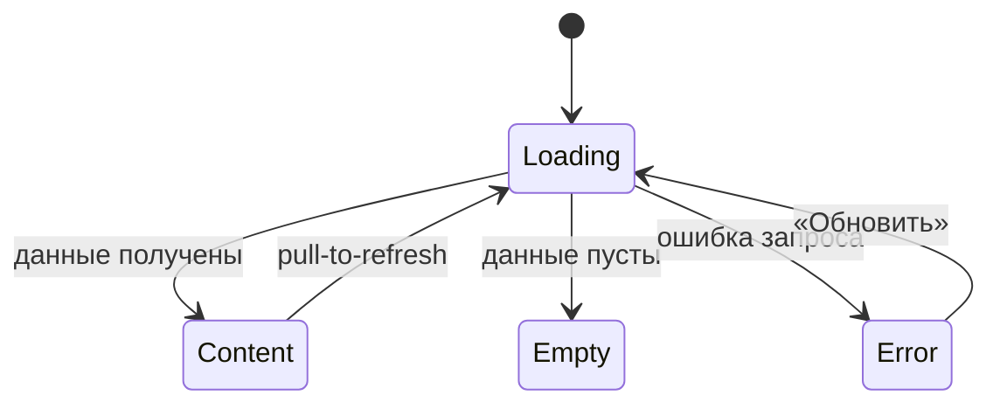

# Требования на дизайн · Foundations (сквозные правила)

> **Этап 4 (Дизайн).** Сквозной документ дизайн-требований клиентского приложения студии
> «Шеф-стол». Описывает принципы, структурные токены, паттерны навигации и состояний,
> доступность и микрокопию, **общие для всех экранов**. Экранные документы ссылаются сюда и не
> дублируют эти правила.

**Статус:** Черновик · **Версия:** 0.1 · **Дата:** 2026-07-02

**Источники:**
[Бизнес-требования](../2-requirements/business-requirements.md) ·
[Функциональные требования](../2-requirements/functional-requirements.md) ·
[Нефункциональные требования](../2-requirements/non-functional-requirements.md) ·
[Use cases](../2-requirements/use-cases.md) ·
[User stories](../2-requirements/user-stories.md) ·
[Описание домена](../1-elicitation/02-domain.md)

> **Объём визуальных требований.** Документ задаёт **функционально-структурные** требования:
> иерархию, компоненты, поведение, ограничения. Конкретная палитра, шрифты и иллюстративный
> стиль — зона ответственности дизайнера; бренд в исходной аналитике не зафиксирован. Токены
> ниже описаны как **правила/уровни** (контраст, размеры, плотность), а не как hex/font-family.

---

## 1. Продукт и аудитория

**«Шеф-стол»** — клиентское веб-приложение (PWA) для самостоятельной записи на групповые
кулинарные классы. Заменяет запись через WhatsApp и Google-таблицу (BR-1, BR-2).

**Единственная роль — «Клиент».** Шеф и владелец/администратор в приложение не входят;
работают через существующую инфраструктуру. Справочные данные (слоты, программы, шефы) —
read-only из API. Оплата — **офлайн** (наличные / перевод на карту); приложение показывает цену
и фиксирует запись, онлайн-оплаты нет (FR-23).

**Контекст использования:** клиент выбирает и бронирует класс чаще всего заранее, с телефона, в
свободную минуту — не обязательно стоя у плиты (в отличие от шефа, который работает на кухне, но
шеф вне скоупа этого приложения). Тем не менее интерфейс — **mobile-first** (NFR-1): экран
телефона — основной и единственный целевой формфактор.

**Одна запись — одно место.** Групповая запись (несколько мест в одной брони, например «я + друг»)
**не входит** в текущий скоуп — это открытый вопрос домена (`02-domain.md` → «Открытые вопросы»,
п. 1), решённый функциональными требованиями как допущение «одна запись = одно место» (см.
`functional-requirements.md`, врезка перед FR-7). Экраны ниже проектируются из этого допущения;
при развороте в групповую запись потребуется пересмотр SCR-004.

---

## 2. Дизайн-принципы

| # | Принцип | Источник | Что это значит для макета |
|---|---------|----------|---------------------------|
| P1 | **Mobile-first** | NFR-1 | Крупные тач-зоны, комфортная читаемость на телефоне, минимум мелкого текста. |
| P2 | **Короткий путь к записи** | NFR-2 | От списка до подтверждения — ориентир **≤ 3 экранов**. Не добавлять необязательных шагов/полей (в частности — не вводить количество мест: одна запись = одно место). |
| P3 | **Числа только из API** | FR-12, US-8 | Вместимость слота (всего/свободно) не пересчитывается и не хардкодится на клиенте — только значение из ответа сервера. |
| P4 | **Экипировка никогда не блокирует запись** | FR-9, Q-001 | Прокатный фонд не ограничен — в UI нет состояния «наборов не осталось»; выбор «прокат» доступен всегда наравне со «своя». |
| P5 | **Только свои данные** | NFR-8 | Клиент видит и управляет только своими записями и своими оценками; в UI нет доступа к чужим бронированиям или к данным управления расписанием. |
| P6 | **Спокойный тон, без штрафов и давления** | FR-16, BR-4 | Поздняя отмена — предупреждение, а не наказание. Ошибки объясняются по-человечески, без вины пользователя. |
| P7 | **Воспринимаемая скорость** | NFR-5 | Скелетоны вместо пустого экрана на время загрузки; ориентир отклика — < 2–3 с. |

---

## 3. Структурные токены (без бренда)

Дизайнер выбирает конкретные значения; ниже — обязательные **правила**.

### 3.1 Тач-зоны и размеры
- Минимальный размер интерактивного элемента — **≥ 44–48 pt** по меньшей стороне.
- Основной CTA — во всю ширину контентной области, высота не менее минимальной тач-зоны.
- Между кликабельными элементами — отступ, исключающий случайный тап не по цели.

### 3.2 Контраст и читаемость (NFR-1)
- Контраст текста к фону — не ниже **WCAG AA** (обычный текст ≥ 4.5:1, крупный ≥ 3:1). См. §7 —
  это базовая гигиена интерфейса, а не отдельно сформулированное заказчиком НФТ (в
  `non-functional-requirements.md` нет отдельного пункта accessibility — см. оговорку в §7.
- Состояния не передаются только цветом — дублируются иконкой/текстом/формой.
- Важные числа (свободно мест, цена, время начала, статус записи) — крупные и контрастные.

### 3.3 Типографическая иерархия (уровни, не шрифты)
- **Заголовок экрана** → **Заголовок секции/карточки** → **Основной текст** →
  **Вторичный/подпись (caption)**. 4–5 уровней, единообразно на всех экранах.
- Минимальный размер основного текста — комфортен для чтения, без «мелкого серого».

### 3.4 Плотность и сетка
- Единая шкала отступов (кратная базовому шагу) — задаёт дизайнер, применяет везде.
- Контент — в одну колонку (mobile-first); карточки слотов/бронирований разделены явными
  отступами/границами.

### 3.5 Иконки и индикаторы
- Иконки в таб-баре и статусах сопровождаются текстом, не несут смысл в одиночку.
- Бейдж статуса записи (активна / отменена / отменена студией / прошла) — считывается с первого
  взгляда, не только по цвету (см. §3.2).

---

## 4. Каркас экрана и навигация

### 4.1 Базовый каркас
```
┌─────────────────────────────┐
│ Хедер (заголовок / назад)    │  ← фиксированный
├─────────────────────────────┤
│                              │
│ Скролл-контент               │  ← основная зона
│                              │
├─────────────────────────────┤
│ Фикс. нижний CTA (если есть) │  ← всегда виден, не перекрыт клавиатурой
└─────────────────────────────┘
│ Таб-бар (на корневых экранах) │
└─────────────────────────────┘
```

### 4.2 Таб-бар (авторизованная зона)

Два верхнеуровневых раздела, всегда доступны на корневых экранах:
- **Классы** ([SCR-002](SCR-002-slot-list.md)) — стартовая вкладка после входа (список слотов).
- **Мои записи** ([SCR-005](SCR-005-my-bookings.md)).

> **Профиля как отдельного раздела нет.** Функциональные требования не описывают просмотр или
> редактирование профиля клиента (авторизация — только email/пароль, FR-1/FR-2, без анкеты).
> Единственная связанная необходимость — **выход из аккаунта**, минимально вытекающая из самого
> факта авторизации (FR-2), но отдельным FR не описанная. Она вынесена в компактную шторку
> [BS-004 «Аккаунт»](BS-004-account.md), открываемую иконкой в хедере обоих корневых экранов —
> **без отдельного таба и без отдельного полноценного экрана**, чтобы не изобретать
> функциональность, которой нет в требованиях (см. правило «не изобретай» в промтах 1–3).

Таб-бар скрывается на вложенных экранах (карточка слота, оформление записи, детали брони,
оценка шефа) и на bottom sheet.

### 4.3 Bottom Sheet (шторки BS-001…BS-004)

Единые правила для всех шторок:
- Высота — по контенту, не выше ~90% экрана; длинный контент скроллится внутри.
- **Бэкдроп** (затемнение фона) + закрытие по тапу вне шторки (кроме критичных подтверждений —
  отмена записи, выход из аккаунта, — где закрытие только явной кнопкой).
- **Swipe-to-close** жестом вниз + видимый «грабер» сверху.
- Явная кнопка закрытия/отмены; кнопки действия — в нижней части шторки.
- Открытие/закрытие — плавная анимация снизу вверх.

### 4.4 Карта навигации (сквозная)

```
SCR-001 (Вход/Регистрация)
   │ успешный вход
   ▼
SCR-002 (Классы) ⇄ таб-бар ⇄ SCR-005 (Мои записи)
   │ фильтр дат              │ открыть запись
   ▼ BS-001                  ▼
   │ открыть слот         SCR-006 (Детали брони)
   ▼                          │ отменить          │ оценить (если класс прошёл)
SCR-003 (Карточка слота)      ▼ BS-003            ▼
   │ записаться            (подтверждение)     SCR-007 (Оценка шефа)
   ▼
SCR-004 (Оформление записи)
   │ подтвердить
   ▼ BS-002 (успех) → SCR-005

Хедер SCR-002 / SCR-005 → иконка аккаунта → BS-004 (выход)
```

Про навигацию каждого экрана — входящие/исходящие переходы — в разделе «Навигация» каждого
экранного документа.

---

## 5. Сквозной паттерн состояний экрана

Применяется ко **всем экранам с запросами к API**. Экранные документы уточняют только специфику
(тексты пустых состояний, конкретные ошибки), не переописывая паттерн.



| Состояние | Что показываем | Правило |
|-----------|----------------|---------|
| **Loading** | Скелетон/шиммер в форме будущего контента | Не пустой белый экран. |
| **Content** | Данные | Основной сценарий. |
| **Empty** | Заглушка + понятная подсказка (+ действие, если применимо) | Объясняет, почему пусто. |
| **Error** | Заглушка ошибки + кнопка **«Обновить»** | Нейтральный тон, без вины пользователя, даёт повтор. |

Специфичные состояния (например, disabled CTA «Записаться» при отсутствии мест, бейдж «Отменён
студией») описаны в соответствующих экранных документах.

---

## 6. Tone of voice и общая микрокопия

**Тон:** простой, прямой, дружелюбный, без жаргона и канцелярита. Обращение на «вы». Сообщения —
короткие, по делу, без вины и давления (P6) — штрафов в продукте нет (FR-16).

**Сквозные тексты (единые формулировки, переиспользуются экранами):**

| Контекст | Текст |
|----------|-------|
| Оплата | «Оплата на месте: наличные или перевод на карту.» (FR-23) |
| Лейблы экипировки | «Своя экипировка» / «Прокатная экипировка» (FR-8) |
| Правило отмены | «Отмена не позднее чем за 24 часа до начала — без предупреждений, место освобождается. Позже — запись всё равно отменится, но продукты на класс уже закуплены. Штраф не взимается.» (FR-15, FR-16) |
| Поздняя отмена (итог) | «Поздняя отмена: продукты на класс уже закуплены. Штраф не взимается.» (FR-16) |
| Отменено студией | «Класс отменён студией. Причина: [reason]. Повторная запись на этот слот недоступна.» (FR-17, FR-18) |
| Мест не осталось (гонка бронирований) | «Мест больше нет. Список обновлён.» (FR-10, UC-1 E1) |
| Кнопка повтора | «Обновить» |
| Сетевая ошибка при загрузке | «Не удалось загрузить. Проверьте соединение и попробуйте снова.» |
| Сетевая ошибка при действии | «Не удалось выполнить. Проверьте соединение и повторите.» |
| Ошибка сервера (5xx) | «Что-то пошло не так. Попробуйте ещё раз позже.» |

> Числа (свободно мест, цена) **не зашиваются в тексты** — подставляются из данных слота (P3).
> Прокатный фонд в UI не отображается как ограничивающая величина — он не ограничивает запись
> (P4, FR-9).

### 6.1 Каталог снеков успеха

Снек показывается после завершённого действия, результат которого не очевиден из самого
перехода. Тон — короткий, утвердительный, без восклицаний.

| Действие | Экран/Шторка | Текст снека | Примечание |
|----------|--------------|-------------|------------|
| Создание записи (`createBooking`) | [SCR-004](SCR-004-booking.md) → [BS-002](BS-002-booking-success.md) | — (снек не показывается) | Обратная связь — переход на шторку успеха; дублировать снеком нельзя (см. §6.2). |
| Отмена записи, ранняя (`cancelBooking`) | [BS-003](BS-003-cancel-confirm.md) → [SCR-006](SCR-006-booking-details.md) | «Запись отменена» | Показывает экран-родитель после закрытия шторки. |
| Отмена записи, поздняя (`cancelBooking`) | [BS-003](BS-003-cancel-confirm.md) → [SCR-006](SCR-006-booking-details.md) | «Поздняя отмена: продукты на класс уже закуплены. Штраф не взимается.» | Это успешный исход отмены, не ошибка. |
| Оценка шефа (`submitRating`) | [SCR-007](SCR-007-chef-rating.md) → [SCR-006](SCR-006-booking-details.md) | «Спасибо за оценку!» | — |
| Применение/сброс фильтра дат | [BS-001](BS-001-date-filter.md) → [SCR-002](SCR-002-slot-list.md) | — (снек не показывается) | Обратная связь — обновлённый список. |
| Выход из аккаунта (`logout`) | [BS-004](BS-004-account.md) → [SCR-001](SCR-001-auth.md) | — (снек не показывается) | Обратная связь — сам переход на экран входа. |
| Успешный pull-to-refresh | любой список | — (снек не показывается) | Снек только при ошибке обновления (§6.3). |

### 6.2 Кто показывает снек при закрытии шторки

- Снек **успеха/итога** действия, после которого шторка закрывается, показывает **экран-родитель**
  (переживает закрытие шторки). Пример: подтверждение отмены на BS-003 → снек «Запись отменена»
  показывает SCR-006.
- Снек **ошибки**, при которой шторка остаётся открытой (можно повторить), показывает сама шторка.
- Нельзя дублировать обратную связь: если результат уже выражен переходом на отдельную шторку
  успеха (`createBooking` → BS-002), снек об успехе на экране-инициаторе не показывается.

### 6.3 Снеки vs Error-заглушка

- **Снеком** сообщаются результаты действий (отправка формы, тап CTA, подтверждение) и ошибка
  при pull-to-refresh (контент на экране сохраняется).
- **Error-заглушкой** (§5) сообщается провал первичной загрузки данных экрана, когда показывать
  нечего.

---

## 7. Доступность

> **Оговорка по источнику.** В `non-functional-requirements.md` нет отдельного НФТ про
> accessibility/WCAG — заказчик этот аспект не формулировал. Раздел ниже — это **общая гигиена
> интерфейса** (соответствует §3.1–3.2 структурных токенов), а не требование, привязанное к
> конкретному ID. Если для проекта нужен формальный уровень соответствия (например, WCAG AA) —
> это стоит вернуть аналитику как дополнение к NFR, а не фиксировать здесь как факт.

Базовые практики, которые стоит соблюдать при отсутствии возражений от заказчика:
- Контраст — не ниже WCAG AA (§3.2).
- Тач-зоны — ≥ 44 pt (§3.1).
- Поддержка системного увеличения шрифта без обрезки контента.
- Интерактивные элементы имеют доступное имя для screen reader (например, «Записаться на класс
  «Паста ручной работы», 21 июля»).
- Состояния не передаются только цветом (§3.2).

---

## 8. Сквозные функции

### 8.1 Напоминания и уведомления (FR-21, FR-22)
- Push-напоминание о записи — за 24 часа до начала класса (FR-21).
- Push-уведомление при отмене класса студией (FR-22); резервного канала (SMS/email) нет —
  Q-014. При недоступности push клиент увидит актуальный статус при следующем открытии
  приложения.
- **Запрос разрешения на push** логично показывать после первой успешной записи — на шторке
  подтверждения [BS-002](BS-002-booking-success.md), когда ценность уведомления уже понятна
  пользователю, а не на экране входа. Отдельного экрана управления уведомлениями в MVP нет.

### 8.2 Безопасность данных в UI (NFR-8)
- На экранах отображаются только данные текущего клиента: свои записи, свои оценки.
- Нет доступа к данным управления (расписание, шефы, программы) — это read-only справочные
  данные, приходящие из API, без интерфейса редактирования.

### 8.3 Офлайн и сетевые ошибки
> В `non-functional-requirements.md` нет отдельного НФТ про офлайн-режим — специальная стратегия
> кэширования не описывается, чтобы не изобретать её без опоры на требования. При отсутствии
> сети применяется единый паттерн Error/повтор (§5) и снек ошибки при действиях (§6.3).

---

## 9. Глоссарий (дизайн-специфичный срез)

Полный глоссарий домена — [`02-domain.md`](../1-elicitation/02-domain.md#глоссарий). Здесь —
только термины, напрямую влияющие на UI-лейблы:

| Термин | UI-лейбл |
|--------|----------|
| Класс / слот | «Класс» |
| Программа (меню класса) | «Программа» |
| Рабочий набор напрокат | «Прокатная экипировка» |
| Своя экипировка | «Своя экипировка» |
| Отмена студией | Бейдж «Отменён студией» |
| Оценка шефа | «Оценка» / «Оценить шефа» |

---

## 10. Карта документов дизайн-требований

| ID | Документ |
|----|----------|
| — | **00-foundations.md** (этот файл) |
| — | [design-brief.md](design-brief.md) — обзор и индекс |
| SCR-001 | [Регистрация / Вход](SCR-001-auth.md) |
| SCR-002 | [Список слотов](SCR-002-slot-list.md) |
| BS-001 | [Фильтр по датам](BS-001-date-filter.md) |
| SCR-003 | [Карточка слота](SCR-003-slot-card.md) |
| SCR-004 | [Оформление записи](SCR-004-booking.md) |
| BS-002 | [Подтверждение записи](BS-002-booking-success.md) |
| SCR-005 | [Мои бронирования](SCR-005-my-bookings.md) |
| SCR-006 | [Детали брони + отмена](SCR-006-booking-details.md) |
| BS-003 | [Подтверждение отмены](BS-003-cancel-confirm.md) |
| SCR-007 | [Оценка шефа](SCR-007-chef-rating.md) |
| BS-004 | [Аккаунт / выход](BS-004-account.md) |
