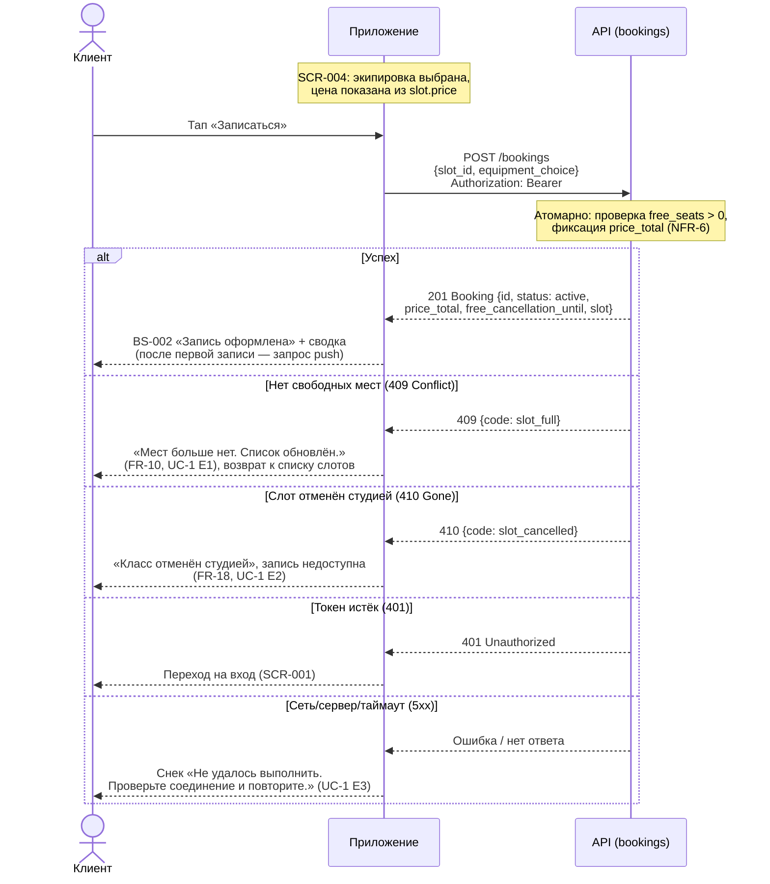
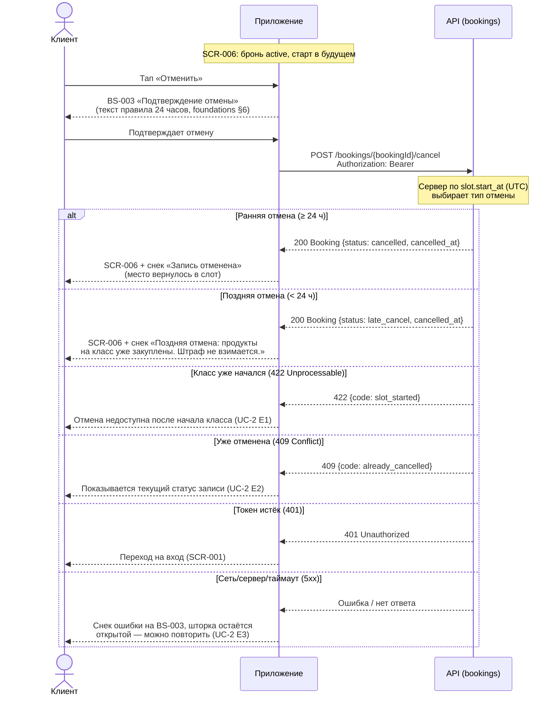
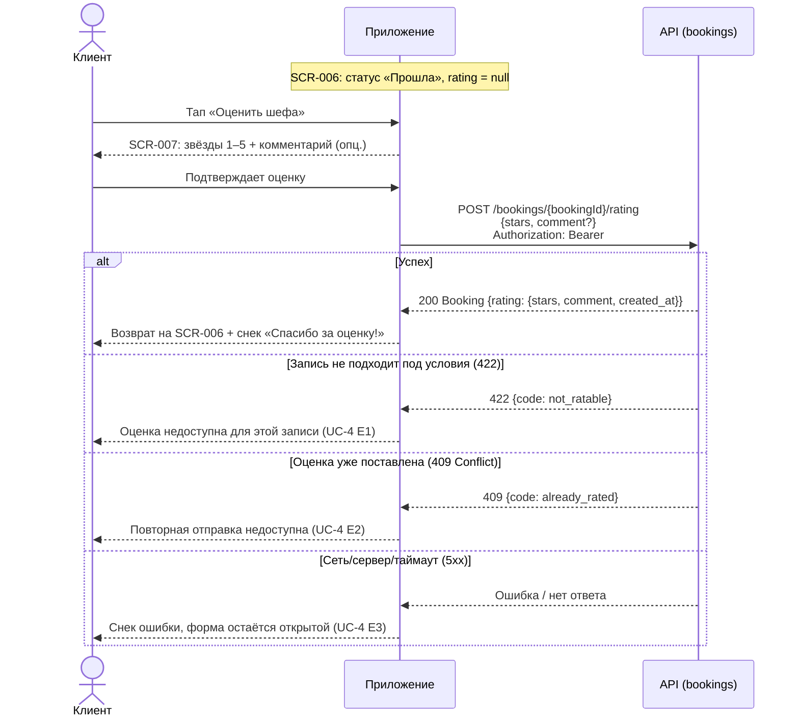

# Sequence-диаграмма API-взаимодействия

> Этап 4. Проектирование. Как клиент и сервер обмениваются вызовами в критичных сценариях записи.
> Контракты API — в многофайловой спецификации [`../api/`](../api/) (домены `bookings`, `slots`,
> `auth`, `common`; отдельного домена `ratings` нет — оценка шефа оформлена как под-путь
> `bookings`). Операции: `createBooking`, `cancelBooking`, `submitRating`
> ([bookings/api.yaml](../api/bookings/api.yaml)).

> **Сквозные правила взаимодействия.**
> - Все вызовы (кроме `auth/register`, `auth/login`) — с `Authorization: Bearer <token>`; при
>   истёкшем/неверном токене сервер отвечает `401`, клиент уходит на вход
>   [SCR-001](../3-design-brief/SCR-001-auth.md).
> - Сервер — **источник истины** по времени и доступности: `slot.start_at` в UTC, тип отмены и
>   наличие мест проверяет сервер, клиент их не пересчитывает (`02-domain.md` → «Граница
>   серверной интеграции», R-004).
> - Запись/отмена **атомарны**: овербукинг и двойная бронь исключены (NFR-6).
> - Мутации при отсутствии сети не отправляются — единый паттерн Error/Retry
>   ([00-foundations.md §5](../3-design-brief/00-foundations.md#5-сквозной-паттерн-состояний-экрана)).

## Сценарий 1: Создание записи (`createBooking`, UC-1)

Поток: [SCR-004 «Оформление записи»](../3-design-brief/SCR-004-booking.md) → `POST /bookings` →
[BS-002 «Подтверждение»](../3-design-brief/BS-002-booking-success.md). Клиент отправляет `slot_id`
и `equipment_choice` (`own`/`rental`, FR-8). Итоговую цену `price_total` (read-only) считает
сервер — клиент её не вычисляет, а показывает (FR-23).

| Шаг | Что происходит | Источник |
| :-- | :-- | :-- |
| Запрос | `POST /bookings`; тело — `slot_id`, `equipment_choice` | bookings/api.yaml |
| Проверка | Сервер атомарно проверяет `free_seats > 0` и фиксирует `price_total` | NFR-6, FR-23 |
| `201` | Возвращается `Booking` со `status=active`, `price_total`, `free_cancellation_until` (оба read-only) | FR-12, FR-23 |
| `409` | Мест не осталось (`slot_full`) — гонка бронирований | FR-10, UC-1 E1 |
| `410` | Слот отменён студией к моменту подтверждения | FR-18, UC-1 E2 |

> **Нет листа ожидания и нет повтора с идемпотентным ключом.** В отличие от похожих проектов, где
> `409` предлагает встать в очередь, здесь Q-012 явно исключает лист ожидания — клиент просто
> возвращается к списку. Идемпотентный ключ не требуется: повторный тап не создаёт двойной запрос
> (см. `SCR-004-booking.md` §6.4, защита от двойного тапа на UI-уровне; двойная запись в принципе
> исключена сервером, NFR-6).

## Сценарий 2: Отмена записи (`cancelBooking`, UC-2)

Поток: [SCR-006 «Детали брони»](../3-design-brief/SCR-006-booking-details.md) →
[BS-003 «Подтверждение отмены»](../3-design-brief/BS-003-cancel-confirm.md) → `POST
/bookings/{bookingId}/cancel`. Отмена — только целиком (одна запись = одно место). **Тип отмены
определяет сервер** по времени до старта (источник истины — `slot.start_at` в UTC): `≥ 24 ч` →
`cancelled` (место возвращается в слот), `< 24 ч` → `late_cancel` (не возвращается, штрафов нет).

| Шаг | Что происходит | Источник |
| :-- | :-- | :-- |
| Запрос | `POST /bookings/{bookingId}/cancel` (без тела; отмена целиком) | bookings/api.yaml |
| Решение | Сервер выбирает `cancelled` / `late_cancel` по `start_at` (UTC), порог 24 ч | FR-15, FR-16 |
| `200` | `Booking` с новым `status` и `cancelled_at` | data-model.md |
| `422` | Класс уже начался — отмена недоступна | UC-2 E1 |
| `409` | Повторная отмена — терминальный статус | UC-2 E2 |

> Полная модель состояний брони и инварианты освобождения мест — в
> [data-model.md §«Модель состояний»](data-model.md#модель-состояний-жизненный-цикл).

## Сценарий 3: Оценка шефа (`submitRating`, UC-4)

Поток: [SCR-006](../3-design-brief/SCR-006-booking-details.md) →
[SCR-007 «Оценка шефа»](../3-design-brief/SCR-007-chef-rating.md) → `POST
/bookings/{bookingId}/rating`. Доступно только для прошедших неотменённых записей без уже
поставленной оценки (FR-20).

| Шаг | Что происходит | Источник |
| :-- | :-- | :-- |
| Запрос | `POST /bookings/{bookingId}/rating`; тело — `stars` (1–5), `comment` (опц.) | bookings/api.yaml |
| Проверка | Сервер проверяет: слот в прошлом, бронь `active`, оценки ещё нет | FR-20, UC-4 |
| `200` | `Booking.rating` заполнен | data-model.md |
| `422` | Запись не подходит (не прошла / отменена) | UC-4 E1 |
| `409` | Оценка уже поставлена — редактирование не предусмотрено | UC-4 E2 |
