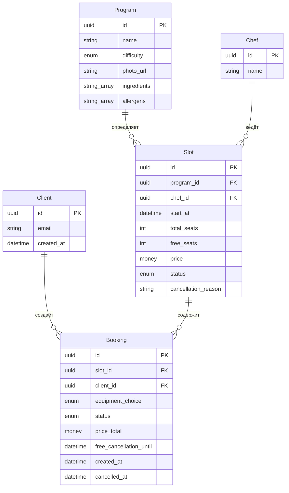
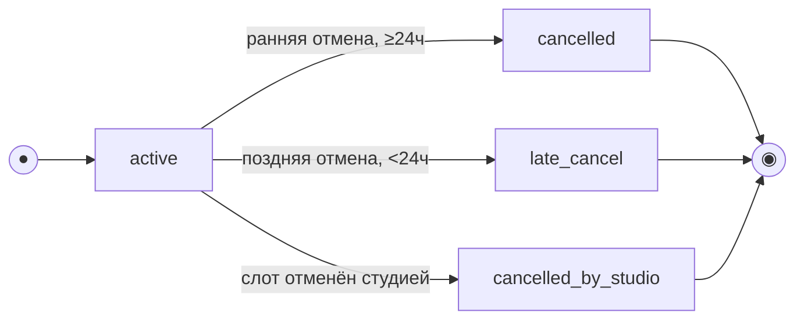
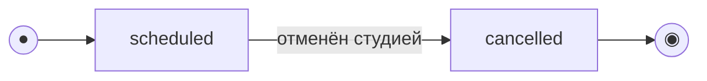

# Модель данных

> Этап 4. Проектирование. Описание сущностей, атрибутов и связей + черновик ERD.
>
> **Скоуп: клиентское приложение и API для него.** Это **ресурсная модель API** (что клиент
> читает/создаёт), а не схема БД, которую мы проектируем: хранение и бизнес-логика принадлежат
> **существующей инфраструктуре**.
>
> - **Program, Chef, Slot** — read-only-проекция ресурсов существующего бэкенда; приходят через
>   API, клиент их не создаёт и не редактирует.
> - **Client, Booking, Rating** — ресурсы, которыми оперирует клиентский API (регистрация,
>   бронирования, оценки).
> - **Данные существующей инфраструктуры (R-015).** Проект учебный/тестовый, легаси-данных нет:
>   эта модель считается **канонической** и совпадает с контрактом API. Миграция/backfill и
>   поведение при отсутствии полей не рассматриваются — бэкенд по условию отдаёт все поля модели.
> - **Прокатный фонд не моделируется как лимит.** FR-9 прямо исключает нехватку экипировки как
>   причину отказа — в модели нет поля вида «свободно прокатных наборов», в отличие от аналогичных
>   проектов, где прокатный инвентарь ограничен.
> - **Одна запись = одно место.** Допущение аналитика (`functional-requirements.md`, врезка перед
>   FR-7; открытый вопрос домена №1) — в `Booking` нет `seats_count`/`rental_count`, только один
>   `equipment_choice` на всю запись.

## Сущности и атрибуты

### Client (Клиент)
| Атрибут | Тип | Описание |
| :-- | :-- | :-- |
| id | UUID (PK) | Идентификатор клиента |
| email | string (unique) | Логин клиента |
| password_hash | string, **никогда не возвращается клиенту** | Хеш пароля — деталь реализации сервера, не часть контракта ответа API |
| created_at | datetime | Дата регистрации |

> Вход/регистрация — по email и паролю (FR-1, FR-2, Q-008), без OTP и без анкеты. Профиля с
> именем/телефоном нет — единственное действие с аккаунтом на стороне клиента, помимо входа, —
> выход (`BS-004`, минимальная необходимость, не отдельное FR).

### Program (Программа/меню класса) — справочник, read-only
| Атрибут | Тип | Описание |
| :-- | :-- | :-- |
| id | UUID (PK) | Идентификатор программы |
| name | string | Название программы |
| difficulty | enum (`novice` / `experienced`) | Уровень сложности — **явное поле** (FR-6, Q-004), не текст в названии |
| photo_url | string (URL) | Фото блюда (Q-003) |
| ingredients | string[] | Список ингредиентов блюда (Q-003) |
| allergens | string[] | Список аллергенов блюда — состав блюда, **не** данные об аллергиях клиента (сбор данных об аллергиях клиента вне скоупа, `02-domain.md`) |

### Chef (Шеф) — справочник, read-only
| Атрибут | Тип | Описание |
| :-- | :-- | :-- |
| id | UUID (PK) | Идентификатор шефа |
| name | string | Имя шефа |

> Постоянные и приглашённые (сезонные) шефы — один и тот же ресурс, без отдельного статуса
> (`02-domain.md` → «Ключевые объекты домена»).

### Slot (Класс / слот) — предзаполняется, read-only для клиента
| Атрибут | Тип | Описание |
| :-- | :-- | :-- |
| id | UUID (PK) | Идентификатор слота |
| program_id | FK → Program | Программа класса |
| chef_id | FK → Chef | Назначенный шеф |
| start_at | datetime (UTC) | Дата и время старта в UTC; **хранится в UTC**, источник истины — сервер. Клиент отображает в локальном времени студии |
| total_seats | int | Всего мест (лимит 8/12 — логика бэкенда, клиент его не хранит и не пересчитывает, FR-12) |
| free_seats | int | Свободно мест — **значение строго из API**, не пересчитывается на клиенте |
| price | money (RUB) | Цена класса |
| status | enum (`scheduled` / `cancelled`) | Статус слота |
| cancellation_reason | string?, nullable | Причина отмены студией — заполнено только при `status = cancelled` (FR-17) |

> **Тариф проката — открытый вопрос, не часть текущей модели.** `02-domain.md` (R-015) упоминает
> «прокатный тариф на экипировку» как поле, которое бэкенд может отдавать, но ни один FR/US не
> определяет формулу его использования в цене — см. `3-design-brief/SCR-004-booking.md` §4.2,
> §11 п.4. Поле сознательно **не включено** в эту модель как «канонический факт»; при уточнении
> заказчика может понадобиться `rental_price` по аналогии с `price`.

### Booking (Запись / бронь)
| Атрибут | Тип | Описание |
| :-- | :-- | :-- |
| id | UUID (PK) | Идентификатор записи |
| slot_id | FK → Slot | Слот |
| client_id | FK → Client | Кто записался |
| equipment_choice | enum (`own` / `rental`) | Вариант экипировки на всю запись (FR-8); `rental` никогда не блокируется (FR-9) |
| status | enum (`active` / `cancelled` / `late_cancel` / `cancelled_by_studio`) | Статус записи — см. «Модель состояний» |
| price_total | money (RUB), read-only | Цена, зафиксированная на момент записи (= `slot.price` на момент создания); клиент **не пересчитывает** |
| free_cancellation_until | datetime (UTC), read-only | Момент, до которого отмена бесплатна (`= slot.start_at − 24ч`, вычисляется **сервером**); клиент только отображает значение, не вычисляет (P3, устраняет расхождение с SCR-006/BS-003) |
| rating | object?, nullable — `{ stars: int, comment: string?, created_at }` | Оценка шефа по этой записи, если уже поставлена (FR-19); `null`, если ещё не оценена |
| created_at | datetime | Время создания записи |
| cancelled_at | datetime?, nullable | Время отмены (если была) |

> **«Прошедшая» — не хранимый статус.** Бейдж «Прошедшая» (SCR-006) и группа «Прошедшие»
> (SCR-005) — **производное отображение** по `Slot.start_at` в прошлом, а не значение
> `Booking.status`. Статус остаётся `active`/`cancelled`/`late_cancel`/`cancelled_by_studio`.
>
> **Оценка — не отдельная сущность верхнего уровня.** `rating` хранится как вложенный объект
> внутри `Booking` (1:1, не более одной оценки на запись, FR-20/UC-4 E2), а не как самостоятельный
> ресурс со своим списком/поиском — клиент не просматривает чужие оценки и агрегаты (это данные
> владельца, вне скоупа, `02-domain.md` → «Границы скоупа»).

## ERD

## Модель состояний (жизненный цикл)

> Две сущности имеют явный жизненный цикл: **Booking** (управляется клиентским API) и **Slot**
> (read-only-проекция; переходы выполняет существующая инфраструктура, клиент только читает
> текущий статус). Состояние **«Прошедшая»** у обеих — **производное** (по `Slot.start_at`
> относительно текущего времени), а не отдельное значение enum.

### Booking (Запись / бронь)

`status ∈ {active, cancelled, late_cancel, cancelled_by_studio}`. Создаётся в `active`; отмена —
терминальный переход (повторная отмена не выполняется, UC-2 E2). Какой именно переход
(ранняя/поздняя отмена) определяется **сервером** по времени до старта на момент отмены
(`slot.start_at` в UTC — источник истины); порог — **24 часа** (FR-15/FR-16, Q-007). Отдельно: при
отмене **слота студией** (`Slot.status → cancelled`) связанная бронь переходит в
`cancelled_by_studio` (FR-17) — не по инициативе клиента, повторная запись на этот слот запрещена
всем клиентам (FR-18).

| Из | Событие / условие | В | Эффект на слот | Трасса |
| :-- | :-- | :-- | :-- | :-- |
| — | Клиент подтверждает бронь | `active` | `free_seats −= 1` | UC-1, FR-7 |
| `active` | Отмена, до старта ≥ 24 ч | `cancelled` | Место **возвращается** в слот (`free_seats += 1`) | UC-2, FR-15 |
| `active` | Отмена, до старта < 24 ч | `late_cancel` | Место **не освобождается**, штрафов нет | UC-2 A1, FR-16 |
| `active` | Слот отменён студией (`Slot.status → cancelled`) | `cancelled_by_studio` | Слот снят; клиент получает push (FR-22); повторная запись на слот запрещена (FR-18) | UC-2 A2, FR-17 |
| `cancelled` / `late_cancel` / `cancelled_by_studio` | — (терминальные) | — | Повторная отмена не выполняется | UC-2 E2 |

> Отмена возможна только пока класс не начался (`start_at` в будущем) — после старта CTA
> недоступна (`SCR-006`, UC-2 E1).

### Slot (Класс / слот)

`status ∈ {scheduled, cancelled}` — read-only для клиента. Переход в `cancelled` инициирует
владелец в существующей инфраструктуре (форс-мажор или решение организатора, R-008); массовая
рассылка уведомлений участникам выполняется инфраструктурой, клиент только получает push (FR-22).

| Статус | Что видит клиент | Запись |
| :-- | :-- | :-- |
| `scheduled` (старт в будущем) | Слот в списке/карточке; при `free_seats = 0` — пометка «Мест нет» | Доступна при `free_seats > 0` |
| `scheduled` (старт в прошлом) — *производное «Прошедший»* | В клиентских сценариях не предлагается к записи | Недоступна |
| `cancelled` | Пометка «Отменён студией» + причина | Недоступна для всех клиентов (FR-18) |

## Ключевые инварианты (целостность данных)

- `Slot.free_seats = Slot.total_seats − Σ(active + late_cancel bookings)` — при поздней отмене
  место **не** освобождается (FR-16).
- Только **ранняя** отмена (`≥ 24 ч`) возвращает место в слот; `late_cancel` и
  `cancelled_by_studio` — нет (FR-15, FR-16, FR-17).
- Запись/отмена выполняются **атомарно**: овербукинг и двойная бронь исключены при параллельных
  операциях (NFR-6, гарантия «0 двойных записей» — `02-domain.md` → «Граница серверной
  интеграции», R-004).
- `Booking.rating` заполняется не более одного раза на запись, и только если
  `Slot.start_at` в прошлом и `Booking.status = active` на момент простановки оценки (FR-20).
- `Booking.price_total` фиксируется на момент создания и не меняется при последующем изменении
  `Slot.price` (историческая цена).
