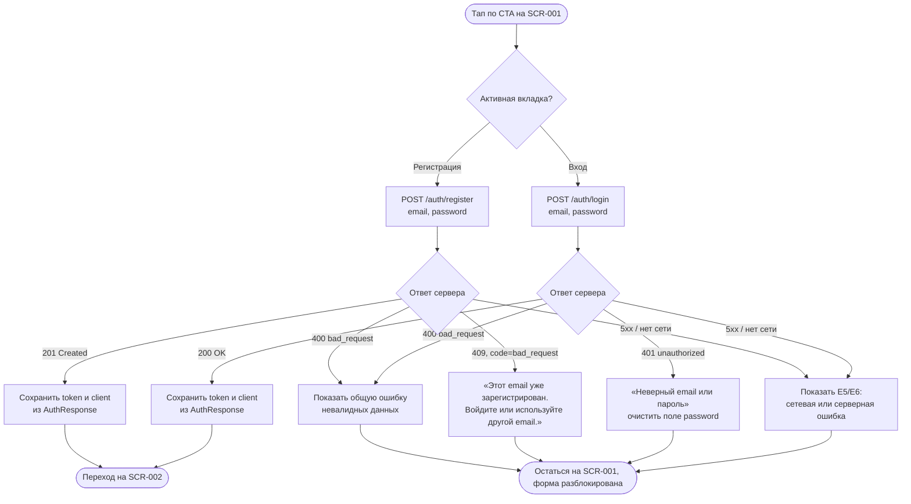

# Авторизация по email и паролю

**ID:** LOGIC-001
**Приоритет:** Must
**Статус:** Актуален

---

## Обзор

Логика инкапсулирует два связанных сценария единственного неавторизованного экрана
[SCR-001](../SCR-001-auth.md) — **регистрацию** и **вход** клиента по email и паролю (FR-1, FR-2,
Q-008) — и то, что происходит сразу после успешного ответа сервера: сохранение токена доступа и
переход в авторизованную зону приложения. Отдельного механизма восстановления пароля, кода
подтверждения по SMS/email или иного второго фактора в продукте нет — авторизация выполняется
**только парой email + пароль** (FR-1, FR-2, Q-008); ссылка «Забыли пароль?» на SCR-001 намеренно
не реализована — это зафиксированный на уровне дизайн-брифа открытый вопрос
([`3-design-brief/SCR-001-auth.md`](../../3-design-brief/SCR-001-auth.md) → «Решения», п. 2), а не
часть данной логики.

Обе ветки (регистрация и вход) используют одну и ту же форму с полями `email`/`password`
([`3-design-brief/SCR-001-auth.md`](../../3-design-brief/SCR-001-auth.md) §5–§6) и различаются
только вызываемой операцией API и текстом специфичных ошибок сервера — поэтому описаны одним
документом, а не двумя.

Общий паттерн состояний экрана (Loading/Content/Empty/Error) для SCR-001 применяется частично —
экран не выполняет GET-запрос при открытии, поэтому состояний Loading/Empty у него нет; состояние
«Отправка» и «Ошибка» специфичны для формы и описаны здесь и в
[`3-design-brief/SCR-001-auth.md`](../../3-design-brief/SCR-001-auth.md) §7. Сквозной паттерн для
экранов, действительно опирающихся на GET-запрос при открытии, вынесен в
[LOGIC-005_Паттерн-состояний-экрана.md](LOGIC-005_Паттерн-состояний-экрана.md) и здесь не
дублируется.

---

## Точки применения

| Экран/Шторка | Элемент/Триггер | Условие |
|--------------|------------------|---------|
| [SCR-001 Регистрация / Вход](../SCR-001-auth.md) | CTA «Зарегистрироваться» (вкладка «Регистрация») | Поля `email` и `password` заполнены, кнопка не в состоянии `submitting` |
| [SCR-001 Регистрация / Вход](../SCR-001-auth.md) | CTA «Войти» (вкладка «Вход») | Поля `email` и `password` заполнены, кнопка не в состоянии `submitting` |

---

## Флоу

---

## API-запросы

### POST /auth/register

**Спецификация:** [`../../api/auth/api.yaml`](../../api/auth/api.yaml) → `register`
**Тело запроса:** [`../../api/auth/models.yaml`](../../api/auth/models.yaml) → `RegisterRequest`
(`email`, `password`, оба обязательны; `password` — `minLength: 8`, порог зафиксирован как
допущение дизайнера в самой схеме API, а не требованием заказчика, см. `models.yaml` → описание
поля `password`).
**Триггер:** Тап по CTA «Зарегистрироваться» на вкладке «Регистрация» SCR-001, когда оба поля
формы заполнены (FR-1).

**Обработка ответа:**

| Результат | Действие |
|-----------|----------|
| `201 Created` (`AuthResponse`: `token`, `client`) | Сохранить `token` и данные `client` (см. раздел «Хранение и использование токена»); немедленный переход на [SCR-002](../SCR-002-slot-list.md) — без промежуточного экрана успеха ([`3-design-brief/SCR-001-auth.md`](../../3-design-brief/SCR-001-auth.md) §7, «Решения» п. 7). |
| `400 Bad Request` (`code: bad_request`, `common/models.yaml → BadRequest`) | Общая ошибка невалидного запроса (например, некорректный формат email не был отловлен клиентской проверкой). Форма остаётся заполненной, `submitting` снимается. |
| `409 Conflict` (`code: bad_request`, специфичный `message`: «Этот email уже зарегистрирован.») | Email уже занят. **Важно:** контракт `auth/api.yaml` возвращает HTTP-статус `409`, но в теле `Error.code` — не отдельный доменный код (в `common/models.yaml → Error.code` enum нет значения вроде `email_taken`), а тот же `bad_request`, что и для `400`; различать этот случай на клиенте нужно **по HTTP-статусу 409**, а не по полю `code`. UI-текст — E4 из [`3-design-brief/SCR-001-auth.md`](../../3-design-brief/SCR-001-auth.md) §8: «Этот email уже зарегистрирован. Войдите или используйте другой email.» |
| `5xx` / сетевой сбой (`default → InternalError`, `code: internal_error`) | E5 (сеть) / E6 (5xx) из [`3-design-brief/SCR-001-auth.md`](../../3-design-brief/SCR-001-auth.md) §8; форма и введённые значения сохраняются, повторная отправка доступна. |

### POST /auth/login

**Спецификация:** [`../../api/auth/api.yaml`](../../api/auth/api.yaml) → `login`
**Тело запроса:** [`../../api/auth/models.yaml`](../../api/auth/models.yaml) → `LoginRequest`
(`email`, `password`, оба обязательны; клиентская проверка минимальной длины пароля на этой
вкладке не выполняется — см. [`3-design-brief/SCR-001-auth.md`](../../3-design-brief/SCR-001-auth.md) §6.3).
**Триггер:** Тап по CTA «Войти» на вкладке «Вход» SCR-001, когда оба поля формы заполнены (FR-2).

**Обработка ответа:**

| Результат | Действие |
|-----------|----------|
| `200 OK` (`AuthResponse`: `token`, `client`) | Сохранить `token` и данные `client`; немедленный переход на [SCR-002](../SCR-002-slot-list.md). |
| `400 Bad Request` (`code: bad_request`) | Общая ошибка невалидного запроса. Форма остаётся заполненной. |
| `401 Unauthorized` (`code: unauthorized`, `message`: «Неверный email или пароль.») | E3 из [`3-design-brief/SCR-001-auth.md`](../../3-design-brief/SCR-001-auth.md) §8: сообщение намеренно не уточняет, какое из полей неверно (защита от подбора существующих email, в духе NFR-7); поле `password` очищается, `email` сохраняется, фокус — на поле пароля. |
| `5xx` / сетевой сбой | E5/E6, аналогично `register`. |

---

## Хранение и использование токена

- Успешный ответ обеих операций (`register` → `201`, `login` → `200`) возвращает объект
  `AuthResponse` (`token`, `client`) — контракт зафиксирован в
  [`../../api/auth/models.yaml`](../../api/auth/models.yaml). `token` — непрозрачная строка
  (`bearerFormat: opaque-token`), формат и время жизни на клиенте не интерпретируются.
- Все последующие запросы клиента к API (кроме `register` и `login`), включая `logout`
  (`../../api/auth/api.yaml` → `logout`) и все операции доменов `slots`/`bookings`, передают токен
  в заголовке `Authorization: Bearer <token>` — согласно `securityScheme bearerAuth`
  ([`../../api/auth/models.yaml`](../../api/auth/models.yaml)).
- **Конкретный механизм хранения токена в браузере (localStorage / sessionStorage / cookie и
  т. п.) заказчиком не определён и прямо назван вне скоупа анализа требований (NFR-7:** «конкретный
  протокол передачи и механизм хранения... остаётся на усмотрение реализации API»; в
  [`3-design-brief/SCR-001-auth.md`](../../3-design-brief/SCR-001-auth.md) NFR-7 также
  трактуется как основание не проектировать экран/поток восстановления пароля). Ниже —
  **допущение реализации**, не требование:
  - Предлагается хранить `token` в `localStorage` PWA, а не в `sessionStorage`: сценарии
    повторного открытия SCR-001, описанные в
    [`3-design-brief/SCR-001-auth.md`](../../3-design-brief/SCR-001-auth.md) §2 (переустановка
    приложения на новом устройстве, явный `logout` через BS-004), подразумевают, что между этими
    случаями обычное закрытие вкладки/браузера **не должно** разлогинивать клиента — что
    обеспечивает `localStorage` (переживает закрытие вкладки), а `sessionStorage` — нет.
  - Явный выход (`logout`, вызывается из BS-004) обязан удалять сохранённый `token` из
    `localStorage` и переводить клиента на SCR-001 — это единственный документированный способ
    завершения сессии на клиенте (`../../api/auth/api.yaml` → `logout`, `204 No Content`).
  - Если `token` отсутствует или сервер отвечает `401 Unauthorized`
    (`../../api/common/models.yaml → Unauthorized`) на любой запрос авторизованной зоны, клиент
    должен удалить сохранённый `token` и вернуть пользователя на SCR-001 — иначе NFR-8
    (разграничение доступа) не может быть обеспечено на стороне клиента.
  - Данное допущение — предложение по реализации, а не зафиксированное решение заказчика; при
    расхождении с фактическим требованием безопасности (например, если заказчик впоследствии
    потребует хранение только в памяти вкладки) секцию нужно пересмотреть.

---

## Связанные требования

| Категория | Идентификаторы |
|-----------|-----------------|
| **FR** | FR-1 (регистрация по email/паролю), FR-2 (авторизация по email/паролю) |
| **NFR** | NFR-7 (защита учётных данных при передаче и хранении; механизм хранения — вне скоупа анализа), NFR-8 (разграничение доступа между клиентами, обеспечивается наличием токена сессии) |
| **UC** | Нет выделенного UC на регистрацию/вход — поведение выведено из FR-1/FR-2/US-1, см. врезку в источниках [`3-design-brief/SCR-001-auth.md`](../../3-design-brief/SCR-001-auth.md) |

---

## Критерии приёмки

| ID | Критерий |
|----|----------|
| AC-001 | **Дано** клиент на вкладке «Регистрация» ввёл email, ранее не зарегистрированный, и пароль длиной ≥ 8 символов, **Когда** он нажимает «Зарегистрироваться», **Тогда** отправляется `POST /auth/register`, и по ответу `201` с телом `AuthResponse` токен сохраняется, а клиент переходит на SCR-002. |
| AC-002 | **Дано** клиент на вкладке «Вход» ввёл email и пароль существующей учётной записи, **Когда** он нажимает «Войти», **Тогда** отправляется `POST /auth/login`, и по ответу `200` с телом `AuthResponse` токен сохраняется, а клиент переходит на SCR-002. |
| AC-003 | **Дано** клиент отправил `POST /auth/register` с email, который уже зарегистрирован, **Когда** сервер отвечает `409` с `code: bad_request` и сообщением про занятый email, **Тогда** клиент показывает текст E4 («Этот email уже зарегистрирован...») по факту HTTP-статуса 409, не полагаясь на отдельный доменный `code`, и учётная запись повторно не создаётся. |
| AC-004 | **Дано** клиент отправил `POST /auth/login` с неверным email или паролем, **Когда** сервер отвечает `401` с `code: unauthorized`, **Тогда** показывается единый текст «Неверный email или пароль» без уточнения, какое поле неверно, поле `password` очищается. |
| AC-005 | **Дано** любой из запросов (`register` или `login`) завершился `5xx`-ответом или сетевым сбоем, **Тогда** клиент показывает E6/E5 соответственно, не сохраняет и не подставляет токен, форма остаётся заполненной для повторной отправки. |
| AC-006 | **Дано** токен успешно сохранён после `register` или `login`, **Когда** клиент выполняет любой последующий запрос к авторизованной зоне API (`slots`, `bookings`, `logout`), **Тогда** запрос содержит заголовок `Authorization: Bearer <token>`. |
| AC-007 | **Дано** сохранённый токен признан сервером недействительным (`401 Unauthorized` на запросе авторизованной зоны), **Тогда** клиент удаляет токен и возвращает пользователя на SCR-001. |

---

## Обработка ошибок

| Ошибка | Контекст | Действие |
|--------|----------|----------|
| `400 bad_request` | Ответ `register` или `login` — запрос не прошёл валидацию на сервере | Показать общий текст невалидного запроса (аналог E1, но по факту ответа сервера, а не клиентской проверки); форма разблокируется, значения сохраняются |
| `409` с `code: bad_request` | Ответ `register` — email уже зарегистрирован; доменный код по HTTP-статусу, а не по `Error.code` (см. «API-запросы» → `register`) | Показать E4 из [`3-design-brief/SCR-001-auth.md`](../../3-design-brief/SCR-001-auth.md) §8; предложить переключиться на вкладку «Вход», не переключать автоматически |
| `401 unauthorized` | Ответ `login` — неверные email/пароль | Показать E3; очистить `password`, сохранить `email`, фокус на поле пароля |
| `401 unauthorized` | Ответ **любого другого** авторизованного запроса (не `login`) — токен истёк/недействителен | Удалить сохранённый токен, вернуть на SCR-001 (см. «Хранение и использование токена») — не относится к форме входа/регистрации напрямую |
| `5xx` / сетевой сбой | Любой из двух запросов | E5 (сеть) / E6 (сервер) из [`3-design-brief/SCR-001-auth.md`](../../3-design-brief/SCR-001-auth.md) §8; повторная отправка доступна, данные формы не теряются |
