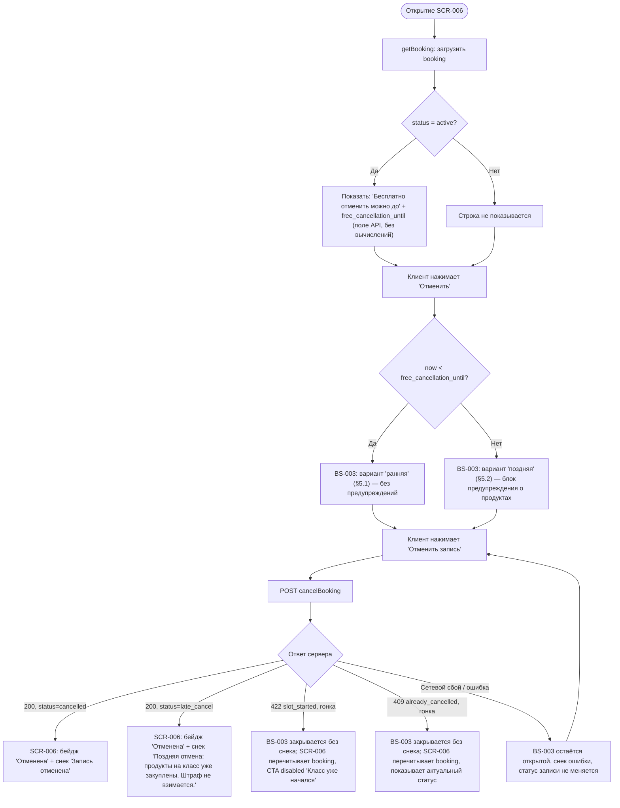

# Правило отмены (24 часа)

**ID:** LOGIC-002
**Приоритет:** Must
**Статус:** Актуален

---

## Обзор

Логика определяет, как клиентское приложение показывает клиенту границу «бесплатной» отмены
записи и какой из двух вариантов содержимого показать в шторке подтверждения отмены — без
предупреждений (ранняя отмена) или с предупреждением о закупленных продуктах (поздняя отмена).
Порог — **24 часа до начала класса** (FR-15, FR-16, Q-007).

**Ключевой принцип, ради которого логика вынесена отдельным документом:** порог 24 часа и
итоговое решение «ранняя / поздняя отмена» определяет **исключительно сервер**. Клиент **не
вычисляет** `slot.start_at − 24ч` самостоятельно ни в одном месте приложения — он только:

1. **отображает** уже готовое поле `booking.free_cancellation_until`, присланное сервером в
   ответе `getBooking` (используется на [SCR-006](../SCR-006-booking-details.md) для строки
   «Бесплатно отменить можно до…» и на [BS-003](../BS-003-cancel-confirm.md) для предварительного
   выбора варианта содержимого шторки — см. §3, шаг 2);
2. **считывает** итоговый, уже определённый сервером результат — поле `status` в ответе
   `cancelBooking` (`cancelled` — ранняя отмена, `late_cancel` — поздняя) — и по нему показывает
   финальный статус записи и снек-итог; предварительный выбор варианта шторки на это никак не
   влияет и не может «переопределить» результат сервера.

Это прямое следствие проблемы, найденной и исправленной на этапе ревью дизайн-брифа: черновая
версия [SCR-006](../SCR-006-booking-details.md) ошибочно описывала значение «до…» как
вычисляемое на клиенте (`start_at − 24ч`). Исправление зафиксировано в модели данных
(`4-design/data-model.md` → `Booking.free_cancellation_until`, «клиент только отображает
значение, не вычисляет») и в контракте API (`api/bookings/models.yaml` →
`Booking.free_cancellation_until`, «клиент не вычисляет самостоятельно»). Мотив совпадает с общим
принципом P3 фаундейшнов «числа только из API»: то же правило распространяется и на серверное
время/пороги (см. [BS-003 §1](../BS-003-cancel-confirm.md)).

Точный текст правила отмены (микрокопия предупреждения, тексты снеков) логика не переопределяет —
единственный источник дословной формулировки:
[`00-foundations.md` §6](../../3-design-brief/00-foundations.md#6-tone-of-voice-и-общая-микрокопия)
и [§6.1 «Каталог снеков успеха»](../../3-design-brief/00-foundations.md#61-каталог-снеков-успеха).

---

## Точки применения

| Экран/Шторка | Элемент/Триггер | Условие |
|--------------|------------------|---------|
| [SCR-006 Детали брони + отмена](../SCR-006-booking-details.md) | Строка «Бесплатно отменить можно до `<free_cancellation_until>`»​ | Только при `booking.status = active` (FR-15, FR-16) |
| [SCR-006 Детали брони + отмена](../SCR-006-booking-details.md) | Доступность CTA «Отменить» (enabled/disabled) | Enabled, только пока класс не начался и запись активна (FR-14, UC-2 E1/E2) |
| [BS-003 Подтверждение отмены](../BS-003-cancel-confirm.md) | Выбор содержимого шторки при открытии: без предупреждения (§5.1) vs с предупреждением (§5.2) | По сравнению текущего момента с `booking.free_cancellation_until` (предварительная оценка, не финальное решение — см. §3) |
| [SCR-006 Детали брони + отмена](../SCR-006-booking-details.md) | Итоговый бейдж статуса и снек после возврата из BS-003 | По полю `status`, полученному в ответе `cancelBooking` (`cancelled` / `late_cancel`) — единственный источник истины (UC-2, шаг 3) |

---

## Флоу

> Ветка `Preview` — это **предварительный** выбор содержимого шторки на основе уже полученного
> ранее поля `free_cancellation_until` (простое сравнение двух моментов времени, не вычитание
> 24 часов из `start_at`). Ветка `Result` — единственный **окончательный** источник статуса
> записи: даже если предварительный вариант шторки был показан ошибочно (например, из-за
> рассинхронизации часов устройства клиента), итоговый бейдж и снек всегда строятся по значению
> `status`, которое вернул сервер в ответе `cancelBooking`, а не по тому, какой вариант шторки
> был показан до подтверждения.

---

## API-запросы

### GET /bookings/{bookingId}

**Спецификация:** [`../../api/bookings/api.yaml`](../../api/bookings/api.yaml) → `getBooking`
**Триггер:** открытие [SCR-006](../SCR-006-booking-details.md).

**Обработка ответа:**

| Результат | Действие |
|-----------|----------|
| Успех | Из тела ответа (схема `Booking`, [`../../api/bookings/models.yaml`](../../api/bookings/models.yaml)) читаются `status` и `free_cancellation_until` (readOnly, вычислено сервером как `slot.start_at − 24ч`, но клиент это значение только отображает — не пересчитывает). При `status = active` показывается строка «Бесплатно отменить можно до `<free_cancellation_until>`» (SCR-006 §4). |
| Ошибка | Экран переходит в состояние Error — общий паттерн [`00-foundations.md` §5](../../3-design-brief/00-foundations.md#5-сквозной-паттерн-состояний-экрана), текст — [§6](../../3-design-brief/00-foundations.md#6-tone-of-voice-и-общая-микрокопия). |

### POST /bookings/{bookingId}/cancel

**Спецификация:** [`../../api/bookings/api.yaml`](../../api/bookings/api.yaml) → `cancelBooking`
**Триггер:** нажатие «Отменить запись» в [BS-003](../BS-003-cancel-confirm.md) (независимо от
того, какой вариант шторки был показан).

**Обработка ответа:**

| Результат | Действие |
|-----------|----------|
| Успех, `status = cancelled` | Сервер определил ≥24ч до начала на момент запроса (FR-15). BS-003 закрывается, [SCR-006](../SCR-006-booking-details.md) показывает бейдж «Отменена» и снек «Запись отменена» ([`00-foundations.md` §6.1](../../3-design-brief/00-foundations.md#61-каталог-снеков-успеха), §6.2 — снек показывает экран-родитель). |
| Успех, `status = late_cancel` | Сервер определил <24ч до начала на момент запроса (FR-16). Отмена **выполнена** (не заблокирована), денежного штрафа нет. BS-003 закрывается, [SCR-006](../SCR-006-booking-details.md) показывает бейдж «Отменена» и снек «Поздняя отмена: продукты на класс уже закуплены. Штраф не взимается.» ([`00-foundations.md` §6.1](../../3-design-brief/00-foundations.md#61-каталог-снеков-успеха)). |
| `422`, `code = slot_started` (гонка состояния, UC-2 E1) | Класс успел начаться между открытием BS-003 и тапом «Отменить запись» — обычно предотвращено заранее disabled-состоянием CTA на SCR-006, это защита от гонки, а не основной путь. Шторка закрывается без снека ошибки, [SCR-006](../SCR-006-booking-details.md) перечитывает `booking` и показывает CTA disabled «Класс уже начался — отменить запись нельзя.» |
| `409`, `code = already_cancelled` (гонка состояния, UC-2 E2) | Запись уже была отменена раньше (например, из другой вкладки/сессии) между открытием BS-003 и подтверждением — та же защита от гонки. Шторка закрывается без снека ошибки — результат («запись отменена») уже достигнут; [SCR-006](../SCR-006-booking-details.md) перечитывает `booking` и показывает актуальный статус. |
| Ошибка (сеть/сбой, UC-2 E3) | Текст — из `00-foundations.md §6`, сквозная сетевая ошибка действия: «Не удалось выполнить. Проверьте соединение и повторите.» Шторка остаётся открытой (снек ошибки показывает сама шторка, [`00-foundations.md` §6.2](../../3-design-brief/00-foundations.md#62-кто-показывает-снек-при-закрытии-шторки)), статус записи не меняется, повторный тап «Отменить запись» разрешён. |

---

## Связанные требования

| Категория | Идентификаторы |
|-----------|-----------------|
| **FR** | FR-14 (отмена до начала класса), FR-15 (ранняя отмена ≥24ч — без предупреждений, место освобождается), FR-16 (поздняя отмена <24ч — выполняется, предупреждение о продуктах, штрафа нет) |
| **NFR** | — (нет специфичных нефункциональных требований к этой логике сверх общих P3/§6 фаундейшнов) |
| **UC** | UC-2 (основной поток, шаг 3 — «источник истины сервер»; A1 — поздняя отмена; E1–E3) |

---

## Критерии приёмки

| ID | Критерий |
|----|----------|
| AC-001 | **Дано** запись со статусом `active`, **Когда** клиент открывает SCR-006, **Тогда** отображается строка «Бесплатно отменить можно до `<X>`», где `<X>` — значение `booking.free_cancellation_until` из ответа `getBooking`, без каких-либо вычитаний на клиенте. |
| AC-002 | **Дано** текущий момент раньше `free_cancellation_until`, **Когда** клиент открывает BS-003, **Тогда** показывается вариант «ранняя отмена» — без блока предупреждения. |
| AC-003 | **Дано** текущий момент позже или равен `free_cancellation_until`, **Когда** клиент открывает BS-003, **Тогда** показывается вариант «поздняя отмена» — с блоком предупреждения о закупленных продуктах и явным указанием, что штраф не взимается. |
| AC-004 | **Дано** клиент подтвердил отмену (любой предварительный вариант BS-003), **Когда** сервер возвращает `status = cancelled`, **Тогда** SCR-006 показывает бейдж «Отменена» и снек «Запись отменена», независимо от того, какой вариант шторки был показан до запроса. |
| AC-005 | **Дано** клиент подтвердил отмену (любой предварительный вариант BS-003), **Когда** сервер возвращает `status = late_cancel`, **Тогда** SCR-006 показывает бейдж «Отменена» и снек «Поздняя отмена: продукты на класс уже закуплены. Штраф не взимается.», независимо от предварительного варианта шторки. |
| AC-006 | **Дано** любое состояние логики, **Тогда** нигде в клиентском коде не выполняется вычисление вида `slot.start_at − 24 часа`: значение границы приходит только полем `free_cancellation_until`, а решающий статус — только полем `status` ответа `cancelBooking`. |
| AC-007 | **Дано** запрос `cancelBooking` завершился сетевой ошибкой, **Когда** это происходит, **Тогда** статус записи не меняется, BS-003 остаётся открытой с сообщением об ошибке, повторный тап «Отменить запись» доступен (UC-2 E3). |
| AC-008 | **Дано** класс успел начаться между открытием BS-003 и подтверждением отмены (гонка состояния), **Когда** `cancelBooking` возвращает `422 slot_started`, **Тогда** BS-003 закрывается без снека ошибки, а SCR-006 перечитывает `booking` и показывает CTA disabled «Класс уже начался — отменить запись нельзя.» (UC-2 E1). |
| AC-009 | **Дано** запись уже была отменена из другого места между открытием BS-003 и подтверждением (гонка состояния), **Когда** `cancelBooking` возвращает `409 already_cancelled`, **Тогда** BS-003 закрывается без снека ошибки, а SCR-006 перечитывает `booking` и показывает уже актуальный статус (UC-2 E2). |

---

## Обработка ошибок

> Специфика логики сверх общего паттерна
> [`00-foundations.md` §5–§6](../../3-design-brief/00-foundations.md#5-сквозной-паттерн-состояний-экрана).

| Ошибка | Контекст | Действие |
|--------|----------|----------|
| Класс уже начался/прошёл к моменту тапа «Отменить» (UC-2 E1) | SCR-006 | Основной путь: CTA «Отменить» показывается disabled с пояснением «Класс уже начался — отменить запись нельзя.»; BS-003 не открывается. Определяется по статусу «Прошла» (производному от `slot.start_at`), а не отдельным клиентским пересчётом порога отмены. Если класс успел начаться уже после открытия BS-003 (гонка состояния — редко, но возможно), сервер всё равно отклоняет запрос (`422 slot_started`, см. «API-запросы»), и клиент не полагается только на клиентскую проверку. |
| Повторная попытка отмены уже отменённой записи (UC-2 E2) | SCR-006 | Основной путь: CTA «Отменить» показывается disabled с пояснением «Запись уже отменена.» Если запись успела быть отменена (например, из другой сессии) уже после открытия BS-003 (гонка состояния), сервер возвращает `409 already_cancelled` (см. «API-запросы») вместо повторного выполнения отмены — клиентская disabled-проверка не единственная защита. |
| Рассинхронизация часов устройства клиента с сервером | BS-003 (предварительный выбор варианта) | Не критично: предварительный вариант шторки (§5.1/§5.2) может отличаться от фактического, но это влияет только на *содержимое подсказки до подтверждения* — итоговый статус и снек всегда определяются полем `status` из ответа `cancelBooking` (см. Флоу, AC-004/AC-005), а не предпоказанным вариантом. |
| Сетевой сбой при `cancelBooking` (UC-2 E3) | BS-003 | Шторка остаётся открытой, статус записи не меняется, показывается сквозной текст сетевой ошибки действия (`00-foundations.md §6`); повтор — тем же тапом «Отменить запись». |
