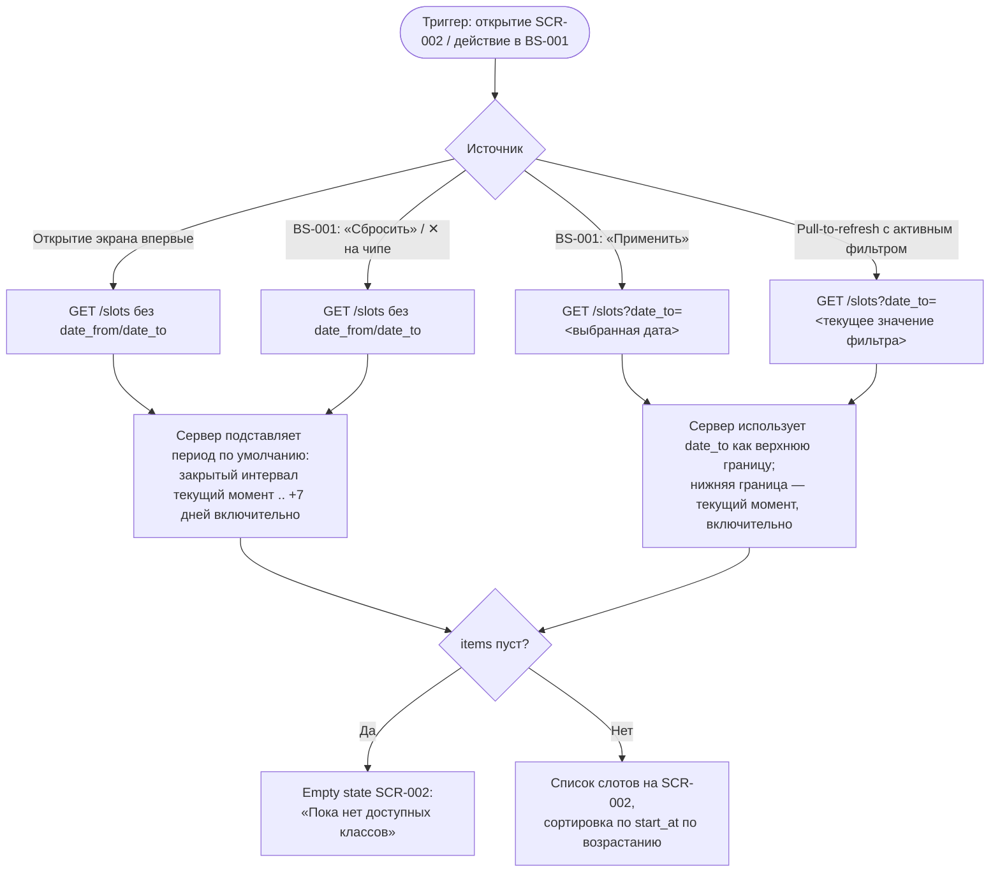

# Фильтрация слотов по датам

**ID:** LOGIC-003
**Приоритет:** Must
**Статус:** Актуален

---

## Обзор

Логика определяет, какие параметры даты клиент передаёт в запрос `GET /slots` (`listSlots`) и
как эти параметры соотносятся с активным периодом, который видит клиент на
[SCR-002](../SCR-002-slot-list.md). Три сценария используют одну и ту же логику:

1. **Первичная загрузка SCR-002** (открытие экрана, фильтр ещё не задавался) — запрос уходит
   **без** параметров `date_from`/`date_to`. Сервер сам подставляет период по умолчанию:
   **закрытый с обеих сторон интервал `[текущий момент, текущий момент + 7 дней]`**, обе границы
   включительны (FR-3, R-027; `date_from`/`date_to` в
   [`api/common/models.yaml`](../../api/common/models.yaml) явно описаны как «граница
   включительна»).
2. **Применение фильтра в [BS-001](../BS-001-date-filter.md)** — запрос уходит с явным
   `date_to=<выбранная дата>`. Параметр `date_from` **не передаётся** — нижняя граница остаётся
   неявной и равна текущему моменту, клиент её не задаёт (FR-3: список — «предстоящих слотов...
   от текущего момента»; BS-001 §6.1, §11 п.1: поле «Показать по» — единственный вводимый
   параметр шторки).
3. **Сброс фильтра** (кнопка «Сбросить» в BS-001 либо ✕ на чипе активного фильтра на SCR-002) —
   повторный запрос **без** параметров даты, идентичный сценарию 1: сервер возвращает дефолтные
   7 дней (UC-3 A2).

Во всех трёх случаях, если ответ API содержит пустой `items`, SCR-002 показывает empty state
(FR-5) — независимо от того, дефолтный период активен или заданный фильтром.

Общий паттерн отображения состояний экрана (Loading/Content/Empty/Error) эта логика не
описывает повторно — см. [LOGIC-005](LOGIC-005_Паттерн-состояний-экрана.md).

---

## Точки применения

| Экран/Шторка | Элемент/Триггер | Условие |
|--------------|------------------|---------|
| [SCR-002 Список слотов](../SCR-002-slot-list.md) | При открытии экрана (первичная загрузка) | Фильтр ранее не применялся или был сброшен |
| [SCR-002 Список слотов](../SCR-002-slot-list.md) | Pull-to-refresh | Всегда — повторяет запрос с теми же параметрами, что и активный период (фильтр сам по себе не сбрасывается) |
| [SCR-002 Список слотов](../SCR-002-slot-list.md) | Тап ✕ на чипе активного фильтра | Чип показан, только если период отличается от дефолтных 7 дней |
| [BS-001 Фильтр по датам](../BS-001-date-filter.md) | Кнопка «Применить» | Клиент выбрал дату в поле «Показать по» |
| [BS-001 Фильтр по датам](../BS-001-date-filter.md) | Кнопка «Сбросить» | Всегда доступна, независимо от текущего состояния поля |

---

## Флоу

---

## API-запросы

### GET /slots

**Спецификация:** [`../../api/slots/api.yaml`](../../api/slots/api.yaml) → `listSlots`
**Триггер:**
- Открытие SCR-002 без ранее заданного фильтра, либо после сброса фильтра — запрос без
  `date_from`/`date_to`. Сервер подставляет дефолтный период — закрытый интервал `[текущий
  момент, текущий момент + 7 дней]`, обе границы включительны (FR-3, R-027).
- Нажатие «Применить» в BS-001 — запрос с `date_to=<выбранная в поле «Показать по» дата>`;
  `date_from` не передаётся (FR-4; параметры описаны в
  [`api/common/models.yaml`](../../api/common/models.yaml) → `DateFromParam`/`DateToParam`).
- Pull-to-refresh на SCR-002 — повторяет тот же набор параметров, что и активный на момент
  обновления период (дефолт либо ранее применённый `date_to`) — фильтр не сбрасывается сам по
  себе.

**Обработка ответа:**

| Результат | Действие |
|-----------|----------|
| Успех, `items` непустой | Список отображается на SCR-002; сортировка по `start_at` по возрастанию гарантирована сервером (FR-3, `listSlots` → «отсортированы по start_at по возрастанию») |
| Успех, `items` пуст (`[]`) | Empty state «Пока нет доступных классов» (FR-5); если активен дефолтный период — подсказка и кнопка «Выбрать другой период» (открывает BS-001), если активен нестандартный период — дополнительно кнопка «Сбросить фильтр» (см. SCR-002 §8) |
| Ошибка (401 / сеть / 5xx) | По общему паттерну состояний — см. [LOGIC-005](LOGIC-005_Паттерн-состояний-экрана.md): при первичной загрузке — Error-заглушка с кнопкой «Обновить» (повтор с теми же параметрами), при pull-to-refresh — снек ошибки без потери уже показанного списка |

---

## Связанные требования

| Категория | Идентификаторы |
|-----------|-----------------|
| **FR** | FR-3 (дефолтный период 7 дней от текущего момента, сортировка), FR-4 (фильтр — более длинный период), FR-5 (empty state при пустом периоде) |
| **NFR** | NFR-5 (отклик списка < 2–3 с) |
| **UC** | [UC-3](../../2-requirements/use-cases.md): основной поток (шаги 1, 3–4) · A1 (расширение периода) · A2 (сброс фильтра) · E1 (нет слотов в периоде) |

---

## Критерии приёмки

| ID | Критерий |
|----|----------|
| AC-001 | **Дано** клиент открывает SCR-002 без ранее заданного фильтра, **Когда** экран загружается, **Тогда** выполняется `GET /slots` без параметров `date_from`/`date_to`, и сервер возвращает слоты за закрытый интервал `[текущий момент, текущий момент + 7 дней]` включительно (FR-3, R-027) |
| AC-002 | **Дано** клиент в BS-001 выбрал дату в поле «Показать по» и нажал «Применить», **Когда** выполняется запрос, **Тогда** SCR-002 отправляет `GET /slots?date_to=<выбранная дата>` без параметра `date_from` (FR-4) |
| AC-003 | **Дано** на SCR-002 активен нестандартный период (после ранее применённого фильтра), **Когда** клиент нажимает «Сбросить» в BS-001 либо ✕ на чипе фильтра, **Тогда** выполняется повторный `GET /slots` без параметров даты, возвращающий дефолтные 7 дней (UC-3 A2) |
| AC-004 | **Дано** ответ API на активный период (дефолтный или заданный фильтром) содержит пустой `items`, **Тогда** SCR-002 показывает empty state «Пока нет доступных классов» (FR-5) |
| AC-005 | **Дано** слот стартует ровно на границе «текущий момент + 7 дней» при запросе без параметров дат, **Тогда** слот включён в результат, так как правая граница интервала включительна (FR-3; `DateToParam` в `api/common/models.yaml` — «граница включительна») |
| AC-006 | **Дано** клиент выполняет pull-to-refresh на SCR-002 с активным нестандартным периодом, **Когда** список обновляется, **Тогда** повторный запрос выполняется с тем же `date_to`, что и до обновления — фильтр не сбрасывается сам по себе |

---

## Обработка ошибок

Специфичной обработки сверх общего паттерна нет — сетевые сбои и пустые результаты при загрузке
списка по любому из трёх сценариев (первичная загрузка, применение фильтра, сброс) обрабатываются
по правилам [LOGIC-005 «Паттерн состояний экрана»](LOGIC-005_Паттерн-состояний-экрана.md): Error-
заглушка для первичной загрузки, снек — для pull-to-refresh, без специфики именно для фильтрации
дат.
