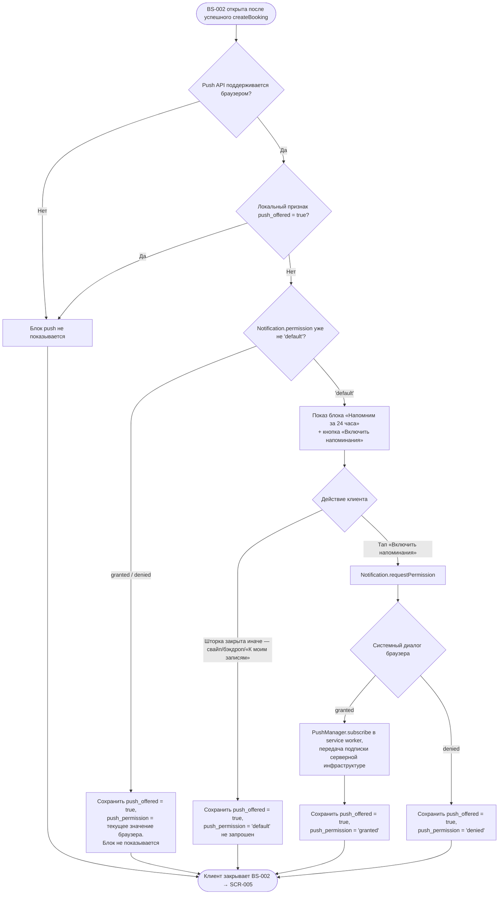

# Запрос push-разрешения

**ID:** LOGIC-004
**Приоритет:** Must
**Статус:** Актуален

---

## Обзор

Логика однократного (за всё время использования приложения клиентом на конкретном
устройстве/браузере) запроса системного разрешения браузера на push-уведомления. Запрос
показывается на шторке [BS-002](../BS-002-booking-success.md) сразу после первой в жизни клиента
успешной записи — момент, когда ценность уведомлений уже понятна пользователю (обоснование места
и частоты показа — `3-design-brief/BS-002-booking-success.md` §6.5, `3-design-brief/00-foundations.md`
§8.1).

Задача логики — узко техническая: получить (или не получить) от браузера разрешение
`Notification`/Push API и **не спросить его повторно**, если решение уже принято или предложение
уже было показано ранее. Логика не отвечает за то, что именно присылается через push — это:

- **FR-21** — push-напоминание о записи за 24 часа до начала класса;
- **FR-22** — push-уведомление при отмене класса студией.

Формирование, расписание и доставка самих push-сообщений — зона ответственности **существующей
серверной инфраструктуры уведомлений** (`00-foundations.md` §8.1; границы скоупа —
`functional-requirements.md` → «Границы скоупа»); клиентское приложение только получает системное
разрешение и передаёт инфраструктуре объект подписки (endpoint и формат передачи — вне текущего
API-контракта, см. раздел «API-запросы» ниже). Резервного канала уведомлений (SMS/email) в
продукте нет (Q-014) — при недоступности push клиент увидит актуальный статус при следующем
открытии приложения (FR-22).

**Платформенное уточнение (NFR-3).** «Шеф-стол» — веб-приложение (PWA), открываемое в браузере, а
не нативное приложение из App Store/Google Play. Поэтому разрешение запрашивается через
браузерный **Web Push API** (`Notification.requestPermission()` + `PushManager.subscribe()` в
service worker), а не через нативный SDK пуш-уведомлений (FCM/APNs SDK) — в отличие от проектов с
нативным приложением, здесь нет привязки к магазину приложений или нативному push-токену
платформы.

---

## Точки применения

| Экран/Шторка | Элемент/Триггер | Условие |
|--------------|------------------|---------|
| [BS-002 Подтверждение записи](../BS-002-booking-success.md) | Блок «Напомним за 24 часа до начала» → кнопка «Включить напоминания» | Первая в жизни клиента успешная запись **на этом устройстве/браузере** И локальный признак «push уже предлагали» ещё не установлен |

Логика не применяется на других экранах: отдельного экрана управления уведомлениями в MVP нет
(`00-foundations.md` §8.1), запрос привязан только к первому успешному прохождению UC-1.

---

## Флоу

**Пояснения к шагам (решения реализации, не описанные буквально в FR — детализируют место/частоту
показа, зафиксированные в `BS-002-booking-success.md` §6.5 и `00-foundations.md` §8.1):**

1. **Проверка поддержки Push API** (`Support`) — feature-detection (`'serviceWorker' in navigator
   && 'PushManager' in window && 'Notification' in window`) выполняется до показа блока. Часть
   мобильных браузеров исторически не поддерживает Web Push (см. NFR-3 — конкретный список
   браузеров заказчиком не задан). Если API не поддерживается, блок скрывается тихо, без ошибки —
   это не сбой, а объективное ограничение платформы клиента.
2. **Проверка локального признака `push_offered`** — хранится в клиентском постоянном хранилище
   (`localStorage`/IndexedDB), привязан к устройству/браузеру, не к серверному профилю клиента
   (сервер о факте показа предложения не уведомляется — переиспользование этого решения на другом
   устройстве не предусмотрено, что соответствует буквальной формулировке §6.5 «на этом
   устройстве/браузере»).
3. **Сверка с фактическим состоянием браузера (`Notification.permission`)** — если разрешение уже
   было выдано или отклонено клиентом напрямую через настройки браузера (в обход блока в
   приложении), системный диалог повторно не вызывается: браузер физически не откроет диалог для
   уже решённого разрешения. Приложение в этом случае просто синхронизирует локальный признак с
   фактическим состоянием, чтобы не пытаться показать блок при следующей записи.
4. **Показ блока и реакция на действие клиента** — если клиент **не нажал** кнопку, а закрыл
   шторку любым другим способом (свайп, тап по бэкдропу, кнопка «К моим записям» — все три
   равноценны, `BS-002-booking-success.md` §3), признак `push_offered` всё равно выставляется в
   `true`. Это прямое следствие правила §6.5 «При второй и последующих записях блок не
   показывается — независимо от того, разрешил клиент push или отказал»: блок должен исчезнуть
   навсегда после первого показа, а не только после явного клика — иначе клиент, просто
   закрывший шторку свайпом, увидел бы то же предложение при следующей записи, что противоречит
   правилу «один раз за всё время использования».
5. **Регистрация подписки на сервере** — при результате `granted` браузер выдаёт объект подписки
   (`PushSubscription`), который клиент должен передать серверной инфраструктуре уведомлений,
   чтобы она могла присылать push по FR-21/FR-22. Конкретный API-эндпоинт для этой передачи —
   вне контракта, проанализированного в `api/` (см. раздел «API-запросы» ниже).

---

## API-запросы

> Секция указана, так как логика подразумевает сетевое взаимодействие с backend для регистрации
> push-подписки — хотя сама эта логика формально не покрыта operationId в текущем API-контракте.

### Регистрация push-подписки — вне текущего API-контракта

**Статус:** открытый вопрос контракта, аналогично уже зафиксированным в `api/README.md` →
«Открытые вопросы, влияющие на контракт» (например, тариф проката). В `api/auth/api.yaml`,
`api/bookings/api.yaml` и `api/slots/api.yaml` нет операции для сохранения `PushSubscription`
клиента на сервере — доставка push обеспечивается **существующей инфраструктурой** уведомлений
(`00-foundations.md` §8.1, `functional-requirements.md` → «Границы скоупа»), контракт для передачи
подписки в эту инфраструктуру не входит в проанализированный `api/` и должен быть уточнён перед
реализацией.

**Триггер:** результат системного диалога браузера — `granted` (см. флоу, шаг «Subscribe»).

**Обработка ответа (ожидаемая, до уточнения контракта):**

| Результат | Действие |
|-----------|----------|
| Подписка успешно зарегистрирована на сервере | Никакого видимого клиенту эффекта — регистрация фоновая, не блокирует и не подтверждает закрытие BS-002 |
| Сетевой сбой при регистрации подписки | Не блокирует закрытие шторки/переход на SCR-005 (см. «Обработка ошибок» ниже); `push_permission = granted` сохраняется локально независимо от исхода регистрации на сервере, так как системное разрешение уже получено от браузера |

---

## Связанные требования

| Категория | Идентификаторы |
|-----------|-----------------|
| **FR** | FR-21 (push-напоминание за 24 часа — содержательная ценность запроса разрешения), FR-22 (push-уведомление об отмене студией — содержательная ценность запроса разрешения) |
| **NFR** | NFR-3 (клиент — PWA в браузере, отсюда Web Push API, а не нативный SDK) |
| **UC** | UC-1 (запись на класс — шаг 6/постусловие, точка первого показа запроса), UC-2 (отмена записи, альт. поток A2 — канал доставки уведомления об отмене студией, ради которого запрашивается разрешение) |

---

## Критерии приёмки

| ID | Критерий |
|----|----------|
| AC-001 | **Дано** это первая в жизни клиента успешная запись на этом устройстве/браузере, признак `push_offered` не установлен, браузер поддерживает Push API, **Когда** открывается BS-002, **Тогда** показывается блок «Напомним за 24 часа до начала» с кнопкой «Включить напоминания». |
| AC-002 | **Дано** показан блок предложения push, **Когда** клиент нажимает «Включить напоминания», **Тогда** вызывается системный диалог браузера `Notification.requestPermission()`. |
| AC-003 | **Дано** клиент разрешил push в системном диалоге, **Когда** разрешение получено (`granted`), **Тогда** выполняется `PushManager.subscribe()`, локально сохраняются `push_offered = true` и `push_permission = granted`, подписка передаётся серверной инфраструктуре уведомлений для последующей отправки FR-21/FR-22. |
| AC-004 | **Дано** клиент отклонил push в системном диалоге, **Когда** разрешение отклонено (`denied`), **Тогда** локально сохраняются `push_offered = true` и `push_permission = denied`; текущая и будущие записи клиента этим не блокируются. |
| AC-005 | **Дано** клиент закрыл BS-002 (свайпом, тапом по бэкдропу или кнопкой «К моим записям»), не нажав «Включить напоминания», **Когда** блок был показан, **Тогда** локально сохраняется `push_offered = true` — блок считается показанным, даже если системный диалог браузера не вызывался. |
| AC-006 | **Дано** признак `push_offered = true` уже сохранён (по любому из AC-003–AC-005), **Когда** клиент открывает BS-002 при второй и последующих успешных записях, **Тогда** блок предложения push не показывается, и это не блокирует переход на SCR-005. |
| AC-007 | **Дано** браузер клиента не поддерживает Push API (нет `serviceWorker`/`PushManager`/`Notification`), **Когда** открыта BS-002 при первой записи, **Тогда** блок предложения push не показывается, ошибка клиенту не выводится (тихая деградация функциональности). |
| AC-008 | **Дано** разрешение на push уже было выдано или отклонено ранее вне приложения (`Notification.permission` ≠ `'default'`) при том, что `push_offered` ещё не установлен, **Когда** открыта BS-002 при первой записи, **Тогда** системный диалог повторно не вызывается, локальный признак синхронизируется с фактическим состоянием браузера, блок не показывается. |

---

## Обработка ошибок

| Ошибка | Контекст | Действие |
|--------|----------|----------|
| Push API не поддерживается браузером | Проверка поддержки перед показом блока (шаг «Support» во флоу) | Блок не показывается; это не ошибка пользователя — тихая деградация. FR-21/FR-22 для этого клиента остаются недоступны через push; актуальный статус записи/отмены он увидит при следующем открытии приложения (текст FR-22, `00-foundations.md` §8.1) |
| Клиент отклонил разрешение (`denied`) | Ответ системного диалога браузера | Не ошибка, а валидный исход. Повторный вызов диалога невозможен технически (браузеры не показывают его повторно после явного отказа) и не предпринимается логикой — см. §6.5 `BS-002-booking-success.md`, решение №4 |
| Сетевой сбой при передаче подписки серверной инфраструктуре | Шаг «Subscribe» → регистрация `PushSubscription` на сервере | Не блокирует закрытие BS-002 и переход на SCR-005; `push_permission = granted` и `push_offered = true` сохраняются локально независимо от исхода сетевого запроса (браузерное разрешение уже получено). Повторная попытка регистрации подписки при следующем запуске приложения — решение реализации, не описанное отдельным FR |
| Клиент позже меняет разрешение в настройках браузера (например, отзывает push) | Вне момента показа BS-002 | Приложение не отслеживает это отдельно и не оповещает клиента — отдельного экрана управления уведомлениями в MVP нет (`00-foundations.md` §8.1); повторный запрос через BS-002 не предусмотрен ни при каких условиях после первого показа |
