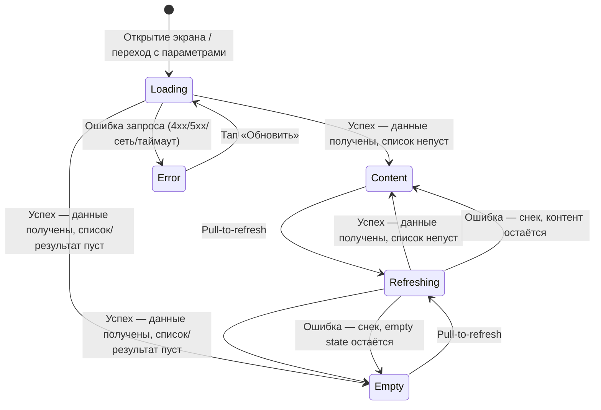
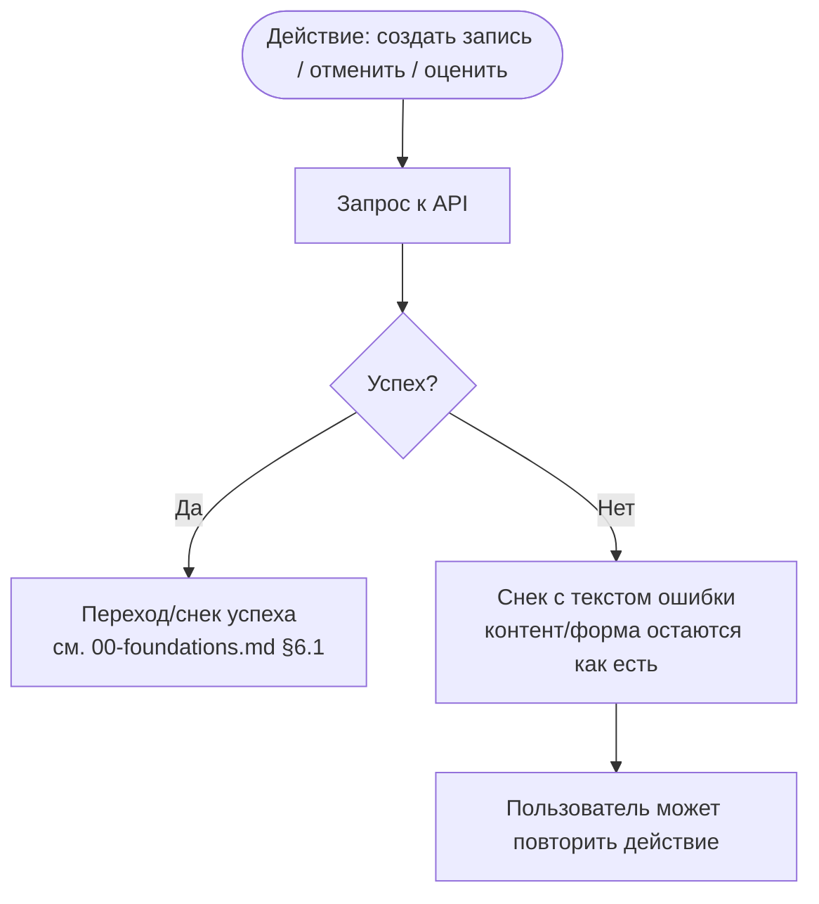

# Паттерн состояний экрана

**ID:** LOGIC-005
**Приоритет:** Must
**Статус:** Актуален

---

## Обзор

Единый жизненный цикл состояний для **любого экрана, который получает данные с API**: от момента
открытия (или перехода на экран с параметрами) до отображения результата — данных, пустого
состояния или ошибки. Логика не специфична ни для одного экрана — это инфраструктурный паттерн
верхнего уровня, на который каждый экранный документ ссылается, уточняя только частности (текст
empty state, состав скелетона, конкретные коды ошибок).

Паттерн решает две задачи:

1. **Первичная загрузка.** Пока данных ещё нет, пользователь видит скелетон вместо пустого белого
   экрана (P7 «Воспринимаемая скорость», NFR-5) и получает предсказуемый путь восстановления после
   сбоя — кнопку «Обновить».
2. **Разграничение обратной связи по источнику сбоя.** Ошибка **первичной загрузки** (нечего
   показать) и ошибка **действия/обновления** (контент уже есть) требуют разных UI-реакций:
   полноэкранная заглушка в первом случае и ненавязчивый снек — во втором, без разрушения уже
   отображённого контента (см. `00-foundations.md` §5, §6.1–§6.3).

Паттерн опирается на схему `Error` из [`../../api/common/models.yaml`](../../api/common/models.yaml)
(поля `code`, `message`, опционально `details`) — коды ошибок и тексты в разделе «Обработка
ответа» ниже соответствуют этой схеме.

---

## Точки применения

| Экран/Шторка | Элемент/Триггер | Условие |
|--------------|------------------|---------|
| [SCR-002 Список слотов](../SCR-002-slot-list.md) | При открытии экрана / смене фильтра дат / pull-to-refresh | Всегда — списковый экран, поддерживает Empty |
| [SCR-003 Карточка слота](../SCR-003-slot-card.md) | При открытии экрана | Всегда — не списковый экран, Empty не применяется |
| [SCR-005 Мои бронирования](../SCR-005-my-bookings.md) | При открытии экрана / pull-to-refresh | Всегда — списковый экран, поддерживает Empty |
| [SCR-006 Детали брони](../SCR-006-booking-details.md) | При открытии экрана | Всегда — не списковый экран, Empty не применяется |
| [SCR-007 Оценка шефа](../SCR-007-chef-rating.md) | При открытии экрана (подгрузка данных слота/брони перед формой оценки) | Всегда |
| [BS-001 Фильтр по датам](../BS-001-date-filter.md) | Кнопка «Применить» / «Сбросить» | Косвенно — инициирует перезапрос списка на SCR-002; ответ обрабатывает SCR-002 по этому паттерну, сама шторка не показывает Loading/Error |
| [BS-002 Подтверждение записи](../BS-002-booking-success.md) | Действие «Записаться» (`createBooking`) на SCR-004 | Косвенно — это **действие**, а не первичная загрузка: ошибка обрабатывается снеком на SCR-004, не заглушкой (см. «Снек vs Error-заглушка» ниже) |
| [BS-003 Подтверждение отмены](../BS-003-cancel-confirm.md) | Кнопка «Отменить запись» (`cancelBooking`) | Косвенно — действие; ошибка — снек на самой шторке (шторка остаётся открытой), успех — снек на экране-родителе SCR-006 |

---

## Флоу

### Состояния экрана (первичная загрузка и pull-to-refresh)

**Ключевое отличие `Loading` от `Refreshing`:** `Loading` — полноэкранный скелетон, показывается
только когда на экране ещё нет данных для отображения (первый заход или повтор после `Error`).
`Refreshing` — лёгкий индикатор поверх уже видимого контента (pull-to-refresh); провал запроса в
состоянии `Refreshing` **никогда** не переводит экран в `Error` — старые данные остаются на
экране, а о сбое сообщает снек (см. §6.3 `00-foundations.md`).

### Обратная связь по действию (снек vs error-заглушка)

Действие (создание записи, отмена, оценка) **не переводит экран в состояние `Error`** из
основного диаграммы состояний — у него нет отдельного жизненного цикла Loading/Content/Empty/Error,
только индикатор занятости кнопки (спиннер/disabled на время запроса) и снек по результату.
`Error`-заглушка зарезервирована исключительно за провалом **первичной загрузки** экрана.

---

## API-запросы

> Секция описывает не конкретный эндпоинт, а универсальное правило сопоставления результата
> **любого** запроса экрана (`GET` — первичная загрузка/обновление, `POST`/`DELETE` — действие)
> состоянию UI. Конкретные операции (`operationId`, доменные коды из `enum` схемы `Error`) — в
> разделе «Используемые запросы» каждого экранного документа.

### Запрос первичной загрузки (`GET`, инициализация экрана или pull-to-refresh)

**Спецификация:** соответствующий `operationId` домена — см. `../../api/{домен}/api.yaml`
экрана-потребителя (`slots.getSlots`, `slots.getSlot`, `bookings.getBookings`,
`bookings.getBooking` и т.п.).
**Триггер:** открытие экрана, смена входных параметров (например, фильтр дат), pull-to-refresh.

**Обработка ответа:**

| Результат | Состояние экрана | Действие |
|-----------|-------------------|----------|
| 200, данные непусты | `Content` | Показать данные. |
| 200, данные пусты (списковый экран) | `Empty` | Показать заглушку с пояснением, почему пусто (текст — за экранным документом; пример FR-5: «Пока нет доступных классов»). |
| 4xx/5xx/сетевая ошибка, **первый заход или после «Обновить»** (состояние было `Loading`) | `Error` | Полноэкранная заглушка + кнопка «Обновить». Текст: сеть — «Не удалось загрузить. Проверьте соединение и попробуйте снова.»; сервер 5xx — «Что-то пошло не так. Попробуйте ещё раз позже.» (00-foundations.md §6). |
| 4xx/5xx/сетевая ошибка, **pull-to-refresh** (состояние было `Content`/`Empty`) | Состояние не меняется (остаётся `Content`/`Empty`) | Снек «Не удалось загрузить. Проверьте соединение и попробуйте снова.» (или текст 5xx-варианта), контент/empty state сохраняется, `Error`-заглушка не показывается. |

### Запрос действия (`POST`/`DELETE`, например `createBooking`, `cancelBooking`, `submitRating`)

**Триггер:** тап по CTA действия (не открытие экрана).

**Обработка ответа:**

| Результат | Действие |
|-----------|----------|
| Успех (2xx) | Снек успеха или переход на экран/шторку итога — правило «кто показывает снек» и «не дублировать обратную связь» см. `00-foundations.md` §6.1–§6.2. Экран/форма, инициировавшие действие, не переходят в состояние `Error`. |
| Ошибка, сеть недоступна | Снек «Не удалось выполнить. Проверьте соединение и повторите.» — форма/экран остаются в прежнем виде, действие можно повторить. |
| Ошибка, 5xx | Снек «Что-то пошло не так. Попробуйте ещё раз позже.» |
| Ошибка, доменный код 4xx (`slot_full`, `slot_cancelled`, `slot_started`, `already_cancelled`, `not_ratable`, `already_rated` и т.п. из `Error.code`) | Снек/инлайн-сообщение с текстом из `message` схемы `Error` (или сквозным текстом, если он определён в `00-foundations.md` §6, например «Мест больше нет. Список обновлён.») — конкретика по коду описана в экранном документе, обрабатывающем эту операцию. |

---

## Связанные требования

| Категория | Идентификаторы |
|-----------|-----------------|
| **FR** | FR-5 (пример текста Empty), FR-21, FR-22 (косвенно — актуальность статуса при следующем открытии как часть обработки Content/Error) |
| **NFR** | NFR-1 (mobile-first, скелетон вместо пустого экрана), NFR-5 (воспринимаемая скорость отклика) |
| **UC** | UC-1 (E1, E3 — ошибка действия при записи), UC-2 (E3 — ошибка действия при отмене), UC-3 (E1 — Empty, E2 — Error первичной загрузки списка), UC-4 (E3 — ошибка действия при оценке) |

---

## Критерии приёмки

| ID | Критерий |
|----|----------|
| AC-001 | **Дано** экран с запросом к API только что открыт, **Когда** ответ ещё не получен, **Тогда** отображается скелетон (`Loading`), а не пустой экран. |
| AC-002 | **Дано** экран в состоянии `Loading`, **Когда** запрос завершился успехом и данные непусты, **Тогда** экран переходит в `Content` и показывает данные. |
| AC-003 | **Дано** списковый экран в состоянии `Loading`, **Когда** запрос завершился успехом, но данных нет, **Тогда** экран переходит в `Empty` с понятной подсказкой. |
| AC-004 | **Дано** экран в состоянии `Loading` (первичная загрузка), **Когда** запрос завершился ошибкой (4xx/5xx/сеть), **Тогда** экран переходит в `Error` и показывает заглушку с нейтральным текстом и кнопкой «Обновить», без обвинения пользователя. |
| AC-005 | **Дано** экран в состоянии `Error`, **Когда** пользователь нажимает «Обновить», **Тогда** экран возвращается в `Loading` и повторяет тот же запрос. |
| AC-006 | **Дано** экран в состоянии `Content` (или `Empty` на списковом экране), **Когда** пользователь выполняет pull-to-refresh, **Тогда** экран переходит в `Refreshing`, старые данные остаются видимыми под индикатором обновления. |
| AC-007 | **Дано** экран в состоянии `Refreshing`, **Когда** повторный запрос завершается ошибкой, **Тогда** экран **не** переходит в `Error`-заглушку — показывается снек с текстом ошибки, а ранее отображённые данные остаются на экране без изменений. |
| AC-008 | **Дано** пользователь выполняет действие (создание записи, отмена, оценка) и оно завершается ошибкой, **Когда** экран, с которого инициировано действие, уже показывает контент (`Content`), **Тогда** используется снек, а не `Error`-заглушка — контент экрана/данные формы сохраняются. |
| AC-009 | **Дано** пользователь выполняет действие и оно завершается успехом, **Когда** результат уже очевиден из перехода на отдельный экран/шторку успеха (например, `createBooking` → BS-002), **Тогда** дублирующий снек об успехе на экране-инициаторе не показывается. |
| AC-010 | **Дано** сетевая ошибка возникает при первичной загрузке, **Когда** экран показывает `Error`-заглушку, **Тогда** используется дословный текст «Не удалось загрузить. Проверьте соединение и попробуйте снова.»; при ошибке сервера (5xx) — «Что-то пошло не так. Попробуйте ещё раз позже.». |
