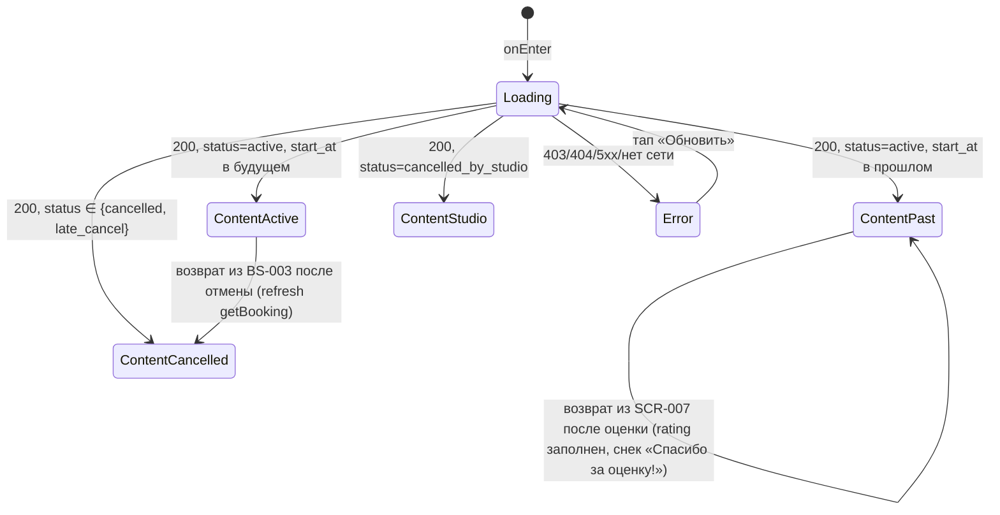

# Детали бронирования + отмена

**ID:** SCR-006
**Тип:** Экран
**Приоритет:** Must
**Статус:** Актуален
**Зона авторизации:** АЗ
**Дизайн-бриф:** [SCR-006 · Детали бронирования + отмена](../3-design-brief/SCR-006-booking-details.md)

---

## Содержание

- [Обзор](#обзор)
- [Навигация](#навигация)
- [Входные данные](#входные-данные)
- [Применяемые логики](#применяемые-логики)
- [Используемые запросы](#используемые-запросы)
- [Элементы экрана](#элементы-экрана)
- [Состояния экрана](#состояния-экрана)
- [Действия пользователя](#действия-пользователя)
- [Связанные требования](#связанные-требования)
- [Критерии приёмки](#критерии-приёмки)

---

## Обзор

Вложенный экран авторизованной зоны. Показывает **полную информацию об одной записи (брони)
клиента** и служит **точкой запуска её отмены**. Открывается из списка
[«Мои бронирования» (SCR-005)](SCR-005-my-bookings.md) тапом по конкретному бронированию (FR-13).
Таб-бар на этом экране скрыт.

Три задачи экрана:

1. **Просмотр.** Полные параметры записи, статус и вариант экипировки — что оплатить офлайн и на
   что клиент записан (FR-13, FR-8, FR-23).
2. **Отмена.** Единственное действие над записью — отмена целиком. Подтверждение, определение
   раннего/позднего порога и текст предупреждения выполняются в шторке
   [BS-003 «Подтверждение отмены»](../3-design-brief/BS-003-cancel-confirm.md); этот экран только
   запускает шторку и отображает результат после возврата (FR-14, FR-15, FR-16).
3. **Переход к оценке шефа.** Для прошедшего неотменённого класса без уже поставленной оценки —
   точка входа в [SCR-007 «Оценка шефа»](../3-design-brief/SCR-007-chef-rating.md) (FR-20).

Экран не показывает карту — в домене «Шеф-стол» нет геопривязанного перемещения (класс идёт в
лофте студии по расписанию).

### User Story

> Как клиент, я хочу видеть детали своей записи на кулинарный класс и при необходимости отменить
> её до начала, понимая последствия, чтобы освободить место, если мои планы изменились; а после
> посещения класса — оценить шефа.

### Бизнес-ценность

- Прозрачность записи: клиент видит все параметры брони и сумму к офлайн-оплате в одном месте.
- Самообслуживание при отмене — клиент не пишет в мессенджер, а отменяет запись сам, понимая
  последствия ещё до подтверждения.
- Ранняя отмена клиентом возвращает место в слот (FR-15) — его может занять другой клиент.
- Точка входа к оценке шефа поддерживает обратную связь владельцу о качестве проведения классов
  (FR-19, FR-20), не нагружая экран деталей формой ввода напрямую.

---

## Навигация

### Входящая (откуда открывается)

| Источник | Триггер | Условие | Передаваемые параметры |
|----------|---------|---------|------------------------|
| [SCR-005 Мои бронирования](SCR-005-my-bookings.md) | Тап по карточке записи | Всегда, для записи в любом статусе | `bookingId` |
| [SCR-007 Оценка шефа](../3-design-brief/SCR-007-chef-rating.md) | Возврат после успешной отправки оценки (`submitRating`) | После `200 OK` на SCR-007 | `bookingId` (тот же); экран перечитывает запись (`getBooking`), получая заполненное поле `rating` |

> **Возврат с SCR-007.** SCR-006 как экран-родитель показывает снек **«Спасибо за оценку!»**
> ([foundations §6.1](../3-design-brief/00-foundations.md#61-каталог-снеков-успеха)). После
> перечитывания записи поле `rating` в ответе `getBooking` заполнено (не `null`) — CTA
> «Оценить шефа» заменяется нейтральной пометкой **«Оценка отправлена»** (см.
> [§8, блок 8](#8-нижний-cta-контекстный)).

### Исходящая (куда ведёт)

| Назначение | Триггер | Передаваемые параметры |
|------------|---------|------------------------|
| [BS-003 Подтверждение отмены](../3-design-brief/BS-003-cancel-confirm.md) | Тап по активной (enabled) кнопке «Отменить» | `bookingId` |
| [SCR-007 Оценка шефа](../3-design-brief/SCR-007-chef-rating.md) | Тап по кнопке «Оценить шефа» | `bookingId` |
| [SCR-005 Мои бронирования](SCR-005-my-bookings.md) | Тап «Назад» в хедере | — |

> **Кто показывает снек после отмены.** Само действие отмены (`cancelBooking`) выполняется в
> [BS-003](../3-design-brief/BS-003-cancel-confirm.md), а не на этом экране. После подтверждения
> управление возвращается на SCR-006 с обновлённым статусом; снек-**итог** отмены («Запись
> отменена» / «Поздняя отмена: продукты на класс уже закуплены. Штраф не взимается.») показывает
> **SCR-006** как экран-родитель, а не шторка ([foundations §6.2](../3-design-brief/00-foundations.md#62-кто-показывает-снек-при-закрытии-шторки)).
> Снеки **ошибок**, при которых шторка остаётся открытой (сеть/5xx), показывает сама BS-003 и на
> SCR-006 не дублируются. Возврат в список бронирований (SCR-005) — отдельное действие клиента
> через «Назад», не автоматический переход.
>
> «Отменить» и «Оценить шефа» взаимоисключающи по условиям (класс либо ещё не начался, либо уже
> прошёл) — на экране в любой момент времени активен не более чем один из двух CTA.

---

## Входные данные

| Название | Тип | Возможные значения | Описание |
|----------|-----|---------------------|----------|
| `bookingId` | Навигационный параметр | UUID | Идентификатор записи, переданный из [SCR-005](SCR-005-my-bookings.md) (или сохранённый при возврате с [SCR-007](../3-design-brief/SCR-007-chef-rating.md)). Используется как path-параметр `getBooking`. Обязателен; при отсутствии/невалидном значении — состояние Error. |

---

## Применяемые логики

| Логика | Элемент/Триггер | Описание |
|--------|------------------|----------|
| [LOGIC-002 Правило отмены (24 часа)](09_Логики/LOGIC-002_Правило-отмены-24-часа.md) | Строка «Бесплатно отменить можно до…» (§8, блок 7); доступность CTA «Отменить» (§8, блок 8) | Момент бесплатной отмены — **готовое поле `free_cancellation_until`** из ответа `getBooking`; клиент **не вычисляет** `slot.start_at − 24ч` самостоятельно ни в этой строке, ни при определении доступности CTA. Финальный статус после отмены («Отменена») определяется полем `status` ответа `cancelBooking`, а не предварительным клиентским расчётом. |
| [LOGIC-005 Паттерн состояний экрана](09_Логики/LOGIC-005_Паттерн-состояний-экрана.md) | Экран целиком | Единый цикл Loading → Content/Error поверх запроса `getBooking`; см. [Состояния экрана](#состояния-экрана). |

---

## Используемые запросы

> Все API-запросы — по контракту [`../api/`](../api/). Общий паттерн обработки ответа
> (Loading/Content/Empty/Error) — [00-foundations.md §5](../3-design-brief/00-foundations.md#5-сквозной-паттерн-состояний-экрана),
> здесь не повторяется — указывается только специфика конкретного запроса.

### getBooking

**Метод:** GET
**Спецификация:** [`../api/bookings/api.yaml`](../api/bookings/api.yaml) → `getBooking`
**Триггер:** Инициализация экрана; повторный вызов — при возврате из [BS-003](../3-design-brief/BS-003-cancel-confirm.md)
после отмены, при возврате из [SCR-007](../3-design-brief/SCR-007-chef-rating.md) после оценки, и
при тапе «Обновить» в состоянии Error.

**Параметры:**

| Параметр | Тип | Обязательность | Источник | Описание |
|----------|-----|-----------------|----------|----------|
| `bookingId` | string (uuid) | Да | Навигационный параметр | Идентификатор записи (path, `../common/models.yaml` → `BookingIdParam`). |

**Обработка ответа:**

| Результат | Условие | UI-реакция |
|-----------|---------|------------|
| Успех | `200 OK`, тело — схема `Booking` (`../api/bookings/models.yaml`) с вложенным `slot` | Состояние Content: отрисовка блоков по [Элементы экрана](#элементы-экрана); бейдж статуса, доступность CTA и текст строки «Бесплатно отменить можно до…» вычисляются из `status`, `slot.start_at`, `free_cancellation_until` и `rating` полученного ответа |
| Ошибка авторизации | `401 unauthorized` | Переход на вход (сквозное поведение авторизованной зоны) |
| Чужая запись | `403 forbidden` | Состояние Error (принцип «только свои данные», NFR-8) |
| Не найдена | `404 not_found` | Состояние Error |
| Сбой сервиса/сети | `5xx` / нет сети | Состояние Error, текст — [foundations §6](../3-design-brief/00-foundations.md#6-tone-of-voice-и-общая-микрокопия): «Не удалось загрузить. Проверьте соединение и попробуйте снова.» |

### cancelBooking

**Метод:** POST
**Спецификация:** [`../api/bookings/api.yaml`](../api/bookings/api.yaml) → `cancelBooking`
**Триггер:** Кнопка **«Отменить запись»** в шторке [BS-003](../3-design-brief/BS-003-cancel-confirm.md)
— сам запрос выполняется в шторке, не на этом экране. SCR-006 как экран-родитель обрабатывает
результат **после** закрытия шторки (полный флоу и состояние загрузки —
[LOGIC-002](09_Логики/LOGIC-002_Правило-отмены-24-часа.md), [BS-003](../3-design-brief/BS-003-cancel-confirm.md)).

**Параметры:**

| Параметр | Тип | Обязательность | Источник | Описание |
|----------|-----|-----------------|----------|----------|
| `bookingId` | string (uuid) | Да | Навигационный параметр, передан в BS-003 | Идентификатор отменяемой записи; запрос без тела — отмена только целиком. |

**Обработка ответа (реакция SCR-006 после возврата из BS-003):**

| Результат | Условие | UI-реакция |
|-----------|---------|------------|
| Успех, ранняя отмена | `200 OK`, `status = cancelled` (FR-15) | Бейдж «Отменена»; CTA «Отменить» → disabled «Запись уже отменена.»; снек-**родитель** «Запись отменена» |
| Успех, поздняя отмена | `200 OK`, `status = late_cancel` (FR-16) | Бейдж «Отменена» (тот же, что при ранней — см. [§8, блок 2](#2-бейдж-статуса-и-причина-отмены-студией)); CTA disabled; снек-родитель «Поздняя отмена: продукты на класс уже закуплены. Штраф не взимается.» |
| Класс уже начался | `422 slot_started` (UC-2 E1) | Экран перечитывает `booking` (`getBooking`); статус не меняется самопроизвольно, CTA становится disabled «Класс уже начался — отменить запись нельзя.»; снек ошибки показывает BS-003 при закрытии |
| Повторная отмена | `409 already_cancelled` (UC-2 E2) | Экран перечитывает `booking`; отображается текущий (уже актуальный) статус; снек показывает BS-003 |
| Сеть/сервер | `5xx` / нет сети (UC-2 E3) | На SCR-006 изменений нет — шторка остаётся открытой, статус записи не меняется; снек ошибки показывает сама BS-003, на SCR-006 не дублируется |

---

## Элементы экрана

> Экран полностью read-only (нет полей ввода) — колонка «Валидация» везде «—».

### 1. Хедер

| Элемент | Описание | Источник данных | Валидация | Действие |
|---------|----------|------------------|-----------|----------|
| Кнопка «Назад» | Возврат к списку бронирований | — | — | Переход на [SCR-005](SCR-005-my-bookings.md) |
| Заголовок | Текст «Детали записи» | статичный | — | — |

**Условия доступности:** кнопка «Назад» доступна всегда, в любом состоянии экрана (кроме Loading, если так решено дизайнером на макете).

### 2. Бейдж статуса и причина отмены студией

| Элемент | Описание | Источник данных | Валидация | Действие |
|---------|----------|------------------|-----------|----------|
| Бейдж статуса | Иконка + текст текущего статуса записи | `status` из `Booking` (`getBooking`) + производное «Прошла» по `slot.start_at` | — | — |
| Причина отмены студией | Текст причины | `slot.cancellation_reason` (`getBooking` → `Booking.slot`) | — | — |

**Логика — соответствие API-статуса и UI-бейджа:**

| `status` (API) | `slot.start_at` | UI-статус (бейдж) |
|-----------------|------------------|--------------------|
| `active` | в будущем | **Активна** |
| `active` | уже наступил | **Прошла** |
| `cancelled` | любое | **Отменена** |
| `late_cancel` | любое | **Отменена** (та же метка, что и `cancelled` — постоянного статуса «поздняя отмена» нет; разница видна только в снеке в момент самой отмены, см. [Используемые запросы → cancelBooking](#cancelbooking)) |
| `cancelled_by_studio` | любое | **Отменён студией** |

Ровно четыре видимых UI-статуса. Для «Отменён студией» под бейджем дополнительно показывается
текст причины из `slot.cancellation_reason` по шаблону foundations §6: «Класс отменён студией.
Причина: [reason]. Повторная запись на этот слот недоступна.» (FR-17). Бронь при этом **не
удаляется** из истории. Смысл статуса передаётся иконкой и текстом, не только цветом.

**Условия доступности:** блок причины отображается, только если `status = cancelled_by_studio`.

### 3. Блок «Когда»

| Элемент | Описание | Источник данных | Валидация | Действие |
|---------|----------|------------------|-----------|----------|
| Дата и время начала | Дата и время начала класса, крупно и контрастно | `slot.start_at` (`getBooking`) | — | — |

### 4. Блок «Программа и шеф»

| Элемент | Описание | Источник данных | Валидация | Действие |
|---------|----------|------------------|-----------|----------|
| Название программы | Название кулинарной программы | `slot.program.name` | — | — |
| Уровень сложности | «для новичков» / «для опытных» | `slot.program.difficulty` (`novice`/`experienced`) | — | — |
| Шеф | Имя шефа, ведущего класс | `slot.chef.name` | — | — |

> Список ингредиентов/аллергенов программы здесь не повторяется — это информация для решения о
> записи (уже принято), показывается на [SCR-003](../3-design-brief/SCR-003-slot-card.md); допущение дизайнера.

### 5. Блок «Экипировка»

| Элемент | Описание | Источник данных | Валидация | Действие |
|---------|----------|------------------|-----------|----------|
| Вариант экипировки | «Своя экипировка» / «Прокатная экипировка» | `equipment_choice` (`own`/`rental`, `getBooking`) | — | — |

Лейблы — единые для всего приложения ([foundations §6](../3-design-brief/00-foundations.md#6-tone-of-voice-и-общая-микрокопия)).
Прокатный фонд не ограничен и не влияет на исход записи (FR-9) — здесь дополнительно не
комментируется.

### 6. Блок «Цена»

| Элемент | Описание | Источник данных | Валидация | Действие |
|---------|----------|------------------|-----------|----------|
| Итоговая цена | Сумма к оплате, ₽ | **`price_total`** (readOnly, `getBooking`) — зафиксирована на момент записи; клиент не пересчитывает (FR-23) | — | — |
| Текст офлайн-оплаты | «Оплата на месте: наличные или перевод на карту.» | статичный, [foundations §6](../3-design-brief/00-foundations.md#6-tone-of-voice-и-общая-микрокопия) | — | — |

### 7. Строка «Бесплатная отмена» (только статус «Активна»)

| Элемент | Описание | Источник данных | Валидация | Действие |
|---------|----------|------------------|-----------|----------|
| Момент бесплатной отмены | «Бесплатно отменить можно до `<free_cancellation_until>`» | **`free_cancellation_until`** (readOnly, `getBooking`) | — | — |

**Логика:** значение — **готовое поле API**, полученное в ответе `getBooking`. Клиент **не
вычисляет** его самостоятельно вычитанием 24 часов из `slot.start_at` — порог остаётся
исключительно на стороне сервера (устраняет клиентский пересчёт, зафиксировано в
[LOGIC-002](09_Логики/LOGIC-002_Правило-отмены-24-часа.md) и в контракте API,
`api/bookings/models.yaml` → `Booking.free_cancellation_until`). Строка показывается только при
UI-статусе «Активна» (см. [§8, блок 2](#2-бейдж-статуса-и-причина-отмены-студией)).

**Условия доступности:** строка видна, только если `status = active` и `slot.start_at` в будущем.

### 8. Нижний CTA (контекстный)

| Элемент | Описание | Источник данных | Валидация | Действие |
|---------|----------|------------------|-----------|----------|
| Кнопка «Отменить» | Primary CTA во всю ширину, деструктивное действие; отмена только целиком | — | — | Открыть [BS-003](../3-design-brief/BS-003-cancel-confirm.md) с `bookingId` |
| Пояснение недоступности | Короткий текст рядом с disabled-кнопкой «Отменить» | производное от `status`/`slot.start_at` | — | — |
| Кнопка «Оценить шефа» | Заменяет «Отменить», когда класс прошёл и оценки ещё нет | `rating` (`Booking.rating`, `getBooking`) `= null` | — | Переход на [SCR-007](../3-design-brief/SCR-007-chef-rating.md) с `bookingId` |
| Пометка «Оценка отправлена» | Нейтральный текст вместо кнопки (не интерактивна) | `rating` (`Booking.rating`) `≠ null` | — | — |

**Логика выбора CTA (единый источник условий для этого блока):**

1. **«Отменить», enabled** — только когда UI-статус «Активна» (`status = active` **и**
   `slot.start_at` в будущем). Тап → [BS-003](../3-design-brief/BS-003-cancel-confirm.md) (FR-14).
2. **«Отменить», disabled с обязательным пояснением** (не скрывается):
   - UI-статус «Прошла» (класс уже начался, UC-2 E1) → «Класс уже начался — отменить запись
     нельзя.»
   - UI-статус «Отменена» (`status ∈ {cancelled, late_cancel}`, UC-2 E2) → «Запись уже отменена.»
   - UI-статус «Отменён студией» → «Класс отменён студией — отменять уже нечего.»
3. **«Оценить шефа»** — показывается **вместо** «Отменить», только если UI-статус «Прошла»
   (класс состоялся, не отменён ни клиентом, ни студией, FR-20) **и** поле `rating` в ответе
   `getBooking` равно `null` (оценка ещё не поставлена).
4. **Пометка «Оценка отправлена»** — показывается вместо кнопки «Оценить шефа», если `rating ≠
   null`. Защищает от повторной отправки оценки (UC-4 E2) уже на этом экране, не только на
   [SCR-007](../3-design-brief/SCR-007-chef-rating.md).
5. Для UI-статусов «Отменена» и «Отменён студией» кнопка «Оценить шефа» **не показывается
   вовсе** — FR-20 разрешает оценку только для неотменённых прошедших записей; приоритет
   отдаётся факту отмены, а не факту «класс прошёл».
6. «Отменить» и «Оценить шефа»/«Оценка отправлена» взаимоисключающи — на экране одновременно
   виден не более чем один нижний блок.

**Условия доступности:**
- Кнопка «Отменить» активна (enabled), только если: `status = active` **и** `slot.start_at` в будущем.
- Кнопка «Оценить шефа» видна и активна, только если: UI-статус «Прошла» **и** `rating = null`.

---

## Состояния экрана

Базовый паттерн — [00-foundations.md §5](../3-design-brief/00-foundations.md#5-сквозной-паттерн-состояний-экрана)
([LOGIC-005](09_Логики/LOGIC-005_Паттерн-состояний-экрана.md)). Специфика этого экрана:

| Состояние | Условие | Отображение |
|-----------|---------|--------------|
| Loading | Ожидание ответа `getBooking` | Скелетон в форме блоков деталей и бейджа статуса (не пустой экран) |
| Content — Активна | `200 OK`, `status = active`, `slot.start_at` в будущем | Полные детали; строка «Бесплатно отменить можно до `<free_cancellation_until>`»; CTA «Отменить» enabled |
| Content — Прошла, не оценено | `200 OK`, `status = active`, `slot.start_at` в прошлом, `rating = null` | Полные детали; бейдж «Прошла»; CTA «Оценить шефа» |
| Content — Прошла, оценено | `200 OK`, `status = active`, `slot.start_at` в прошлом, `rating ≠ null` | Полные детали; бейдж «Прошла»; вместо CTA — пометка «Оценка отправлена» |
| Content — Отменена | `200 OK`, `status ∈ {cancelled, late_cancel}` | Полные детали; бейдж «Отменена»; CTA «Отменить» disabled «Запись уже отменена.» |
| Content — Отменён студией | `200 OK`, `status = cancelled_by_studio` | Полные детали; бейдж «Отменён студией» + причина (`slot.cancellation_reason`); CTA disabled «Класс отменён студией — отменять уже нечего.» |
| Empty | Неприменимо | Экран всегда открывается для одной существующей записи; переход на несуществующую/чужую запись трактуется как **Error** (принцип «только свои данные», NFR-8), а не как пустое состояние |
| Error | `401` (переход на вход) / `403` / `404` / `5xx` / нет сети | Заглушка ошибки + кнопка «Обновить» («Не удалось загрузить. Проверьте соединение и попробуйте снова.») |

---

## Действия пользователя

| Действие | Элемент | Триггер | Результат |
|----------|---------|---------|-----------|
| Вернуться к списку | Кнопка «Назад» (хедер) | Tap | Переход на [SCR-005](SCR-005-my-bookings.md) |
| Начать отмену | Кнопка «Отменить» (enabled) | Tap | Открыть [BS-003](../3-design-brief/BS-003-cancel-confirm.md) с `bookingId` |
| Перейти к оценке шефа | Кнопка «Оценить шефа» | Tap | Открыть [SCR-007](../3-design-brief/SCR-007-chef-rating.md) с `bookingId` |
| Повторить загрузку | Кнопка «Обновить» (состояние Error) | Tap | Повторный запрос [getBooking](#getbooking) |

---

## Связанные требования

| Категория | Идентификаторы |
|-----------|-----------------|
| **FR** | FR-8 (вариант экипировки), FR-13 (детали записи, статус, экипировка), FR-14 (отмена до начала класса), FR-15 (ранняя отмена ≥24ч), FR-16 (поздняя отмена <24ч), FR-17 (статус «Отменён студией» с причиной), FR-18 (запрет повторной записи на слот, отменённый студией — реализуется на SCR-002/SCR-003, здесь упомянут для полноты картины), FR-20 (условие показа CTA «Оценить шефа»), FR-23 (цена и офлайн-оплата) |
| **NFR** | NFR-1 (mobile-first: тач-зоны, крупные ключевые числа), NFR-8 (клиент видит и управляет только своими записями и оценками) |
| **UC** | [UC-2](../2-requirements/use-cases.md) — отмена записи: основной поток, A1 (поздняя отмена), A2 (отмена студией, входящее состояние), E1–E3; [UC-4](../2-requirements/use-cases.md) — предусловия доступности оценки шефа, E2 (оценка уже поставлена) |
| **US** | US-9 (просмотр деталей брони), US-10 (отмена до начала класса), US-11 (статус и причина отмены студией), US-13 (переход к оценке шефа после посещения класса) |

---

## Критерии приёмки

### Позитивные

| ID | Критерий |
|----|----------|
| AC-001 | **Дано** клиент открыл детали активной записи (`status = active`, `slot.start_at` в будущем), **Когда** экран в состоянии Content, **Тогда** отображаются бейдж «Активна», дата/время начала, программа и уровень сложности, шеф, вариант экипировки, цена и напоминание об офлайн-оплате, а также строка «Бесплатно отменить можно до `<free_cancellation_until>`», где значение взято готовым из ответа `getBooking` без вычислений на клиенте |
| AC-002 | **Дано** запись активна и класс ещё не начался, **Когда** экран в Content, **Тогда** кнопка «Отменить» активна (enabled) и тап по ней открывает шторку [BS-003](../3-design-brief/BS-003-cancel-confirm.md) с `bookingId` |
| AC-003 | **Дано** класс прошёл, запись не была отменена (`status = active`, `slot.start_at` в прошлом) и `rating = null`, **Когда** экран в Content, **Тогда** вместо «Отменить» показана кнопка «Оценить шефа», и тап по ней открывает [SCR-007](../3-design-brief/SCR-007-chef-rating.md) с `bookingId` |
| AC-004 | **Дано** класс прошёл, запись не отменена и `rating ≠ null` (оценка уже поставлена), **Когда** экран в Content, **Тогда** вместо кнопки «Оценить шефа» показывается неинтерактивная пометка «Оценка отправлена» |
| AC-005 | **Дано** клиент вернулся на SCR-006 из [SCR-007](../3-design-brief/SCR-007-chef-rating.md) после успешной отправки оценки, **Когда** управление возвращается на экран, **Тогда** SCR-006 показывает снек «Спасибо за оценку!», перечитывает запись (`getBooking`) и заменяет CTA «Оценить шефа» на пометку «Оценка отправлена» |
| AC-006 | **Дано** класс был отменён студией (`status = cancelled_by_studio`), **Когда** экран в Content, **Тогда** бейдж показывает «Отменён студией» с причиной из `slot.cancellation_reason`, бронь остаётся видна (не удалена), а кнопка «Отменить» disabled с пояснением «Класс отменён студией — отменять уже нечего.» |
| AC-007 | **Дано** клиент подтвердил раннюю отмену в [BS-003](../3-design-brief/BS-003-cancel-confirm.md) (`200 OK`, `status = cancelled`), **Когда** шторка закрылась и управление вернулось на SCR-006, **Тогда** экран показывает снек «Запись отменена», бейдж «Отменена» и кнопку «Отменить» disabled «Запись уже отменена.» |
| AC-008 | **Дано** клиент подтвердил позднюю отмену в BS-003 (`200 OK`, `status = late_cancel`), **Когда** шторка закрылась, **Тогда** SCR-006 показывает снек «Поздняя отмена: продукты на класс уже закуплены. Штраф не взимается.», тот же бейдж «Отменена» (без отдельного статуса «поздняя отмена») и CTA disabled |
| AC-009 | **Дано** экран в состоянии Content, **Когда** отображается бейдж статуса, **Тогда** смысл статуса передан иконкой и/или текстом, а не только цветом |

### Негативные

| ID | Критерий |
|----|----------|
| AC-N01 | **Дано** `getBooking` вернул `403`/`404`/`5xx` или нет сети, **Когда** открытие экрана, **Тогда** отображается состояние Error с кнопкой «Обновить» |
| AC-N02 | **Дано** `status = active`, но `slot.start_at` уже наступил (UC-2 E1), **Когда** экран в Content, **Тогда** кнопка «Отменить» disabled с пояснением «Класс уже начался — отменить запись нельзя.» |
| AC-N03 | **Дано** запись уже отменена клиентом (`status ∈ {cancelled, late_cancel}`, UC-2 E2), **Когда** экран в Content, **Тогда** кнопка «Отменить» disabled с пояснением «Запись уже отменена.» и отображается бейдж «Отменена» |
| AC-N04 | **Дано** класс прошёл, но запись была отменена клиентом или студией ещё до старта, **Когда** экран в Content, **Тогда** CTA-раздел показывает disabled-статус «Отменена»/«Отменён студией» (с соответствующим пояснением), а не кнопку «Оценить шефа» — приоритет у факта отмены (FR-20) |
| AC-N05 | **Дано** `cancelBooking` в [BS-003](../3-design-brief/BS-003-cancel-confirm.md) вернул `422 slot_started` (класс стартовал между открытием экрана и подтверждением), **Когда** управление возвращается на SCR-006, **Тогда** экран перечитывает запись (`getBooking`), статус не меняется самопроизвольно, а кнопка «Отменить» становится disabled с пояснением «Класс уже начался — отменить запись нельзя.» |
| AC-N06 | **Дано** `cancelBooking` завершился сетевой ошибкой (`5xx`/нет сети, UC-2 E3), **Когда** шторка BS-003 остаётся открытой, **Тогда** на SCR-006 статус записи не меняется, и снек ошибки показывает сама шторка — на SCR-006 он не дублируется |

### Граничные

| ID | Критерий |
|----|----------|
| AC-E01 | **Дано** текущий момент близок к `free_cancellation_until`, **Когда** клиент тапает «Отменить», **Тогда** SCR-006 лишь открывает [BS-003](../3-design-brief/BS-003-cancel-confirm.md) — окончательное решение «ранняя/поздняя» отмена принимает сервер по фактическому времени запроса, а не предвычисленное на этом экране значение |
| AC-E02 | **Дано** клиент подтвердил отмену в BS-003 (любой вариант шторки), **Когда** происходит возврат на SCR-006, **Тогда** экран отражает итоговый статус строго по полю `status` ответа `cancelBooking`, полученному при перечитывании записи (`getBooking`), а не по тому, что предварительно показывалось на экране до отмены |
| AC-E03 | **Дано** запись только что создана и класс далеко в будущем, **Когда** клиент впервые открывает SCR-006, **Тогда** строка «Бесплатно отменить можно до `<free_cancellation_until>`» отображается с первого показа Content, используя уже присланное сервером значение, без промежуточного клиентского расчёта |
| AC-E04 | **Дано** `bookingId` не принадлежит текущему клиенту или не существует, **Когда** `getBooking` возвращает `403`/`404`, **Тогда** отображается состояние Error (а не Empty) — согласовано с принципом «только свои данные» (NFR-8) |
