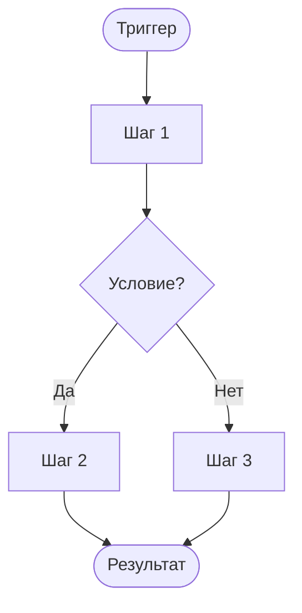

# {Название логики}

**ID:** LOGIC-XXX
**Приоритет:** {Must | Should | Could}
**Статус:** {Черновик | На согласовании | Актуален | Устарел}

---

## Обзор

{Краткое описание: что делает логика, в каком контексте применяется, какую задачу решает}

---

## Точки применения

| Экран/Шторка | Элемент/Триггер | Условие |
|--------------|------------------|---------|
| [{ID} {Название}]({файл}.md) | {Кнопка / При открытии} | {Условие или "Всегда"} |

---

## Флоу

---

## API-запросы

> *Секция опциональна — указывать, если логика обращается к API.*

### {METHOD} {endpoint}

**Спецификация:** [`../../api/{домен}/api.yaml`](../../api/{домен}/api.yaml) → `{operationId}`
**Триггер:** {Описание}

**Обработка ответа:**

| Результат | Действие |
|-----------|----------|
| Успех | {Описание} |
| Ошибка | {Текст — из `00-foundations.md §6`, если сквозной} |

---

## Связанные требования

| Категория | Идентификаторы |
|-----------|-----------------|
| **FR** | {FR-N, ...} |
| **NFR** | {NFR-N, ...} |
| **UC** | {UC-N, ...} |

---

## Критерии приёмки

| ID | Критерий |
|----|----------|
| AC-001 | **Дано** {контекст}, **Когда** {действие}, **Тогда** {результат} |

---

## Обработка ошибок

> *Секция опциональна — указывать, если есть специфичная обработка сверх общего паттерна
> [00-foundations.md §5–§6](../3-design-brief/00-foundations.md).*

| Ошибка | Контекст | Действие |
|--------|----------|----------|
| {Ошибка} | {Где возникает} | {Что делать} |
