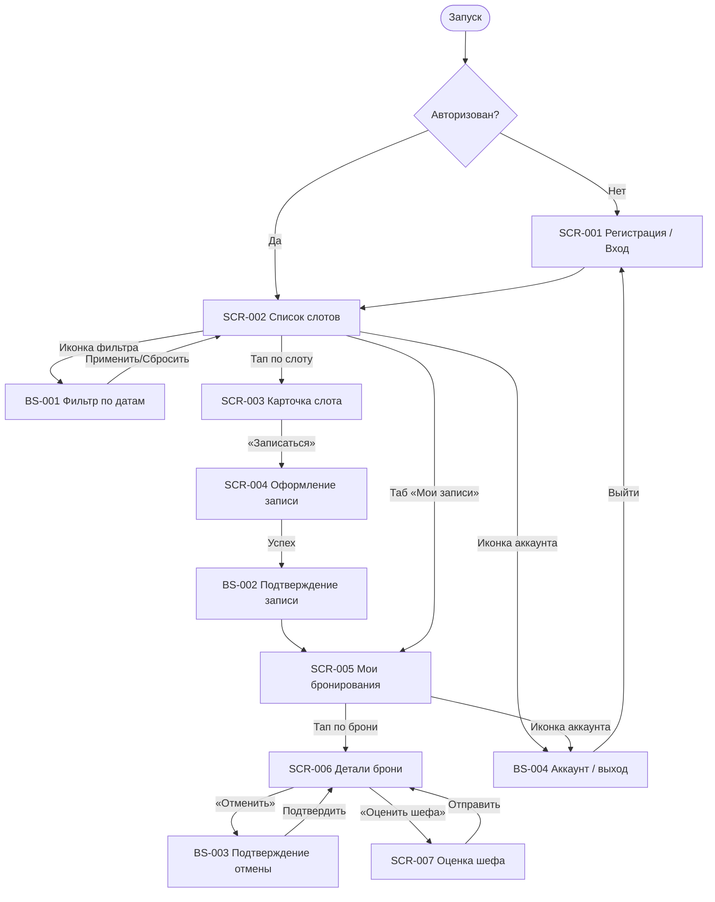

# Фича-лист мобильного приложения «Шеф-стол»

> **Этап 5.** Перечень экранов клиентского приложения и доступных на них функций. Связующий
> артефакт между [требованиями](../2-requirements/), [дизайн-брифом](../3-design-brief/),
> [API](../api/) и финальным ТЗ по экранам (`_SCREEN_TEMPLATE.md`).

**Статус:** Актуален · **Версия:** 1.0 · **Дата:** 2026-07-03

---

## 1. Назначение

**«Шеф-стол»** — клиентское веб-приложение (PWA) для самостоятельной записи на групповые
кулинарные классы. Заменяет ручную запись через WhatsApp и Google-таблицу, устраняя двойные
записи и путаницу по выходным (BR-1, BR-2).

**Скоуп приложения — только роль «Клиент».** Шеф и Владелец/Администратор (Артём) работают через
существующую инфраструктуру/админку и в приложение **не входят**. Справочные данные (слоты,
программы, шефы) приложение получает из API в режиме **read-only**; оплата — **офлайн**
(наличные / перевод), приложение лишь показывает цену и фиксирует запись.

**Источники:**
[Бриф](../0-customer-brief/brief-cooking.md) ·
[Бизнес-требования](../2-requirements/business-requirements.md) ·
[Функциональные требования](../2-requirements/functional-requirements.md) ·
[Нефункциональные требования](../2-requirements/non-functional-requirements.md) ·
[Use cases](../2-requirements/use-cases.md) ·
[User stories](../2-requirements/user-stories.md) ·
[Модель данных](../4-design/data-model.md) ·
[API (OpenAPI, многофайловый)](../api/README.md)

---

## 2. Глоссарий и роли

Полный глоссарий — [`02-domain.md` → «Глоссарий»](../1-elicitation/02-domain.md#глоссарий);
дизайн-специфичный срез UI-лейблов — [`00-foundations.md` §9](../3-design-brief/00-foundations.md#9-глоссарий-дизайн-специфичный-срез).

**Роль приложения:** **Клиент** — просматривает и фильтрует слоты, записывается, выбирает
экипировку, отменяет записи, получает напоминания, оценивает шефа после класса.

> **Принцип абстракции.** В фича-листе не привязываемся к конкретным числам (лимиты 8/12
> мест, точный порог отмены как магическое число в тексте) там, где это параметр бэкенда —
> см. `functional-requirements.md`, `02-domain.md`. Порог отмены (24 часа, FR-15/FR-16) —
> зафиксированное бизнес-правило проекта, а не техническая деталь, поэтому здесь называется
> явно, в отличие от бэкенд-параметров вместимости.
>
> **Одна запись — одно место.** Допущение аналитика (открытый вопрос домена №1, снят в пользу
> простого варианта для MVP) — на `SCR-004` нет счётчика количества мест.

---

## 3. Карта навигации

---

## 4. Инвентарь экранов

| ID | Экран | Тип | Назначение | Зона | Приоритет | Требования |
|----|-------|-----|------------|------|-----------|------------|
| **SCR-001** | Регистрация / Вход | Экран | Вход по email и паролю | НЗ | Must | FR-1, FR-2 / US-1 |
| **SCR-002** | Список слотов | Экран | Каталог классов на 7 дней + фильтр дат | АЗ | Must | FR-3–FR-6a, FR-12, FR-18 / UC-3, US-2, US-3 |
| **BS-001** | Фильтр по датам | Bottom Sheet | Расширение периода просмотра слотов | АЗ | Must | FR-4 / US-3 |
| **SCR-003** | Карточка слота | Экран | Полные параметры класса перед записью | АЗ | Must | FR-6, FR-12, FR-17, FR-18, FR-23 / US-4, US-14 |
| **SCR-004** | Оформление записи | Экран | Выбор экипировки, цена, подтверждение записи | АЗ | Must | FR-7–FR-12, FR-23 / UC-1, US-5–US-8, US-14 |
| **BS-002** | Подтверждение записи | Экран/Шторка | Сводка успешной записи + запрос push | АЗ | Must | UC-1 (постусловие), US-5, US-14 |
| **SCR-005** | Мои бронирования | Экран | Список предстоящих и прошедших записей | АЗ | Must | FR-13 / US-9 |
| **SCR-006** | Детали брони + отмена | Экран | Детали записи, запуск отмены, переход к оценке | АЗ | Must | FR-8, FR-13–FR-18, FR-20, FR-23 / UC-2, US-9–US-11, US-13 |
| **BS-003** | Подтверждение отмены | Bottom Sheet | Правило 24 часов и подтверждение отмены | АЗ | Must | FR-14–FR-16 / US-10 |
| **SCR-007** | Оценка шефа | Экран | Оценка 1–5 звёзд + комментарий после класса | АЗ | Should | FR-19, FR-20 / UC-4, US-13 |
| **BS-004** | Аккаунт / выход | Bottom Sheet | Выход из аккаунта (минимальная необходимость) | АЗ | — | FR-2 (косвенно) |

> **Зоны:** НЗ — неавторизованная, АЗ — авторизованная.

---

## 5. Переиспользуемые логики

Логика, общая для нескольких экранов, вынесена в [09_Логики/](09_Логики/_INDEX.md):

| ID | Логика | Используется в |
|----|--------|------------------|
| LOGIC-001 | Авторизация по email и паролю | SCR-001 |
| LOGIC-002 | Правило отмены (24 часа) | SCR-006, BS-003 |
| LOGIC-003 | Фильтрация слотов по датам | SCR-002, BS-001 |
| LOGIC-004 | Запрос push-разрешения | BS-002 |
| LOGIC-005 | Паттерн состояний экрана | Все экраны с запросами к API |

---

## 6. Не входит в MVP (Phase 2+)

| Функция | Причина / источник |
|---------|---------------------|
| Онлайн-оплата | Оплата офлайн на старте (BR-8, FR-23, Q-006) |
| Лист ожидания (waitlist) на заполненные слоты | Явно исключено (Q-012, FR-10) |
| Программа лояльности для постоянных клиентов | Отложено на развитие (Q-015) |
| Сбор данных об аллергиях клиента | Отложено на развитие (Q-017) |
| Резервный канал уведомлений (SMS/email) | Только push в MVP (Q-014, FR-22) |
| Профиль клиента (просмотр/редактирование данных) | Не описано ни одним FR — только вход по email/паролю |
| Публичный рейтинг шефа для клиентов | Оценки видит только владелец через существующую инфраструктуру |

---

## 7. Трассировка требований → экраны

| Требование | Покрывающий экран/функция |
|------------|------------------------------|
| FR-1, FR-2 (регистрация/вход) | SCR-001 |
| FR-3–FR-5 (список слотов, empty state) | SCR-002 |
| FR-4 (фильтр дат) | SCR-002 + BS-001 |
| FR-6, FR-6a (карточка слота, заполненный слот) | SCR-002, SCR-003 |
| FR-7–FR-12 (запись, экипировка, лимиты) | SCR-004 |
| FR-13 (список своих записей) | SCR-005 |
| FR-14–FR-16 (отмена, порог 24 часа) | SCR-006 + BS-003 |
| FR-17, FR-18 (отмена студией, запрет повторной записи) | SCR-002, SCR-003, SCR-006 |
| FR-19, FR-20 (оценка шефа) | SCR-007 |
| FR-21, FR-22 (напоминания, уведомление об отмене) | Сквозная функция (LOGIC-004) |
| FR-23 (цена, офлайн-оплата) | SCR-003, SCR-004, SCR-006, BS-002 |
| UC-1 (запись) | SCR-002 → SCR-003 → SCR-004 → BS-002 |
| UC-2 (отмена) | SCR-005 → SCR-006 → BS-003 |
| UC-3 (фильтрация) | SCR-002 + BS-001 |
| UC-4 (оценка шефа) | SCR-006 → SCR-007 |

---

## 8. Замечания по данным

- **API** описан в многофайловой OpenAPI-спецификации [`../api/`](../api/README.md) (точка
  входа — `api/README.md`). Домены: **auth** (регистрация/вход/выход), **slots** (список и
  карточка классов, read-only), **bookings** (создание, список, детали, отмена, оценка шефа).
  Программы и шефы — не отдельный домен, вложены в `Slot`.
- **Тариф проката экипировки** — открытый вопрос, не часть текущего контракта (см.
  `api/README.md` → «Открытые вопросы, влияющие на контракт», `SCR-004-booking.md` §11 п.4).
