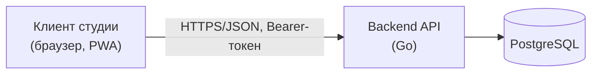
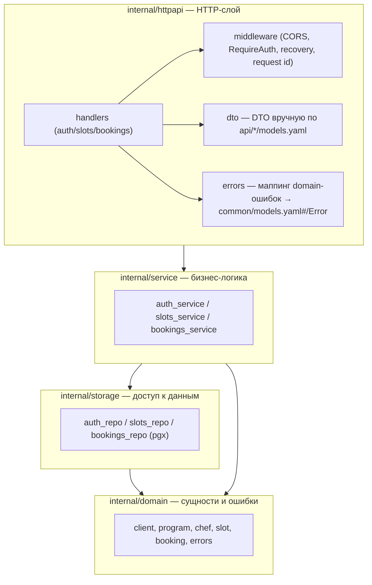
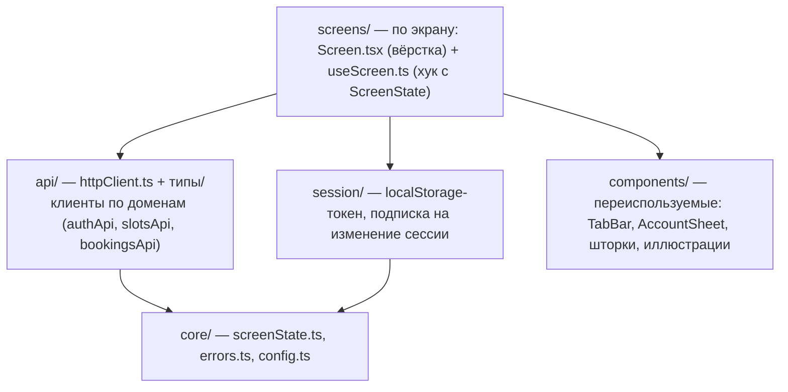
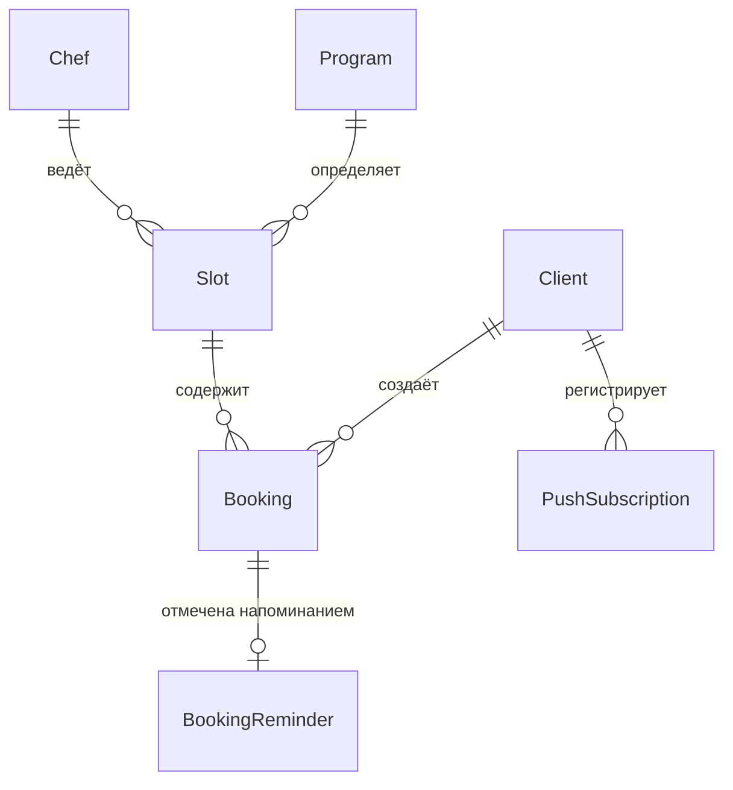

# Архитектурный план — «Шеф-стол»

> Недостающая часть перехода «требования → разработка»: схема данных уже зафиксирована в
> [`4-design/data-model.md`](../4-design/data-model.md) (ресурсная модель API, ERD, модели
> состояний, инварианты) и физически реализована в
> [`backend/migrations/00001_init.sql`](../backend/migrations/00001_init.sql) — этот документ её
> не повторяет, а ссылается на неё как на единственный источник истины. Ниже — то, чего раньше не
> было отдельным документом: план архитектуры системы (компоненты, слои, стек, взаимодействие,
> деплой). Решения по стеку до этого момента были рассыпаны по разделам «Стек приложения» в
> [`BE_IMPLEMENTATION_PLAN.md`](BE_IMPLEMENTATION_PLAN.md) и
> [`FE_IMPLEMENTATION_PLAN.md`](FE_IMPLEMENTATION_PLAN.md) — здесь они сведены в одну связную
> картину верхнего уровня.

---

## 1. Обзор системы (context)

Один актор — зарегистрированный клиент студии (см. `2-requirements/user-stories.md`). Внешних
интеграций нет: онлайн-оплата, SMS/email-рассылка, карты/геолокация — вне скоупа (см. «Границы
скоупа» в `2-requirements/functional-requirements.md` и `6-development/BE_IMPLEMENTATION_PLAN.md`
→ «Правила декомпозиции»).

## 2. Контейнеры

| Контейнер | Технология | Ответственность |
|---|---|---|
| Client SPA/PWA | React + TypeScript + Vite | Весь UI, локальное состояние сессии (`localStorage`), офлайн-манифест/service worker (NFR-3) |
| Backend API | Go (`net/http` + `chi`) | Единственная точка бизнес-логики и валидации, единственный процесс |
| PostgreSQL | PostgreSQL 16/17 | Единственное хранилище состояния |

Ни очереди сообщений, ни кэша (Redis и т.п.), ни отдельного сервиса для push нет — ни один NFR не
требует горизонтального масштабирования или асинхронной обработки при текущей нагрузке учебного
проекта. Web Push (BE-10, реализован — регистрация подписки, VAPID-отправка, воркер напоминаний,
dev-инструмент отмены студией; см. `FEATURES_IMPLEMENTATION_PLAN.md` FEAT-01..05) встроен в тот же
backend-процесс: воркер напоминаний — фоновая горутина, запущенная из `cmd/api/main.go`, не
отдельный контейнер/сервис.

## 3. Backend — слои

Причина слоистого деления: бизнес-логика (`service`) не знает про HTTP и не знает про SQL — это
даёт возможность тестировать её через фейковые репозитории (уже сделано для `auth`/`slots`, см.
`backend/internal/service/*_test.go`) без поднятия реальной БД. `httpapi` отвечает только за
разбор запроса/формирование ответа и не содержит бизнес-правил (например, порог 24 часа живёт в
`bookings_service`, а не в handler'е).

Сквозные решения:
- **Auth** — непрозрачный (`opaque-token`) bearer-токен, не JWT (см. `auth/models.yaml` →
  `bearerFormat`); `RequireAuth` кладёт клиента в контекст запроса (`ClientFromContext`) — так
  `bookings`-слой получает per-client scoping (NFR-8) без протаскивания `clientId` через каждую
  сигнатуру вручную.
- **Конкурентность** — атомарный CAS (`UPDATE ... WHERE free_seats > 0 RETURNING`) для
  `createBooking` (гарантия «0 двойных записей», NFR-6); `SELECT ... FOR UPDATE` в одной
  транзакции для `cancelBooking`/`submitRating`, чтобы параллельные операции над одной записью не
  давали два разных исхода.
- **Ошибки** — единый маппер domain-ошибок (`internal/domain/errors.go`) → HTTP-код + `Error.code`
  из `common/models.yaml`, один раз в `internal/httpapi/errors.go`, а не в каждом handler'е
  отдельно.

## 4. Frontend — слои

- **Паттерн состояний** — `ScreenState<T>` (`loading | content | empty | error`), прямое
  отражение `LOGIC-005`, реализован как обычный TS discriminated union + кастомный React-хук на
  экран — без MVI-библиотеки или Redux/Zustand: при 7 экранах это оправданный минимум, а не
  недоделка (см. историю решения в `FE_IMPLEMENTATION_PLAN.md` → «Стек приложения»).
- **Навигация** — `react-router-dom`, маршрутный контракт зафиксирован комментарием в `App.tsx` и
  таблицей в `FE_IMPLEMENTATION_PLAN.md`.
- **PWA** — `vite-plugin-pwa` (манифест + service worker), закрывает NFR-3 по-настоящему (в
  отличие от изначально выбранного и впоследствии отклонённого стека Kotlin/Compose
  Multiplatform — причина отказа задокументирована в `FE_IMPLEMENTATION_PLAN.md`, здесь не
  повторяется).

## 5. Взаимодействие клиент-сервер

- Протокол — REST JSON, `Authorization: Bearer <opaque-token>` на все эндпоинты кроме
  `register`/`login`.
- Контракт — OpenAPI 3.0.3, `api/{auth,slots,bookings,push,common}/*.yaml` — единственный источник
  истины по операциям, схемам и кодам ошибок; клиентские типы (`client/src/api/types.ts`) и
  серверные DTO (`backend/internal/httpapi/dto/dto.go`) написаны вручную по этому контракту (см.
  открытый пункт BE-01/FE-02 — кодогенерация в обе стороны не подключена, расхождение при правке
  контракта нужно сверять руками).
- Ошибки — единая схема `common/models.yaml#/Error` (`code` + `message` + опциональный
  `details`), полный список кодов — `backend/README.md` → «Эндпоинты».
- CORS — dev-only permissive middleware на бэкенде (отражает `Origin`), т.к. в разработке клиент
  и API поднимаются на разных origin (`127.0.0.1` vs `localhost`) даже на одной машине.

## 6. Данные — схема (сводка)

Полная модель — [`4-design/data-model.md`](../4-design/data-model.md) (ERD, атрибуты, модели
состояний `Booking`/`Slot`, ключевые инварианты; описывает состояние до FEAT-01..05, `push` там не
отражён). Физическая схема — таблицы, `CHECK`-ограничения и индексы —
[`00001_init.sql`](../backend/migrations/00001_init.sql) +
[`00003_push_and_reminders.sql`](../backend/migrations/00003_push_and_reminders.sql) (`push`,
FEAT-02). Здесь — только сводка сущностей для целостности архитектурной картины:

| Сущность | Тип | Кто владеет |
|---|---|---|
| `Client` | ресурс клиентского API | создаётся регистрацией, read-only для остальных |
| `Program`, `Chef` | справочники | read-only-проекция, заполняются только seed-миграцией (нет CRUD/админки — вне скоупа) |
| `Slot` | read-only для клиента | переход `scheduled → cancelled` — не часть публичного `api/`, но достижим через dev-only `/internal/slots/{slotId}/force-cancel` (BE-10, FEAT-05) |
| `Booking` | ресурс клиентского API | полный жизненный цикл через `bookings`-эндпоинты |
| `PushSubscription` | ресурс клиентского API | `push`-домен (FEAT-01/02/03), upsert по `endpoint` |
| `booking_reminders` | внутренняя таблица бэкенда | не ресурс API — маркер «напоминание уже отправлено» для воркера (FEAT-04), см. «Отклонение от плана» в `FEATURES_IMPLEMENTATION_PLAN.md` |

## 7. Deployment view

- **Backend** — Docker Compose (`app` + `db` сервисы), конфигурация через env (`DATABASE_URL`,
  `HTTP_ADDR`, `SESSION_TTL_HOURS` — см. `backend/README.md` → «Переменные окружения»); в этой
  поставке проверено на реальном локальном PostgreSQL 17 через `winget`, а не только в контейнере.
- **Frontend** — статическая сборка (`npm run build` → `dist/`), раздаётся любым статик-хостингом;
  публичный адрес деплоя не определён — `API_BASE_URL` захардкожен на `http://localhost:8080`
  (`client/src/core/config.ts`), заменить перед любой сборкой, отличной от локальной.
- Горизонтальное масштабирование backend, CDN для статики клиента, отдельный push-воркер — вне
  скоупа: ни один NFR не требует этого при нагрузке учебного проекта (см. `6-development/BE_IMPLEMENTATION_PLAN.md` → BE-13).

## 8. Ключевые архитектурные решения и почему

| Решение | Альтернатива | Почему выбрано |
|---|---|---|
| Слоистая архитектура (`httpapi/service/storage/domain`) на бэке, без DDD-агрегатов/CQRS | Чистая архитектура целиком, hexagonal | Масштаб домена (4 сущности с логикой) не оправдывает более тяжёлую структуру; слоёв достаточно для изоляции бизнес-правил от HTTP/SQL |
| Непрозрачный bearer-токен | JWT | Контракт (`auth/models.yaml`) явно фиксирует `opaque-token`; отзыв токена — простой `UPDATE auth_sessions SET revoked_at=...`, для JWT потребовался бы отдельный blacklist |
| Ручные DTO по контракту, без `oapi-codegen`/клиентской кодогенерации | Генерация типов из OpenAPI | Временное решение (см. BE-01/FE-02, открытые пункты) — не архитектурный выбор, а технический долг с явно зафиксированной причиной |
| React + TypeScript + Vite на клиенте | Kotlin Compose Multiplatform | Подтверждённый открытый баг Windows-тулчейна Kotlin/Wasm (KT-79120/KT-79144) сделал верификацию сборки невозможной — решение задокументировано в `FE_IMPLEMENTATION_PLAN.md` |
| Кастомные хуки + `ScreenState<T>` вместо Redux/Zustand/MVI-библиотеки | Полноценный state-menedжер | 7 экранов, один общий паттерн (Loading/Content/Empty/Error) — библиотека добавила бы сложность без выигрыша на этом масштабе |
| PostgreSQL без кэша/очереди | Redis, message queue | Ни один NFR не требует асинхронной обработки или кэширования при нагрузке учебного проекта |

## 9. Что осознанно не входит в архитектуру

- Полноценная owner/admin-панель — `/internal/slots/{slotId}/force-cancel` (FEAT-05) специально
  минимальный dev-only инструмент для проверки FR-17/18/22, а не замена админки; вне `api/`.
- Устойчивость воркера напоминаний к простою/рестарту — окно считается от текущего `now`, не от
  сохранённого watermark; пропуск при рестарте процесса не наверстывается (известный пробел, см.
  ревью в истории коммитов).
- Горизонтальное масштабирование backend и CDN для статики клиента — не задеплоено публично,
  не требуется текущими NFR.
- Кодогенерация типов из OpenAPI в обе стороны (`oapi-codegen`, клиентский генератор) — BE-01/FE-02.
