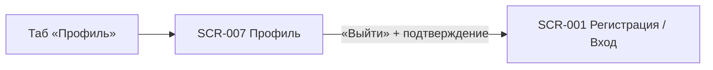

# Требования на дизайн · SCR-007 · Профиль клиента

**ID:** SCR-007 · **Тип:** Экран · **Зона:** АЗ · **Приоритет:** Medium · **Статус:** Черновик · **Версия:** 0.1 · **Дата:** 2026-06-15

> Документ описывает **функционально-структурные** требования к экрану «Профиль клиента».
> Сквозные правила (токены, навигация, состояния, доступность, микрокопия) — в
> [`00-foundations.md`](00-foundations.md); здесь они не дублируются, только уточняется специфика.

**Источники:**
[Foundations](00-foundations.md) ·
[Фича-лист §5 (SCR-007)](../5-mobile-app-spec/feature-list.md) ·
[Функциональные требования](../2-requirements/functional-requirements.md) ·
[Нефункциональные требования](../2-requirements/non-functional-requirements.md) ·
[Модель данных](../4-design/data-model.md)

---

## 1. Назначение и контекст

Экран «Профиль» — верхнеуровневый раздел авторизованной зоны. Задачи экрана в MVP:

- **Показать и дать отредактировать контактные данные** клиента — имя и телефон (FR-1, FR-2);
  смена телефона подтверждается кодом из SMS (как при входе).
- **Дать выход из аккаунта** — управляемое завершение сессии с возвратом к экрану входа.
- **Дать удалить аккаунт** — удаление аккаунта/данных клиента (обработка ПДн), с подтверждением.
- **Справочные пункты** — правила клуба, контакты поддержки, версия приложения.

Это не «личный кабинет» в широком смысле: экран не содержит ленты записей (для этого есть
[SCR-005](SCR-005-my-bookings.md)) и **не управляет уведомлениями** (push-разрешение
запрашивается в [BS-002](BS-002-booking-success.md), отдельного раздела настроек уведомлений в
MVP нет — см. [foundations §8.1](00-foundations.md#81-напоминания-и-уведомления-fr-33-nfr-13)).
Соответствует принципам **P3 «минимальный порог входа»** и **P5 «только свои данные»**
([foundations §2](00-foundations.md#2-дизайн-принципы)).

---

## 2. Пользователь и цель

| Параметр | Значение |
|----------|----------|
| **Роль** | Клиент (единственная роль приложения). |
| **Контекст** | Чаще всего — на берегу/на солнце, мокрые или холодные руки (см. [foundations §1](00-foundations.md#1-продукт-и-аудитория)). Заход в «Профиль» обычно эпизодический: свериться с данными или выйти на чужом/общем устройстве. |
| **Задача (Job)** | «Хочу убедиться, что вошёл под своим именем/номером» и «хочу безопасно выйти, чтобы под моим аккаунтом не записались другие». |
| **Цель дизайна** | Считываемость данных с одного взгляда; защита от случайного выхода; отсутствие лишних элементов. |

---

## 3. Навигация

### Входящие
- **Таб «Профиль»** в таб-баре авторизованной зоны — единственная точка входа на экран
  ([foundations §4.2](00-foundations.md#42-таб-бар-авторизованная-зона)). Экран корневой,
  поэтому таб-бар на нём виден.

### Исходящие
- **«Выйти»** (после подтверждения) → завершение сессии → [SCR-001 · Регистрация / Вход](SCR-001-registration.md).
  После выхода пользователь попадает в неавторизованную зону; назад к авторизованным экранам
  без повторного входа вернуться нельзя.
- **«Удалить аккаунт»** (после явного подтверждения) → удаление данных → завершение сессии →
  [SCR-001](SCR-001-registration.md).
- **«Сохранить» в режиме редактирования** при смене телефона → шаг подтверждения нового номера
  кодом из SMS (как на [SCR-001](SCR-001-registration.md), шаг 2) → возврат в просмотр профиля с
  обновлёнными данными. Смена только имени подтверждения кодом не требует.

### Таб-бар
Постоянный нижний таб-бар АЗ — единый для всех корневых экранов, описан в
[foundations §4.2](00-foundations.md#42-таб-бар-авторизованная-зона):
**Прогулки** ([SCR-002](SCR-002-slot-list.md)) · **Мои записи** ([SCR-005](SCR-005-my-bookings.md)) ·
**Профиль** ([SCR-007](SCR-007-profile.md), активная вкладка).



---

## 4. Контент-инвентарь

Отображаются **только собственные данные текущего клиента** (NFR-11, NFR-12). Источник —
сущность клиента из [модели данных](../4-design/data-model.md).

| Элемент | Лейбл (UI) | Источник | Доступ |
|---------|------------|----------|--------|
| `name` | «Имя» | Клиент | read + **edit** |
| `phone` | «Телефон» | Клиент | read + **edit** (смена подтверждается кодом из SMS) |
| Кнопка «Редактировать» | «Редактировать» | — | вход в режим редактирования |
| Кнопка «Выйти» | «Выйти» | — | завершение сессии (с подтверждением) |
| Кнопка «Удалить аккаунт» | «Удалить аккаунт» | — | удаление данных (с подтверждением) |
| Справочные пункты | «Правила клуба», «Поддержка», «Версия приложения» | конфиг / статика | read; правила/поддержка — переходы, версия — текст |

Чужие контакты, данные других клиентов и любые административные сведения на экране
**отсутствуют** (см. [foundations §8.2](00-foundations.md#82-безопасность-данных-в-ui-nfr-11-nfr-12)).

---

## 5. Структура и иерархия

Каркас — по [foundations §4.1](00-foundations.md#41-базовый-каркас): фиксированный хедер,
скролл-контент, постоянный таб-бар. Фиксированного нижнего CTA нет; «Выйти» — часть контента.

Порядок сверху вниз:

1. **Хедер** — заголовок «Профиль» + кнопка «Редактировать» (в режиме просмотра).
2. **Блок данных** — имя и телефон, крупно и контрастно (в режиме редактирования — поля ввода).
3. **Справочные пункты** — «Правила клуба» ›, «Поддержка» ›, «Версия приложения».
4. **Кнопка «Выйти»** — визуально отделена, в безопасной зоне (см. §9).
5. **Кнопка «Удалить аккаунт»** — деструктивная, ниже «Выйти», менее акцентная, с подтверждением.
6. **Таб-бар** — постоянный (активна вкладка «Профиль»).

**Режим просмотра:**

```
┌─────────────────────────────┐
│  Профиль        Редактировать│  ← хедер + вход в редактирование
├─────────────────────────────┤
│  Имя                         │
│  Анна Петрова                │  ← блок данных
│  Телефон                     │
│  +7 999 123-45-67            │
│  · · · · · · · · · · · · ·   │
│  Правила клуба            ›  │  ← справочные пункты
│  Поддержка                ›  │
│  Версия приложения   1.0.0   │
│                              │
│        [   Выйти   ]         │  ← безопасная зона
│      Удалить аккаунт         │  ← деструктивное, с подтверждением
├─────────────────────────────┤
│ Прогулки Мои записи ●Профиль │  ← таб-бар (foundations §4.2)
└─────────────────────────────┘
```

**Режим редактирования** (поля ввода + «Сохранить» / «Отмена»):

```
┌─────────────────────────────┐
│  ‹ Отмена   Редактирование    │
├─────────────────────────────┤
│  Имя                         │
│  [ Анна Петрова           ]  │  ← поле ввода
│  Телефон                     │
│  [ +7 999 123-45-67       ]  │  ← поле ввода (смена → код из SMS)
├─────────────────────────────┤
│  [        Сохранить       ]  │  ← фикс. CTA
└─────────────────────────────┘
```

---

## 6. Компоненты и поведение

### 6.1 Блок контактных данных и режим редактирования (имя, телефон)
- **Просмотр:** пары «лейбл → значение», значение крупнее лейбла
  ([foundations §3.3](00-foundations.md#33-типографическая-иерархия-уровни-не-шрифты)).
- **Редактирование:** по «Редактировать» поля становятся вводимыми; валидация формата — как на
  [SCR-001](SCR-001-registration.md) (имя, телефон с маской). Действия — «Сохранить» / «Отмена».
- **Смена телефона** подтверждается **кодом из SMS** (шаг кода, как [SCR-001 §6](SCR-001-registration.md#6-компоненты-и-поведение)),
  т.к. телефон — логин. Смена **только имени** подтверждения кодом не требует.
- На время сохранения — индикация; при сбое — нейтральная ошибка, данные не теряются.

### 6.2 Кнопка «Выйти»
- Завершает сессию и переводит на [SCR-001](SCR-001-registration.md).
- **Обязательное подтверждение** перед выходом — защита от случайного нажатия «мокрым
  пальцем» на берегу (P1). Подтверждение оформляется как диалог/шторка по правилам
  [foundations §4.3](00-foundations.md#43-bottom-sheet-шторки-bs-001--bs-002--bs-003): два явных
  действия — «Выйти» и «Отмена»; закрытие шторки = отмена.
- На время завершения сессии — индикация процесса; при сбое запроса выхода показать
  нейтральную ошибку и оставить пользователя в аккаунте.

### 6.3 Кнопка «Удалить аккаунт»
- Деструктивное действие: удаляет аккаунт и персональные данные клиента (ПДн), затем завершает
  сессию и переводит на [SCR-001](SCR-001-registration.md).
- **Обязательное явное подтверждение** в шторке/диалоге ([foundations §4.3](00-foundations.md#43-bottom-sheet-шторки-bs-001--bs-002--bs-003)):
  деструктивная кнопка «Удалить аккаунт» менее акцентна, безопасная «Отмена» — акцентна; закрытие = отмена.
- Пояснение последствий (данные удаляются безвозвратно, активные записи аннулируются) — нейтральным тоном, без давления (P6).
- Размещается **ниже** «Выйти», визуально отделена, чтобы исключить случайное нажатие.

### 6.4 Справочные пункты
- **Правила клуба** и **Поддержка** — строки-переходы (›) на статические/внешние ресурсы (адрес/ссылка — параметр конфигурации).
- **Версия приложения** — нередактируемый текст (значение из сборки).
- Управление уведомлениями здесь **отсутствует** (см. §1, [foundations §8.1](00-foundations.md#81-напоминания-и-уведомления-fr-33-nfr-13)).

---

## 7. Состояния экрана

Экран читает данные клиента из API → применяется сквозной паттерн состояний
([foundations §5](00-foundations.md#5-сквозной-паттерн-состояний-экрана)). Состояние `Empty`
неприменимо: у авторизованного клиента имя и телефон есть всегда.

| Состояние | Содержимое / Поведение |
|-----------|------------------------|
| **Loading** | Скелетон на месте блока данных (две строки «лейбл/значение»). Кнопка «Выйти» может быть видна, но неактивна до загрузки. |
| **Content (просмотр)** | Имя и телефон, справочные пункты, кнопки «Редактировать», «Выйти», «Удалить аккаунт». |
| **Редактирование** | Поля ввода имени/телефона + «Сохранить»/«Отмена»; при смене телефона — шаг подтверждения кодом из SMS. |
| **Сохранение / удаление (loading)** | Индикация процесса, повторные тапы блокируются; при сбое — нейтральная ошибка, данные не теряются. |
| **Error (загрузка профиля)** | Заглушка ошибки + кнопка **«Обновить»** (текст — [foundations §6](00-foundations.md#6-tone-of-voice-и-общая-микрокопия)). Кнопка «Выйти» при этом остаётся доступной — выход не зависит от загрузки профиля. |

---

## 8. Валидации и микрокопия

- **Доступ только к собственным данным** (NFR-11, NFR-12): на клиенте не запрашиваются и не
  отображаются данные других пользователей; UI не содержит элементов администрирования.
- **Подтверждение выхода** (тон — [foundations §6](00-foundations.md#6-tone-of-voice-и-общая-микрокопия), на «вы», без давления):

| Контекст | Текст |
|----------|-------|
| Заголовок подтверждения выхода | «Выйти из аккаунта?» |
| Пояснение | «Чтобы снова записаться на прогулку, нужно будет войти по номеру телефона.» |
| Кнопка действия | «Выйти» |
| Кнопка отмены | «Отмена» |
| Ошибка выхода | «Не удалось выйти. Проверьте соединение и попробуйте снова.» |
| Заголовок подтверждения удаления | «Удалить аккаунт?» |
| Пояснение удаления | «Ваши данные и записи будут удалены безвозвратно. Это действие нельзя отменить.» |
| Кнопка действия удаления | «Удалить аккаунт» |
| Кнопка отмены удаления | «Отмена» |
| Подтверждение смены телефона | «Подтвердите новый номер кодом из SMS.» |
| Успех сохранения профиля | «Изменения сохранены.» |

- Сетевая ошибка загрузки профиля — общий текст из
  [foundations §6](00-foundations.md#6-tone-of-voice-и-общая-микрокопия):
  «Не удалось загрузить. Проверьте соединение и попробуйте снова.»

---

## 9. Доступность и mobile-first

Базовые правила — [foundations §7](00-foundations.md#7-доступность-nfr-1) и
[§3](00-foundations.md#3-структурные-токены-без-бренда). Специфика экрана:

- **Крупная, читаемая контактная информация** — имя и телефон контрастны и комфортны для
  чтения на ярком солнце (NFR-1, [foundations §3.2](00-foundations.md#32-контраст-и-читаемость-nfr-1)).
- Телефон — в формате, легко считываемом и сверяемом (группировка цифр).
- **Кнопка «Выйти»** — тач-зона ≥ 44–48 pt, в **явной безопасной зоне**: отделена отступом от
  блока данных и не примыкает вплотную к таб-бару, чтобы исключить случайный выход.
  Подтверждение (§6.2) — дополнительный барьер.
- Все элементы имеют текстовые подписи/доступные имена; статус выхода озвучивается screen
  reader’ом.

---

## 10. Критерии приёмки дизайна

```gherkin
Feature: SCR-007 Профиль клиента

  Scenario: AC-001 — отображение собственных данных
    Дано клиент авторизован
    Когда он открывает вкладку «Профиль»
    Тогда он видит своё имя и свой телефон
    И данные соответствуют аккаунту текущего клиента

  Scenario: AC-002 — выход возвращает на экран входа
    Дано клиент находится на экране «Профиль»
    Когда он нажимает «Выйти» и подтверждает действие
    Тогда сессия завершается
    И он попадает на экран SCR-001 «Регистрация / Вход»

  Scenario: AC-003 — защита от случайного выхода
    Дано клиент находится на экране «Профиль»
    Когда он нажимает «Выйти»
    Тогда показывается подтверждение с действиями «Выйти» и «Отмена»
    И при выборе «Отмена» он остаётся в аккаунте на экране «Профиль»

  Scenario: AC-004 — нет доступа к чужим и административным данным
    Дано клиент находится на экране «Профиль»
    Тогда на экране отсутствуют данные других клиентов
    И отсутствуют любые административные функции и сведения

  Scenario: AC-005 — состояние ошибки загрузки
    Дано загрузка данных профиля завершилась ошибкой
    Тогда показывается заглушка ошибки с кнопкой «Обновить»
    И кнопка «Выйти» остаётся доступной

  Scenario: AC-006 — редактирование имени без кода
    Дано клиент в режиме редактирования профиля
    Когда он меняет только имя и нажимает «Сохранить»
    Тогда изменения сохраняются без подтверждения кодом
    И профиль показывает обновлённое имя

  Scenario: AC-007 — смена телефона подтверждается кодом
    Дано клиент в режиме редактирования профиля
    Когда он меняет телефон и нажимает «Сохранить»
    Тогда показывается шаг подтверждения нового номера кодом из SMS
    И после верного кода телефон обновляется

  Scenario: AC-008 — удаление аккаунта с подтверждением
    Дано клиент находится на экране «Профиль»
    Когда он нажимает «Удалить аккаунт» и подтверждает действие
    Тогда аккаунт и данные удаляются, сессия завершается
    И он попадает на экран SCR-001
    И при выборе «Отмена» аккаунт не удаляется
```

---

## 11. Решения

1. **Редактирование данных — да.** Имя/телефон редактируются; смена телефона подтверждается кодом из SMS, смена имени — нет (§6.1).
2. **Удаление аккаунта — да.** Кнопка «Удалить аккаунт» с явным подтверждением и пояснением про ПДн; ниже «Выйти» (§6.3).
3. **Справочные пункты — да.** Правила клуба, поддержка, версия приложения (§6.4); адреса/ссылки — параметр конфигурации.
4. **Управление уведомлениями — НЕ в профиле.** Push-разрешение запрашивается в [BS-002](BS-002-booking-success.md); отдельного раздела настроек уведомлений в MVP нет ([foundations §8.1](00-foundations.md#81-напоминания-и-уведомления-fr-33-nfr-13)).

---

## 12. Трассировка

| Связь | Источник |
|-------|----------|
| **FR-1, FR-2** | Регистрация/авторизация → данные профиля (имя, телефон), выход и возврат к входу. |
| **NFR-11, NFR-12** | Доступ только к собственным данным; отсутствие чужих/административных сведений в UI. |
| Фича-лист | [SCR-007 §5](../5-mobile-app-spec/feature-list.md) · трассировка FR-1/FR-2 → SCR-001, SCR-007 ([§8](../5-mobile-app-spec/feature-list.md)). |
| Сквозные правила | [foundations](00-foundations.md) §3 (токены), §4 (навигация), §5 (состояния), §6 (микрокопия), §7 (доступность), §8 (данные, уведомления). |
