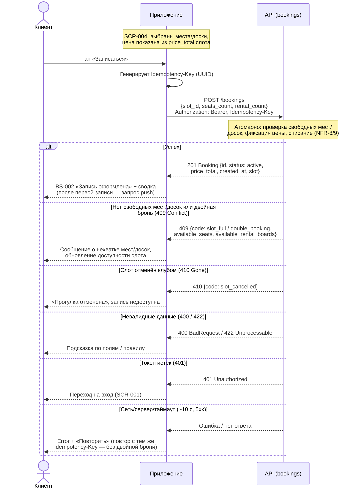

# Sequence-диаграмма API-взаимодействия

> Этап 3. Проектирование. Как клиент и сервер обмениваются вызовами в критичных сценариях
> бронирования. Контракты API — в многофайловой спецификации
> [api/redocly.yaml](../api/redocly.yaml) (домены `bookings`, `slots`, `auth`).
> Операции: `createBooking`, `cancelBooking` ([bookings/api.yaml](../api/bookings/api.yaml)).

> **Сквозные правила взаимодействия.**
> - Все вызовы — с `Authorization: Bearer <token>` (`bearerAuth`); при истёкшем/неверном токене
>   сервер отвечает `401`, клиент уходит на вход [SCR-001](../3-design-brief/SCR-001-registration.md).
> - Сервер — **источник истины** по времени и доступности: `slot.start_at` в UTC, тип отмены и
>   наличие мест/досок проверяет сервер, клиент их не пересчитывает (R-005, R-021).
> - Запись/отмена **атомарны**: овербукинг и двойная бронь исключены (NFR-8, NFR-9).
> - Таймаут запроса ~10 с; мутации офлайн запрещены — см. единый паттерн Error/Retry (R-020).

## Сценарий 1: Создание брони (`createBooking`, UC-1)

Поток: [SCR-004 «Оформление записи»](../3-design-brief/SCR-004-booking.md) → `POST /bookings`
→ [BS-002 «Подтверждение»](../3-design-brief/BS-002-booking-success.md). Клиент отправляет
`slot_id`, `seats_count` (1..3) и `rental_count` (0..seats_count). Итоговую цену `price_total`
(RUB, read-only) считает сервер — клиент её не вычисляет, а показывает (R-005, R-010).



| Шаг | Что происходит | Источник |
| :-- | :-- | :-- |
| Запрос | `POST /bookings` с `Idempotency-Key`; тело — `CreateBookingRequest` | bookings/api.yaml |
| Проверка | Сервер атомарно проверяет места/прокатные доски и фиксирует цену слота | NFR-8/9, R-010 |
| `201` | Возвращается `Booking` со `status=active` и `price_total` (read-only) | R-005 |
| `409` | Нет мест/досок или двойная бронь; тело несёт `available_seats`/`available_rental_boards` (Error.details) | common/models.yaml |
| `410` | Слот отменён клубом (`slot_cancelled`) | R-008 |
| Повтор | Сетевой сбой → повтор с тем же `Idempotency-Key` исключает дубль | NFR-9, R-020 |

## Сценарий 2: Отмена брони (`cancelBooking`, UC-2)

Поток: [SCR-006 «Детали брони»](../3-design-brief/SCR-006-booking-details.md) →
[BS-003 «Подтверждение отмены»](../3-design-brief/BS-003-cancel-confirm.md) → `POST
/bookings/{bookingId}/cancel`. Отмена — **только целиком** (R-014). **Тип отмены определяет
сервер** по времени до старта (источник истины — `slot.start_at` в UTC): `≥ 2 ч` → `cancelled`
(места и прокатные доски возвращаются в слот), `< 2 ч` → `late_cancel` (не возвращаются, штрафов
нет). Граница «ровно 2 часа» трактуется как ранняя отмена (R-021).

```mermaid
sequenceDiagram
    actor User as Клиент
    participant App as Приложение
    participant API as API (bookings)

    Note over App: SCR-006: бронь active, старт в будущем
    User->>App: Тап «Отменить запись»
    App-->>User: BS-003 «Подтверждение отмены»<br/>(текст правила 2 часов)
    User->>App: Подтверждает отмену (целиком)

    App->>API: POST /bookings/{bookingId}/cancel<br/>Authorization: Bearer
    Note over API: Сервер по slot.start_at (UTC) выбирает<br/>тип отмены; граница ровно 2ч = ранняя

    alt Ранняя отмена (≥ 2 ч)
        API-->>App: 200 Booking {status: cancelled, cancelled_at}
        App-->>User: SCR-006 + снек «Бронь отменена»<br/>(места/доски вернулись в слот)
    else Поздняя отмена (< 2 ч)
        API-->>App: 200 Booking {status: late_cancel, cancelled_at}
        App-->>User: SCR-006 + «Поздняя отмена: место не<br/>освобождено. Штраф не взимается.»
    else Слот уже стартовал (422 Unprocessable)
        API-->>App: 422 {code: slot_started}
        App-->>User: Отмена недоступна после старта
    else Уже отменена (409 Conflict)
        API-->>App: 409 {code: already_cancelled}
        App-->>User: Бронь уже отменена, статус актуализируется
    else Чужая/несуществующая бронь (403 / 404)
        API-->>App: 403 Forbidden / 404 NotFound
        App-->>User: Бронь недоступна
    else Токен истёк (401)
        API-->>App: 401 Unauthorized
        App-->>User: Переход на вход (SCR-001)
    else Сеть/сервер/таймаут (~10 c, 5xx)
        API-->>App: Ошибка / нет ответа
        App-->>User: Снек ошибки на BS-003, шторка остаётся<br/>открытой — можно повторить
    end
```

| Шаг | Что происходит | Источник |
| :-- | :-- | :-- |
| Запрос | `POST /bookings/{bookingId}/cancel` (без тела; отмена целиком) | R-014, bookings/api.yaml |
| Решение | Сервер выбирает `cancelled` / `late_cancel` по `start_at` (UTC) | R-021 |
| `200` | `Booking` с новым `status` и `cancelled_at`; экран обновляется | модель данных |
| `422` | Слот уже стартовал (`slot_started`) — отмена недоступна | UC-2 E1 |
| `409` | Повторная отмена (`already_cancelled`) — терминальный статус | UC-2 E2 |

> Полная модель состояний брони и инварианты освобождения мест/досок —
> в [data-model.md §«Модель состояний»](data-model.md#модель-состояний-жизненный-цикл).
