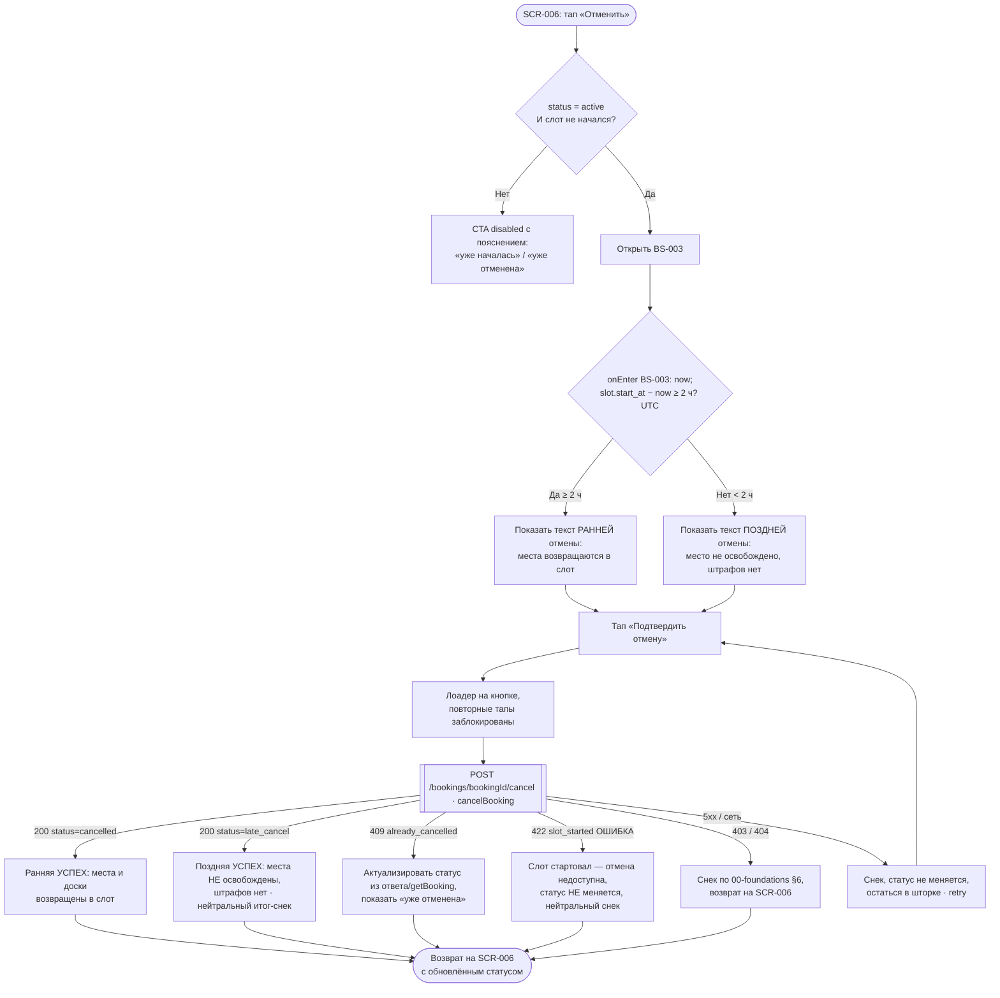

# Отмена брони: правило 2 часов

**ID:** LOGIC-004  
**Тип:** Логика  
**Домен:** 09. Логики  
**Приоритет:** Critical  
**Статус:** Черновик  
**Функциональные блоки:** FB-BOOKING-001

---

## История изменений

| Релиз | ТЗ | Описание изменений |
|-------|-----|-------------------|
| — | — | Первоначальная документация |

---

## Входные данные

> Логика опирается на данные брони и слота, уже полученные экраном деталей (`getBooking`), и на текущее время устройства. Собственного кэша или Remote Config не требует — ниже перечислены поля-источники и состояние.

| Название | Тип | Возможные значения | Описание |
|----------|-----|-------------------|----------|
| `slot.start_at` | Данные слота (`getBooking` → `Booking.slot.start_at`) | date-time (ISO 8601) | Время старта прогулки. От него сервер отсчитывает порог 2 часа; клиент использует то же значение для предварительного определения варианта и подсказки дедлайна. |
| `now` | Состояние (текущее время устройства) | date-time | Текущий момент; фиксируется в **момент onEnter шторки BS-003**, сравнение со `slot.start_at` ведётся в UTC. Используется на клиенте для предварительного выбора варианта (ранняя/поздняя) и проверки «слот не начался». Окончательное решение — на сервере. |
| `booking.status` | Данные брони (`getBooking` → `Booking.status`) | `active`, `cancelled`, `late_cancel` | Текущий статус брони. Отмена доступна только при `active`. После отмены — `cancelled` (ранняя) или `late_cancel` (поздняя). |
| `booking.cancelled_at` | Данные брони (`Booking.cancelled_at`, read-only) | date-time \| `null` | Момент отмены; заполняется сервером в ответе на `cancelBooking`. |

---

## Обзор

Логика управляет отменой брони SUP-прогулки клиентом и применением **правила 2 часов**. Отмена выполняется запросом `POST /bookings/{bookingId}/cancel` (operationId `cancelBooking`); в ответ приходит обновлённый объект `Booking` с новым статусом и заполненным `cancelled_at`.

**Правило 2 часов** (источник истины — сервер, отсчёт от `slot.start_at`):

- **Ранняя отмена** — до старта осталось **≥ 2 часов** (граница **ровно 2 часа = ранняя**). Статус → `cancelled`; забронированные **места и прокатные доски возвращаются в слот** и снова доступны другим клиентам.
- **Поздняя отмена** — до старта осталось **< 2 часов**. Статус → `late_cancel`; места и прокатные доски **НЕ освобождаются**; **денежных штрафов нет**.

**Граница и отсчёт времени (единые для клиента и сервера):** порог — **ровно 2 часа = ранняя** (`≥ 2 ч` → освобождение мест/досок → `cancelled`; `< 2 ч` → `late_cancel`). Момент `now` фиксируется в **момент onEnter шторки подтверждения [BS-003](../BS-003-cancel-confirm.md)**.

**Время — в UTC, отображение — в локальной зоне клуба (R-021).** `slot.start_at` хранится и **сравнивается в UTC** (и на клиенте, и на сервере), что исключает ошибки на стыке часовых поясов и переходов времени. Пользователю же дата/время старта и подсказка дедлайна «до `<start_at − 2 ч>`» **отображаются в локальной зоне клуба** (канонично, синхронно с use-cases и data-model; форматирование на клиенте из UTC-значения). **Источник истины по фактическому времени и статусу отмены — сервер** (подтверждено data-model [../../4-design/data-model.md](../../4-design/data-model.md) и 00-foundations §6); клиентский расчёт по той же границе нужен только для текста-подсказки в шторке.

Клиент **до подтверждения** предварительно вычисляет вариант по разнице `slot.start_at − now` относительно порога 2 часа — только чтобы показать в [BS-003](../BS-003-cancel-confirm.md) правильный текст-последствие (ранняя/поздняя). **Окончательное решение принимает сервер**: клиент отображает фактический результат по статусу из ответа `cancelBooking`.

Доступность отмены определяется на [SCR-006](../SCR-006-booking-details.md): CTA «Отменить» активна только когда `booking.status = active` **И** слот ещё не начался (`slot.start_at` в будущем). После старта отмена недоступна, повторная отмена уже отменённой брони не выполняется.

### User Story

> Как Клиент, я хочу отменить свою запись до старта прогулки, понимая последствия (освободится место или нет),
> чтобы освободить место для других, если планы изменились, и не опасаться скрытых штрафов при поздней отмене.

### Бизнес-ценность

- Ранняя отмена возвращает места и прокатные доски в слот — они снова доступны другим клиентам (повышение заполняемости).
- Честность и спокойствие: при поздней отмене явно сообщается об отсутствии штрафов, статус фиксируется прозрачно (принцип P6).
- Целостность данных: единое серверное правило исключает рассинхрон счётчиков слота при отмене и параллельных операциях (NFR-9).

---

## Точки применения

| Экран/Компонент | Элемент/Триггер | Условие |
|-----------------|-----------------|---------|
| [SCR-006 Детали брони](../SCR-006-booking-details.md) | CTA «Отменить» (доступность) + подсказка дедлайна «до `<start_at − 2 ч>`» | CTA enabled, только если `status = active` И слот не начался; иначе disabled с пояснением причины |
| [BS-003 Подтверждение отмены](../BS-003-cancel-confirm.md) | Выбор текста-последствия (ранняя/поздняя) + кнопка «Подтвердить отмену» → вызов `cancelBooking` | При открытии шторки — предварительный расчёт варианта; при подтверждении — запрос отмены |

---

## Флоу

---

## Описание логики

### Шаг 1: Доступность отмены на SCR-006

CTA «Отменить» активна (**enabled**) только при одновременном выполнении: `booking.status = active` **И** `slot.start_at` в будущем (слот не начался). Иначе CTA показывается **неактивной (disabled) с обязательным коротким пояснением**:

- слот уже начался/прошёл → «Прогулка уже началась — отменить запись нельзя.» (UC-2 E1);
- статус `cancelled` / `late_cancel` → «Запись уже отменена.» (UC-2 E2).

Рядом с активным CTA показывается подсказка дедлайна — конкретный момент отсечки «до `<slot.start_at − 2 ч>`» (вычисляется из `slot.start_at`, без хардкода), чтобы клиент заранее понимал, ранняя у него отмена или поздняя.

### Шаг 2: Предварительный расчёт варианта на клиенте (для текста в BS-003)

При открытии BS-003 клиент вычисляет `Δ = slot.start_at − now`, где `now` фиксируется **в момент onEnter шторки** (`slot.start_at` — в UTC):

- `Δ ≥ 2 часа` → показать текст **ранней** отмены (места возвращаются в слот);
- `Δ < 2 часа` → показать текст **поздней** отмены (место не освобождается, штрафов нет).

Граница **ровно 2 часа трактуется как ранняя** (`≥`) — **той же границей** пользуется сервер (Шаг 4). Этот расчёт нужен **только для выбора правильного текста-последствия** в шторке — он не является решением. Фактический результат определяет сервер.

### Шаг 3: Подтверждение и запрос отмены

По тапу «Подтвердить отмену» кнопка переходит в состояние загрузки, повторные тапы исключаются (защита от двойного запроса, NFR-8); остальные элементы шторки заблокированы. Выполняется `POST /bookings/{bookingId}/cancel` (`cancelBooking`).

### Шаг 4: Применение правила 2 часов на сервере

Сервер отсчитывает время до старта от `slot.start_at` и определяет тип отмены (граница ровно 2 часа = ранняя):

- **≥ 2 ч → `cancelled`:** места и прокатные доски возвращаются в слот (счётчики свободных мест/досок увеличиваются), бронь становится недоступной для повторной отмены.
- **< 2 ч → `late_cancel`:** места и прокатные доски НЕ освобождаются; штрафы не начисляются.

В обоих случаях возвращается обновлённый `Booking` с новым `status` и заполненным `cancelled_at`.

### Шаг 5: Отображение результата

При успехе клиент закрывает шторку и возвращается на SCR-006, где бейдж статуса обновляется по `status` из ответа: «Отменена» (`cancelled`) или «Поздняя отмена» (`late_cancel`); показывается `cancelled_at`. CTA «Отменить» становится disabled («Запись уже отменена»). Клиент не доверяет предварительному варианту из Шага 2, а отображает фактический серверный статус — расхождение возможно, если время приблизилось к границе между открытием шторки и подтверждением.

**Важно — `late_cancel` это УСПЕШНЫЙ исход, а не ошибка.** Оба статуса в ответе 200 (`cancelled` и `late_cancel`) — успешная отмена. Снек-итог при `late_cancel` — нейтральный, из каталога снеков успеха [00-foundations §6.1](../../3-design-brief/00-foundations.md): «Поздняя отмена: место не освобождено (правило 2 часов). Штраф не взимается.» (его показывает экран-родитель SCR-006 после закрытия шторки, §6.2). Ошибочным является **только** случай **422 `slot_started`** (слот уже стартовал) — отмена недоступна, статус не меняется (см. Шаг 4 и «Обработку ошибок»).

---

## API запросы

### POST /bookings/{bookingId}/cancel

**API-ссылка:** [`../../api/bookings/api.yaml`](../../api/bookings/api.yaml) → `cancelBooking`. REST.

**Триггер:** Тап по кнопке «Подтвердить отмену» в шторке [BS-003](../BS-003-cancel-confirm.md).

**Headers:**

| Поле | Описание |
|------|----------|
| `authorization` | Bearer токен пользователя (`bearerAuth`) |

**Параметры/Body:**

| Параметр | Тип | Описание | Значение/Источник |
|----------|-----|----------|-------------------|
| `bookingId` | string (uuid), path | Идентификатор отменяемой брони | `booking.id` открытой брони (SCR-006) |

> Тело запроса отсутствует. Тип отмены (ранняя/поздняя) определяет сервер по `slot.start_at` — клиент его не передаёт.

**Обработка ответа:**

| Результат | Действие |
|-----------|----------|
| Загрузка | Лоадер на кнопке «Подтвердить отмену»; повторные тапы заблокированы, элементы шторки заблокированы (NFR-8). |
| **Успех (200)**, `status = cancelled` | Закрыть шторку, вернуться на SCR-006; бейдж «Отменена», показать `cancelled_at`. Места и прокатные доски возвращены в слот (на сервере). Снек успеха «Бронь отменена» (§6.1, показывает экран-родитель). |
| **Успех (200)**, `status = late_cancel` (поздняя отмена, < 2 ч) — **успешный исход, НЕ ошибка** | Закрыть шторку, вернуться на SCR-006; бейдж «Поздняя отмена», показать `cancelled_at`. Места и прокатные доски **НЕ освобождены**, штрафов нет. Нейтральный итог-снек из [00-foundations §6.1](../../3-design-brief/00-foundations.md): «Поздняя отмена: место не освобождено (правило 2 часов). Штраф не взимается.» (показывает экран-родитель, §6.2). |
| **Ошибка 422 (`slot_started`)** — слот уже стартовал, **отмена недоступна** | **Статус брони НЕ меняется.** Закрыть шторку; на SCR-006 нейтральный снек «Слот уже стартовал — отмена недоступна.»; актуализировать состояние брони (`getBooking`), CTA «Отменить» disabled с пояснением «Прогулка уже началась — отменить запись нельзя». |
| Ошибка 409 (`already_cancelled`) | Бронь уже отменена ранее → **актуализировать статус брони из ответа/повторного `getBooking`** (`cancelled` либо `late_cancel`); закрыть шторку, вернуться на SCR-006 с актуальным статусом и `cancelled_at`, CTA disabled. Снек «Запись уже отменена.» (4xx с `message` → текст из `message`, иначе эта формулировка; правило 00-foundations §6 / каталог [LOGIC-008](LOGIC-008_Паттерн-состояний-экрана.md) Шаг 6). |
| Ошибка 403 | Снек по правилу 00-foundations §6 / каталог [LOGIC-008](LOGIC-008_Паттерн-состояний-экрана.md) Шаг 6: 4xx с `message` → текст из `message`, иначе дефолт «Не удалось выполнить. Попробуйте ещё раз.»; **статус не меняется**. |
| Ошибка 404 | Бронь не найдена (например, удалена в другой сессии). Снек по правилу 00-foundations §6 / каталог [LOGIC-008](LOGIC-008_Паттерн-состояний-экрана.md) Шаг 6: 4xx с `message` → текст из `message`, иначе дефолт «Не удалось выполнить. Попробуйте ещё раз.»; вернуться на SCR-006, актуализировать состояние (`getBooking`). |
| Ошибка 5xx | Снек «Не удалось загрузить. Проверьте соединение и попробуйте снова.» (foundations §6); **статус брони не меняется**, остаться в шторке, доступен retry. |
| Ошибка сети | Снек «Не удалось загрузить. Проверьте соединение и попробуйте снова.» (foundations §6); **статус брони не меняется**, остаться в шторке, доступен retry. |

---

## Связанные требования

### Функциональные (REQ-FUNC-*)

| ID | Название | Приоритет |
|----|----------|-----------|
| FR-16 | Клиент может отменить свою запись до старта прогулки | Critical |
| FR-17 | Ранняя отмена (≥ 2 ч до старта) освобождает места обратно в слот | Critical |
| FR-18 | Поздняя отмена (< 2 ч) фиксируется статусом «поздняя отмена» без освобождения места и без штрафов | Critical |

### Интеграции (REQ-INT-*)

| ID | Название | Приоритет |
|----|----------|-----------|
| UC-2 | Отмена записи: основной поток (ранняя) + A1 (поздняя), E1 (слот начался), E2 (уже отменена) | Critical |
| NFR-9 | Согласованность записей и свободных мест при сбоях: отмена корректно освобождает место без потери/задвоения данных | High |

### UI (REQ-UI-*)

| ID | Название | Приоритет |
|----|----------|-----------|
| US-10 | Клиент отменяет свою запись до старта, понимая последствия по правилу 2 часов | Critical |

---

## Критерии приёмки

| ID | Критерий |
|----|----------|
| AC-001 | **Дано** активная бронь и до старта **≥ 2 часов**, **Когда** клиент подтверждает отмену в BS-003, **Тогда** `cancelBooking` возвращает `status = cancelled`, забронированные **места и прокатные доски возвращаются в слот**, на SCR-006 бейдж «Отменена» и показан `cancelled_at`. |
| AC-002 | **Дано** активная бронь и до старта **< 2 часов**, **Когда** клиент подтверждает отмену, **Тогда** `cancelBooking` возвращает **200** `status = late_cancel` (это **успешный исход**, а не ошибка), **места и прокатные доски НЕ освобождаются**, штрафов нет, на SCR-006 бейдж «Поздняя отмена» и нейтральный итог-снек из [00-foundations §6.1](../../3-design-brief/00-foundations.md) «Поздняя отмена: место не освобождено (правило 2 часов). Штраф не взимается.». |
| AC-003 | **Дано** до старта **ровно 2 часа** (`now` фиксируется в момент onEnter BS-003, сравнение в UTC), **Когда** клиент открывает BS-003 и подтверждает отмену, **Тогда** случай трактуется как **ранняя** отмена (`≥ 2 ч`) — одинаково на клиенте и сервере: показан текст ранней отмены и сервер возвращает `status = cancelled` с возвратом мест и прокатных досок. |
| AC-004 | **Дано** слот уже стартовал (`slot.start_at` в прошлом), **Когда** клиент на SCR-006, **Тогда** CTA «Отменить» **disabled** с пояснением «Прогулка уже началась — отменить запись нельзя» (UC-2 E1); при попытке отмены сервер отвечает **422 `slot_started`** — это **ошибка**, отмена недоступна: **статус брони НЕ меняется**, показывается нейтральный снек «Слот уже стартовал — отмена недоступна.», состояние брони актуализируется (`getBooking`). |
| AC-005 | **Дано** бронь со статусом `cancelled` или `late_cancel`, **Когда** клиент на SCR-006, **Тогда** CTA «Отменить» **disabled** с пояснением «Запись уже отменена» (UC-2 E2); при повторном вызове отмены сервер отвечает **409 `already_cancelled`**, и клиент **актуализирует статус брони из ответа/повторного `getBooking`** (бронь уже была отменена ранее) и показывает снек «Запись уже отменена.» (правило 00-foundations §6 / каталог LOGIC-008 Шаг 6). |
| AC-006 | **Дано** клиент тапнул «Подтвердить отмену», **Когда** запрос выполняется, **Тогда** кнопка показывает лоадер и блокирует повторные тапы (NFR-8); при ошибке 5xx/сети показан снек, **статус брони не меняется**, клиент остаётся в шторке с возможностью повтора. |
| AC-007 | **Дано** до старта осталось около 2 часов, **Когда** клиент открывает BS-003, **Тогда** клиент предварительно выбирает текст (ранняя/поздняя) по `slot.start_at − now`, но итоговый бейдж и последствия отображаются строго по `status` из ответа `cancelBooking` (источник истины — сервер). |
| AC-008 | **Дано** клиент подтверждает отмену, **Когда** сервер отвечает **403** или **404**, **Тогда** показывается снек по единому правилу 00-foundations §6 / каталога [LOGIC-008](LOGIC-008_Паттерн-состояний-экрана.md) Шаг 6 (4xx с `message` → текст из `message`, иначе дефолт «Не удалось выполнить. Попробуйте ещё раз.»); при 404 состояние брони актуализируется (`getBooking`), статус не меняется самопроизвольно. |

---

## Обработка ошибок

### Матрица ошибок отмены (код → HTTP → UX)

> Единая матрица для отмены брони (R-023): доменный `code` из тела `Error` → HTTP-статус →
> реакция UX. Коды-источники — контракт [`../../api/bookings/api.yaml`](../../api/bookings/api.yaml)
> (`cancelBooking`) и общий каталог ответов `../../api/common/models.yaml`.

| `code` | HTTP | UX-реакция |
|--------|------|------------|
| `already_cancelled` | 409 | Бронь уже отменена ранее. Актуализировать статус из ответа/`getBooking` (`cancelled` / `late_cancel`), снек «Запись уже отменена.», CTA disabled; статус самопроизвольно не меняется. |
| `slot_started` | 422 | Слот уже стартовал — отмена недоступна. **Статус НЕ меняется**, нейтральный снек «Слот уже стартовал — отмена недоступна.», `getBooking`, CTA disabled «Прогулка уже началась…». **Это ошибка, не путать с `late_cancel` (успех 200).** |
| `slot_cancelled` | 410 | Слот отменён организатором, отмена брони как таковой не требуется/недоступна. Снек по каталогу (4xx с `message` → текст из `message`), актуализировать состояние (`getBooking`); статус не меняется самопроизвольно. |
| (нет спец. кода) | 403 / 404 | 403 — нет прав; 404 — бронь не найдена/удалена. Снек по правилу 00-foundations §6 (4xx с `message` → из `message`, иначе дефолт), при 404 — `getBooking`; статус не меняется. |
| `internal_error` | 5xx / сеть | Снек «Не удалось загрузить. Проверьте соединение и попробуйте снова.», статус не меняется, остаться в шторке, retry. |

> Успешная отмена — **200** со `status = cancelled` (ранняя) или `late_cancel` (поздняя): оба исхода НЕ ошибки (см. «Описание логики», Шаг 5).

### Детализация

| Тип ошибки | Контекст | Действие |
|------------|----------|----------|
| 422 `slot_started` (**ошибка** — отмена недоступна) | Слот стартовал между открытием экрана и подтверждением | **Статус брони НЕ меняется.** Показать нейтральный снек «Слот уже стартовал — отмена недоступна.»; актуализировать состояние брони (`getBooking`); CTA «Отменить» disabled с пояснением «Прогулка уже началась — отменить запись нельзя»; шторка закрывается. **Не путать с `late_cancel`** — тот приходит как успех 200 и снек не является ошибкой. |
| 409 `already_cancelled` | Бронь уже отменена ранее (например, в другой сессии) | **Актуализировать статус брони из ответа/повторного `getBooking`** (`cancelled` или `late_cancel`); показать снек «Запись уже отменена.» (правило 00-foundations §6 / каталог [LOGIC-008](LOGIC-008_Паттерн-состояний-экрана.md) Шаг 6); вернуться на SCR-006 с актуальным статусом, CTA disabled. |
| 410 `slot_cancelled` | Слот отменён организатором до отмены брони клиентом | Снек по каталогу (4xx с `message` → текст из `message`, иначе дефолт «Не удалось выполнить. Попробуйте ещё раз.»); актуализировать состояние брони (`getBooking`); статус не меняется самопроизвольно. |
| 403 | Нет прав на отмену этой брони | Снек по единому правилу 00-foundations §6 / каталог [LOGIC-008](LOGIC-008_Паттерн-состояний-экрана.md) Шаг 6 (4xx с `message` → текст из `message`, иначе дефолт «Не удалось выполнить. Попробуйте ещё раз.»); **статус не меняется**. |
| 404 | Бронь не найдена (удалена/недоступна) | Снек по единому правилу 00-foundations §6 / каталог [LOGIC-008](LOGIC-008_Паттерн-состояний-экрана.md) Шаг 6 (4xx с `message` → текст из `message`, иначе дефолт «Не удалось выполнить. Попробуйте ещё раз.»); вернуться на SCR-006, актуализировать состояние (`getBooking`). |
| Ошибка 5xx | Сбой сервера при отмене | Снек «Не удалось загрузить. Проверьте соединение и попробуйте снова.»; **статус не меняется**; остаться в шторке, доступен retry. |
| Ошибка сети | Нет соединения при подтверждении | Снек «Не удалось загрузить. Проверьте соединение и попробуйте снова.»; **статус не меняется**; остаться в шторке, доступен retry. |
| Двойной тап «Подтвердить отмену» | Контекст спешки, «мокрый палец» | Кнопка в состоянии загрузки блокирует повторные тапы; исключается двойной запрос на отмену (NFR-8). |

---
