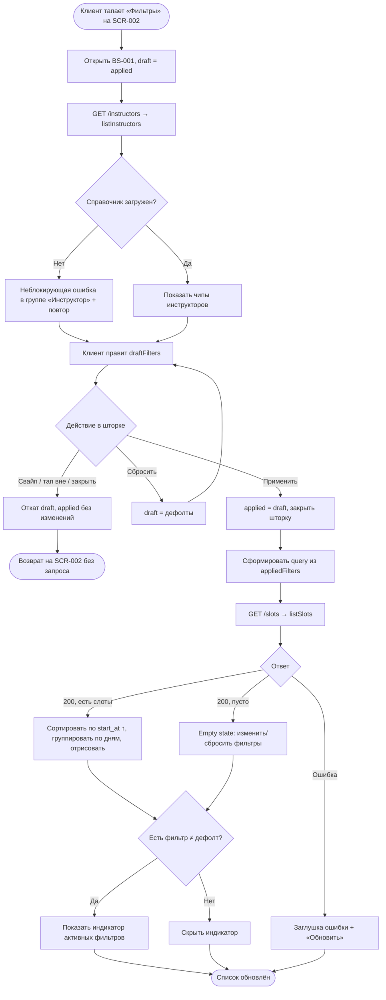

# Фильтрация и сортировка слотов

**ID:** LOGIC-005  
**Тип:** Логика  
**Домен:** 09. Логики  
**Приоритет:** High  
**Статус:** Черновик  
**Функциональные блоки:** FB-SLOTS-001, FB-SLOTS-002

---

## История изменений

| Релиз | ТЗ | Описание изменений |
|-------|-----|-------------------|
| — | — | Первоначальная документация |

---

## Входные данные

Логика опирается на состояние выбранных фильтров. Различаются два набора состояния:
**применённые фильтры** (действуют на список SCR-002, сохраняются между открытиями шторки)
и **черновик выбора** внутри BS-001 (правится пользователем, переносится в применённые только
по «Применить»).

| Название | Тип | Возможные значения | Описание |
|----------|-----|-------------------|----------|
| `appliedFilters` | Состояние | объект фильтров (см. ниже) | Применённые фильтры, активные на SCR-002. По умолчанию — пустые (все дефолты). Управляют запросом `listSlots` и индикатором активных фильтров. **Дефолт («фильтры не заданы»)** = `date_from` не задано, `date_to` не задано, `route_type = []`, `instructor_id = []`, `only_available = false`. Индикатор активных фильтров скрыт ровно тогда, когда все поля равны дефолту. |
| `draftFilters` | Состояние | объект фильтров (см. ниже) | Черновик выбора внутри BS-001. Инициализируется копией `appliedFilters` при открытии шторки. «Применить» копирует `draftFilters` → `appliedFilters`; «Сбросить» возвращает `draftFilters` к дефолтам; закрытие без применения отбрасывает `draftFilters`. |
| `filters.date_from` | Состояние | `date-time` или не задано | Начало периода старта. По умолчанию — не задано: при отсутствии периода применяется **дефолт API «ближайшие 7 дней»** (`date_from = now`, `date_to = now + 7 дней`). Больший период — явным фильтром дат. |
| `filters.date_to` | Состояние | `date-time` или не задано | Конец периода старта. По умолчанию — не задано (дефолт API — `now + 7 дней`). |
| `filters.route_type` | Состояние | массив из `novice`, `experienced`; по умолчанию `[]` | Выбранные типы маршрута (мультивыбор, OR внутри группы). Пустой массив = любой тип. |
| `filters.instructor_id` | Состояние | массив `uuid`; по умолчанию `[]` | Выбранные инструкторы (мультивыбор, OR внутри группы). Пустой массив = любой инструктор. |
| `filters.only_available` | Состояние | `true` / `false`; по умолчанию `false` | Показывать только слоты со свободными местами. По умолчанию OFF — заполненные слоты показываются с бейджем «Мест нет». |
| `instructorsRef` | Кэш | массив инструкторов из `listInstructors` | Справочник инструкторов для построения чип-листа в BS-001. Загружается при открытии шторки. Если справочник пуст или не загрузился — фильтр по инструктору недоступен: чип-лист не строится, `draftFilters.instructor_id` сбрасывается к `[]`, и UUID отсутствующих в справочнике инструкторов не отправляются в `listSlots`. |

---

## Обзор

Логика отвечает за формирование выдачи списка слотов под запрос клиента: применение
фильтров (дата/период старта, тип маршрута, наличие свободных мест, инструктор), их
комбинирование и сортировку результата. Шторка фильтров [BS-001](../BS-001-filters.md)
собирает черновик параметров и по «Применить» обновляет применённые фильтры; экран
[SCR-002](../SCR-002-slot-list.md) на их основе запрашивает слоты через `listSlots`,
сортирует по времени старта по возрастанию и группирует по дням. Справочник инструкторов
для фильтра грузится отдельным запросом `listInstructors`.

### User Story

> Как клиент, я хочу отфильтровать список SUP-прогулок по дате, типу маршрута, наличию мест
> и инструктору и видеть результат отсортированным по ближайшему старту,
> чтобы быстро дойти до подходящей прогулки и записаться, не листая весь каталог.

### Бизнес-ценность

- Короткий путь к записи: клиент быстро сужает каталог до релевантных вариантов (US-3, NFR-2).
- Прозрачность доступности: заполненные слоты видны с бейджем «Мест нет», что снижает путаницу.
- Предсказуемость выдачи: единый порядок (ближайшие первыми) и группировка по дням упрощают ориентацию в расписании.

---

## Точки применения

| Экран/Компонент | Элемент/Триггер | Условие |
|-----------------|-----------------|---------|
| [SCR-002 Список слотов](../SCR-002-slot-list.md) | При открытии экрана / pull-to-refresh / возврат из BS-001 после «Применить» | Запрос списка через `listSlots` с применёнными фильтрами; сортировка по `start_at`, группировка по дням |
| [SCR-002 Список слотов](../SCR-002-slot-list.md) | Хедер, индикатор активных фильтров | Виден, если хотя бы один применённый фильтр ≠ дефолт |
| [SCR-002 Список слотов](../SCR-002-slot-list.md) | Empty state | Результат `listSlots` пуст при применённых фильтрах (UC-3 E1) |
| [BS-001 Фильтры](../BS-001-filters.md) | При открытии шторки | Загрузка справочника инструкторов через `listInstructors`; инициализация черновика копией применённых фильтров |
| [BS-001 Фильтры](../BS-001-filters.md) | Кнопка «Применить» | Перенос черновика в применённые фильтры, закрытие шторки, обновление SCR-002 |
| [BS-001 Фильтры](../BS-001-filters.md) | Кнопка «Сбросить» | Возврат черновика к дефолтам |
| [BS-001 Фильтры](../BS-001-filters.md) | Закрытие свайпом / тапом вне / кнопкой закрытия | Откат черновика, применённые фильтры не меняются |

---

## Флоу

---

## Описание логики

### Шаг 1: Открытие шторки и загрузка инструкторов

По тапу «Фильтры» на SCR-002 открывается BS-001. Черновик `draftFilters` инициализируется
копией `appliedFilters`, чтобы шторка отражала текущее состояние выдачи. Параллельно
выполняется запрос `listInstructors` для построения чип-листа инструкторов. На время загрузки
группа «Инструктор» показывает состояние загрузки (скелетон), остальные группы интерактивны.

### Шаг 2: Правка черновика и комбинирование

Клиент меняет параметры: период дат (`date_from`/`date_to`), типы маршрута (мультивыбор),
переключатель «Только со свободными местами», инструкторов (мультивыбор). Правила
комбинирования при формировании выдачи:

- **Внутри группы с мультивыбором (тип маршрута, инструктор) — OR:** слот подходит, если его
  значение совпадает с любым из выбранных в группе.
- **Между группами — AND:** слот попадает в выдачу, только если выполнены условия по всем
  заданным группам одновременно.

Пример: типы `novice` + `experienced` и инструкторы Анна + Игорь → слот подходит, если
(тип = novice ИЛИ experienced) И (инструктор = Анна ИЛИ Игорь).

### Шаг 3: Применение, сброс, отмена

- **«Применить»:** `appliedFilters = draftFilters`, шторка закрывается, выполняется запрос
  списка на SCR-002.
- **«Сбросить»:** `draftFilters` возвращается к дефолтам внутри шторки; выдача SCR-002
  обновится только после «Применить». Снек при сбросе **не показывается** — результат сброса
  виден в самом списке после применения (по 00-foundations §6.1).
- **Закрытие свайпом / тапом по бэкдропу / кнопкой закрытия (без «Применить»):**
  `draftFilters` отбрасывается (черновик сбрасывается), `appliedFilters` не меняются,
  запрос не выполняется (откат). При следующем открытии шторки `draftFilters`
  переинициализируется копией `appliedFilters`.

### Шаг 4: Запрос, сортировка и группировка

На основе `appliedFilters` формируется query для `listSlots` (см. раздел API). Дефолтные
группы в query не передаются (рекомендация — опускать дефолтные значения): пустые массивы
`route_type`/`instructor_id` и неустановленные даты опускаются; `only_available` передаётся
только как `true`, дефолтное `false` опускается (заполненные слоты приходят в выдаче). Когда
период дат не задан, параметры `date_from`/`date_to` опускаются и сервер применяет **дефолт
«ближайшие 7 дней»** (`date_from = now`, `date_to = now + 7 дней`); больший период клиент
получает только явным фильтром дат.
Результат сортируется по `start_at` по возрастанию (ближайшие первыми), на экране слоты
группируются по дню старта со sticky-заголовками. Слоты с `free_seats = 0` показываются с
бейджем «Мест нет» и некликабельны.

### Шаг 5: Индикатор и пустой результат

После применения индикатор активных фильтров на SCR-002 показывается, если хотя бы один
применённый фильтр отличается от дефолта, и скрывается, когда все фильтры в дефолте.
Дефолт («фильтры не заданы»): `date_from`/`date_to` не заданы, `route_type = []`,
`instructor_id = []`, `only_available = false` (см. «Входные данные»). Если справочник
инструкторов пуст/не загрузился, `instructor_id` считается дефолтным (`[]`) и в индикаторе
не учитывается.
Если выдача пуста при заданных фильтрах — на SCR-002 отображается empty state с подсказкой
изменить или сбросить фильтры и быстрым переходом к BS-001 (UC-3 E1).

---

## API запросы

### GET /slots

**Источник:** [../../api/slots/api.yaml](../../api/slots/api.yaml) → `listSlots`. REST.

**Триггер:** Открытие SCR-002, pull-to-refresh, возврат из BS-001 после «Применить».

**Headers:**

| Поле | Описание |
|------|----------|
| `authorization` | Bearer токен пользователя |
| `deviceuuid` | ID устройства |

**Параметры/Body (query):**

| Параметр | Тип | Описание | Значение/Источник |
|----------|-----|----------|-------------------|
| `date_from` | string (date-time) | Начало периода старта | `appliedFilters.date_from`; опускается, если не задано. При отсутствии обоих параметров действует **дефолт API «ближайшие 7 дней»** (`date_from = now`) |
| `date_to` | string (date-time) | Конец периода старта | `appliedFilters.date_to`; опускается, если не задано (дефолт API — `now + 7 дней`); больший период — явным фильтром дат |
| `route_type` | array(enum) `novice` / `experienced` | Типы маршрута, OR внутри группы | `appliedFilters.route_type`; опускается, если массив пуст (любой тип) |
| `instructor_id` | array(uuid) | Идентификаторы инструкторов, OR внутри группы. Имя параметра — `instructor_id` (массив UUID), без скобок в имени (`instructor_id[]` — неверно); согласовано с SCR-002 и BS-001 | `appliedFilters.instructor_id`; опускается, если массив пуст (любой инструктор). Передаются только UUID инструкторов, присутствующих в загруженном справочнике `instructorsRef` |
| `only_available` | bool | Только слоты со свободными местами | `appliedFilters.only_available`; передаётся только `only_available=true`. Дефолтное `false` **опускается** (заполненные слоты приходят в выдаче по умолчанию) |
| `limit` | int | Размер страницы (пагинация) | Конфигурируемый размер страницы; в MVP список грузится целиком |
| `offset` | int | Смещение страницы (пагинация) | `0` для первой страницы; увеличивается при догрузке |

**Обработка ответа:**

| Результат | Действие |
|-----------|----------|
| Загрузка | Скелетоны карточек слотов (не пустой экран) |
| Успех (200), есть слоты | Сортировка по `start_at` ↑, группировка по дням (sticky-заголовки); заполненные слоты с бейджем «Мест нет», некликабельны; обновление индикатора активных фильтров |
| Успех (200), пусто | Empty state с подсказкой изменить/сбросить фильтры + переход к BS-001 (UC-3 E1) |
| Ошибка 400 | **Защитный двусторонний сценарий** (на случай рассинхрона UI и бэкенда): UI не даёт сформировать некорректный диапазон дат (первичная защита, см. SCR-002/BS-001), поэтому в штатном потоке 400 не ожидается. Если ответ всё же пришёл — снек по каталогу с текстом из `message`; некорректный диапазон не отправляется повторно |
| Ошибка 401 | Сценарий повторной авторизации |
| Ошибка 5xx | Заглушка ошибки + кнопка «Обновить» (снек "Произошла ошибка. Попробуйте позже") |
| Ошибка сети | Заглушка ошибки + «Обновить» (снек "Нет соединения. Проверьте подключение к интернету") |

### GET /instructors

**Источник:** [../../api/instructors/api.yaml](../../api/instructors/api.yaml) → `listInstructors`. REST.

**Триггер:** Открытие шторки BS-001 (для построения чип-листа инструкторов).

**Headers:**

| Поле | Описание |
|------|----------|
| `authorization` | Bearer токен пользователя |
| `deviceuuid` | ID устройства |

**Параметры/Body (query):**

| Параметр | Тип | Описание | Значение/Источник |
|----------|-----|----------|-------------------|
| `limit` | int | Размер страницы справочника | Конфигурируемый размер страницы |
| `offset` | int | Смещение страницы справочника | `0` для первой страницы |

**Обработка ответа:**

| Результат | Действие |
|-----------|----------|
| Загрузка | Скелетон/индикатор в группе «Инструктор»; остальные группы интерактивны |
| Успех (200) | Построение чип-листа инструкторов из ответа; кэш `instructorsRef` |
| Ошибка 401 | Сценарий повторной авторизации |
| Ошибка 5xx / сеть | Неблокирующая ошибка в группе «Инструктор» с возможностью повтора; прочие фильтры доступны (см. «Обработка ошибок») |

---

## Связанные требования

### Функциональные (REQ-FUNC-*)

| ID | Название | Приоритет |
|----|----------|-----------|
| FR-38 | Фильтрация списка слотов по дате/периоду, типу маршрута, наличию мест, инструктору | Must |
| FR-9 | Показ списка слотов с составом карточки (дата/время, маршрут, инструктор, места, цена) | Must |

### Интеграции (REQ-INT-*)

| ID | Название | Приоритет |
|----|----------|-----------|
| listSlots | GET /slots — список слотов с фильтрами и пагинацией ([../../api/slots/api.yaml](../../api/slots/api.yaml)) | Critical |
| listInstructors | GET /instructors — справочник инструкторов для фильтра ([../../api/instructors/api.yaml](../../api/instructors/api.yaml)) | High |

### UI (REQ-UI-*)

| ID | Название | Приоритет |
|----|----------|-----------|
| US-3 | Клиент фильтрует слоты под свой запрос | High |
| UC-3 | Просмотр и фильтрация списка слотов (A1 — применение/сброс, E1 — пустой результат) | High |
| NFR-6 | Отклик загрузки/обновления списка < 2–3 с | High |

---

## Критерии приёмки

| ID | Критерий |
|----|----------|
| AC-001 | **Дано** открыта шторка BS-001, **Когда** клиент выбирает несколько значений в группах «Тип маршрута» и «Инструктор» и нажимает «Применить», **Тогда** в выдаче остаются слоты, удовлетворяющие всем заданным группам (AND между группами). |
| AC-002 | **Дано** в группе с мультивыбором (тип маршрута или инструктор) выбрано несколько значений, **Когда** применены фильтры, **Тогда** слот попадает в выдачу при совпадении с любым из выбранных значений группы (OR внутри группы). |
| AC-003 | **Дано** переключатель «Только со свободными местами» выключен (дефолт), **Когда** загружен список, **Тогда** слоты с `free_seats = 0` показаны с бейджем «Мест нет» и некликабельны; **И** при включении переключателя (`only_available=true`) такие слоты скрываются. |
| AC-004 | **Дано** применены фильтры, под которые нет ни одного слота, **Когда** `listSlots` вернул пустой результат, **Тогда** на SCR-002 показан empty state с подсказкой изменить/сбросить фильтры и быстрым переходом к BS-001 (UC-3 E1). |
| AC-005 | **Дано** заданы какие-либо фильтры, **Когда** клиент нажимает «Сбросить», а затем «Применить», **Тогда** все параметры возвращаются к дефолтам, SCR-002 показывает слоты на ближайшие 7 дней (дефолт API), индикатор активных фильтров снят. |
| AC-006 | **Дано** применён хотя бы один фильтр, отличный от дефолта, **Когда** происходит возврат на SCR-002, **Тогда** в хедере виден индикатор активных фильтров; **И** когда все фильтры в дефолте — индикатор скрыт. |
| AC-007 | **Дано** список содержит слоты на разные даты, **Когда** список загружен, **Тогда** слоты отсортированы по `start_at` по возрастанию (ближайшие первыми) и сгруппированы по дням со sticky-заголовками. |
| AC-008 | **Дано** на SCR-002 ранее применены фильтры, **Когда** клиент открывает шторку, меняет значения и закрывает её свайпом вниз или тапом по бэкдропу, **Тогда** применённые фильтры и выдача SCR-002 не изменяются (откат черновика). |

---

## Обработка ошибок

| Тип ошибки | Контекст | Действие |
|------------|----------|----------|
| Ошибка загрузки справочника инструкторов / пустой справочник | `listInstructors` при открытии BS-001 | **Неблокирующая:** группа «Инструктор» показывает ошибку (или пустое состояние) с возможностью повтора; остальные группы фильтров и кнопка «Применить» остаются доступны, фильтрация без инструктора работает. Фильтр по инструктору недоступен: `draftFilters.instructor_id` сбрасывается к `[]`, UUID отсутствующих в справочнике инструкторов в `listSlots` не отправляются |
| Некорректные параметры фильтра (400) | `listSlots` (напр. `date_from` > `date_to`) | **Двухуровневая защита.** Первичная: UI не даёт сформировать некорректный диапазон дат (валидация в BS-001, кнопка «Применить» неактивна — см. SCR-002/BS-001), поэтому запрос с некорректным диапазоном в штатном потоке не уходит. Вторичная (защитный двусторонний сценарий на случай рассинхрона UI и бэкенда): если 400 всё же получен — снек по каталогу с текстом из `message`. Это не дублирование с UI-валидацией, а страховка от рассинхрона |
| Ошибка списка слотов (5xx / сеть) | `listSlots` на SCR-002 | Заглушка ошибки с кнопкой «Обновить»; повтор возвращает экран в загрузку |
| Пустой результат | `listSlots` вернул 0 слотов при фильтрах | Не ошибка: empty state с подсказкой изменить/сбросить фильтры (UC-3 E1) |

---
