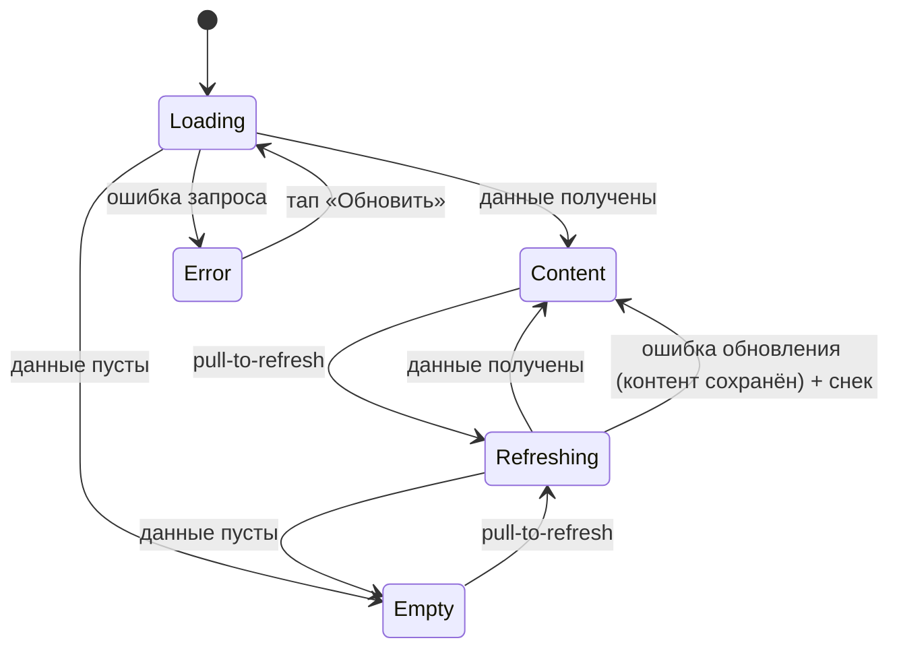

# Сквозной паттерн состояний экрана

**ID:** LOGIC-008  
**Тип:** Логика  
**Домен:** 09. Логики  
**Приоритет:** High  
**Статус:** Черновик  
**Функциональные блоки:** FB-UI-STATES-001

---

## История изменений

| Релиз | ТЗ | Описание изменений |
|-------|-----|-------------------|
| — | — | Первоначальная документация |

---

## Входные данные

| Название | Тип | Возможные значения | Описание |
|----------|-----|-------------------|----------|
| `requestStatus` | Состояние | `loading`, `success`, `empty`, `error` | Статус запроса данных экрана/секции. Определяет, какое из состояний паттерна показывается: `loading` → **Loading**, `success` + непустые данные → **Content**, `success` + пусто → **Empty**, `error` → **Error**. |
| `data` | Состояние | массив/объект данных или `null` | Полезная нагрузка ответа. Пустой результат при `success` трактуется как `empty`. |
| `isRefreshing` | Состояние | `true`, `false` | Признак pull-to-refresh. При `true` экран в состоянии **Refreshing** (повторная загрузка поверх уже показанного контента; см. Шаг 1). Контент не сбрасывается в скелетон. |
| `actionStatus` | Состояние | `idle`, `submitting` | Статус действия (отправка формы/тап CTA). При `submitting` — лоадер на кнопке и блокировка повторного тапа (Шаг 5). Не влияет на `requestStatus`/состояние контента. |

---

## Обзор

Единый паттерн отображения состояний для всех экранов и секций, загружающих данные из API. Любой такой экран проходит через четыре состояния: **Loading** (скелетон/шиммер в форме будущего контента — не пустой белый экран и не блокирующий спиннер), **Content** (получены данные), **Empty** (данных нет: заглушка + объяснение, почему пусто, + подсказка действия) и **Error** (ошибка запроса: заглушка с нейтральным текстом + кнопка «Обновить»). Pull-to-refresh переводит экран обратно в Loading поверх контента.

Паттерн описывается один раз и применяется ко всем экранам с запросами через переиспользуемый компонент. Экранные документы лишь уточняют специфику (тексты пустых состояний, конкретные ошибки), не переописывая логику. Дополнительно паттерн задаёт поведение действий (кнопок отправки): на время запроса — лоадер на кнопке и блокировка повторного тапа.

### User Story

> Как клиент, я хочу на каждом экране понимать, что происходит — данные грузятся, их нет, или произошла ошибка,
> чтобы не смотреть на пустой экран, не сомневаться в работе приложения и иметь возможность повторить загрузку одним тапом.

### Бизнес-ценность

- Воспринимаемая скорость: скелетон в форме контента создаёт ощущение мгновенного отклика (P4, NFR-6) вместо «зависшего» пустого экрана.
- Снижение оттока на ошибках: нейтральная заглушка без вины + кнопка «Обновить» дают понятный выход, клиент не уходит из приложения.
- Единообразие и предсказуемость: одинаковое поведение на всех экранах снижает порог входа и стоимость поддержки (паттерн описан один раз).
- Доступность на берегу: состояния дублируются текстом/иконкой/формой, считываются на солнце и при дальтонизме (NFR-1).

---

## Точки применения

> Применяется на **всех экранах и секциях с запросами к API** через переиспользуемый компонент состояний экрана (`StateContainer`). Ниже — ссылка на компонент и примеры экранов; перечисление всех экранов не требуется.

| Экран/Компонент | Элемент/Триггер | Условие |
|-----------------|-----------------|---------|
| Переиспользуемый компонент состояний экрана (`StateContainer`) | При открытии экрана/секции и при pull-to-refresh | На всех экранах с запросами к API |
| [SCR-002 Список слотов](../SCR-002-slot-list.md) | При открытии вкладки, pull-to-refresh | Пример применения |
| [SCR-003 Карточка слота](../SCR-003-slot-card.md) | При открытии экрана | Пример применения |
| [SCR-005 Мои брони](../SCR-005-my-bookings.md) | При открытии вкладки, pull-to-refresh | Пример применения |
| [SCR-006 Детали брони](../SCR-006-booking-details.md) | При открытии экрана | Пример применения |
| [SCR-007 Профиль](../SCR-007-profile.md) | При открытии вкладки | Пример применения |

---

## Флоу

> Жизненный цикл состояний экрана с запросом к API.

> **Refreshing** — это не отдельный экран, а **Loading поверх контента** (`isRefreshing = true`):
> сверху списка индикатор обновления, текущий контент **не сбрасывается** в скелетон. Ошибка во
> время Refreshing **не переводит** экран в Error — контент сохраняется, об ошибке сообщает снек
> (см. Шаг 1 и «Обработка ошибок»).

---

## Описание логики

### Шаг 1: Loading и Refreshing

**Loading (первичная загрузка).** При входе на экран (или старте секции) показывается **скелетон/шиммер в форме будущего контента**: блоки-плейсхолдеры повторяют будущую раскладку (карточки, строки, заголовки). Не пустой белый экран и, по возможности, не блокирующий спиннер во весь экран (P4, NFR-6).

**Refreshing (pull-to-refresh поверх контента).** Pull-to-refresh (`isRefreshing = true`) запускает повторную загрузку **поверх уже показанного контента**: индикатор обновления сверху списка, текущий контент **не сбрасывается** в скелетон. Исходы:
- Данные получены → контент обновляется (Content), индикатор скрывается. Снек успеха **не показывается** (обратная связь — сам обновлённый контент).
- Пусто → Empty.
- **Ошибка обновления** (сеть/сервер) → экран **не переходит** в Error, текущий контент **сохраняется**, об ошибке сообщает **ненавязчивый снек** (текст — из каталога снеков ниже, строка «Ошибка при обновлении (PTR)»).

### Шаг 2: Content

Данные получены и непустые — отображается основной сценарий экрана. Это целевое состояние.

### Шаг 3: Empty

Запрос завершился успешно, но данных нет (пустой список/результат). Показывается заглушка с **нейтральным объяснением, почему пусто, и подсказкой действия**. Конкретные тексты пустых состояний задаются в экранных документах по единому **шаблону микрокопии**:

> **Шаблон Empty:** заголовок «Пока нет … {что именно}» + (опционально) пояснение, почему пусто + **действие** (CTA или подсказка «Потяните вниз, чтобы обновить»). Тон — нейтральный, без вины.

Если у экрана **несколько разновидностей Empty** (например, «нет данных вообще» vs «ничего не найдено по фильтрам/в табе») — каждая описывается отдельной строкой с собственным текстом и CTA. Каталог конкретных текстов (по экранам):

| Контекст Empty | Текст-заголовок | Действие (CTA/подсказка) | Источник |
|----------------|-----------------|--------------------------|----------|
| Нет доступных слотов вообще | «Пока нет доступных прогулок» | «Потяните вниз, чтобы обновить» | [SCR-002](../SCR-002-slot-list.md) |
| Нет слотов по выбранным фильтрам | «Ничего не найдено по фильтрам» | CTA «Изменить фильтры» | [SCR-002](../SCR-002-slot-list.md) |
| Нет предстоящих броней | «Пока нет предстоящих записей» | CTA «Записаться на прогулку» → [SCR-002](../SCR-002-slot-list.md) | [SCR-005](../SCR-005-my-bookings.md) |
| Нет прошедших броней | «Здесь появятся прошедшие прогулки» | CTA «Записаться на прогулку» → [SCR-002](../SCR-002-slot-list.md) | [SCR-005](../SCR-005-my-bookings.md) |
| Маршрут без геометрии (`route.geometry = null`) | «Маршрут на карте недоступен» (пин места встречи + текст) | — (это Content-без-линии, не Error) | [BS-004](../BS-004-route-map.md), [LOGIC-006](LOGIC-006_Карта-маршрута.md) |

Экраны **ссылаются** на эту таблицу и не переписывают тексты; новые разновидности Empty добавляются строкой сюда.

### Шаг 4: Error

Запрос завершился ошибкой (сеть/сервер). Показывается заглушка ошибки + кнопка **«Обновить»** (микрокопия из 00-foundations §6). Тон **нейтральный, без вины пользователя**; общий текст сетевой ошибки — «Не удалось загрузить. Проверьте соединение и попробуйте снова.». Тап «Обновить» переводит экран обратно в Loading и повторяет запрос.

### Шаг 5: Состояние действий (кнопки отправки)

Для действий (CTA отправки формы, подтверждение) на время запроса (`actionStatus = submitting`): на кнопку выводится **лоадер**, а сама кнопка **блокируется от повторного тапа** до завершения операции (защита от двойной отправки). По завершении — успех (переход/закрытие/снек успеха) или возврат активного состояния кнопки с показом ошибки. Состояние действия **независимо** от состояния контента (`requestStatus`): экран остаётся в Content, меняется только кнопка.

### Шаг 6: Каталог снеков (success / error / info)

Снеки сообщают результат **действий** и **ошибку при pull-to-refresh** (в отличие от Error-заглушки, которая закрывает провал первичной загрузки — см. «Обработка ошибок»). Базовые тексты — из [00-foundations §6](../../3-design-brief/00-foundations.md), каталог успеха — [§6.1](../../3-design-brief/00-foundations.md), правило показа при закрытии шторки — [§6.2](../../3-design-brief/00-foundations.md). Экраны добавляют только специфичные строки (тексты из `message`, контекстные формулировки) и **ссылаются** на этот каталог.

| Тип | Контекст | Текст | Инициатор | Когда/сколько показывать |
|-----|----------|-------|-----------|--------------------------|
| success | Успех действия (результат не очевиден из перехода) | По каталогу [00-foundations §6.1](../../3-design-brief/00-foundations.md) | Компонент действия; при закрытии шторки — экран-родитель ([§6.2](../../3-design-brief/00-foundations.md)) | После ответа, авто-скрытие ~2–3 с; снек переживает закрытие шторки |
| error | 4xx **с** `message` | Текст из `message` | Компонент действия | После ответа; кнопка возвращается в активное состояние |
| error | 4xx **без** `message` (дефолт) | «Не удалось выполнить. Попробуйте ещё раз.» ([§6](../../3-design-brief/00-foundations.md)) | Компонент действия | После ответа |
| error | 5xx при действии | «Что-то пошло не так. Попробуйте ещё раз позже.» ([§6](../../3-design-brief/00-foundations.md)) | Компонент действия | После ответа |
| error | Сеть/таймаут при действии | «Не удалось выполнить. Проверьте соединение и повторите.» ([§6](../../3-design-brief/00-foundations.md)) | Компонент действия | После ответа; повтор доступен |
| error | Ошибка при обновлении (PTR) | «Не удалось обновить. Проверьте соединение и попробуйте снова.» | Список (поверх сохранённого контента) | Контент **не** сбрасывается; ненавязчивый снек |

> **Когда снек не показывается:** если результат уже выражен переходом (на другой экран/шторку успеха) или обновлением самого контента (PTR-успех, применение фильтра) — дублировать снеком нельзя ([00-foundations §6.2](../../3-design-brief/00-foundations.md)).

### Доступность состояний (сквозное правило)

Различие состояний **не передаётся только цветом** — каждое состояние дублируется иконкой, текстом и/или формой (скелетон, заглушка, лоадер на кнопке). Это требование NFR-1 для использования на ярком солнце и при дальтонизме.

---

## API запросы

> Неприменимо. LOGIC-008 — сквозной UI-паттерн отображения состояний; собственных запросов к API не выполняет, а задаёт правила отображения статусов любых запросов экранов. Конкретные эндпоинты описаны в соответствующих экранных документах. Секция опущена.

---

## Связанные требования

### Функциональные (REQ-FUNC-*)

> Неприменимо — логика является сквозным UI/UX-паттерном, не привязана к конкретным функциональным требованиям.

### UI (REQ-UI-*)

| ID | Название | Приоритет |
|----|----------|-----------|
| NFR-1 | Удобство использования: mobile-first, крупные элементы, высокий контраст; состояния дублируются не только цветом (доступность на берегу/при дальтонизме) | High |
| NFR-6 | Производительность: воспринимаемая скорость — скелетоны вместо пустого экрана, отклик < 2–3 с | High |
| 00-foundations §5 | Сквозной паттерн состояний экрана (Loading → Content / Empty / Error, pull-to-refresh) | High |
| 00-foundations §6 | Общая микрокопия: кнопка «Обновить»; сетевая ошибка «Не удалось загрузить. Проверьте соединение и попробуйте снова.» | High |

---

## Критерии приёмки

> Формат: **Дано** {контекст}, **Когда** {действие}, **Тогда** {результат}

| ID | Критерий |
|----|----------|
| AC-001 | **Дано** экран с запросом к API в процессе загрузки, **Когда** данные ещё не получены, **Тогда** показывается скелетон/шиммер в форме будущего контента, а не пустой белый экран и не блокирующий спиннер. |
| AC-002 | **Дано** запрос завершился ошибкой (сеть/сервер), **Когда** экран переходит в Error, **Тогда** показывается заглушка с нейтральным текстом без вины («Не удалось загрузить. Проверьте соединение и попробуйте снова.») и кнопкой «Обновить», тап по которой повторяет запрос (переход в Loading). |
| AC-003 | **Дано** запрос успешен, но данных нет, **Когда** экран переходит в Empty, **Тогда** показывается заглушка с объяснением, почему пусто, и подсказкой действия. |
| AC-004 | **Дано** экран в состоянии Content, **Когда** клиент выполняет pull-to-refresh, **Тогда** запускается повторная загрузка (Loading поверх контента) с индикатором обновления. |
| AC-005 | **Дано** любое состояние экрана, **Когда** клиент его воспринимает, **Тогда** различие состояний передаётся не только цветом, а дублируется иконкой/текстом/формой (NFR-1). |
| AC-006 | **Дано** кнопка действия (отправка формы/CTA), **Когда** клиент инициировал запрос, **Тогда** на кнопке показывается лоадер и кнопка блокируется от повторного тапа до завершения операции. |
| AC-007 | **Дано** экран в Content, **Когда** клиент делает pull-to-refresh и обновление завершается ошибкой (сеть/сервер), **Тогда** текущий контент сохраняется, экран не переходит в Error, а ошибка сообщается ненавязчивым снеком «Не удалось обновить. Проверьте соединение и попробуйте снова.». |
| AC-008 | **Дано** действие завершилось ответом 4xx с непустым `message`, **Когда** обрабатывается результат, **Тогда** показывается снек с текстом из `message` (а не Error-заглушка), кнопка возвращается в активное состояние. |
| AC-009 | **Дано** успешное действие, результат которого уже выражен переходом на другой экран/шторку успеха или обновлением контента, **Когда** действие завершилось, **Тогда** снек успеха не дублируется (00-foundations §6.2). |

---

## Обработка ошибок

> **Разграничение:** провал **первичной загрузки** (5xx/сеть, показывать нечего) → состояние **Error** + «Обновить». Провал **действия** или **обновления** (контент уже есть) → **снек** (Шаг 6), экран в Error не сбрасывается. 4xx с `message` всегда показывается **снеком** с текстом из `message`, а не Error-заглушкой.

| Тип ошибки | Контекст | Действие |
|------------|----------|----------|
| Ошибка сети (offline / таймаут) | Первичная загрузка данных экрана | Состояние Error: заглушка + «Не удалось загрузить. Проверьте соединение и попробуйте снова.» + кнопка «Обновить». Тон нейтральный, без вины. |
| Ошибка сервера (5xx) | Первичная загрузка данных экрана | Состояние Error: общая заглушка + кнопка «Обновить» (повтор запроса). |
| 4xx с `message` | Любой запрос (загрузка/действие) | **Снек** с текстом из `message` (не Error-заглушка). |
| Ошибка при pull-to-refresh | Обновление поверх контента | Контент сохраняется; ошибка сообщается ненавязчивым **снеком** «Не удалось обновить. Проверьте соединение и попробуйте снова.», экран **не** сбрасывается в Error. |
| Ошибка при действии (отправка) | Кнопка действия | Лоадер снимается, кнопка разблокируется; показывается **снек** ошибки (4xx с `message` → текст из `message`; 4xx без `message` → дефолт; 5xx / сеть → тексты §6), повторный тап доступен. |
