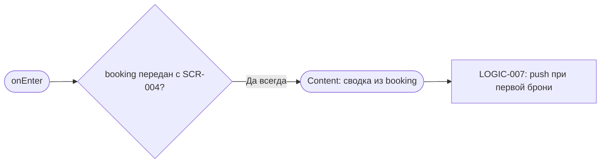
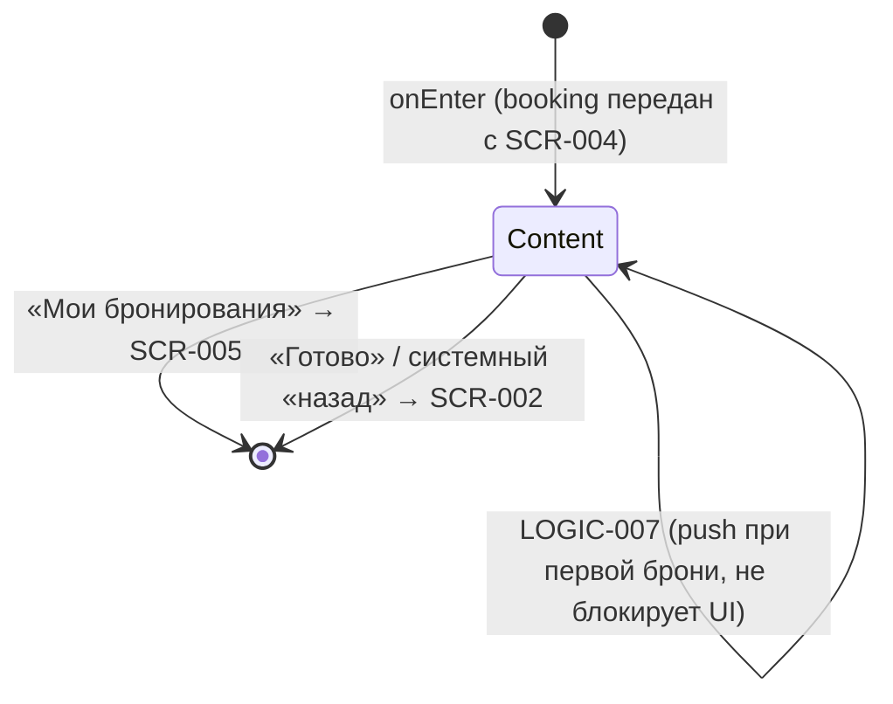

# Подтверждение записи («Вы записаны»)

**ID:** BS-002  
**Тип:** Экран  
**Домен:** 02. Запись на слот  
**Приоритет:** High  
**Статус:** Черновик  
**Функциональные блоки:** FB-BOOKING-003 (Завершение записи), FB-NOTIFY-001 (Напоминания о записи)  
**Зона авторизации:** АЗ  
**Дизайн-макет:** [Figma — Запись подтверждена (71:6161)](https://www.figma.com/design/ySEt0cjmRqmhdWyDlTpDM5/Волна-приложение?node-id=71-6161)

> **Тип изменён: Bottom Sheet → Экран** (по дизайну, [RR-D03](../3-design-brief/design-review.md)).
> В макете подтверждение записи — **полноэкранный** успех «Вы записаны» со сводкой брони и двумя
> кнопками («Мои бронирования» — primary, «Готово» — secondary), а не шторка. **ID `BS-002`
> сохранён** намеренно, чтобы не ломать ссылки в других ТЗ и трассировку; изменён только тип.

---

## Содержание

- [История изменений](#история-изменений)
- [Обзор](#обзор)
- [Навигация](#навигация)
- [Входные данные](#входные-данные)
- [Применяемые логики](#применяемые-логики)
- [Инициализация](#инициализация)
- [Используемые запросы](#используемые-запросы)
- [Макет экрана](#макет-экрана)
- [Элементы экрана](#элементы-экрана)
- [Состояния экрана](#состояния-экрана)
- [Действия пользователя](#действия-пользователя)
- [Связанные требования](#связанные-требования)
- [Критерии приёмки](#критерии-приёмки)

---

## История изменений

| Релиз | ТЗ | Описание изменений |
|-------|-----|-------------------|
| 0.1 | BS-002 «Подтверждение записи» | Первоначальная документация шторки |
| 0.2 | BS-002 «Вы записаны» | Переклассификация Bottom Sheet → **экран** по дизайну ([RR-D03](../3-design-brief/design-review.md)): заголовок «Вы записаны», две кнопки «Мои бронирования» (primary) / «Готово» (secondary). ID сохранён. |

---

## Обзор

Экран завершает основной сценарий записи: **подтверждает, что бронь успешно создана**, даёт
клиенту наглядную сводку того, на что он записался, напоминает об **офлайн-оплате** и
предлагает дальнейший шаг — посмотреть запись в «Моих бронированиях» или вернуться к списку
прогулок. По дизайну ([RR-D03](../3-design-brief/design-review.md)) это **полноэкранный** успех
с заголовком «Вы записаны», а не bottom sheet.

BS-002 — это **финальный, успешный** результат потока записи. Он открывается **только после
успешного создания брони** на экране оформления [SCR-004](SCR-004-booking.md): бронь уже создана
на бэкенде (`createBooking` → 201), места уменьшены. Все ошибки записи (нехватка мест, нехватка
прокатных досок, гонка запросов, сетевой сбой) обрабатываются **на SCR-004** и до этого экрана не
доходят. Поэтому BS-002 **не выполняет сетевых запросов при открытии** — вся сводка строится из
объекта `booking`, переданного с SCR-004 в ответе `createBooking`.

> **Единственный носитель подтверждения успеха записи.** Обратная связь об успешном `createBooking`
> выражается **только переходом на этот экран** с детальной сводкой. По правилу
> [foundations §6.2](../3-design-brief/00-foundations.md) (и каталогу §6.1) дублировать успех
> **запрещено**: экран-инициатор [SCR-004](SCR-004-booking.md) при успехе **НЕ показывает снек**
> (его обратная связь — сам переход на BS-002), а BS-002 не показывает снек поверх своей сводки —
> детальная сводка и есть подтверждение. Снек на BS-002 не используется.

После показа сводки, **только при первой успешной записи** клиента, инициируется системный запрос
разрешения на push-уведомления ([LOGIC-007](09_Логики/LOGIC-007_Запрос-push-разрешения.md)).
Экран покидается только по действию пользователя — тапу по одной из двух кнопок («Мои
бронирования» / «Готово»); автозакрытия по таймеру нет, клиент успевает прочитать сводку и
напоминание об оплате.

### User Story

> Как **Клиент**, я хочу после подтверждения записи получить однозначное подтверждение успеха и
> сводку брони (когда, какой маршрут, инструктор, сколько мест и досок, сколько платить и как),
> чтобы убедиться, что я записался, и понять, что делать дальше.

### Бизнес-ценность

- Закрытие петли записи спокойным позитивным завершением, без давления (P6): снижается тревога
  «записался ли я».
- Мягкая подводка к разделу «Мои бронирования» ([SCR-005](SCR-005-my-bookings.md), US-5).
- Единственная точка запроса разрешения на push — в момент очевидной ценности (после первой
  брони), что повышает конверсию согласия на напоминания (US-12, FR-33).

---

## Навигация

### Входящая (откуда открывается)

| Источник | Триггер | Условие | Передаваемые параметры |
|----------|---------|---------|------------------------|
| [SCR-004 «Оформление записи»](SCR-004-booking.md) | Успешное создание брони (`createBooking` → 201) | Только при успехе записи (ошибки обрабатываются на SCR-004 и до экрана не доходят) | `booking` (объект `Booking` из ответа); `is_first_booking` (поле ответа `createBooking`, передаётся вместе с `booking`) |

> Deep link и push на этот экран не ведут — единственная точка входа — успех `createBooking` на
> [SCR-004](SCR-004-booking.md).

### Исходящая (куда ведёт)

| Назначение | Триггер | Передаваемые параметры |
|------------|---------|------------------------|
| [SCR-005 «Мои бронирования»](SCR-005-my-bookings.md) | Тап на кнопку «Мои бронирования» (primary) | — (список загружается на SCR-005; созданная бронь видна там) |
| [SCR-002 «Прогулки»](SCR-002-slot-list.md) | Тап «Готово» (secondary) | — (стек оформления записи завершён; SCR-003/SCR-004 в стеке не остаются) |

> Экран — полноэкранный (не шторка), поэтому свободного закрытия свайпом / тапом по бэкдропу
> **нет**: единственные способы покинуть экран — две явные кнопки. «Готово» возвращает на корневую
> вкладку «Прогулки» [SCR-002](SCR-002-slot-list.md); «Мои бронирования» ведёт в
> [SCR-005](SCR-005-my-bookings.md). Системный/аппаратный «назад» эквивалентен «Готово» (бронь уже
> сохранена, повторное действие не требуется).

> **Повторное открытие.** После ухода с BS-002 экран из стека выводится: переход на
> [SCR-005](SCR-005-my-bookings.md) и последующий возврат (например, кнопкой «назад») **не
> открывают BS-002 снова** — клиент видит SCR-005 / [SCR-002](SCR-002-slot-list.md), а детали брони
> доступны через [SCR-006](SCR-006-booking-details.md). Единственная точка входа на BS-002 — успех
> `createBooking` (см. входящую навигацию). Даже если экран будет открыт повторно (новая бронь),
> системный запрос push не повторится: `push_permission_requested` уже `true` (см.
> [LOGIC-007](09_Логики/LOGIC-007_Запрос-push-разрешения.md)).

---

## Входные данные

| Название | Тип | Возможные значения | Описание |
|----------|-----|-------------------|----------|
| `booking` | Состояние / Параметр навигации | объект `Booking` (`CreateBookingResponse`) | Полные данные созданной брони из ответа `createBooking` (201), переданные с [SCR-004](SCR-004-booking.md). Источник **всей** сводки экрана. Содержит `id`, `seats_count`, `rental_count`, `status`, **`price_total`** (серверный итог, RUB), `created_at` и вложенный `slot` (с `start_at`, `route.name`, `instructor.name`, а также тарифами `price` / `rental_price` — они лежат в **`booking.slot`**, не на верхнем уровне брони, R-005). Итог в сводке показывается **из серверного `price_total`** ([LOGIC-003](09_Логики/LOGIC-003_Расчёт-цены-брони.md)). **Никаких запросов при открытии не выполняется.** |
| `is_first_booking` | Параметр навигации (поле ответа `createBooking`) | `true` / `false` | Признак того, что эта бронь — первая успешная запись клиента. **Источник — поле ответа `createBooking`** (`CreateBookingResponse.is_first_booking`, R-006), передаётся в навигацию **вместе с `booking`** при открытии экрана. Экран собственных запросов для его вычисления не делает. Управляет показом системного запроса push-разрешения через [LOGIC-007](09_Логики/LOGIC-007_Запрос-push-разрешения.md). |
| `reminder_hours` | Параметр навигации (поле ответа `createBooking`) | массив целых, напр. `[24, 2]` / пусто | Часы повторных напоминаний из `CreateBookingResponse.reminder_hours` (R-006). Передаётся вместе с `booking`; используется в подводке [LOGIC-007](09_Логики/LOGIC-007_Запрос-push-разрешения.md) («Напомним за N часов до старта»). |
| `push_permission_requested` | Локальный кэш | `true` / `false` (по умолчанию `false`) | Флаг «системный запрос разрешения на push уже показывался на устройстве». См. [LOGIC-007](09_Логики/LOGIC-007_Запрос-push-разрешения.md). |

> Все значения сводки (время старта, маршрут, инструктор, число мест, разбивка досок, итоговая
> цена) подставляются из объекта `booking` — **без хардкода** (foundations §6). Лейблы досок
> «Своя доска» / «Прокатная доска» и текст офлайн-оплаты — из foundations §6.

---

## Применяемые логики

| Логика | Элемент/Триггер | Описание |
|--------|-----------------|----------|
| [LOGIC-003 Расчёт цены брони](09_Логики/LOGIC-003_Расчёт-цены-брони.md) | Блок «Итого» | Итоговая цена брони — **серверное поле `price_total`** ответа `createBooking` (R-005). На BS-002 показывается **`booking.price_total`**, клиент его **не пересчитывает**. Тарифы `price` / `rental_price` лежат в `booking.slot` и нужны лишь для разбивки «своих / прокатных» досок. |
| [LOGIC-007 Запрос push-разрешения](09_Логики/LOGIC-007_Запрос-push-разрешения.md) | После показа сводки | Только при первой успешной записи (`is_first_booking = true` И `push_permission_requested = false`): подводка «Напомним за N часов до старта» → системный запрос разрешения на push. Плейсхолдер часов **берётся из `reminder_hours`** (поле ответа `createBooking`, R-006; за сколько часов до старта приходят напоминания) — **не хардкодится**. При повторных бронях не показывается; отказ ничего не блокирует — **бронь работает без напоминаний** (включение позже — только через настройки ОС, осознанное ограничение MVP). |

> **Запрос push остаётся на этом экране успеха** (а не на BS-004/SCR-007): перенос типа
> Bottom Sheet → Экран ([RR-D03](../3-design-brief/design-review.md)) логику LOGIC-007 не меняет —
> момент очевидной ценности (после первой брони) сохраняется.

---

## Инициализация

> **Примечание:** при открытии экрана сетевые запросы **не отправляются**. Вся сводка строится из
> объекта `booking`, переданного с [SCR-004](SCR-004-booking.md) (ответ `createBooking` 201).
> Источники данных описаны во [Входных данных](#входные-данные).

Экран открывается **только по факту уже успешно созданной брони**, поэтому Loading/Empty/Error на
нём не возникают. Сразу отрисовывается состояние **Content** из `booking`. После отрисовки сводки
запускается [LOGIC-007](09_Логики/LOGIC-007_Запрос-push-разрешения.md) (не блокирующий UI; влияет
только на показ системного диалога push при первой брони).

### Диаграмма загрузки



### Запросы при открытии

| № | Запрос | Критичный | Зависит от | Условие |
|---|--------|-----------|------------|---------|
| 1 | — (нет запросов; данные из состояния/навигации — объект `booking`, переданный с SCR-004) | — | — | Всегда |

> Экран не делает вызовов REST API. Системный запрос разрешения на push ([LOGIC-007](09_Логики/LOGIC-007_Запрос-push-разрешения.md))
> — это обращение к системному API ОС, а не к REST API «Волны».

---

## Используемые запросы

> **REST.** При открытии экрана запросов нет — данные берутся из объекта `booking`, переданного с
> [SCR-004](SCR-004-booking.md). Ниже — справочная ссылка на источник модели `Booking`.

### Источник данных сводки (справочно)

**Тип:** REST  
**Метод:** POST  
**Спецификация:** [../api/bookings/api.yaml](../api/bookings/api.yaml) → `createBooking`

**Триггер:** Запрос выполняется **на SCR-004** (до открытия экрана). На BS-002 повторно **не
вызывается** — экран получает готовый объект `Booking` из его ответа (201).

**Поля `Booking`, используемые в сводке** (см. [../api/bookings/models.yaml](../api/bookings/models.yaml) → `Booking`):

| Поле | Тип | Назначение в сводке |
|------|-----|---------------------|
| `slot.start_at` | string (date-time) | Дата и время старта прогулки |
| `slot.route.name` | string | Название маршрута |
| `slot.instructor.name` | string | Имя инструктора |
| `seats_count` | integer `1…3` | Число забронированных мест (себя + гости) |
| `rental_count` | integer `0…seats_count` | Число прокатных досок; своих досок = `seats_count − rental_count` |
| `price_total` | integer (RUB), read-only | **Серверный итог брони** = `slot.price × seats_count + slot.rental_price × rental_count` (R-005). Показывается напрямую в сводке. |
| `slot.price` | integer (RUB) | Тариф за одно место (в `booking.slot`, R-005); для разбивки |
| `slot.rental_price` | integer (RUB) | Тариф проката за одну доску (в `booking.slot`, R-005); для разбивки |
| `id` | string (uuid) | Идентификатор брони (для трассировки / перехода к деталям) |

> Итог берётся из серверного поля `booking.price_total` ([LOGIC-003](09_Логики/LOGIC-003_Расчёт-цены-брони.md), R-005); клиент его **не пересчитывает**. Тарифы `price` / `rental_price` лежат в `booking.slot`.

> Поскольку запрос на экране не выполняется, состояний Loading / Error / Empty у BS-002 нет
> (см. [Состояния экрана](#состояния-экрана)).

---

## Макет экрана

### Структура

```
┌─────────────────────────────────────┐
│                                       │  ← полноэкранный успех (без хедера/таб-бара)
│               ( ✓ )                   │  ← иконка успеха (форма + текст, не только цвет)
│            Вы записаны                │  ← заголовок-подтверждение
│                                       │
│  ┌─────────────────────────────────┐ │
│  │ 🗓  <slot.start_at: дата · время>│ │
│  │ 〰  Маршрут: <slot.route.name>   │ │  ← сводка брони
│  │ 👤  Инструктор: <instructor.name>│ │
│  │ 👥  Мест: <seats_count>          │ │
│  │ 🛶  Доски: своих <K> · прокат <M>│ │  ← K = seats−rental, M = rental_count
│  │ ───────────────────────────────  │ │
│  │ 💳  Итого: <price_total> ₽        │ │  ← серверный booking.price_total, крупно
│  └─────────────────────────────────┘ │
│                                       │
│  ⓘ Оплата на месте: наличные         │  ← напоминание об офлайн-оплате
│     или перевод на карту.             │     (текст foundations §6)
│                                       │
│  ┌─────────────────────────────────┐ │
│  │      Мои бронирования           │ │  ← primary → SCR-005
│  └─────────────────────────────────┘ │
│  ┌─────────────────────────────────┐ │
│  │           Готово                │ │  ← secondary → SCR-002 «Прогулки»
│  └─────────────────────────────────┘ │
└─────────────────────────────────────┘
```

> Полноэкранный успех (макет [71:6161](https://www.figma.com/design/ySEt0cjmRqmhdWyDlTpDM5/Волна-приложение?node-id=71-6161)):
> грабера и бэкдропа нет; две кнопки внизу — единственный способ покинуть экран. После показа сводки
> при **первой** брони поверх инициируется системный запрос разрешения на push
> ([LOGIC-007](09_Логики/LOGIC-007_Запрос-push-разрешения.md)) с подводкой «Напомним за N часов до
> старта», где часы = `reminder_hours` из ответа `createBooking` (не хардкод). Иконки в вайрфрейме
> условны; ключевые числа (старт, мест, цена) — крупные и контрастные. Плейсхолдер `<price_total>` —
> **серверное поле** `booking.price_total` ([LOGIC-003](09_Логики/LOGIC-003_Расчёт-цены-брони.md), R-005),
> клиент его не пересчитывает.

### Компоненты

| Компонент | Описание | Обязательность |
|-----------|----------|----------------|
| Блок успеха | Иконка успеха + заголовок «Вы записаны» (успех передан формой/иконкой и текстом, не только цветом). | Да |
| Сводка брони | Карточка «лейбл → значение»: старт, маршрут, инструктор, число мест, разбивка досок, итог цены. | Да |
| Напоминание об оплате | Текст «Оплата на месте: наличные или перевод на карту.» | Да |
| Кнопка «Мои бронирования» | Primary CTA во всю ширину → [SCR-005](SCR-005-my-bookings.md). | Да |
| Кнопка «Готово» | Secondary CTA во всю ширину → [SCR-002](SCR-002-slot-list.md) «Прогулки». | Да |

---

## Элементы экрана

> **Примечания:** на BS-002 нет полей ввода, поэтому колонка «Валидация» везде — «—». Данные сводки
> берутся из объекта `booking`, переданного с SCR-004. Экран полноэкранный: грабера/бэкдропа нет,
> уход — только по двум кнопкам.

### 1. Блок успеха

| Элемент | Описание | Источник данных | Валидация | Действие |
|---------|----------|-----------------|-----------|----------|
| Иконка успеха | Невербальный сигнал «готово» (форма + цвет, доступное имя для screen reader) | — | — | — |
| Заголовок «Вы записаны» | Однозначное подтверждение успеха (тон спокойный, без давления) | — | — | — |

**Логика:**
- Состояние «успех» передаётся иконкой/формой **и** текстом, а не только цветом (foundations §3.2).

### 2. Сводка брони

| Элемент | Описание | Источник данных | Валидация | Действие |
|---------|----------|-----------------|-----------|----------|
| Дата/время старта | «Сб, 21 июн · 10:00» | `booking.slot.start_at` | — | — |
| Маршрут | «Маршрут: …» | `booking.slot.route.name` | — | — |
| Инструктор | «Инструктор: …» | `booking.slot.instructor.name` | — | — |
| Число мест | «Мест: N» | `booking.seats_count` | — | — |
| Разбивка досок | «своих K · прокат M», где `K = seats_count − rental_count`, `M = rental_count` | `booking.seats_count`, `booking.rental_count` | — | — |
| Итог цены | «Итого: … ₽» (крупно, контрастно) — **серверное поле** | `booking.price_total` | — | — |

**Логика:**
- Разбивка досок: лейблы «Своя доска» / «Прокатная доска» — foundations §6. При `rental_count = 0`
  строка про прокат может скрываться (за дизайнером), при этом факт «своя доска» остаётся понятен.
- Итог цены: [LOGIC-003](09_Логики/LOGIC-003_Расчёт-цены-брони.md) — показывается **серверное поле
  `booking.price_total`** (read-only, RUB, R-005); клиент его не пересчитывает. Тарифы
  `booking.slot.price` / `booking.slot.rental_price` нужны лишь для разбивки досок.

### 3. Напоминание об оплате

| Элемент | Описание | Источник данных | Валидация | Действие |
|---------|----------|-----------------|-----------|----------|
| Текст оплаты | «Оплата на месте: наличные или перевод на карту.» | foundations §6 (FR-30) | — | — |

**Логика:**
- Текст фиксированный из foundations §6, не дублируется другими формулировками.

### 4. Кнопки действий

| Элемент | Описание | Источник данных | Валидация | Действие |
|---------|----------|-----------------|-----------|----------|
| Кнопка «Мои бронирования» | Primary CTA во всю ширину | — | — | Переход на [SCR-005](SCR-005-my-bookings.md) |
| Кнопка «Готово» | Secondary CTA во всю ширину | — | — | Уход с экрана → [SCR-002](SCR-002-slot-list.md) «Прогулки» |

**Логика:**
- «Мои бронирования»: при тапе — навигация на [SCR-005](SCR-005-my-bookings.md) (список своих
  записей; созданная бронь там присутствует, FR-30 / US-5).
- «Готово»: при тапе — уход с экрана успеха и возврат на корневую вкладку «Прогулки»
  [SCR-002](SCR-002-slot-list.md). Эквивалентно системному/аппаратному «назад» (свободного закрытия
  свайпом/бэкдропом у экрана нет).
- После отрисовки сводки (до взаимодействия с кнопками) выполняется
  [LOGIC-007](09_Логики/LOGIC-007_Запрос-push-разрешения.md): при первой брони — подводка и
  системный запрос push; отказ не блокирует кнопки и закрытие.

**Условия доступности:**
- Обе кнопки активны всегда (экран — только в состоянии Content).

---

## Состояния экрана

### Таблица состояний

| Состояние | Условие | Отображение |
|-----------|---------|-------------|
| **Content (успех)** | Экран открыт с переданным `booking` | Блок успеха + сводка брони + напоминание об оплате + кнопки. Единственное состояние. Кнопки «Мои бронирования» и «Готово» **активны всегда**. |
| Content — запрос push поверх (при первой брони) | `is_first_booking = true` И `push_permission_requested = false` (после показа сводки) | Поверх сводки — подводка и системный диалог push ([LOGIC-007](09_Логики/LOGIC-007_Запрос-push-разрешения.md)). **Не отдельное состояние экрана:** UI BS-002 не меняется, кнопки остаются активны. |
| Content — после решения по push (allow/deny) | Клиент ответил на системный диалог push | Экран **не блокируется** ни отказом, ни разрешением: при `Deny` — кнопки и уход доступны, запрос не повторяется, без снека и давления (P6); при `Allow` — регистрация токена в фоне, UI не меняется. |
| Loading | — | **Не применяется:** запросов при открытии нет; индикация создания брони была на [SCR-004](SCR-004-booking.md). |
| Empty | — | **Не применяется:** экран появляется только при наличии созданной брони. |
| Error | — | **Не применяется:** все ошибки записи обработаны на [SCR-004](SCR-004-booking.md) до открытия экрана. |

### Диаграмма переходов



> Сбоев загрузки на экране нет — у BS-002 нет Loading/Empty/Error (foundations §5 неприменим, т.к.
> экран не выполняет запросов).

---

## Действия пользователя

| Действие | Элемент | Триггер | Результат |
|----------|---------|---------|-----------|
| Перейти к своим записям | Кнопка «Мои бронирования» | Tap | Переход на [SCR-005](SCR-005-my-bookings.md) |
| Завершить | Кнопка «Готово» | Tap | Уход с экрана → [SCR-002](SCR-002-slot-list.md) «Прогулки» |
| Завершить системным жестом | Аппаратный/системный «назад» | Back | Эквивалент «Готово» → [SCR-002](SCR-002-slot-list.md) |
| Решение по push (при первой брони) | Системный диалог push | Allow / Deny | [LOGIC-007](09_Логики/LOGIC-007_Запрос-push-разрешения.md): allow → регистрация push-токена; deny → ничего не блокируется, запрос не повторяется |

---

## Связанные требования

### Функциональные (FR)

| ID | Название | Приоритет |
|----|----------|-----------|
| FR-30 | Показ цены и фиксация записи; оплата офлайн (наличные / перевод) — подтверждается на BS-002 | Must |
| FR-33 | Напоминание о предстоящей записи; запрос разрешения на push после первой записи (приложение регистрирует push-токен) | Should |

### Сценарии (UC) и истории (US)

| ID | Название |
|----|----------|
| UC-1 | Запись на прогулку — завершающий (успешный) шаг: SCR-002 → SCR-003 → SCR-004 → **BS-002** |
| US-5 | Записаться на слот и получить подтверждение записи |
| US-11 | Видеть цену прогулки; оплата офлайн |
| US-12 | Получать напоминание о предстоящей записи (через запрос разрешения на push) |

### Логики (LOGIC-*)

| ID | Название | Приоритет |
|----|----------|-----------|
| LOGIC-003 | [Расчёт цены брони](09_Логики/LOGIC-003_Расчёт-цены-брони.md) | — |
| LOGIC-007 | [Запрос push-разрешения](09_Логики/LOGIC-007_Запрос-push-разрешения.md) | — |

---

## Критерии приёмки

### Позитивные сценарии

| ID | Критерий | Приоритет |
|----|----------|-----------|
| AC-001 | **Дано** клиент подтвердил запись на SCR-004 и бронь успешно создана (201), **Когда** открывается BS-002, **Тогда** виден блок успеха (иконка + «Вы записаны») и сводка брони: дата/время старта, маршрут, инструктор, число мест, разбивка досок и итог цены — все значения из объекта `booking`, без хардкода. | P0 |
| AC-002 | **Дано** открыт BS-002, **Когда** экран отрисован, **Тогда** показано напоминание «Оплата на месте: наличные или перевод на карту.» | P0 |
| AC-003 | **Дано** открыта BS-002, **Когда** клиент нажимает «Мои бронирования», **Тогда** выполняется переход на [SCR-005](SCR-005-my-bookings.md), и созданная бронь присутствует в списке. | P0 |
| AC-004 | **Дано** в брони есть прокатные места (`rental_count > 0`), **Когда** открыта BS-002, **Тогда** сводка показывает соотношение своих (`seats_count − rental_count`) и прокатных (`rental_count`) досок. | P1 |
| AC-005 | **Дано** это первая успешная запись клиента (`is_first_booking = true` из ответа `createBooking`, `push_permission_requested = false`), **Когда** показана сводка на BS-002, **Тогда** после сводки показывается подводка «Напомним за N часов до старта» (часы из `reminder_hours` ответа `createBooking`, не хардкод) и вызывается системный запрос разрешения на push ([LOGIC-007](09_Логики/LOGIC-007_Запрос-push-разрешения.md)). | P1 |

### Негативные сценарии

| ID | Критерий | Приоритет |
|----|----------|-----------|
| AC-N01 | **Дано** клиент совершает вторую и последующие записи (`is_first_booking = false`) **или** запрос уже показывался (`push_permission_requested = true`), **Когда** открыта BS-002, **Тогда** системный запрос разрешения на push **не показывается** и не повторяется. | P1 |
| AC-N02 | **Дано** при первой брони показан системный запрос push, **Когда** клиент отказывает в разрешении, **Тогда** запись и экран работают штатно, кнопки и уход доступны, запрос больше не повторяется и нет давления (P6). | P1 |
| AC-N03 | **Дано** открыт экран BS-002, **Когда** клиент нажимает «Готово» (secondary), **Тогда** клиент уходит на список «Прогулки» [SCR-002](SCR-002-slot-list.md). | P0 |

### Граничные условия (Edge Cases)

| ID | Критерий | Приоритет |
|----|----------|-----------|
| AC-E01 | **Дано** открыт экран BS-002, **Когда** клиент нажимает аппаратный/системный «назад», **Тогда** исход тот же, что и «Готово» — возврат на [SCR-002](SCR-002-slot-list.md) «Прогулки»; свободного закрытия свайпом/бэкдропом у экрана нет, бронь уже сохранена. | P0 |
| AC-E02 | **Дано** `rental_count = 0` (все доски свои), **Когда** открыт BS-002, **Тогда** строка про прокат может быть скрыта, но факт «своя доска» в сводке остаётся понятен. | P2 |
| AC-E03 | **Дано** максимум мест (`seats_count = 3`) и длинная сводка, **Когда** контент не помещается, **Тогда** содержимое скроллится внутри экрана, а кнопки «Мои бронирования» и «Готово» остаются достижимыми. | P2 |
| AC-E04 | **Дано** открыт BS-002, **Когда** экран отрисовывается, **Тогда** сетевые запросы не отправляются — сводка строится из переданного `booking`; состояний Loading/Empty/Error не возникает. | P1 |

---
