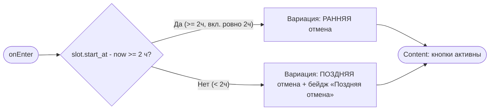
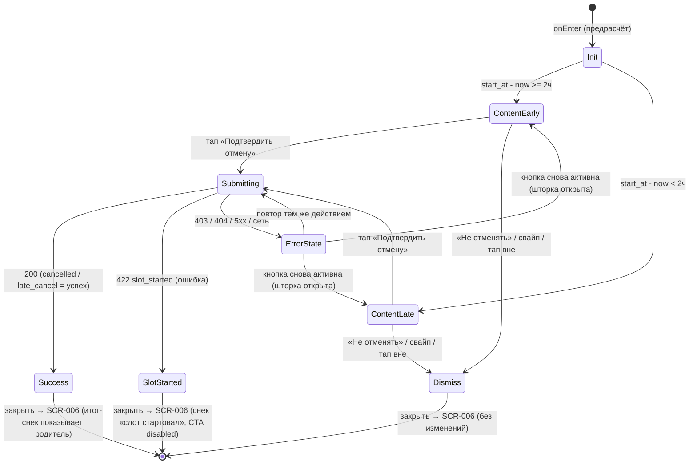

# Подтверждение отмены

**ID:** BS-003  
**Тип:** Bottom Sheet  
**Домен:** 02. Мои записи и отмены  
**Приоритет:** High  
**Статус:** Черновик  
**Функциональные блоки:** FB-002-003 (Отмена записи)  
**Зона авторизации:** АЗ  
**Дизайн-макет:** Figma — [Отмена записи (71:13106)](https://www.figma.com/design/ySEt0cjmRqmhdWyDlTpDM5/Волна-приложение?node-id=71-13106) · [Cancellation Sheet (71:3609)](https://www.figma.com/design/ySEt0cjmRqmhdWyDlTpDM5/Волна-приложение?node-id=71-3609)

---

## Содержание

- [История изменений](#история-изменений)
- [Обзор](#обзор)
- [Навигация](#навигация)
- [Входные данные](#входные-данные)
- [Применяемые логики](#применяемые-логики)
- [Свойства Bottom Sheet](#свойства-bottom-sheet)
- [Инициализация](#инициализация)
- [Используемые запросы](#используемые-запросы)
- [Макет экрана](#макет-экрана)
- [Элементы экрана](#элементы-экрана)
- [Состояния экрана](#состояния-экрана)
- [Действия пользователя](#действия-пользователя)
- [Связанные требования](#связанные-требования)
- [Критерии приёмки](#критерии-приёмки)
---

## История изменений

| Релиз | ТЗ | Описание изменений |
|-------|-----|-------------------|
| 0.1.0 | BS-003 «Подтверждение отмены» | Первая версия ТЗ на критичную шторку подтверждения отмены записи. |
| 0.1.1 | BS-003 «Подтверждение отмены» | Разделена трактовка HTTP 422 `slot_started` (критичная ошибка) и `late_cancel` (успешный исход 200, итог-снек показывает SCR-006). Зафиксированы: снек 409 (предотвращается на SCR-006 + защитный снек), единое retry-поведение (повтор тем же действием, шторка открыта), скролл/доступность при крупном шрифте (foundations §4.3/§7) и UTC-расчёт `now` (источник истины — сервер, как в LOGIC-004). |

---

## Обзор

Критичная шторка-подтверждение деструктивного действия — **отмены записи** клиентом. Открывается с экрана [SCR-006 · Детали брони](SCR-006-booking-details.md) по тапу на кнопку «Отменить». Шторка объясняет последствия отмены **до** её выполнения (по правилу 2 часов: ранняя или поздняя отмена), требует явного подтверждения и защищает от случайной потери брони.

Тип отмены (ранняя / поздняя) определяется на клиенте предрасчётом по разнице `slot.start_at − now` относительно порога 2 часа, чтобы показать корректную вариацию текста. Итоговый статус брони определяет **сервер** при выполнении `cancelBooking` (`cancelled` / `late_cancel`); клиентский предрасчёт служит только для контента шторки.

### User Story

> Как клиент, я хочу отменить свою запись до старта прогулки, понимая последствия отмены,
> чтобы освободить место, если планы изменились, и не столкнуться со скрытыми санкциями.

### Бизнес-ценность

- При ранней отмене (≥ 2 ч до старта) место и прокатные доски возвращаются в слот и становятся доступны другим клиентам (FR-17).
- При поздней отмене (< 2 ч до старта) запись честно фиксируется без освобождения места и без денежных штрафов — снимает тревогу клиента (FR-18, принцип P6).
- Защита от случайного нажатия предотвращает непреднамеренную потерю брони.

---

## Навигация

### Входящая (откуда открывается)

| Источник | Триггер | Условие | Передаваемые параметры |
|----------|---------|---------|------------------------|
| [SCR-006 · Детали брони](SCR-006-booking-details.md) | Тап на кнопку «Отменить» | Бронь `status = active` И слот ещё не стартовал (`slot.start_at > now`) | `bookingId`, `slot.start_at` |

### Исходящая (куда ведёт)

| Назначение | Триггер | Передаваемые параметры |
|------------|---------|------------------------|
| [SCR-006 · Детали брони](SCR-006-booking-details.md) | «Подтвердить отмену» → успешный `cancelBooking` | Обновлённая бронь (`status = cancelled` или `late_cancel`, `cancelled_at`) |
| [SCR-006 · Детали брони](SCR-006-booking-details.md) | «Не отменять» / свайп вниз / тап вне области (отказ) | — (без изменений) |

---

## Входные данные

| Название | Тип | Возможные значения | Описание |
|----------|-----|-------------------|----------|
| `bookingId` | Состояние (навигационный параметр) | UUID | Идентификатор отменяемой брони; передаётся со SCR-006. |
| `slot.start_at` | Кэш (данные брони со SCR-006) | ISO 8601 date-time | Время старта слота; используется для предрасчёта типа отмены (ранняя/поздняя). |
| `now` | Состояние (системное время устройства) | date-time | Текущее время на момент **onEnter** шторки; используется в предрасчёте. Сравнение со `slot.start_at` ведётся в **UTC**; это лишь подсказка для текста — **источник истины по фактическому результату — сервер** (как в [LOGIC-004](09_Логики/LOGIC-004_Отмена-правило-2-часов.md)). |

> Параметры брони (маршрут, места, цена) в шторке **не повторяются** — контекст уже виден на SCR-006. Шторка фокусируется на последствиях и подтверждении (решение брифа §11.3).

---

## Применяемые логики

| Логика | Элемент/Триггер | Описание |
|--------|-----------------|----------|
| [LOGIC-004 Отмена правило 2 часов](09_Логики/LOGIC-004_Отмена-правило-2-часов.md) | Инициализация шторки + кнопка «Подтвердить отмену» | Определение типа отмены по `slot.start_at − now`: `≥ 2 ч` (включая ровно 2 ч) → ранняя (место освобождается); `< 2 ч` → поздняя (место не освобождается, штрафов нет). Подбор вариации контента и обработка результата `cancelBooking`. |

---

## Свойства Bottom Sheet

| Свойство | Значение |
|----------|----------|
| Высота | Динамическая (по контенту, не выше ~90% экрана; при крупном шрифте / длинном содержимом контент **скроллится внутри** шторки, layout не «ломается» — [foundations §4.3](../3-design-brief/00-foundations.md), §7) |
| Доступность кнопок | Кнопки «Подтвердить отмену» и «Не отменять» закреплены в нижней части и **остаются доступными** при скролле контента и крупном шрифте; у каждой — доступное имя (screen reader), фокус-состояние и обратная связь на тап ([foundations §7](../3-design-brief/00-foundations.md)) |
| Закрытие свайпом | Да — свайп вниз трактуется как **отказ** (безопасное действие, отмена не выполняется) |
| Закрытие по тапу вне области | Да — тап по бэкдропу трактуется как **отказ** (безопасное действие, отмена не выполняется) |
| Затемнение фона | Да (бэкдроп) |
| Кнопка закрытия | Нет отдельного крестика; роль безопасного закрытия выполняет кнопка «Не отменять» в нижней части шторки |

> **Критичное подтверждение.** Деструктивное действие («Подтвердить отмену») невозможно выполнить без явного тапа по кнопке подтверждения. Любое неявное закрытие (свайп вниз, тап вне области) = отказ; статус брони при этом не меняется (бриф §3, §9).

---

## Инициализация

> При открытии шторки запросы к API **не отправляются**. Тип отмены вычисляется локально (предрасчёт) из `slot.start_at` (кэш, передан со SCR-006) и `now`. API-запрос `cancelBooking` выполняется только по тапу на «Подтвердить отмену».

### Диаграмма загрузки



### Запросы при открытии

| № | Запрос | Критичный | Зависит от | Условие |
|---|--------|-----------|------------|---------|
| — | Нет запросов при открытии | — | — | Данные берутся из кэша (`bookingId`, `slot.start_at`), тип отмены — локальный предрасчёт |

> Полное описание action-запроса см. в секции [Используемые запросы](#используемые-запросы).

---

## Используемые запросы

> Шторка не отправляет запросов при открытии. Единственный запрос — выполнение отмены по тапу на «Подтвердить отмену».

### cancelBooking

**Тип:** REST  
**Метод:** POST  
**Спецификация:** [../api/bookings/api.yaml](../api/bookings/api.yaml) → `cancelBooking` (`POST /bookings/{bookingId}/cancel`)

**Триггер:** Тап на кнопку «Подтвердить отмену»

**Параметры:**

| Параметр | Тип | Обязательность | Источник | Описание |
|----------|-----|----------------|----------|----------|
| `bookingId` | string (uuid) | Да | Входные данные (навигационный параметр) | Идентификатор отменяемой брони (path-параметр). |

**Обработка ответа:**

| Результат | Условие | UI-реакция |
|-----------|---------|------------|
| Загрузка | — | Лоадер на кнопке «Подтвердить отмену»; обе кнопки и неявное закрытие заблокированы; повторные тапы исключены (NFR-8/NFR-9) |
| **Успех 200** | `status = cancelled` (ранняя) | Закрыть шторку → возврат на SCR-006 с обновлённым статусом «Отменена»; места и прокатные доски возвращены в слот. Снек-итог «Бронь отменена» показывает **экран-родитель SCR-006** после закрытия шторки ([00-foundations §6.1/§6.2](../3-design-brief/00-foundations.md)) |
| **Успех 200** | `status = late_cancel` (поздняя отмена, < 2 ч) — **успешный исход, НЕ ошибка** | Закрыть шторку → возврат на SCR-006 с обновлённым статусом «Поздняя отмена»; место не освобождено, штраф не взимается. Снек-итог «Поздняя отмена: место не освобождено (правило 2 часов). Штраф не взимается.» показывает **экран-родитель SCR-006** после закрытия шторки ([00-foundations §6.1/§6.2](../3-design-brief/00-foundations.md)). Это **итог поздней отмены, а не ошибка** — шторка ошибочный снек не показывает |
| **HTTP 422** (`slot_started`) — **критичная ошибка**, отмена недоступна | Слот стартовал между открытием шторки и подтверждением | **Шторка обрабатывает как ошибку.** Статус брони **НЕ меняется**; снек «Слот уже стартовал — отмена недоступна.» (показывает экран-родитель SCR-006, [§6.2](../3-design-brief/00-foundations.md)); шторка закрывается, на SCR-006 актуализируется состояние брони (`getBooking`), CTA «Отменить» становится disabled с пояснением «Прогулка уже началась — отменить запись нельзя». **Не путать с `late_cancel`** — тот приходит как успех 200 |
| HTTP 409 (`already_cancelled`) | Бронь уже отменена ранее (например, в другой сессии / гонка) | Случай **штатно предотвращается на SCR-006** (CTA «Отменить» недоступна для уже отменённой брони). На случай гонки — защитный снек «Запись уже отменена.» (4xx с `message` → текст из `message`, иначе эта формулировка; каталог [LOGIC-008](09_Логики/LOGIC-008_Паттерн-состояний-экрана.md) Шаг 6); актуализировать статус брони из ответа/повторного `getBooking`, шторка закрывается, статус не меняется самопроизвольно |
| HTTP 403 | Forbidden | Снек: 4xx с `message` → текст из `message`, иначе дефолт «Не удалось выполнить. Попробуйте ещё раз.» (каталог [LOGIC-008](09_Логики/LOGIC-008_Паттерн-состояний-экрана.md) Шаг 6); шторка остаётся открытой, статус не меняется, кнопка действия снова активна (повтор тем же действием) |
| HTTP 404 | NotFound | Снек: 4xx с `message` → текст из `message`, иначе дефолт «Не удалось выполнить. Попробуйте ещё раз.» (каталог [LOGIC-008](09_Логики/LOGIC-008_Паттерн-состояний-экрана.md) Шаг 6); вернуться на SCR-006, актуализировать состояние (`getBooking`), статус не меняется самопроизвольно |
| HTTP 5xx / default | InternalError | Снек «Что-то пошло не так. Попробуйте ещё раз позже.» ([§6](../3-design-brief/00-foundations.md)); шторка **остаётся открытой**, статус не меняется, кнопка действия снова активна — повтор тем же действием «Подтвердить отмену» |
| Сеть | Нет соединения / timeout | Снек «Не удалось загрузить. Проверьте соединение и попробуйте снова.» ([§6](../3-design-brief/00-foundations.md)); шторка **остаётся открытой**, статус не меняется, кнопка действия снова активна — повтор тем же действием «Подтвердить отмену» |

> **Итоговый статус определяет сервер (источник истины), сравнение — в UTC** (как в [LOGIC-004](09_Логики/LOGIC-004_Отмена-правило-2-часов.md)). Граница ровно 2 ч → ранняя. Клиентский предрасчёт влияет только на контент шторки до подтверждения.

> **Разделение трактовки 422 vs `late_cancel` (согласовано с [SCR-006](SCR-006-booking-details.md) и [LOGIC-004](09_Логики/LOGIC-004_Отмена-правило-2-часов.md)):**
> - `slot_started` (**HTTP 422**) — **критичная ошибка**: отмена недоступна, статус не меняется, снек «Слот уже стартовал — отмена недоступна.», шторка обрабатывает как ошибку.
> - `late_cancel` (**HTTP 200**) — **успешный исход** поздней отмены (< 2 ч): приходит как **успех, а не ошибка**, итог-снек «Поздняя отмена: место не освобождено (правило 2 часов). Штраф не взимается.» показывает экран-родитель SCR-006 ([§6.2](../3-design-brief/00-foundations.md)).
>
> **Кто показывает снек ([00-foundations §6.2](../3-design-brief/00-foundations.md)):** снек **успеха/итога** (ранняя `cancelled`, поздняя `late_cancel`) показывает **экран-родитель SCR-006** после закрытия шторки. Снек **ошибки**, при которой шторка **остаётся открытой** (403/404/5xx/сеть), показывает **сама шторка**.

---

## Макет экрана

### Структура

```
┌─────────────────────────────────────┐
│               ▔▔▔▔                   │  ← грабер
│                                       │
│  Отменить запись?                     │  ← заголовок
│                                       │
│  Отмена не позднее чем за 2 часа до   │  ← правило 2 часов
│  старта — место освобождается.        │     (из foundations §6)
│  Позже — место остаётся за вами, но   │
│  штрафов нет.                         │
│                                       │
│  ┌─────────────────────────────────┐ │  ← блок текущего случая
│  │ [случай: ранняя ИЛИ поздняя]    │ │     (две вариации)
│  └─────────────────────────────────┘ │
│                                       │
│  [ Подтвердить отмену ]               │  ← деструктивная (менее акцентная)
│  [      Не отменять      ]            │  ← безопасная (основная/акцентная)
└─────────────────────────────────────┘
```

Вариация блока текущего случая:

```
РАННЯЯ (>= 2ч):
┌─────────────────────────────────┐
│ Места возвращаются в слот и      │
│ станут доступны другим.          │
└─────────────────────────────────┘

ПОЗДНЯЯ (< 2ч):
┌─────────────────────────────────┐
│ ⚑ Поздняя отмена                 │  ← бейдж (текст + форма, не только цвет)
│ Поздняя отмена: место не         │
│ освобождено (правило 2 часов).   │
│ Штраф не взимается.              │
└─────────────────────────────────┘
```

### Компоненты

| Компонент | Описание | Обязательность |
|-----------|----------|----------------|
| Грабер | Полоса-индикатор шторки сверху | Да |
| Заголовок | «Отменить запись?» | Да |
| Правило 2 часов | Единая формулировка политики отмены из foundations §6 | Да |
| Блок текущего случая | Последствия для этой брони (ранняя / поздняя), вариативный | Да |
| Бейдж «Поздняя отмена» | Пометка (текст + форма/иконка), только в вариации «поздняя» | Опционально (только при `< 2 ч`) |
| Кнопка «Подтвердить отмену» | Деструктивное действие, менее акцентное | Да |
| Кнопка «Не отменять» | Безопасное действие, основное/акцентное | Да |

---

## Элементы экрана

### 1. Контент шторки

| Элемент | Описание | Источник данных | Валидация | Действие |
|---------|----------|-----------------|-----------|----------|
| Грабер | Индикатор шторки | — | — | Свайп вниз → закрыть (отказ) |
| Заголовок | Текст «Отменить запись?» | Константа | — | — |
| Правило 2 часов | «Отмена не позднее чем за 2 часа до старта — место освобождается. Позже — место остаётся за вами, но штрафов нет.» | Константа (foundations §6) | — | — |
| Блок «ранняя отмена» | «Места возвращаются в слот и станут доступны другим.» | Предрасчёт (`slot.start_at − now ≥ 2 ч`) | — | — |
| Блок «поздняя отмена» | «Поздняя отмена: место не освобождено (правило 2 часов). Штраф не взимается.» + бейдж «Поздняя отмена» | Предрасчёт (`slot.start_at − now < 2 ч`) | — | — |

**Логика:**
- Блок текущего случая: [LOGIC-004 Отмена правило 2 часов](09_Логики/LOGIC-004_Отмена-правило-2-часов.md) — выбор вариации по предрасчёту `slot.start_at − now` относительно порога 2 часа (ровно 2 ч → ранняя).

### 2. Кнопки действий

| Элемент | Описание | Источник данных | Валидация | Действие |
|---------|----------|-----------------|-----------|----------|
| Кнопка «Подтвердить отмену» | Деструктивная, менее акцентная (стиль `destructive`, без хардкода цвета) | — | — | → [cancelBooking](#cancelbooking) |
| Кнопка «Не отменять» | Безопасная, основная/акцентная | — | — | Закрыть шторку → возврат на SCR-006 без изменений |

**Логика:**
- Кнопка «Подтвердить отмену»: при тапе → запрос [cancelBooking](#cancelbooking); на время запроса — лоадер на кнопке, блокировка повторного тапа и неявного закрытия (NFR-8/NFR-9). При успехе (200 `cancelled` / `late_cancel`) → закрыть и вернуться на SCR-006; итог-снек показывает экран-родитель. При ошибке 403/404/5xx/сеть → снек, шторка **остаётся открытой**, статус брони не меняется, **кнопка возвращается в активное состояние — повтор тем же действием** (отдельной кнопки retry в снеке нет). При 422 `slot_started` → шторка закрывается, снек «Слот уже стартовал — отмена недоступна.» показывает SCR-006. См. [LOGIC-004](09_Логики/LOGIC-004_Отмена-правило-2-часов.md).
- Кнопка «Не отменять»: безопасное действие, не маскируется под деструктивное; закрывает шторку без изменений.

**Условия доступности:**
- Обе кнопки активны в состояниях «Content — ранняя» и «Content — поздняя».
- В состоянии «Выполнение отмены» обе кнопки заблокированы; на «Подтвердить отмену» отображается лоадер; неявное закрытие (свайп/тап вне) заблокировано.

---

## Состояния экрана

### Таблица состояний

| Состояние | Условие | Отображение |
|-----------|---------|-------------|
| Content — ранняя отмена | `slot.start_at − now ≥ 2 ч` (включая ровно 2 ч) | Заголовок + правило 2 часов + блок «места возвращаются в слот»; кнопки активны |
| Content — поздняя отмена | `slot.start_at − now < 2 ч` | Заголовок + правило 2 часов + блок «место не освобождено, штраф не взимается» + бейдж «Поздняя отмена»; кнопки активны |
| Выполнение отмены | Отправлен `cancelBooking`, ответ не получен | Лоадер на «Подтвердить отмену»; кнопки и неявное закрытие заблокированы |
| Ошибка отмены (шторка остаётся открытой) | `cancelBooking` вернул 403/404/5xx/сеть | Снек ошибки (4xx с `message` → текст из `message`; 5xx → «Что-то пошло не так. Попробуйте ещё раз позже.»; сеть → «Не удалось загрузить. Проверьте соединение и попробуйте снова.»); шторка **открыта**; статус брони не меняется; **кнопка действия снова активна — повтор тем же действием** «Подтвердить отмену» |
| Слот уже стартовал (422 `slot_started`) — **критичная ошибка** | `cancelBooking` вернул 422 `slot_started` | Шторка **закрывается** (обрабатывает как ошибку); статус не меняется; снек «Слот уже стартовал — отмена недоступна.» показывает SCR-006; на SCR-006 актуализация (`getBooking`) и CTA disabled |

> **`late_cancel` — НЕ состояние ошибки:** поздняя отмена приходит как **успех 200**, шторка закрывается, итог-снек показывает экран-родитель SCR-006 ([§6.2](../3-design-brief/00-foundations.md)). В отличие от 422 `slot_started`, который трактуется как ошибка.
>
> Случай «запись уже отменена» (409 `already_cancelled`) **штатно предотвращается на SCR-006** (кнопка «Отменить» недоступна для уже отменённой брони) — до открытия BS-003. Защитный снек «Запись уже отменена.» предусмотрен лишь на случай гонки.

### Диаграмма переходов



---

## Действия пользователя

| Действие | Элемент | Триггер | Результат |
|----------|---------|---------|-----------|
| Подтвердить отмену | Кнопка «Подтвердить отмену» | Tap | Запрос [cancelBooking](#cancelbooking); лоадер + блокировка; при успехе → [SCR-006](SCR-006-booking-details.md) с обновлённым статусом |
| Отказаться от отмены | Кнопка «Не отменять» | Tap | Закрыть шторку → [SCR-006](SCR-006-booking-details.md) без изменений |
| Отказ свайпом | Грабер / шторка | Swipe вниз | Закрыть шторку (отказ) → SCR-006 без изменений; отмена не выполняется |
| Отказ тапом вне | Бэкдроп | Tap вне области | Закрыть шторку (отказ) → SCR-006 без изменений; отмена не выполняется |
| Повтор после ошибки | Кнопка «Подтвердить отмену» (вернулась в активное состояние) | Tap | Повторный запрос [cancelBooking](#cancelbooking) тем же действием; шторка остаётся открытой. Отдельной кнопки retry в снеке нет |

---

## Связанные требования

### Функциональные (REQ-FUNC-*)

| ID | Название | Приоритет |
|----|----------|-----------|
| FR-16 | Отмена записи клиентом до старта прогулки | Must |
| FR-17 | Ранняя отмена (≥ 2 ч): освобождение мест и прокатных досок обратно в слот | Must |
| FR-18 | Поздняя отмена (< 2 ч): фиксация статуса «поздняя отмена» без освобождения места и без штрафов | Must |

### UI (REQ-UI-*)

| ID | Название | Приоритет |
|----|----------|-----------|
| US-10 | Клиент: отменить запись до старта (ранняя/поздняя отмена) | High |

---

## Критерии приёмки

### Позитивные сценарии

| ID | Критерий | Приоритет |
|----|----------|-----------|
| AC-001 | **Дано** до старта осталось 2 часа или больше (`slot.start_at − now ≥ 2 ч`), **Когда** клиент открывает BS-003, **Тогда** показана вариация ранней отмены с правилом 2 часов и сообщением «Места возвращаются в слот и станут доступны другим». | P0 |
| AC-002 | **Дано** показана ранняя отмена, **Когда** клиент тапает «Подтвердить отмену» и `cancelBooking` возвращает 200 со `status = cancelled`, **Тогда** места и прокатные доски освобождены в слот, шторка закрыта и клиент возвращён на SCR-006 с обновлённым статусом «Отменена». | P0 |
| AC-003 | **Дано** до старта осталось меньше 2 часов (`< 2 ч`), **Когда** клиент открывает BS-003, **Тогда** показана вариация поздней отмены с бейджем «Поздняя отмена», сообщением «место не освобождено (правило 2 часов)» и явным указанием «Штраф не взимается». | P0 |
| AC-004 | **Дано** показана поздняя отмена, **Когда** клиент тапает «Подтвердить отмену» и `cancelBooking` возвращает 200 со `status = late_cancel`, **Тогда** место **не** освобождено, штраф не взимается, шторка закрыта и клиент возвращён на SCR-006 со статусом «Поздняя отмена». | P0 |
| AC-005 | **Дано** клиент тапнул «Подтвердить отмену», **Когда** запрос выполняется, **Тогда** на кнопке отображается лоадер, обе кнопки и неявное закрытие заблокированы, повторные тапы исключены. | P0 |

### Негативные сценарии

| ID | Критерий | Приоритет |
|----|----------|-----------|
| AC-N01 | **Дано** клиент тапнул «Подтвердить отмену», **Когда** запрос завершается ошибкой сети (нет соединения/timeout), **Тогда** показан снек «Не удалось загрузить. Проверьте соединение и попробуйте снова.» с возможностью retry, шторка не закрывается и статус брони не меняется. | P0 |
| AC-N02 | **Дано** показан снек ошибки 403/404/5xx/сети после неудачного `cancelBooking`, **Когда** кнопка «Подтвердить отмену» вернулась в активное состояние и клиент повторяет **то же действие** (шторка остаётся открытой, отдельной кнопки retry в снеке нет), **Тогда** запрос отправляется снова; при успехе бронь отменяется и клиент возвращается на SCR-006 с обновлённым статусом. | P1 |
| AC-N03 | **Дано** `cancelBooking` вернул **422 `slot_started`** (слот уже стартовал) — **критичная ошибка**, **Когда** получен ответ, **Тогда** статус брони НЕ меняется, шторка **закрывается** (обрабатывает 422 как ошибку), на SCR-006 показан нейтральный снек «Слот уже стартовал — отмена недоступна.», состояние актуализируется (`getBooking`) и CTA «Отменить» становится disabled. | P1 |
| AC-N04 | **Дано** бронь уже отменена (статус `cancelled` / `late_cancel`), **Когда** клиент на SCR-006, **Тогда** случай предотвращается заранее: кнопка «Отменить» недоступна и BS-003 не открывается; защитный снек «Запись уже отменена.» (409 `already_cancelled`) предусмотрен лишь на случай гонки. | P2 |
| AC-N05 | **Дано** клиент подтвердил отмену до старта < 2 ч, **Когда** `cancelBooking` возвращает **200 `late_cancel`**, **Тогда** это трактуется как **успешный исход** (не ошибка): шторка закрывается, а итог-снек «Поздняя отмена: место не освобождено (правило 2 часов). Штраф не взимается.» показывает экран-родитель SCR-006 ([§6.2](../3-design-brief/00-foundations.md)). | P1 |

### Граничные условия (Edge Cases)

| ID | Критерий | Приоритет |
|----|----------|-----------|
| AC-E01 | **Дано** до старта осталось **ровно 2 часа** (`slot.start_at − now = 2 ч`), **Когда** клиент открывает BS-003, **Тогда** показана вариация **ранней** отмены (граница `≥ 2 ч` трактуется как ранняя → место освобождается). | P0 |
| AC-E02 | **Дано** шторка BS-003 открыта, **Когда** клиент свайпает вниз или тапает вне области (по бэкдропу), **Тогда** это трактуется как отказ: шторка закрывается, отмена не выполняется и статус брони не меняется. | P0 |
| AC-E03 | **Дано** идёт выполнение отмены (лоадер на кнопке), **Когда** клиент пытается свайпнуть вниз или тапнуть вне области, **Тогда** неявное закрытие заблокировано до получения ответа API. | P2 |
| AC-E04 | **Дано** включён крупный системный шрифт / контент длиннее ~90% экрана, **Когда** клиент открывает BS-003, **Тогда** контент скроллится внутри шторки, layout не «ломается», а кнопки «Подтвердить отмену» и «Не отменять» остаются доступными ([foundations §4.3](../3-design-brief/00-foundations.md), §7). | P2 |
| AC-E05 | **Дано** предрасчёт типа отмены, **Когда** клиент открывает BS-003, **Тогда** `now` фиксируется в момент onEnter и сравнивается со `slot.start_at` в **UTC**, при этом фактический результат определяет **сервер** (источник истины, как в [LOGIC-004](09_Логики/LOGIC-004_Отмена-правило-2-часов.md)). | P2 |

---
