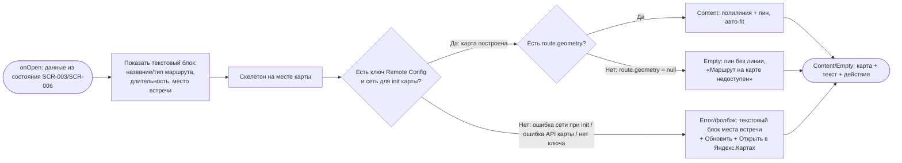

# Карта маршрута

**ID:** BS-004  
**Тип:** Bottom Sheet  
**Домен:** 01. Просмотр прогулок  
**Приоритет:** Medium  
**Статус:** Черновик  
**Функциональные блоки:** FB-MAP-002 (Интерактивная карта BS-004)  
**Зона авторизации:** АЗ  
**Дизайн-макет:** [Figma — Карта маршрута (71:6176)](https://www.figma.com/design/ySEt0cjmRqmhdWyDlTpDM5/Волна-приложение?node-id=71-6176)

> **Дизайн-уточнения** ([RR-D09](../3-design-brief/design-review.md)): на карте — линия маршрута и
> метка **«Пляж»** (точка интереса маршрута), под картой — текст «Прогулка по маршруту займёт N
> минут» (N = `route.duration_min`, из данных). Кнопка **«Проложить маршрут»** (deep-link навигации
> до точки сбора) — рядом с «Открыть в Яндекс.Картах».

---

## Содержание

- [История изменений](#история-изменений)
- [Обзор](#обзор)
- [Навигация](#навигация)
- [Входные данные](#входные-данные)
- [Применяемые логики](#применяемые-логики)
- [Свойства Bottom Sheet](#свойства-bottom-sheet)
- [Инициализация](#инициализация)
- [Используемые запросы](#используемые-запросы)
- [Макет экрана](#макет-экрана)
- [Элементы экрана](#элементы-экрана)
- [Состояния экрана](#состояния-экрана)
- [Действия пользователя](#действия-пользователя)
- [Связанные требования](#связанные-требования)
- [Критерии приёмки](#критерии-приёмки)
---

## История изменений

| Релиз | ТЗ | Описание изменений |
|-------|-----|-------------------|
| 0.1.0 | BS-004 «Карта маршрута» | Первоначальная версия ТЗ на шторку. |

---

## Обзор

BS-004 — шторка (bottom sheet) с **открытой интерактивной картой Яндекс** и **отрисованным маршрутом прогулки**. Раскрывает статичный превью карты с [SCR-003 · Карточка слота](SCR-003-slot-card.md) / [SCR-006 · Детали брони](SCR-006-booking-details.md) до полноразмерного интерактивного просмотра: клиент может приблизить, подвигать карту, рассмотреть линию маршрута и пин места встречи, а при желании — передать маршрут/точку во внешнее приложение Яндекс.Карты (handoff).

Карта строится средствами Yandex Maps JS API: контрастная полилиния по `route.geometry`, пин места встречи по `meeting_point_lat/lng`, авто-fit стартового вида так, чтобы в кадр попали и линия маршрута, и пин. Ключевая текстовая информация (название/тип маршрута, длительность, адрес места встречи) **продублирована текстом** под картой — это текстовый эквивалент карты для доступности (NFR-1) и фолбэк на случай недоступности карты.

Контекст использования — берег, солнце, спешка перед выходом на воду: карта крупная, контролы под палец, текст контрастный и читаемый на солнце. BS-004 — вспомогательный просмотр, не критичное подтверждение: закрытие свободным жестом (свайп / тап по бэкдропу / кнопка «Закрыть») допустимо.

### User Story

> Как клиент, я хочу рассмотреть маршрут прогулки на полноразмерной интерактивной карте и найти место встречи,
> чтобы понять, как проходит маршрут и где собирается группа, и при желании построить дорогу до точки сбора.

### Бизнес-ценность

- Снимает неопределённость «куда идти / что за маршрут» до прогулки — меньше опозданий и неявок.
- Удерживает клиента в приложении: внешняя навигация подключается только по явному действию (handoff).
- Текстовое дублирование места встречи делает информацию доступной даже без карты и для screen reader (NFR-1).

---

## Навигация

### Входящая (откуда открывается)

| Источник | Триггер | Условие | Передаваемые параметры |
|----------|---------|---------|------------------------|
| [SCR-003 · Карточка слота](SCR-003-slot-card.md) | Тап по статичному превью карты маршрута (CTA «Открыть карту ›») | Всегда | `route.geometry`, `route.name`, `route.type`, `route.duration_min`, `slot.meeting_point`, `slot.meeting_point_lat`, `slot.meeting_point_lng` |
| [SCR-006 · Детали брони](SCR-006-booking-details.md) | Тап по статичному превью карты маршрута (CTA «Открыть карту ›») | Всегда | `route.geometry`, `route.name`, `route.type`, `route.duration_min`, `slot.meeting_point`, `slot.meeting_point_lat`, `slot.meeting_point_lng` |

### Исходящая (куда ведёт)

| Назначение | Триггер | Передаваемые параметры |
|------------|---------|------------------------|
| [SCR-003 · Карточка слота](SCR-003-slot-card.md) | Закрытие (кнопка «Закрыть» / свайп вниз / тап по бэкдропу), если открыта с SCR-003 | — (возврат без изменений) |
| [SCR-006 · Детали брони](SCR-006-booking-details.md) | Закрытие (кнопка «Закрыть» / свайп вниз / тап по бэкдропу), если открыта с SCR-006 | — (возврат без изменений) |
| Внешнее приложение / веб Яндекс.Карты | Тап «Открыть в Яндекс.Картах» | `meeting_point_lat`, `meeting_point_lng`, маршрут/точка (deeplink) |
| Внешнее приложение / веб Яндекс.Карты | Тап «Проложить маршрут» | `meeting_point_lat`, `meeting_point_lng` (точка назначения для построения маршрута) |

---

## Входные данные

> Данные передаются вызывающим экраном (SCR-003 / SCR-006) из его состояния — ответа `getSlot` / `getBooking`. BS-004 при открытии **не делает запросов к нашему API**.
>
> **Что именно передаётся:** только данные для отрисовки и handoff — `route.*` (`geometry`, `name`, `type`, `duration_min`) и `meeting_point*` (`meeting_point`, `meeting_point_lat`, `meeting_point_lng`). `bookingId` / `slotId` в BS-004 **не передаются** и не нужны: шторка не обращается к API и не привязана к идентификатору сущности (возврат на родителя — без изменений). Источник родителя (SCR-003 vs SCR-006) определяется навигацией для корректного возврата, а не передачей id.
>
> **Правило форматирования строки маршрута** (текстовый блок под картой): `route.name · {label(route.type)} · ~{route.duration_min} мин`, например «Острова и каналы · Новичковый · ~90 мин». Где `label(route.type)`: `novice` → «Новичковый», `experienced` → «Опытный». Сегмент «~N мин» **скрывается целиком**, если `route.duration_min` отсутствует; разделитель ` · ` ставится только между присутствующими сегментами.

| Название | Тип | Возможные значения | Описание |
|----------|-----|-------------------|----------|
| `route.geometry` | Состояние (от SCR-003 / SCR-006) | массив пар `[lat, lng]` **или** строка encoded polyline; может отсутствовать | Геометрия маршрута для отрисовки полилинии на карте. |
| `route.name` | Состояние | строка, напр. `Острова и каналы` | Название маршрута; дублируется текстом под картой. |
| `route.type` | Состояние | `novice`, `experienced` | Тип маршрута (новичковый / опытный); дублируется текстом под картой. |
| `route.duration_min` | Состояние | целое число минут, напр. `90`; может отсутствовать | Длительность прогулки; в текстовом блоке показывается, если значение есть. |
| `slot.meeting_point` | Состояние | строка, напр. `Лодочная станция у Елагина моста` | Адрес/ориентир места встречи; обязательный текстовый эквивалент карты. |
| `slot.meeting_point_lat` | Состояние | число (широта), напр. `59.978` | Широта места встречи — координата пина и точки для handoff. |
| `slot.meeting_point_lng` | Состояние | число (долгота), напр. `30.262` | Долгота места встречи — координата пина и точки для handoff. |
| `yandex_maps_api_key` | Remote Config | строка | Ключ Yandex Maps JS API. Не хардкодится. |
| `yandex_maps_tiles_style` | Remote Config | строка (идентификатор стиля/набора тайлов) | Стиль тайлов карты. Не хардкодится. |

---

## Применяемые логики

| Логика | Элемент/Триггер | Описание |
|--------|-----------------|----------|
| [LOGIC-006 Карта маршрута](09_Логики/LOGIC-006_Карта-маршрута.md) | Интерактивная карта (FB-MAP-002), кнопки handoff, фолбэк | Отрисовка интерактивной карты (полилиния `route.geometry` + пин `meeting_point_lat/lng`, авто-fit, зум/пан) средствами Yandex Maps JS API; handoff во внешнее приложение; фолбэк на текст при недоступности карты; ключ/стиль из Remote Config. |
| [LOGIC-008 Паттерн состояний экрана](09_Логики/LOGIC-008_Паттерн-состояний-экрана.md) | Инициализация интерактивной карты (асинхронная: Loading → Content / Empty / Error) | Карта строится асинхронно через Yandex Maps JS API: Loading (скелетон, Шаг 1) → Content (карта с линией) / Empty (`route.geometry = null` — пин без линии, заголовок «Маршрут на карте недоступен», Шаг 3) / Error (кнопка «Обновить», Шаг 4). Поведение снеков при «Обновить» и handoff — каталог снеков (Шаг 6). |

---

## Свойства Bottom Sheet

| Свойство | Значение |
|----------|----------|
| Высота | Fullscreen (расширенная, до ~90% экрана — чтобы карта была крупной; контент карты интерактивен внутри шторки) |
| Закрытие свайпом | Да (свайп вниз; виден грабер) |
| Закрытие по тапу вне области | Да (тап по бэкдропу — BS-004 не критичное подтверждение) |
| Затемнение фона | Да (бэкдроп; таб-бар скрыт) |
| Кнопка закрытия | Да (в хедере справа, «✕ Закрыть») |

---

## Инициализация

> **Примечание:** При открытии BS-004 **запросы к нашему API не отправляются**. Все данные (геометрия маршрута, координаты и адрес места встречи, название/тип/длительность маршрута) передаются вызывающим экраном из его состояния; ключ и стиль тайлов Яндекс берутся из Remote Config. См. [Входные данные](#входные-данные). Единственное внешнее взаимодействие — построение карты через Yandex Maps JS API (внешний сервис).

### Диаграмма загрузки



### Запросы при открытии

| № | Запрос | Критичный | Зависит от | Условие |
|---|--------|-----------|------------|---------|
| — | Запросы к нашему API отсутствуют | — | — | Данные переданы с SCR-003 / SCR-006; см. [Входные данные](#входные-данные) |

> Полное описание внешней интеграции с Яндекс.Картами см. в секции [Используемые запросы](#используемые-запросы).

---

## Используемые запросы

> К нашему REST/GraphQL API шторка запросов не делает. Данные о слоте/брони получены ранее через [`../api/slots/api.yaml`](../api/slots/api.yaml) → `getSlot` (для SCR-003) / [`../api/bookings/api.yaml`](../api/bookings/api.yaml) → `getBooking` (для SCR-006) и переданы в BS-004 как [входные данные](#входные-данные). Ниже — описание интеграции с внешним сервисом Яндекс.Карты.

### Интеграция: Yandex Maps JS API (интерактивная карта)

**Тип:** Внешний сервис (клиентский SDK / JS API)  
**Спецификация:** Yandex Maps JS API. Логика: [LOGIC-006 Карта маршрута](09_Логики/LOGIC-006_Карта-маршрута.md)  
**Модель данных (справочно):** `Route.geometry`, `Slot.meeting_point*` — [`../api/instructors/models.yaml`](../api/instructors/models.yaml) → `Route`, [`../api/slots/models.yaml`](../api/slots/models.yaml) → `Slot`

**Триггер:** Открытие шторки BS-004.

**Параметры:**

| Параметр | Тип | Обязательность | Источник | Описание |
|----------|-----|----------------|----------|----------|
| ключ API | string | Да | `yandex_maps_api_key` (Remote Config) | Авторизация Maps JS API. Не хардкодится. |
| стиль тайлов | string | Нет | `yandex_maps_tiles_style` (Remote Config) | Набор/стиль тайлов карты. Не хардкодится. |
| полилиния маршрута | geometry | Нет | `route.geometry` (состояние) | Выделенная линия маршрута на карте. При отсутствии — линия не рисуется. |
| метка (пин) | coords | Да | `meeting_point_lat`, `meeting_point_lng` (состояние) | Пин места встречи; используется и для авто-fit, и для handoff. |
| стартовый вид (bounds) | bounds | Да | вычисляется клиентом по полилинии + пину | Авто-fit: вся линия маршрута и пин помещаются в кадр. |

**Обработка ответа:**

| Результат | Условие | UI-реакция |
|-----------|---------|------------|
| Загрузка (Loading) | Карта инициализируется (асинхронно, [LOGIC-008](09_Логики/LOGIC-008_Паттерн-состояний-экрана.md) Шаг 1) | Скелетон на месте карты; текстовый блок места встречи уже виден |
| Успех (Content) | Карта построена, есть `route.geometry` | Интерактивная карта: полилиния + пин, авто-fit, доступны зум/пан |
| Успех без линии (Empty) | `route.geometry = null` | Карта/превью строится с пином места встречи; полилиния **не** рисуется. Заголовок «Маршрут на карте недоступен» (каталог Empty, [LOGIC-008](09_Логики/LOGIC-008_Паттерн-состояний-экрана.md) Шаг 3). Это Content-без-линии, **не** Error |
| Ошибка сети / офлайн **при инициализации** (Error) | Нет соединения / таймаут до отрисовки карты | Вместо карты: «Не удалось загрузить. Проверьте соединение и попробуйте снова.» + «Обновить»; текстовый блок и **«Открыть в Яндекс.Картах» (handoff остаётся доступен)** |
| Ошибка API карты / ключа (Error → фолбэк на текст) | Maps JS API вернул ошибку **или** `yandex_maps_api_key` пуст/невалиден | Построение карты не выполняется / прервано; фолбэк на текстовый блок + кнопка «Обновить»; «Открыть в Яндекс.Картах» остаётся доступна |
| Офлайн **после** успешной отрисовки | Сеть потеряна, когда карта уже видна | Отрисованный кадр, пин и текст сохраняются (без полного фолбэка); деградируют только подгрузка тайлов/пан в незакэшированные зоны. В Error **не** сбрасываемся |

### Интеграция: Handoff во внешнее приложение Яндекс.Карты

**Тип:** Внешний сервис (deeplink / открытие приложения или веба)  
**Триггер:** Тап «Открыть в Яндекс.Картах» или «Проложить маршрут».

| Действие | Параметры | Поведение |
|----------|-----------|-----------|
| «Открыть в Яндекс.Картах» | `meeting_point_lat`, `meeting_point_lng` (маршрут/точка) | Открывает маршрут/точку во внешнем приложении или вебе Яндекс.Карт |
| «Проложить маршрут» | `meeting_point_lat`, `meeting_point_lng` (точка назначения) | Открывает внешнюю навигацию Яндекс.Карт к месту встречи; turn-by-turn — во внешнем приложении (в MVP без in-app навигации) |
| Приложение Яндекс.Карт **не установлено** | — | Деградация: открытие веб-версии Яндекс.Карт в браузере по тому же deeplink. Если и это недоступно — системная обработка открытия URL / ненавязчивый снек (каталог снеков, [LOGIC-008](09_Логики/LOGIC-008_Паттерн-состояний-экрана.md) Шаг 6); клиент остаётся в приложении |

---

## Макет экрана

### Структура

```
┌─────────────────────────────────────┐
│                ▭▭▭                    │  ← грабер (swipe-to-close)
│  Маршрут                    ✕ Закрыть │  ← хедер
├─────────────────────────────────────┤
│  ░░░░░░░ интерактивная карта ░░░░░░░ │
│  ░░░╱‾‾‾‾‾‾╲░░░░ (зум / пан) ░░🏖Пляж│  ← route.geometry + метка «Пляж» (RR-D09)
│  ░░╱         ╲______░░░░░ 📍 ░░░░░░░ │  ← пин места встречи (meeting_point_lat/lng)
│  ░░░░░░░░░░░░░░░░░░░░░░░░░░ [＋] [－] │  ← контролы зума
├─────────────────────────────────────┤
│  Утренний залив · Новичковый · ~90 мин│  ← route.name · type · duration_min
│  Прогулка по маршруту займёт 90 минут │  ← текст из route.duration_min (RR-D09)
│  📍 Место встречи                     │
│  Лодочная станция у Елагина моста     │  ← slot.meeting_point (текст)
├─────────────────────────────────────┤
│  [ Проложить маршрут ]                │  ← навигация до места встречи (handoff)
│  [ Открыть в Яндекс.Картах ]          │  ← handoff во внешнее приложение
└─────────────────────────────────────┘
        ░░░ бэкдроп (затемнение) ░░░
```

### Компоненты

| Компонент | Описание | Обязательность |
|-----------|----------|----------------|
| Грабер | Полоска сверху, индикатор swipe-to-close | Да |
| Хедер | Заголовок «Маршрут» + кнопка «✕ Закрыть» | Да |
| Интерактивная карта | Полотно Yandex Maps JS API: полилиния маршрута + пин места встречи, зум/пан, авто-fit, контролы зума | Да (при недоступности — фолбэк) |
| Текстовый блок маршрута | Название и тип маршрута, длительность (если есть), лейбл «Место встречи» + адрес/ориентир | Да (обязателен для доступности) |
| Панель действий | Кнопки «Проложить маршрут» и «Открыть в Яндекс.Картах» | Да |

---

## Элементы экрана

### 1. Хедер

| Элемент | Описание | Источник данных | Валидация | Действие |
|---------|----------|-----------------|-----------|----------|
| Грабер | Индикатор перетаскивания, swipe-to-close | — | — | Свайп вниз → закрыть, вернуться на исходный экран |
| Заголовок «Маршрут» | Название шторки | Константа микрокопии | — | — |
| Кнопка «✕ Закрыть» | Явная кнопка закрытия (справа в хедере) | — | — | Закрыть шторку → возврат на [SCR-003](SCR-003-slot-card.md) / [SCR-006](SCR-006-booking-details.md) без изменений |

### 2. Интерактивная карта

| Элемент | Описание | Источник данных | Валидация | Действие |
|---------|----------|-----------------|-----------|----------|
| Полотно карты | Интерактивная карта Яндекс с зумом/паном | Yandex Maps JS API (ключ/стиль из Remote Config) | — | Жесты зум/пан внутри шторки |
| Линия маршрута | Выделенная (контрастная) полилиния маршрута | `route.geometry` | — | — |
| Пин места встречи | Метка точки сбора; по тапу — подпись (адрес/ориентир) | `meeting_point_lat`, `meeting_point_lng`, подпись `slot.meeting_point` | — | Тап по пину → короткая подпись места встречи |
| Контролы зума (＋ / −) | Крупные тач-зоны управления масштабом | — | — | Тап → изменение масштаба карты |

**Логика:**
- Карта: [LOGIC-006](09_Логики/LOGIC-006_Карта-маршрута.md) — построение через Yandex Maps JS API, авто-fit на маршрут+пин, фолбэк на текст при недоступности; смысл линии не передаётся только цветом (контраст не ниже WCAG AA).

**Условия доступности:**
- Полотно карты, пин и контролы зума отображаются в состояниях Content и Empty (`route.geometry = null`). В состоянии Error (ошибка сети при инициализации / ошибка API карты / нет ключа) — вместо карты фолбэк (см. [Состояния экрана](#состояния-экрана)).
- Линия маршрута не рисуется, если `route.geometry = null` (состояние Empty, заголовок «Маршрут на карте недоступен», [LOGIC-008](09_Логики/LOGIC-008_Паттерн-состояний-экрана.md) Шаг 3); пин места встречи при этом показывается. Это Content-без-линии, **не** Error.

### 3. Текстовый блок маршрута (эквивалент карты)

| Элемент | Описание | Источник данных | Валидация | Действие |
|---------|----------|-----------------|-----------|----------|
| Название и тип маршрута | Что за прогулка (новичковый / опытный) | `route.name`, `route.type` | — | — |
| Длительность | «~N мин» (правило форматирования строки — см. [Входные данные](#входные-данные)) | `route.duration_min` | — | — |
| Лейбл «Место встречи» | Подпись блока | Константа микрокопии | — | — |
| Адрес/ориентир места встречи | Текст «куда идти» | `slot.meeting_point` | — | — |

**Логика:**
- Блок: [LOGIC-006](09_Логики/LOGIC-006_Карта-маршрута.md) — текстовый эквивалент карты, обязателен для доступности (NFR-1); виден во всех состояниях карты (загрузка / Content / фолбэк).

**Условия доступности:**
- Текстовый блок виден всегда, независимо от состояния карты (включая загрузку и фолбэк).
- Длительность скрыта, если `route.duration_min` отсутствует.

### 4. Панель действий

| Элемент | Описание | Источник данных | Валидация | Действие |
|---------|----------|-----------------|-----------|----------|
| Кнопка «Проложить маршрут» | Навигация до места встречи (handoff) | `meeting_point_lat`, `meeting_point_lng` | — | Handoff во внешнее приложение Яндекс.Карты (построение маршрута к точке сбора) |
| Кнопка «Открыть в Яндекс.Картах» | Открыть маршрут/точку во внешнем приложении/вебе | `meeting_point_lat`, `meeting_point_lng`, маршрут | — | Handoff во внешнее приложение/веб Яндекс.Карт |

**Логика:**
- Кнопки: [LOGIC-006](09_Логики/LOGIC-006_Карта-маршрута.md) — handoff во внешнее картографическое приложение (deeplink); turn-by-turn выполняется внешним приложением, in-app навигации в MVP нет; при невозможности открытия — системная обработка / снек, клиент остаётся в приложении.

**Условия доступности:**
- Кнопка «Открыть в Яндекс.Картах» доступна во всех состояниях, включая фолбэк при недоступной карте.
- Кнопки имеют доступные имена (screen reader) и крупные тач-зоны (≥ 44–48 pt).

---

## Состояния экрана

### Таблица состояний

| Состояние | Условие | Отображение |
|-----------|---------|-------------|
| Loading (инициализация карты) | Карта строится (асинхронная инициализация Yandex Maps JS API; см. [LOGIC-008](09_Логики/LOGIC-008_Паттерн-состояний-экрана.md) Шаг 1) | Скелетон на месте карты; текстовый блок места встречи и название/тип маршрута уже видны |
| Content | Карта построена, есть `route.geometry` | Интерактивная карта (полилиния + пин, авто-fit, зум/пан) + текстовый блок + панель действий |
| Empty (карта без линии: `route.geometry = null`) | Карта построилась, но `route.geometry` отсутствует — линию рисовать нечем (Content-разновидность Empty, **не** Error; согласовано с [LOGIC-006](09_Логики/LOGIC-006_Карта-маршрута.md)) | Карта/превью строится: показывается пин места встречи + текстовый блок; полилиния **не** рисуется. Заголовок «Маршрут на карте недоступен» (по каталогу Empty в [LOGIC-008](09_Логики/LOGIC-008_Паттерн-состояний-экрана.md) Шаг 3). Панель действий и handoff доступны. |
| Error — ошибка сети / офлайн **при инициализации** карты | Нет соединения при построении / таймаут до того, как карта успела отрисоваться | Вместо карты: сообщение «Не удалось загрузить. Проверьте соединение и попробуйте снова.» ([00-foundations §6](../3-design-brief/00-foundations.md)) + кнопка «Обновить»; текстовый блок места встречи и кнопка **«Открыть в Яндекс.Картах» (handoff во внешнее приложение остаётся доступен)** не блокируются. Шторка не ломается. |
| Error — ошибка API карты / ключа (фолбэк на текст) | Maps JS API вернул ошибку, нет/невалидный `yandex_maps_api_key` в Remote Config | Построение карты не выполняется / прервано: фолбэк на текстовый блок места встречи + кнопка «Обновить»; кнопка «Открыть в Яндекс.Картах» остаётся доступна. Шторка не ломается. |
| Offline **после** успешной отрисовки | Сеть потеряна, когда карта уже построена и видна (Content/Empty) | Уже отрисованный кадр карты, пин и текстовый блок сохраняются (без полного фолбэка); деградируют только подгрузка новых тайлов и зум/пан в незакэшированные области. Handoff остаётся доступен. В Error экран **не** сбрасывается. |

### Диаграмма переходов

```mermaid
stateDiagram-v2
    [*] --> Loading : onOpen (данные из состояния; асинхр. init карты, LOGIC-008)

    Loading --> Content : карта построена, есть route.geometry
    Loading --> Empty : карта построена, route.geometry = null (пин без линии)
    Loading --> Error : ошибка сети/офлайн при инициализации
    Loading --> Error : ошибка API карты / нет ключа

    Content --> Error : карта перестала отвечать (ошибка API)
    Error --> Loading : тап «Обновить»

    Content --> [*] : закрытие (кнопка / свайп / бэкдроп)
    Empty --> [*] : закрытие (кнопка / свайп / бэкдроп)
    Error --> [*] : закрытие (кнопка / свайп / бэкдроп)
    Content --> External : «Открыть в Яндекс.Картах» / «Проложить маршрут»
    Empty --> External : «Открыть в Яндекс.Картах» / «Проложить маршрут»
    Error --> External : «Открыть в Яндекс.Картах» (handoff при ошибке сети)
```

---

## Действия пользователя

| Действие | Элемент | Триггер | Результат |
|----------|---------|---------|-----------|
| Закрыть свайпом | Грабер / полотно шторки | Swipe вниз | Закрытие → возврат на [SCR-003](SCR-003-slot-card.md) / [SCR-006](SCR-006-booking-details.md) без изменений |
| Закрыть по бэкдропу | Затемнённый фон | Tap вне шторки | Закрытие → возврат на исходный экран |
| Закрыть кнопкой | «✕ Закрыть» | Tap | Закрытие → возврат на исходный экран |
| Масштабировать карту | Контролы зума ＋ / − / жесты | Tap / pinch | Изменение масштаба карты; линия и пин остаются отрисованными |
| Двигать карту | Полотно карты | Pan / drag | Перемещение по карте; линия и пин остаются отрисованными |
| Открыть подпись места встречи | Пин | Tap | Короткая подпись с адресом/ориентиром |
| Проложить маршрут | «Проложить маршрут» | Tap | Handoff во внешнее приложение Яндекс.Карты (навигация к месту встречи) |
| Открыть во внешней карте | «Открыть в Яндекс.Картах» | Tap | Handoff во внешнее приложение/веб Яндекс.Карт. Если приложение не установлено — деградация в браузер; при полной неудаче — системная обработка / ненавязчивый снек, клиент остаётся в приложении |
| Повторить загрузку карты | «Обновить» (в Error) | Tap | Повторная попытка построения карты (→ Loading). На время попытки кнопка «Обновить» показывает лоадер и блокируется от повторного тапа ([LOGIC-008](09_Логики/LOGIC-008_Паттерн-состояний-экрана.md) Шаг 5). При повторной неудаче — остаёмся в Error с «Обновить» (первичная загрузка → Error-заглушка, не снек); снек используется только для неудачи handoff |

---

## Связанные требования

### Функциональные (REQ-FUNC-*)

| ID | Название | Приоритет |
|----|----------|-----------|
| FR-9a | Карточка слота со всеми параметрами эвента (включая маршрут и его тип) — [ФТ](../2-requirements/functional-requirements.md) | Must |
| US-4 | Открыть карточку слота со всеми параметрами, чтобы понять детали перед записью — [User stories](../2-requirements/user-stories.md) | — |

### Интеграции (REQ-INT-*)

| ID | Название | Приоритет |
|----|----------|-----------|
| INT-YANDEX-MAPS | Интеграция с Яндекс.Картами: Maps JS API (интерактивная карта BS-004), handoff во внешнее приложение; ключ и стиль тайлов — Remote Config — [LOGIC-006](09_Логики/LOGIC-006_Карта-маршрута.md) | Medium |

### UI (REQ-UI-*)

| ID | Название | Приоритет |
|----|----------|-----------|
| NFR-1 | Доступность / mobile-first: карта — не единственный носитель информации; место встречи и название/тип маршрута дублируются текстом; крупные тач-зоны, высокий контраст — [НФТ](../2-requirements/non-functional-requirements.md) | Высокий |

### Данные (REQ-DATA-*)

| ID | Название | Приоритет |
|----|----------|-----------|
| REQ-DATA-ROUTE | `Route.geometry`, `Route.name`, `Route.type`, `Route.duration_min` — [`../api/instructors/models.yaml`](../api/instructors/models.yaml) → `Route` | Must |
| REQ-DATA-MEETING | `Slot.meeting_point`, `Slot.meeting_point_lat`, `Slot.meeting_point_lng` — [`../api/slots/models.yaml`](../api/slots/models.yaml) → `Slot` | Must |

---

## Критерии приёмки

### Позитивные сценарии

| ID | Критерий | Приоритет |
|----|----------|-----------|
| AC-001 | **Дано** клиент на SCR-003 / SCR-006 тапнул по превью карты и переданы валидные `route.geometry` и `meeting_point_lat/lng` с доступным ключом из Remote Config, **Когда** открывается шторка BS-004, **Тогда** снизу появляется интерактивная карта с выделенной линией маршрута и пином места встречи, авто-fit на маршрут+пин, без запросов к нашему API. | P0 |
| AC-002 | **Дано** открыта шторка BS-004, **Когда** клиент масштабирует и двигает карту (зум/пан), **Тогда** карта реагирует на жесты, а линия маршрута и пин остаются отрисованными. | P0 |
| AC-003 | **Дано** открыта шторка BS-004 (карта доступна или нет), **Когда** клиент смотрит контент, **Тогда** под картой показаны название и тип маршрута, длительность (если `route.duration_min` есть) и текстовый адрес места встречи (`slot.meeting_point`). | P0 |
| AC-003a | **Дано** переданы `route.name`, `route.type` и `route.duration_min`, **Когда** строится текстовый блок, **Тогда** строка маршрута форматируется как `route.name · {Новичковый\|Опытный} · ~{duration_min} мин` (напр. «Острова и каналы · Новичковый · ~90 мин»); при отсутствии `route.duration_min` сегмент «~N мин» и его разделитель скрываются (см. [Входные данные](#входные-данные)). | P1 |
| AC-003b | **Дано** открытие BS-004, **Когда** родитель (SCR-003 / SCR-006) передаёт данные, **Тогда** передаются только `route.*` и `meeting_point*`; `bookingId` / `slotId` не передаются, и шторка не делает запросов к нашему API. | P1 |
| AC-004 | **Дано** открыта шторка BS-004, **Когда** клиент нажимает «Открыть в Яндекс.Картах» или «Проложить маршрут», **Тогда** происходит handoff во внешнее приложение/веб Яндекс.Карт с этим маршрутом/точкой, без in-app навигации. | P0 |

### Негативные сценарии

| ID | Критерий | Приоритет |
|----|----------|-----------|
| AC-N01 | **Дано** карта не загрузилась из-за **ошибки сети / офлайна при инициализации**, **Когда** открывается BS-004, **Тогда** вместо карты показано «Не удалось загрузить. Проверьте соединение и попробуйте снова.» ([00-foundations §6](../3-design-brief/00-foundations.md)) с кнопкой «Обновить», а текстовый блок места встречи и кнопка **«Открыть в Яндекс.Картах» остаются доступны (handoff во внешнее приложение не блокируется)**; шторка не ломается. | P0 |
| AC-N01a | **Дано** **ошибка API карты или отсутствует/невалиден ключ** `yandex_maps_api_key` в Remote Config, **Когда** открывается BS-004, **Тогда** построение карты не выполняется и показывается фолбэк на текстовый блок места встречи + кнопка «Обновить»; кнопка «Открыть в Яндекс.Картах» остаётся доступна; шторка не ломается. | P0 |
| AC-N02 | **Дано** отображён Error-фолбэк карты, **Когда** клиент тапает «Обновить», **Тогда** выполняется повторная попытка построения карты (переход в Loading); на время попытки кнопка показывает лоадер и блокируется от повторного тапа ([LOGIC-008](09_Логики/LOGIC-008_Паттерн-состояний-экрана.md) Шаг 5). | P1 |
| AC-N02a | **Дано** клиент уже тапнул «Обновить» и попытка завершилась неудачей, **Когда** обрабатывается результат, **Тогда** экран остаётся в Error с заглушкой и кнопкой «Обновить» (провал первичной загрузки — Error-заглушка, **не** снек). | P2 |
| AC-N03 | **Дано** сеть потеряна **после** того, как карта уже успешно отрисована (Content/Empty), **Когда** пропадает соединение, **Тогда** отрисованный кадр карты, пин и текстовый блок сохраняются, экран **не** сбрасывается в Error; деградируют только подгрузка новых тайлов и пан в незакэшированные области, handoff остаётся доступен. | P1 |

### Граничные условия (Edge Cases)

| ID | Критерий | Приоритет |
|----|----------|-----------|
| AC-E01 | **Дано** `route.geometry = null`, **Когда** строится карта/превью, **Тогда** экран переходит в **Empty** (Content-без-линии, **не** Error): полилиния **не** рисуется, показываются пин места встречи + текстовый блок и заголовок «Маршрут на карте недоступен» (каталог Empty, [LOGIC-008](09_Логики/LOGIC-008_Паттерн-состояний-экрана.md) Шаг 3); панель действий и handoff доступны. | P1 |
| AC-E02 | **Дано** шторка BS-004 открыта с SCR-003 (или SCR-006), **Когда** клиент закрывает её свайпом вниз (или кнопкой «Закрыть» / тапом по бэкдропу), **Тогда** он возвращается на исходный экран без изменений. | P0 |
| AC-E03 | **Дано** приложение Яндекс.Карт **не установлено**, **Когда** клиент тапает «Проложить маршрут» / «Открыть в Яндекс.Картах», **Тогда** handoff деградирует в веб-версию Яндекс.Карт в браузере по тому же deeplink; если и это недоступно — невозможность открытия обрабатывается системно / ненавязчивым снеком ([LOGIC-008](09_Логики/LOGIC-008_Паттерн-состояний-экрана.md) Шаг 6), и клиент остаётся в приложении. | P2 |

---
