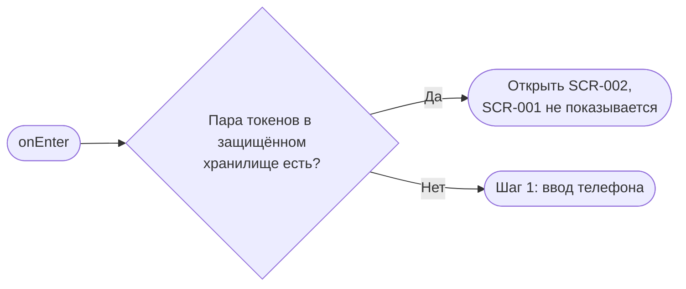
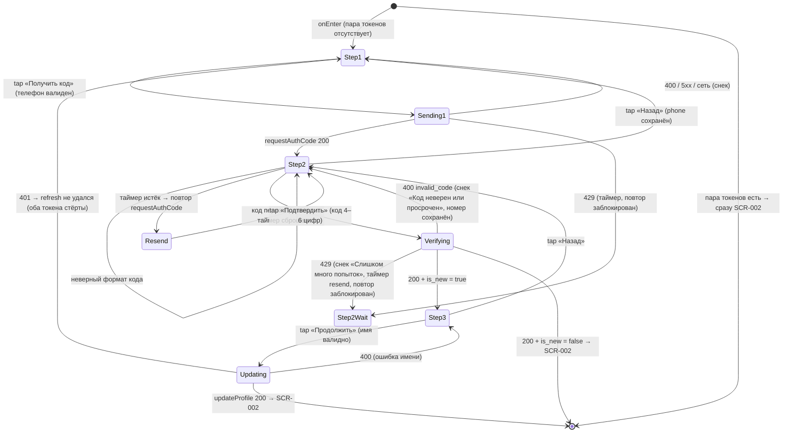

# Регистрация / Вход

**ID:** SCR-001  
**Тип:** Экран  
**Домен:** 01. Авторизация  
**Приоритет:** Critical  
**Статус:** Черновик  
**Функциональные блоки:** FB-AUTH-001 (Вход по телефону), FB-AUTH-002 (Сессия и выход)  
**Зона авторизации:** НЗ  
**Дизайн-макет:** Figma — [Шаг 1 ввод номера (71:5377)](https://www.figma.com/design/ySEt0cjmRqmhdWyDlTpDM5/Волна-приложение?node-id=71-5377) · [вход по номеру (71:5401)](https://www.figma.com/design/ySEt0cjmRqmhdWyDlTpDM5/Волна-приложение?node-id=71-5401) · [Шаг 2 ввод кода (71:12353)](https://www.figma.com/design/ySEt0cjmRqmhdWyDlTpDM5/Волна-приложение?node-id=71-12353) · [Шаг 3 ввод имени (71:5549)](https://www.figma.com/design/ySEt0cjmRqmhdWyDlTpDM5/Волна-приложение?node-id=71-5549)

> **OTP — segmented-поле** ([RR-D05](../3-design-brief/design-review.md)): поле кода (шаг 2)
> рисуется отдельными ячейками (по одной цифре в ячейке); число ячеек = **длине кода из ответа
> API** (на макете — 4 ячейки), таймер повтора — из `resend_after_seconds` (на макете пример
> 00:30). Длину и таймер **не хардкодить** — привязка к данным ответа сохраняется.

---

## Содержание

- [История изменений](#история-изменений)
- [Обзор](#обзор)
- [Навигация](#навигация)
- [Входные данные](#входные-данные)
- [Применяемые логики](#применяемые-логики)
- [Инициализация](#инициализация)
- [Используемые запросы](#используемые-запросы)
- [Макет экрана](#макет-экрана)
- [Элементы экрана](#элементы-экрана)
- [Состояния экрана](#состояния-экрана)
- [Действия пользователя](#действия-пользователя)
- [Связанные требования](#связанные-требования)
- [Критерии приёмки](#критерии-приёмки)
---

## История изменений

| Релиз | ТЗ | Описание изменений |
|-------|-----|-------------------|
| 0.1.0 | SCR-001 «Регистрация / Вход» | Первоначальная версия ТЗ: трёхшаговый OTP-вход без пароля (телефон → код → имя для нового). |

---

## Обзор

SCR-001 — единственная точка входа в приложение «Волна» для неавторизованного пользователя (зона НЗ). Экран обслуживает и **первичную регистрацию**, и **повторный вход** по одному и тому же уникальному номеру телефона, без пароля — подтверждение выполняется одноразовым кодом из SMS (OTP). Поток состоит из трёх последовательных шагов на единой точке входа, без отдельного выбора «регистрация / вход»:

1. **Шаг 1 — Телефон.** Клиент вводит номер телефона → `requestAuthCode` (POST `/auth/request-code`).
2. **Шаг 2 — Код из SMS (OTP).** Клиент вводит код → `verifyAuthCode` (POST `/auth/verify-code`); ответ содержит `tokens` (`access_token` + `refresh_token`), `client` и флаг `is_new`.
3. **Шаг 3 — Имя (только для нового пользователя, `is_new = true`).** Клиент указывает имя → `updateProfile` (PATCH `/profile`). Известный номер (`is_new = false`) этот шаг **пропускает** и сразу попадает в приложение.

Таб-бар на экране отсутствует (зона НЗ). После успешного входа пользователь передаётся в [SCR-002 «Список слотов»](SCR-002-slot-list.md). Если активная сессия уже есть (в защищённом хранилище присутствует пара токенов `access_token` + `refresh_token`), экран **не показывается** — приложение открывается сразу на [SCR-002](SCR-002-slot-list.md).

### User Story

> Как клиент SUP-клуба, я хочу зарегистрироваться и входить по имени и номеру телефона без пароля,
> чтобы быстро начать пользоваться приложением и записаться на прогулку без барьеров.

### Бизнес-ценность

- Минимальный порог входа (NFR-3): нет пароля, регистрация и вход — единый поток по уникальному номеру телефона.
- Сокращение пути к записи (NFR-2): минимум полей (одно ключевое поле на шаг); известный номер пропускает шаг «Имя».
- Сохранённая сессия пропускает экран входа при последующих запусках — пользователь сразу попадает в список слотов.

---

## Навигация

### Входящая (откуда открывается)

| Источник | Триггер | Условие | Передаваемые параметры |
|----------|---------|---------|------------------------|
| Запуск приложения | Открытие приложения | Пользователь **не авторизован** (в защищённом хранилище нет пары токенов) | — |
| [SCR-007 Профиль](SCR-007-profile.md) | Действие «Выйти» (`logout`) | Сессия завершена, пользователь возвращается в НЗ | — |
| [SCR-007 Профиль](SCR-007-profile.md) | Действие «Удалить аккаунт» (`deleteAccount`) | Аккаунт удалён, сессия завершена | — |
| Любой авторизованный запрос | Ответ `401` (access-токен невалиден/просрочен) **и неуспешный refresh** | Оба токена стёрты | — |

### Исходящая (куда ведёт)

| Назначение | Триггер | Передаваемые параметры |
|------------|---------|------------------------|
| [SCR-002 Список слотов](SCR-002-slot-list.md) | Подтверждение кода известного номера (`verifyAuthCode` 200, `is_new = false`) | — (сессия установлена) |
| [SCR-002 Список слотов](SCR-002-slot-list.md) | Завершение регистрации нового номера (`updateProfile` 200 после шага 3) | — (сессия установлена) |

> Если активная сессия уже есть, экран **не показывается** — приложение открывается сразу на [SCR-002](SCR-002-slot-list.md).

---

## Входные данные

| Название | Тип | Возможные значения | Описание |
|----------|-----|-------------------|----------|
| `tokens.access_token` | Защищённое хранилище (Keychain / Keystore) | JWT-строка / отсутствует | Access-токен активной сессии; передаётся в `Authorization: Bearer <access_token>`. Если на старте присутствует пара токенов — пользователь авторизован, SCR-001 пропускается; экран открывается только при их отсутствии. |
| `tokens.refresh_token` | Защищённое хранилище (Keychain / Keystore) | строка / отсутствует | Refresh-токен; используется для обновления `access_token` по 401 (POST `/auth/refresh`, ротация). Хранится в паре с `access_token`; стирается вместе с ним при logout/deleteAccount и при неуспешном refresh. |
| `phone` | Состояние флоу | E.164, `^\+[1-9]\d{1,14}$` | Введённый на шаге 1 номер. Хранится в состоянии между шагами; не теряется при «Назад» и при ошибке кода. |
| `ttl_seconds` | Состояние флоу | integer (пример `300`) | Из ответа `requestAuthCode`. Срок жизни OTP-кода; по истечении код невалиден (бэкенд вернёт 400). |
| `resend_after_seconds` | Состояние флоу | integer (пример `60`) | Из ответа `requestAuthCode`. Длительность обратного отсчёта таймера повторной отправки кода. |
| `is_new` | Состояние флоу | `true` / `false` | Из ответа `verifyAuthCode`. Управляет ветвлением: `true` → шаг 3 (имя), `false` → сразу SCR-002. |

> Числовые величины (длина OTP-кода, длительность таймера повтора) не зашиваются в UI — длина кода берётся из паттерна `^\d{4,6}$` (4–6 цифр), таймер повтора — из `resend_after_seconds`, срок жизни кода — из `ttl_seconds`.

---

## Применяемые логики

| Логика | Элемент/Триггер | Описание |
|--------|-----------------|----------|
| [LOGIC-001 OTP-авторизация](09_Логики/LOGIC-001_OTP-авторизация.md) | Проверка сессии при старте; кнопки «Получить код» (шаг 1), «Подтвердить» (шаг 2), «Продолжить» (шаг 3) | Трёхшаговый вход без пароля по OTP: телефон → код → имя (для нового); выдача и хранение пары токенов (`access_token` + `refresh_token`), refresh-on-401 (POST `/auth/refresh`, ротация), ветвление по `is_new`, обработка таймера/ошибок. |

---

## Инициализация

> **Примечание:** На старте экрана **тяжёлых запросов нет** — экран статичен и сразу готов к вводу. Единственная операция инициализации — локальная проверка наличия пары токенов (`access_token` + `refresh_token`) в защищённом хранилище (без сетевого запроса). Сетевые вызовы (`requestAuthCode`, `verifyAuthCode`, `updateProfile`) инициируются действиями пользователя, а не открытием экрана.

### Диаграмма загрузки



### Запросы при открытии

| № | Запрос | Критичный | Зависит от | Условие |
|---|--------|-----------|------------|---------|
| — | Сетевые запросы при открытии не выполняются | — | — | Проверка сессии — локальное чтение пары токенов из защищённого хранилища (см. [Входные данные](#входные-данные)) |

> Если пара токенов присутствует — экран не открывается, выполняется переход на [SCR-002](SCR-002-slot-list.md). Полное описание запросов, инициируемых действиями пользователя, см. в секции [Используемые запросы](#используемые-запросы).

---

## Используемые запросы

> Все API-запросы экрана — REST. Базовый URL — из конфигурации (prod `https://api.supclub.example/v1`).

### requestAuthCode

**Тип:** REST  
**Метод:** POST `/auth/request-code`  
**Спецификация:** [../api/auth/api.yaml](../api/auth/api.yaml) → `requestAuthCode`

**Триггер:** Тап на кнопку «Получить код» (шаг 1); повтор — тап на ссылку «Отправить код повторно» по истечении таймера (шаг 2).

> Авторизация не требуется (`security: []`). Заголовок `Content-Type: application/json`.

**Параметры:**

| Параметр | Тип | Обязательность | Источник | Описание |
|----------|-----|----------------|----------|----------|
| `phone` | string | Да | Поле «Телефон» (шаг 1) → состояние `phone` | Номер в E.164, `^\+[1-9]\d{1,14}$` |

**Обработка ответа:**

| Результат | Условие | UI-реакция |
|-----------|---------|------------|
| Загрузка | — | CTA «Получить код» в Loading, повторные тапы заблокированы |
| Успех | HTTP 200 | Сохранить `ttl_seconds`, `resend_after_seconds`; перейти на шаг 2, запустить таймер повтора |
| HTTP 400 | Неверный формат телефона | Снек «Не удалось войти. Попробуйте ещё раз»; код не отправлен |
| HTTP 429 | `too_many_requests` | Показать таймер обратного отсчёта, заблокировать повторную отправку до его истечения |
| HTTP 5xx | `internal_error` | Снек «Произошла ошибка. Попробуйте позже» |
| Сеть | Нет соединения | Снек «Не удалось загрузить. Проверьте соединение и попробуйте снова» |

---

### verifyAuthCode

**Тип:** REST  
**Метод:** POST `/auth/verify-code`  
**Спецификация:** [../api/auth/api.yaml](../api/auth/api.yaml) → `verifyAuthCode`

**Триггер:** Тап на кнопку «Подтвердить» (шаг 2).

> Авторизация не требуется (`security: []`). Заголовок `Content-Type: application/json`.

**Параметры:**

| Параметр | Тип | Обязательность | Источник | Описание |
|----------|-----|----------------|----------|----------|
| `phone` | string | Да | Состояние `phone` (шаг 1) | Номер в E.164, `^\+[1-9]\d{1,14}$` |
| `code` | string | Да | Поле «Код из SMS» (шаг 2) | OTP-код, `^\d{4,6}$` |

**Структура ответа (200):** `{ tokens { access_token, refresh_token }, client { id, phone, name, created_at }, is_new }` (см. [../api/auth/models.yaml](../api/auth/models.yaml) → `VerifyCodeResponse`).

**Обработка ответа:**

| Результат | Условие | UI-реакция |
|-----------|---------|------------|
| Загрузка | — | CTA «Подтвердить» в Loading, поля заблокированы |
| Успех | HTTP 200, `is_new = false` | Сохранить **оба токена** (`tokens.access_token` и `tokens.refresh_token`) в защищённое хранилище; сразу открыть SCR-002 (шаг 3 пропускается) |
| Успех | HTTP 200, `is_new = true` | Сохранить **оба токена** (`access_token` + `refresh_token`); перейти на шаг 3 (ввод имени) |
| HTTP 400 | Неверный/просроченный код (`invalid_code`); истёк `ttl_seconds` — для пользователя неотличимо | Снек «Код неверен или просрочен. Запросите новый код»; номер не теряется, можно ввести заново или запросить новый код по таймеру |
| HTTP 429 | `too_many_requests` (лимит попыток ввода кода) | Снек «Слишком много попыток. Запросите новый код»; запустить/перезапустить обратный отсчёт `resend_after_seconds`, заблокировать «Отправить код повторно» до его истечения |
| HTTP 5xx | `internal_error` | Снек «Произошла ошибка. Попробуйте позже» |
| Сеть | Нет соединения | Снек «Не удалось загрузить. Проверьте соединение и попробуйте снова» |

---

### updateProfile

**Тип:** REST  
**Метод:** PATCH `/profile`  
**Спецификация:** [../api/profile/api.yaml](../api/profile/api.yaml) → `updateProfile`

**Триггер:** Тап на кнопку «Продолжить» (шаг 3, **только при `is_new = true`**).

> Заголовки: `Content-Type: application/json`, `Authorization: Bearer <access_token>` — access-токен, полученный на шаге 2.

**Параметры:**

| Параметр | Тип | Обязательность | Источник | Описание |
|----------|-----|----------------|----------|----------|
| `name` | string | Да | Поле «Имя» (шаг 3) | Имя клиента, 1–100 символов (`UpdateProfileRequest.name`: `minLength: 1`, `maxLength: 100`) |

**Обработка ответа:**

| Результат | Условие | UI-реакция |
|-----------|---------|------------|
| Загрузка | — | CTA «Продолжить» в Loading, поле заблокировано |
| Успех | HTTP 200 | Регистрация завершена; переход на SCR-002 |
| HTTP 400 | Невалидное имя | Подсветка поля «Имя» + текст под полем «Проверьте имя — кажется, тут лишние символы» |
| HTTP 401 | Access-токен невалиден/просрочен | Сначала попытаться обновить сессию через `refresh_token` (POST `/auth/refresh`, ротация) и повторить запрос. **Только если refresh не удался** — стереть **оба токена** и вернуть на шаг 1 |
| HTTP 5xx | `internal_error` | Снек «Произошла ошибка. Попробуйте позже» |
| Сеть | Нет соединения | Снек «Не удалось загрузить. Проверьте соединение и попробуйте снова» |

---

## Макет экрана

### Структура

Каркас — по [00-foundations §4.1](../3-design-brief/00-foundations.md). Таб-бар в НЗ отсутствует. Поток — три последовательных шага; на шагах 2 и 3 в хедере есть кнопка «Назад» к предыдущему шагу. Нижний CTA на каждом шаге — фиксированный, всегда видимый, **не перекрытый клавиатурой**.

**Шаг 1 — Телефон:**

```
┌───────────────────────────────┐
│  Волна                         │  ← хедер: заголовок / приветствие
├───────────────────────────────┤
│                                │
│  Войдите, чтобы записаться     │  ← краткое пояснение
│  на прогулку                   │
│                                │
│  Телефон                       │
│  [ +7 ___ ___-__-__ ]          │  ← поле «Телефон» (числовая клавиатура)
│                                │
│  Без пароля — входим по        │  ← подсказка (caption, NFR-3)
│  номеру телефона               │
│                                │
├───────────────────────────────┤
│  [      Получить код      ]    │  ← фикс. нижний CTA
└───────────────────────────────┘
```

**Шаг 2 — Код из SMS:**

```
┌───────────────────────────────┐
│  ‹ Назад    Подтверждение      │  ← хедер: назад к шагу 1
├───────────────────────────────┤
│  Мы отправили код на           │
│  +7 999 123-45-67              │  ← номер из шага 1
│                                │
│  Код из SMS                    │
│  [ _ ][ _ ][ _ ][ _ ]          │  ← segmented: ячейки по длине кода из API (RR-D05)
│                                │
│  Отправить код повторно (00:30)│  ← таймер resend_after_seconds → ссылка по истечении
│                                │
├───────────────────────────────┤
│  [      Подтвердить       ]    │  ← фикс. нижний CTA
└───────────────────────────────┘
```

**Шаг 3 — Имя (только для нового пользователя, `is_new = true`):**

```
┌───────────────────────────────┐
│  ‹ Назад    Как вас зовут?     │  ← хедер
├───────────────────────────────┤
│                                │
│  Имя                           │
│  [____________________]        │  ← поле «Имя» (автофокус)
│                                │
│  Так к вам будут обращаться    │  ← подсказка (caption)
│                                │
├───────────────────────────────┤
│  [      Продолжить        ]    │  ← фикс. нижний CTA → SCR-002
└───────────────────────────────┘
```

> Известный (ранее зарегистрированный) номер шаг 3 **пропускает**: после подтверждения кода на шаге 2 сессия устанавливается и сразу открывается [SCR-002](SCR-002-slot-list.md).

### Компоненты

| Компонент | Описание | Обязательность |
|-----------|----------|----------------|
| Хедер | Шаг 1 — заголовок/приветствие; шаги 2–3 — кнопка «Назад» + заголовок | Да |
| Поле «Телефон» | Ввод номера, числовая/телефонная клавиатура, маска национального формата, автофокус | Да (шаг 1) |
| Подсказка о входе без пароля | Caption под полем телефона | Да (шаг 1) |
| Поле «Код из SMS» | OTP **segmented** (отдельные ячейки; число ячеек = длине кода из ответа API, на макете 4), числовая клавиатура, автофокус (RR-D05) | Да (шаг 2) |
| Текст «Мы отправили код на `<номер>`» | Номер из шага 1 над полем кода | Да (шаг 2) |
| Таймер / ссылка «Отправить код повторно» | Обратный отсчёт `resend_after_seconds` → активная ссылка | Да (шаг 2) |
| Поле «Имя» | Однострочное текстовое поле, автофокус | Опционально (только `is_new = true`, шаг 3) |
| Фиксированный нижний CTA | «Получить код» / «Подтвердить» / «Продолжить» — по шагу; не перекрыт клавиатурой | Да |

---

## Элементы экрана

> **Примечания:**
> - Момент валидации полей — не раньше, чем пользователь покинул поле или нажал CTA; во время набора экран «не ругается».
> - Числовые лимиты не зашиваются в тексты — задаются паттернами/конфигурацией.

### 1. Шаг 1 — Телефон

| Элемент | Описание | Источник данных | Валидация | Действие |
|---------|----------|-----------------|-----------|----------|
| Хедер «Волна» | Заголовок / приветствие | — | — | — |
| Текст «Войдите, чтобы записаться на прогулку» | Краткое пояснение | — | — | — |
| Поле «Телефон*» | Номер телефона, числовая клавиатура, маска нац. формата, автофокус | `phone` (состояние) → `requestAuthCode.phone` | Формат E.164 `^\+[1-9]\d{1,14}$`. Пусто → «Введите номер телефона». Неполный/неверный формат → «Похоже, номер введён не полностью» | — |
| Подсказка под полем | Caption об отсутствии пароля (NFR-3) | — | — | «Без пароля — входим по номеру телефона» |
| Кнопка «Получить код» | Primary CTA, во всю ширину | — | — | Валидация телефона → [requestAuthCode](#requestauthcode) → шаг 2 |

**Логика:**
- Кнопка «Получить код»: [LOGIC-001 OTP-авторизация](09_Логики/LOGIC-001_OTP-авторизация.md) — при тапе валидируется формат телефона, отправляется `requestAuthCode`; из ответа сохраняются `ttl_seconds`/`resend_after_seconds`, выполняется переход на шаг 2 с запуском таймера повтора.

**Условия доступности:**
- Кнопка «Получить код» **disabled**, пока телефон не прошёл формат-валидацию (E.164); **enabled** — при валидном номере. Состояние дублируется не только цветом ([00-foundations §3.2](../3-design-brief/00-foundations.md)).
- Во время запроса CTA — **Loading**, повторные тапы заблокированы (защита от двойной отправки).

### 2. Шаг 2 — Код из SMS

| Элемент | Описание | Источник данных | Валидация | Действие |
|---------|----------|-----------------|-----------|----------|
| Кнопка «Назад» (хедер) | Возврат на шаг 1 | — | — | Перейти на шаг 1 без потери `phone` |
| Текст «Мы отправили код на `<номер>`» | Над полем кода | `phone` (состояние, шаг 1) | — | — |
| Поле «Код из SMS*» | OTP **segmented** (отдельные ячейки; число ячеек = длине кода из ответа API, на макете 4), числовая клавиатура, автофокус (RR-D05) | Поле кода → `verifyAuthCode.code` | Формат `^\d{4,6}$` (4–6 цифр). Неверный/просроченный код (по ответу 400) → «Код неверен или просрочен. Запросите новый код» | — |
| Ссылка «Отправить код повторно» | Обратный отсчёт → активная ссылка | `resend_after_seconds` (из `requestAuthCode`) | — | По истечении таймера → повторно [requestAuthCode](#requestauthcode) (таймер сбрасывается). При 429 — новый обратный отсчёт, ссылка заблокирована до его истечения |
| Кнопка «Подтвердить» | Primary CTA, во всю ширину | — | — | [verifyAuthCode](#verifyauthcode) → `is_new = false`: SCR-002; `is_new = true`: шаг 3 |

**Момент валидации:** формат кода — при отправке формы (тап «Подтвердить»); валидность самого кода проверяет бэкенд.

**Логика:**
- Кнопка «Подтвердить» и ссылка «Отправить код повторно»: [LOGIC-001 OTP-авторизация](09_Логики/LOGIC-001_OTP-авторизация.md) — таймер на `resend_after_seconds`; по `verifyAuthCode` 200 токен сохраняется, выполняется ветвление по `is_new`; при истечении `ttl_seconds` код невалиден (бэкенд 400 `invalid_code` → «Код неверен или просрочен. Запросите новый код»); при 429 (лимит попыток ввода кода) — снек «Слишком много попыток. Запросите новый код», таймер повтора перезапускается, «Отправить код повторно» заблокирована до конца отсчёта.

**Условия доступности:**
- Кнопка «Подтвердить» **disabled**, пока код не введён полностью (4–6 цифр); во время запроса — **Loading**, поля заблокированы.
- Ссылка «Отправить код повторно» **неактивна** и показывает обратный отсчёт, пока идёт `resend_after_seconds`; по истечении — **активна**.
- При тапе на «Отправить код повторно» с ответом 429 (лимит запросов кода) новый код не отправляется: запускается **новый обратный отсчёт** `resend_after_seconds` (при отсутствии в ответе — дефолт `60` с), ссылка остаётся **заблокированной до конца отсчёта**.

### 3. Шаг 3 — Имя (только для нового пользователя)

> Блок показывается **только при `is_new = true`** в ответе `verifyAuthCode`. Известный номер этот шаг не видит.

| Элемент | Описание | Источник данных | Валидация | Действие |
|---------|----------|-----------------|-----------|----------|
| Кнопка «Назад» (хедер) | Возврат на предыдущий шаг | — | — | Перейти на шаг 2 |
| Поле «Имя*» | Однострочное текстовое поле, автофокус | Поле имени → `updateProfile.name` | 1–100 символов (`minLength: 1`, `maxLength: 100`). Пусто → «Укажите, как к вам обращаться». Недопустимый формат (по ответу 400) → «Проверьте имя — кажется, тут лишние символы» | — |
| Подсказка под полем | Caption | — | — | «Так к вам будут обращаться» |
| Кнопка «Продолжить» | Primary CTA, во всю ширину | — | — | [updateProfile](#updateprofile) → SCR-002 |

**Момент валидации:** при потере фокуса / при отправке формы (тап «Продолжить»).

**Логика:**
- Кнопка «Продолжить»: [LOGIC-001 OTP-авторизация](09_Логики/LOGIC-001_OTP-авторизация.md) — при тапе валидируется имя, отправляется `updateProfile` под уже сохранённым `access_token` (`Authorization: Bearer <access_token>`); по 200 регистрация завершается и открывается SCR-002. При 401 — refresh через `refresh_token` и повтор; если refresh не удался — оба токена стираются, возврат на шаг 1.

**Условия доступности:**
- Кнопка «Продолжить» **disabled**, пока имя не заполнено/не прошло формат-валидацию; во время запроса — **Loading**.
- Весь шаг 3 **скрыт**, если `is_new = false` — переход в SCR-002 происходит сразу после шага 2.

---

## Состояния экрана

### Таблица состояний

| Состояние | Условие | Отображение |
|-----------|---------|-------------|
| Loading (старт) | Открытие экрана, пары токенов нет | Экран статичен, поля шага 1 готовы к вводу (сетевая загрузка не блокирует ввод) |
| Content (шаг 1/2/3) | Активный шаг потока | Поля текущего шага + CTA: телефон → код → имя (для нового). Шаги 2–3 имеют кнопку «Назад» |
| Валидация полей | Невалидный ввод после ухода из поля / тапа CTA | Подсветка поля + текст ошибки под полем |
| Отправка / ожидание | Идёт запрос `requestAuthCode` / `verifyAuthCode` / `updateProfile` | CTA в Loading, поля заблокированы (защита от двойной отправки) |
| Ожидание повтора (шаг 2) | Идёт отсчёт `resend_after_seconds` или получен 429 | Ссылка «Отправить код повторно» неактивна + обратный отсчёт; по истечении активируется |
| Лимит запросов кода (429 на `requestAuthCode`) | `requestAuthCode` вернул 429 — на шаге 1 («Получить код») или на шаге 2 (повтор «Отправить код повторно») | Пользователь **остаётся на шаге 1** (если 429 пришёл при первом запросе с шага 1 — переход на шаг 2 не выполняется; экран кода не открывается); если 429 пришёл на повторной отправке — остаётся на шаге 2. В обоих случаях запускается новый обратный отсчёт `resend_after_seconds` (при отсутствии в ответе — дефолт `60` с), повторный запрос не отправляется до конца отсчёта. Снек не дублирует уже видимый таймер |
| Лимит попыток ввода кода (429 на `verifyAuthCode`, шаг 2) | `verifyAuthCode` вернул 429 | Снек «Слишком много попыток. Запросите новый код»; запускается/перезапускается обратный отсчёт `resend_after_seconds`, ссылка «Отправить код повторно» заблокирована до его истечения |
| Неверный/просроченный код (шаг 2) | `verifyAuthCode` 400 (`invalid_code`); либо истёк `ttl_seconds` | Снек «Код неверен или просрочен. Запросите новый код»; номер из шага 1 не теряется, новый код — по таймеру |
| Error (сеть/5xx) | Нет соединения / HTTP 5xx | Снек по [00-foundations §6](../3-design-brief/00-foundations.md); ввод остаётся доступным |

### Диаграмма переходов



---

## Действия пользователя

| Действие | Элемент | Триггер | Результат |
|----------|---------|---------|-----------|
| Ввести телефон | Поле «Телефон» | Ввод текста | Валидация формата активирует CTA «Получить код» |
| Запросить код | Кнопка «Получить код» | Tap | [requestAuthCode](#requestauthcode) → переход на шаг 2, запуск таймера |
| Вернуться к телефону | Кнопка «Назад» (шаг 2) | Tap | Переход на шаг 1 без потери `phone` |
| Ввести код | Поле «Код из SMS» | Ввод текста | По заполнению (4–6 цифр) активируется CTA «Подтвердить» |
| Подтвердить код | Кнопка «Подтвердить» | Tap | [verifyAuthCode](#verifyauthcode) → `is_new=false`: [SCR-002](SCR-002-slot-list.md); `is_new=true`: шаг 3 |
| Переотправить код | Ссылка «Отправить код повторно» | Tap (по истечении таймера) | Повторный [requestAuthCode](#requestauthcode), таймер сбрасывается |
| Ввести имя | Поле «Имя» (шаг 3) | Ввод текста | По заполнению активируется CTA «Продолжить» |
| Завершить регистрацию | Кнопка «Продолжить» | Tap | [updateProfile](#updateprofile) → переход на [SCR-002](SCR-002-slot-list.md) |

---

## Связанные требования

### Функциональные (REQ-FUNC-*)

| ID | Название | Приоритет |
|----|----------|-----------|
| FR-1 | Лёгкая регистрация клиента по имени и номеру телефона без пароля | Must |
| FR-2 | Авторизация клиента по номеру телефона | Must |

### Интеграции (REQ-INT-*)

| ID | Название | Приоритет |
|----|----------|-----------|
| REQ-INT-AUTH | Auth API: `requestAuthCode`, `verifyAuthCode` ([../api/auth/api.yaml](../api/auth/api.yaml)) | Critical |
| REQ-INT-PROFILE | Profile API: `updateProfile` ([../api/profile/api.yaml](../api/profile/api.yaml)) | Critical |

### UI (REQ-UI-*)

| ID | Название | Приоритет |
|----|----------|-----------|
| US-1 | Быстрый вход без барьеров: минимум полей по шагам, автофокус, числовая клавиатура | High |

### Данные (REQ-DATA-*)

| ID | Название | Приоритет |
|----|----------|-----------|
| NFR-3 | Вход без пароля, минимальный порог входа | Critical |

---

## Критерии приёмки

### Позитивные сценарии

| ID | Критерий | Приоритет |
|----|----------|-----------|
| AC-001 | **Дано** пользователь не авторизован (в защищённом хранилище нет пары токенов), **Когда** он открывает приложение, **Тогда** показывается SCR-001 шаг 1 — только поле «Телефон» и кнопка «Получить код»; поля пароля отсутствуют. | P0 |
| AC-002 | **Дано** в защищённом хранилище есть активная пара токенов (`access_token` + `refresh_token`), **Когда** пользователь запускает приложение, **Тогда** SCR-001 не показывается и сразу открывается [SCR-002](SCR-002-slot-list.md). | P0 |
| AC-003 | **Дано** введён валидный телефон в E.164, **Когда** пользователь нажал «Получить код» и `requestAuthCode` вернул 200, **Тогда** открывается шаг 2 с полем кода, запускается таймер повтора на `resend_after_seconds`, код приходит в SMS. | P0 |
| AC-004 | **Дано** телефон уже зарегистрирован (`is_new = false`), **Когда** `verifyAuthCode` вернул 200, **Тогда** оба токена (`access_token` + `refresh_token`) сохраняются в защищённое хранилище и сразу открывается [SCR-002](SCR-002-slot-list.md), шаг 3 пропускается. | P0 |
| AC-005 | **Дано** номер новый (`is_new = true`) и код подтверждён, **Когда** пользователь вводит имя (1–100 символов) и нажимает «Продолжить» (`updateProfile` 200), **Тогда** регистрация завершается и открывается [SCR-002](SCR-002-slot-list.md). | P0 |

### Негативные сценарии

| ID | Критерий | Приоритет |
|----|----------|-----------|
| AC-N01 | **Дано** пользователь ввёл телефон в неполном/неверном формате, **Когда** он пытается получить код, **Тогда** CTA «Получить код» остаётся disabled (или показывается «Похоже, номер введён не полностью»), `requestAuthCode` не отправляется. | P0 |
| AC-N02 | **Дано** пользователь ввёл неверный код на шаге 2, **Когда** `verifyAuthCode` вернул 400 (`invalid_code`), **Тогда** показывается «Код неверен или просрочен. Запросите новый код», вход не выполняется, введённый номер сохранён. | P0 |
| AC-N06 | **Дано** пользователь несколько раз подряд ввёл код на шаге 2, **Когда** `verifyAuthCode` вернул 429 (лимит попыток), **Тогда** показывается «Слишком много попыток. Запросите новый код», запускается/перезапускается обратный отсчёт `resend_after_seconds`, а «Отправить код повторно» заблокирована до его истечения. | P1 |
| AC-N03 | **Дано** на шаге 3 поле «Имя» пусто, **Когда** пользователь нажимает «Продолжить», **Тогда** показывается «Укажите, как к вам обращаться», `updateProfile` не отправляется, переход не происходит. | P1 |
| AC-N04 | **Дано** нет соединения или сервер вернул 5xx, **Когда** выполняется любой из запросов (`requestAuthCode` / `verifyAuthCode` / `updateProfile`), **Тогда** показывается соответствующий снек ([00-foundations §6](../3-design-brief/00-foundations.md)), а введённые данные сохраняются. | P1 |
| AC-N05 | **Дано** `updateProfile` (шаг 3) вернул 401 (access-токен невалиден/просрочен), **Когда** приложение получает ответ, **Тогда** сначала выполняется попытка refresh через `refresh_token` (POST `/auth/refresh`) с повтором запроса; **и только если** refresh не удался — стираются **оба токена** и пользователь переводится на шаг 1. | P1 |

### Граничные условия (Edge Cases)

| ID | Критерий | Приоритет |
|----|----------|-----------|
| AC-E01 | **Дано** на шаге 2 идёт обратный отсчёт `resend_after_seconds` (или получен 429 на запрос/проверку кода), **Когда** пользователь пытается отправить код повторно, **Тогда** повтор заблокирован до конца отсчёта; при 429 запускается новый обратный отсчёт (при отсутствии в ответе — дефолт `60` с), по истечении ссылка «Отправить код повторно» активируется и сбрасывает таймер. | P1 |
| AC-E02 | **Дано** пользователь нажал CTA любого шага и идёт ожидание ответа, **Когда** он нажимает кнопку повторно, **Тогда** повторная отправка не выполняется; CTA остаётся в состоянии Loading. | P1 |
| AC-E03 | **Дано** срок жизни кода `ttl_seconds` истёк, **Когда** пользователь вводит этот код и нажимает «Подтвердить», **Тогда** `verifyAuthCode` возвращает 400 (`invalid_code`), показывается «Код неверен или просрочен. Запросите новый код», предлагается запросить новый код по таймеру. | P2 |
| AC-E04 | **Дано** на шаге 2 показана ошибка кода или пользователь нажал «Назад», **Когда** он возвращается на шаг 1 или повторяет ввод, **Тогда** введённый номер сохранён — без перезаполнения. | P2 |
| AC-E05 | **Дано** на шаге 3 длина имени достигла верхней границы (100 символов), **Когда** пользователь продолжает ввод, **Тогда** ввод сверх лимита не принимается (1–100 символов), CTA «Продолжить» остаётся активным. | P2 |

---
