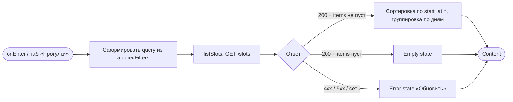
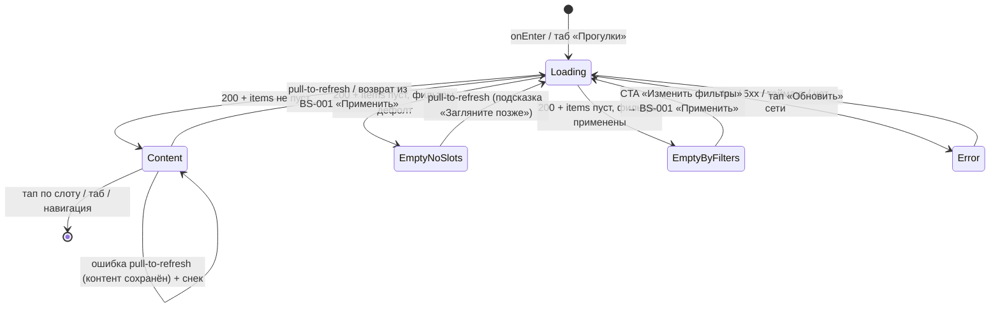

# Список слотов

**ID:** SCR-002  
**Тип:** Экран  
**Домен:** 01. Слоты / Расписание  
**Приоритет:** Critical  
**Статус:** Черновик  
**Функциональные блоки:** FB-SLOTS-001, FB-SLOTS-002  
**Зона авторизации:** АЗ  
**Дизайн-макет:** Figma — [Загрузка списка (71:5695)](https://www.figma.com/design/ySEt0cjmRqmhdWyDlTpDM5/Волна-приложение?node-id=71-5695) · [Нет прогулок / Empty (71:6002)](https://www.figma.com/design/ySEt0cjmRqmhdWyDlTpDM5/Волна-приложение?node-id=71-6002) · [Ошибка загрузки (71:6026)](https://www.figma.com/design/ySEt0cjmRqmhdWyDlTpDM5/Волна-приложение?node-id=71-6026)

> **Терминология и микрокопия по дизайну** ([RR-D10](../3-design-brief/design-review.md) /
> [RR-D11](../3-design-brief/design-review.md)): заголовок экрана — «Прогулки»; Empty «нет слотов
> вообще» — «Пока нет доступных прогулок» / «Загляните позже»; Error — «Не удалось загрузить» /
> «Проверьте соединение и попробуйте снова» / кнопка «Обновить».

---

## Содержание

- [История изменений](#история-изменений)
- [Обзор](#обзор)
- [Навигация](#навигация)
- [Входные данные](#входные-данные)
- [Применяемые логики](#применяемые-логики)
- [Инициализация](#инициализация)
- [Используемые запросы](#используемые-запросы)
- [Макет экрана](#макет-экрана)
- [Элементы экрана](#элементы-экрана)
- [Состояния экрана](#состояния-экрана)
- [Действия пользователя](#действия-пользователя)
- [Связанные требования](#связанные-требования)
- [Критерии приёмки](#критерии-приёмки)
---

## История изменений

| Релиз | ТЗ | Описание изменений |
|-------|-----|-------------------|
| 0.1 | SCR-002 «Список слотов» | Первоначальная документация экрана |

---

## Обзор

**SCR-002 «Список слотов» — главный экран приложения «Волна» и корневой таб
авторизованной зоны.** Открывается сразу после успешного входа и доступен по табу
«Прогулки». Показывает каталог предстоящих групповых SUP-прогулок и служит единственной
точкой входа в сценарий записи: отсюда клиент открывает карточку слота и уточняет выдачу
через фильтры.

Список слотов загружается запросом `listSlots` (`GET /slots`) — read-only-проекция
расписания. По умолчанию (`only_available=false`, период дат не задан) показываются слоты на
**ближайшие 7 дней** (дефолт API: `date_from = now`, `date_to = now + 7 дней`),
отсортированные по `start_at` по возрастанию (ближайшие первыми) и сгруппированные по дням
со sticky-заголовками. Больший период — через явный фильтр дат. Каждая карточка слота содержит дату/время старта, название и тип
маршрута, инструктора, цену и доступность мест («Свободно N из M»). Слот без свободных мест
(`free_seats = 0`) показывается с бейджем «Мест нет» и **некликабелен**.

В хедере — иконка «Фильтры» с индикатором активных фильтров (открывает шторку
[BS-001](BS-001-filters.md)). Жест pull-to-refresh обновляет список и актуальную
доступность мест. Экран подчиняется сквозному паттерну состояний
([LOGIC-008](09_Логики/LOGIC-008_Паттерн-состояний-экрана.md)) и работает в режиме
read-only.

### User Story

> Как клиент, я хочу видеть список свободных слотов прогулок,
> чтобы выбрать подходящую прогулку и записаться. (US-2)
>
> Как клиент, я хочу фильтровать список слотов,
> чтобы быстро находить подходящий вариант. (US-3)

### Бизнес-ценность

- Короткий путь к записи: главный экран сразу показывает каталог прогулок и ведёт в запись за минимум шагов (NFR-2).
- Прозрачность доступности: заполненные слоты видны с пометкой «Мест нет», что снижает путаницу и заменяет ручную запись через WhatsApp/тетрадь.
- Предсказуемость выдачи: единый порядок (ближайшие первыми) и группировка по дням упрощают ориентацию в расписании.
- Воспринимаемая скорость: скелетоны и pull-to-refresh дают ощущение мгновенного отклика на берегу (NFR-6, P4).

---

## Навигация

### Входящая (откуда открывается)

| Источник | Триггер | Условие | Передаваемые параметры |
|----------|---------|---------|------------------------|
| [SCR-001 Регистрация / Вход](SCR-001-registration.md) | Успешный вход / регистрация | Стартовый экран АЗ | — |
| Таб-бар | Тап на таб «Прогулки» | С любого корневого экрана вкладок | — |
| [SCR-003 Карточка слота](SCR-003-slot-card.md) | Кнопка «Назад» | Возврат из карточки / после записи | — |
| [BS-001 Фильтры](BS-001-filters.md) | Применить / Сбросить / закрытие | Закрытие шторки | `appliedFilters` (после «Применить») |

### Исходящая (куда ведёт)

| Назначение | Триггер | Передаваемые параметры |
|------------|---------|------------------------|
| [SCR-003 Карточка слота](SCR-003-slot-card.md) | Тап по карточке слота (только при `free_seats > 0`) | `slotId` |
| [BS-001 Фильтры](BS-001-filters.md) | Тап по иконке «Фильтры» | `appliedFilters` |
| [SCR-005 Мои бронирования](SCR-005-my-bookings.md) | Тап на таб «Мои записи» | — |
| [SCR-007 Профиль клиента](SCR-007-profile.md) | Тап на таб «Профиль» | — |

---

## Входные данные

| Название | Тип | Возможные значения | Описание |
|----------|-----|-------------------|----------|
| `appliedFilters` | Состояние | объект фильтров (см. [LOGIC-005](09_Логики/LOGIC-005_Фильтрация-слотов.md)) | Применённые фильтры выдачи. По умолчанию — пустые (все дефолты). Управляют query запроса `listSlots` и индикатором активных фильтров. |
| `appliedFilters.date_from` | Состояние | `date-time` или не задано | Начало периода старта; по умолчанию не задано. Если клиент не задаёт период — параметры не отправляются и применяется **дефолт API «ближайшие 7 дней»** (`date_from = now`, `date_to = now + 7 дней`). Больший период — только явным фильтром дат. |
| `appliedFilters.date_to` | Состояние | `date-time` или не задано | Конец периода старта; по умолчанию не задано (применяется дефолт API `now + 7 дней`). |
| `appliedFilters.route_type` | Состояние | массив из `novice`, `experienced`; по умолчанию `[]` | Типы маршрута (OR внутри группы); пустой массив = любой тип. |
| `appliedFilters.instructor_id` | Состояние | массив `uuid`; по умолчанию `[]` | Инструкторы (OR внутри группы); пустой массив = любой инструктор. |
| `appliedFilters.only_available` | Состояние | `true` / `false`; по умолчанию `false` | Только слоты со свободными местами; по умолчанию OFF. |

---

## Применяемые логики

| Логика | Элемент/Триггер | Описание |
|--------|-----------------|----------|
| [LOGIC-005 Фильтрация и сортировка слотов](09_Логики/LOGIC-005_Фильтрация-слотов.md) | Загрузка списка / иконка «Фильтры» / индикатор активных фильтров / Empty по фильтрам | Формирование query `listSlots` из применённых фильтров, сортировка по `start_at` ↑, группировка по дням, индикатор активных фильтров, пустой результат по фильтрам (UC-3 E1). |
| [LOGIC-008 Сквозной паттерн состояний экрана](09_Логики/LOGIC-008_Паттерн-состояний-экрана.md) | Открытие экрана / pull-to-refresh / Empty | Loading (скелетоны) → Content / Empty (две разновидности, Шаг 3) / Error («Обновить», Шаг 4); Refreshing = Loading поверх контента (Шаг 1), ошибка обновления → снек (Шаг 6), без перехода в Error. |

---

## Инициализация

### Диаграмма загрузки



### Запросы при открытии

| № | Запрос | Критичный | Зависит от | Условие |
|---|--------|-----------|------------|---------|
| 1 | [listSlots](#listslots) | Да | — | Всегда (query формируется из `appliedFilters`) |

> Справочник инструкторов для фильтра (`listInstructors`) запрашивается не на этом экране,
> а при открытии шторки [BS-001](BS-001-filters.md) — см. [LOGIC-005](09_Логики/LOGIC-005_Фильтрация-слотов.md).
>
> Полное описание запросов см. в секции [Используемые запросы](#используемые-запросы).

---

## Используемые запросы

> Все API-запросы экрана с полным описанием параметров и обработки ответов.

### listSlots

**Тип:** REST  
**Метод:** GET  
**Спецификация:** [../api/slots/api.yaml](../api/slots/api.yaml) → `listSlots` (`GET /slots`)

**Триггер:** Инициализация экрана, pull-to-refresh, возврат из [BS-001](BS-001-filters.md) после «Применить».

**Заголовки:**

| Поле | Описание |
|------|----------|
| `Authorization` | Bearer-токен пользователя |
| `deviceuuid` | Идентификатор устройства |

**Параметры (query):**

| Параметр | Тип | Обязательность | Источник | Описание |
|----------|-----|----------------|----------|----------|
| `date_from` | string (date-time) | Нет | `appliedFilters.date_from` | Начало периода старта; опускается, если не задано. При отсутствии обоих параметров применяется **дефолт API «ближайшие 7 дней»** (`date_from = now`). |
| `date_to` | string (date-time) | Нет | `appliedFilters.date_to` | Конец периода старта; опускается, если не задано (дефолт API — `now + 7 дней`). Больший период — явным фильтром дат. |
| `route_type` | array(enum) `novice`/`experienced` | Нет | `appliedFilters.route_type` | Типы маршрута, OR внутри группы; опускается, если массив пуст. |
| `instructor_id` | array(uuid) | Нет | `appliedFilters.instructor_id` | Инструкторы, OR внутри группы; опускается, если массив пуст. |
| `only_available` | bool | Нет | `appliedFilters.only_available` | Только слоты со свободными местами; по умолчанию `false`. |
| `limit` | int | Нет | Конфигурация | Размер страницы (1..100, по умолчанию из API). В MVP список грузится целиком. |
| `offset` | int | Нет | Состояние | Смещение страницы; `0` для первой страницы, увеличивается при догрузке (задел на будущее). |

> **Вне MVP:** пагинация / бесконечный скролл (догрузка следующих страниц по `limit`/`offset` с лоадером внизу списка) в MVP **не реализуется** — список грузится целиком одной страницей; параметры `limit`/`offset` оставлены как задел на будущее.

**Ответ:** `SlotListResponse` — `items: SlotSummary[]` + `meta: PaginationMeta` (`limit`, `offset`, `total`).
Поля `SlotSummary`: `id`, `start_at`, `route` (`name`, `type`, `capacity_cap`), `instructor` (`name`),
`price`, `rental_price`, `total_seats`, `free_seats`, `free_rental_boards`, `status`.

**Обработка ответа:**

| Результат | Условие | UI-реакция |
|-----------|---------|------------|
| Загрузка | — | Скелетоны карточек слотов (форма будущих карточек), не пустой экран |
| Загрузка (pull-to-refresh) | `isRefreshing = true` | Refreshing — Loading поверх контента ([LOGIC-008](09_Логики/LOGIC-008_Паттерн-состояний-экрана.md), Шаг 1): индикатор обновления сверху списка, список не сбрасывается в скелетон |
| Успех | `items` не пуст | Сортировка по `start_at` ↑, группировка по дням (sticky-заголовки); заполненные слоты с бейджем «Мест нет» и некликабельны; обновление индикатора активных фильтров |
| Успех | `items` пуст, фильтры в дефолте | Empty «нет слотов вообще»: заголовок «Пока нет доступных прогулок» + подсказка «Загляните позже» (микрокопия дизайна, RR-D11; список обновляется жестом pull-to-refresh) |
| Успех | `items` пуст, применены фильтры | Empty «нет по фильтрам»: заголовок «Ничего не найдено по фильтрам» + CTA «Изменить фильтры» (открывает [BS-001](BS-001-filters.md)); тексты — каталог Empty в [LOGIC-008](09_Логики/LOGIC-008_Паттерн-состояний-экрана.md) Шаг 3 (UC-3 E1) |
| HTTP 400 | Некорректные параметры (напр. `date_from` > `date_to`) | Снек с текстом из `message`; если `message` пуст — дефолт «Не удалось выполнить. Попробуйте ещё раз.» (00-foundations §6); некорректный диапазон дат блокируется на стороне UI до запроса ([LOGIC-005](09_Логики/LOGIC-005_Фильтрация-слотов.md)) |
| HTTP 401 | Токен отсутствует/неверен | Сценарий повторной авторизации |
| HTTP 5xx | — | Error state с кнопкой «Обновить» |
| Сеть (первичная загрузка) | Нет соединения | Error state с кнопкой «Обновить» (00-foundations §6) |
| Ошибка при pull-to-refresh | Сбой сети/сервера при `isRefreshing = true` | Контент сохраняется, экран **не** переходит в Error; ненавязчивый снек «Не удалось обновить. Проверьте соединение и попробуйте снова.» (каталог снеков [LOGIC-008](09_Логики/LOGIC-008_Паттерн-состояний-экрана.md) Шаг 6) |

> **Снек успеха применения/сброса фильтра не показывается** (00-foundations §6.1, [LOGIC-005](09_Логики/LOGIC-005_Фильтрация-слотов.md)): обратная связь — обновлённый список и индикатор активных фильтров (см. §6.1 ниже), дублировать снеком нельзя. Успешный pull-to-refresh снеком тоже не подтверждается — только ошибка обновления (строка выше).

---

## Макет экрана

> Дизайн-макет не зафиксирован — ASCII-схема по [дизайн-брифу SCR-002 §5](../3-design-brief/SCR-002-slot-list.md). Числа условны, подставляются из данных.

### Структура

```
┌─────────────────────────────────────┐
│ Прогулки                  [⚙ ②]      │  ← Header: заголовок + иконка «Фильтры» + бейдж-счётчик (число активных фильтров)
├─────────────────────────────────────┤
│  ── Сб, 21 июня ─────────────────    │  ← sticky-заголовок дня
│  ┌─────────────────────────────────┐ │
│  │ Сб, 21 июня · 10:00             │ │  ← start_at (крупно)
│  │ Утренний залив · Новичковый     │ │  ← route.name · route.type
│  │ Инструктор: Анна                │ │  ← instructor.name
│  │ ───────────────────────────────  │ │
│  │ 1500 ₽          Свободно 4 из 8 │ │  ← price | free_seats из total_seats
│  └─────────────────────────────────┘ │
│  ┌─────────────────────────────────┐ │
│  │ Сб, 21 июня · 17:00             │ │
│  │ Вечерние каналы · Опытный       │ │
│  │ Инструктор: Игорь               │ │
│  │ ───────────────────────────────  │ │
│  │ 2500 ₽               [ Мест нет ]│ │  ← free_seats = 0 → бейдж, некликабельна
│  └─────────────────────────────────┘ │
│  ── Вс, 22 июня ─────────────────    │  ← sticky-заголовок следующего дня
│  ┌─────────────────────────────────┐ │
│  │ ...                             │ │
│  └─────────────────────────────────┘ │
│              ⋮ (скролл)               │
├─────────────────────────────────────┤
│ [Прогулки]  [Мои записи]  [Профиль]  │  ← таб-бар (foundations §4.2)
└─────────────────────────────────────┘
```

### Компоненты

| Компонент | Описание | Обязательность |
|-----------|----------|----------------|
| Хедер | Заголовок «Прогулки» + иконка «Фильтры» с бейджем-счётчиком активных фильтров (форма + число, не только цвет) | Да |
| Sticky-заголовок дня | Разделитель-секция с датой дня (текст), залипает при скролле | Да (при наличии слотов на дату) |
| Карточка слота | Дата/время старта, маршрут+тип, инструктор, цена, доступность; вся карточка — тап-зона | Да |
| Бейдж «Мест нет» | Текст + иконка/форма (не только цвет) на карточке с `free_seats = 0` | Условно (при `free_seats = 0`) |
| Заглушка Empty «нет слотов вообще» | Заголовок «Пока нет доступных прогулок» + подсказка «Загляните позже» (микрокопия дизайна, RR-D11; обновление — жестом pull-to-refresh) | Условно (при пустом `items` и фильтрах в дефолте) |
| Заглушка Empty «нет по фильтрам» | Заголовок «Ничего не найдено по фильтрам» + CTA «Изменить фильтры» | Условно (при пустом `items` и применённых фильтрах) |
| CTA «Изменить фильтры» | Кнопка в Empty «нет по фильтрам»; открывает шторку фильтров | Условно (в Empty «нет по фильтрам») |
| Индикатор pull-to-refresh | Индикатор обновления поверх списка | Да |
| Таб-бар | Прогулки / Мои записи / Профиль (foundations §4.2) | Да |

---

## Элементы экрана

> **Примечания:**
> - Колонка «Валидация» для read-only-элементов — «—».
> - Переиспользуемая логика указана ссылкой на раздел [09_Логики](09_Логики).

### 1. Хедер

| Элемент | Описание | Источник данных | Валидация | Действие |
|---------|----------|-----------------|-----------|----------|
| Заголовок «Прогулки» | Название корневого таба | — (статичный) | — | — |
| Иконка «Фильтры» | Кнопка открытия шторки фильтров | — | — | Открыть [BS-001](BS-001-filters.md), передать `appliedFilters` |
| Индикатор активных фильтров | Бейдж-счётчик у иконки «Фильтры»: компактная форма (кружок/пилюля) с числом активных групп фильтров (≠ дефолт). Носитель смысла — форма + число, не только цвет (NFR-1). При увеличении системного шрифта число остаётся читаемым; нечитаемо мелкое число допустимо заменить точкой-маркером | `appliedFilters` | — | — |

**Логика:**
- Иконка «Фильтры» / индикатор: [LOGIC-005](09_Логики/LOGIC-005_Фильтрация-слотов.md) — индикатор виден, если хотя бы один применённый фильтр отличается от дефолта; скрыт, когда все фильтры в дефолте. Число на бейдже = количество групп фильтров, отличающихся от дефолта (период дат считается одной группой; `route_type`, `instructor_id`, `only_available` — отдельными).

**Условия доступности:**
- Индикатор активных фильтров видим, если: хотя бы один из `appliedFilters` ≠ дефолт.

### 2. Список слотов

| Элемент | Описание | Источник данных | Валидация | Действие |
|---------|----------|-----------------|-----------|----------|
| Sticky-заголовок дня | Дата дня старта (текстом) | производное от `start_at` элементов | — | — |
| Дата и время старта | Заголовок карточки (крупно, контрастно) | `start_at` из `listSlots` | — | — |
| Название маршрута | Что за прогулка | `route.name` из `listSlots` | — | — |
| Тип маршрута | Лейбл «Новичковый» / «Опытный» (текст, не только цвет) | `route.type` из `listSlots` | — | — |
| Инструктор | Кто ведёт | `instructor.name` из `listSlots` | — | — |
| Цена | Стоимость места (ключевое число) | `price` из `listSlots` | — | — |
| Доступность мест | «Свободно N из M», N = `free_seats`, M = `total_seats` | `free_seats`, `total_seats` из `listSlots` | — | — |
| Бейдж «Мест нет» | Пометка для заполненного слота (текст + иконка/форма) | `free_seats` из `listSlots` | — | — |
| Карточка слота (тап-зона) | Вся область карточки | `id` из `listSlots` | — | Открыть [SCR-003](SCR-003-slot-card.md), передать `slotId`; **некликабельна при `free_seats = 0`** |

**Логика:**
- Список: [LOGIC-005](09_Логики/LOGIC-005_Фильтрация-слотов.md) — сортировка по `start_at` ↑, группировка по дням со sticky-заголовками; слоты с `free_seats = 0` — бейдж «Мест нет», некликабельны.
- Состояния списка: [LOGIC-008](09_Логики/LOGIC-008_Паттерн-состояний-экрана.md) — Loading/Content/Empty/Error, pull-to-refresh.

**Условия доступности:**
- Карточка слота кликабельна (открывает SCR-003), если: `free_seats > 0`.
- Карточка слота некликабельна (бейдж «Мест нет»), если: `free_seats = 0`.

### 3. Пустые состояния (Empty)

| Элемент | Описание | Источник данных | Валидация | Действие |
|---------|----------|-----------------|-----------|----------|
| Заголовок Empty «нет слотов вообще» | «Пока нет доступных прогулок» | — | — | — |
| Подсказка Empty «нет слотов вообще» | «Загляните позже» (микрокопия дизайна, RR-D11) | — | — | — (обновление — жестом pull-to-refresh) |
| Заголовок Empty «нет по фильтрам» | «Ничего не найдено по фильтрам» | — | — | — |
| CTA «Изменить фильтры» | Кнопка в Empty «нет по фильтрам» | — | — | Открыть [BS-001](BS-001-filters.md), передать `appliedFilters` |

**Логика:**
- Empty: [LOGIC-008](09_Логики/LOGIC-008_Паттерн-состояний-экрана.md) Шаг 3 — две разновидности Empty (тексты и CTA — по каталогу Empty); [LOGIC-005](09_Логики/LOGIC-005_Фильтрация-слотов.md) — пустой результат по фильтрам (UC-3 E1).

**Условия доступности:**
- Empty «нет слотов вообще» — при пустом `items` и фильтрах в дефолте (CTA нет, только подсказка про обновление).
- Empty «нет по фильтрам» с CTA «Изменить фильтры» — при пустом `items` и хотя бы одном применённом фильтре.

### 4. Обновление и таб-бар

| Элемент | Описание | Источник данных | Валидация | Действие |
|---------|----------|-----------------|-----------|----------|
| Pull-to-refresh | Жест «потянуть вниз» | — | — | Повторный запрос [listSlots](#listslots), обновление доступности |
| Таб «Прогулки» | Текущий таб | — | — | — (активный) |
| Таб «Мои записи» | Переход к броням | — | — | Открыть [SCR-005](SCR-005-my-bookings.md) |
| Таб «Профиль» | Переход в профиль | — | — | Открыть [SCR-007](SCR-007-profile.md) |

**Логика:**
- Pull-to-refresh: [LOGIC-008](09_Логики/LOGIC-008_Паттерн-состояний-экрана.md) — Loading поверх контента (индикатор обновления), список не сбрасывается в скелетон; счётчики `free_seats` обновляются актуальными данными.

---

## Состояния экрана

### Таблица состояний

| Состояние | Условие | Отображение |
|-----------|---------|-------------|
| Loading | Ожидание `listSlots` (первичная загрузка) | Скелетоны карточек слотов в форме будущего контента |
| Refreshing | Pull-to-refresh, `isRefreshing = true` | Не самостоятельное состояние, а Loading поверх контента по [LOGIC-008](09_Логики/LOGIC-008_Паттерн-состояний-экрана.md) (Шаг 1, Refreshing): индикатор обновления сверху списка, контент **не сбрасывается** в скелетон. Ошибка обновления → снек, экран не уходит в Error |
| Content | 200 + `items` не пуст | Список карточек (со свободными и заполненными — последние с «Мест нет»), сортировка по `start_at`, секции по дням |
| Empty (нет слотов вообще) | 200 + `items` пуст, фильтры в дефолте | Заглушка: «Пока нет доступных прогулок» + «Загляните позже» (микрокопия дизайна, RR-D11; обновление — жестом pull-to-refresh) |
| Empty (нет по фильтрам) | 200 + `items` пуст, применены фильтры | Заглушка: «Ничего не найдено по фильтрам» + CTA «Изменить фильтры» (открывает [BS-001](BS-001-filters.md)); каталог Empty [LOGIC-008](09_Логики/LOGIC-008_Паттерн-состояний-экрана.md) Шаг 3 (UC-3 E1) |
| Error | 4xx (кроме 400-валидации) / 5xx / таймаут / нет сети при первичной загрузке | Заглушка ошибки + кнопка «Обновить» (00-foundations §6). Ошибка при pull-to-refresh в Error не переводит — см. обработку `listSlots` |

### Диаграмма переходов



---

## Действия пользователя

| Действие | Элемент | Триггер | Результат |
|----------|---------|---------|-----------|
| Открыть карточку слота | Карточка слота (`free_seats > 0`) | Tap | Переход на [SCR-003](SCR-003-slot-card.md) с `slotId` |
| Попытка тапа по заполненному слоту | Карточка слота (`free_seats = 0`) | Tap | Нет перехода (карточка некликабельна, бейдж «Мест нет») |
| Открыть фильтры | Иконка «Фильтры» | Tap | Открыть [BS-001](BS-001-filters.md) с `appliedFilters` |
| Изменить фильтры из Empty | CTA «Изменить фильтры» (Empty «нет по фильтрам») | Tap | Открыть [BS-001](BS-001-filters.md) с `appliedFilters` |
| Обновить список | Список слотов | Pull (потянуть вниз) | Повторный запрос [listSlots](#listslots), обновление доступности мест; при ошибке — контент сохраняется + снек «Не удалось обновить…» (без перехода в Error) |
| Перейти в «Мои записи» | Таб «Мои записи» | Tap | Переход на [SCR-005](SCR-005-my-bookings.md) |
| Перейти в «Профиль» | Таб «Профиль» | Tap | Переход на [SCR-007](SCR-007-profile.md) |
| Повторить загрузку | Кнопка «Обновить» (Error) | Tap | Повтор [listSlots](#listslots), переход в Loading |

---

## Связанные требования

### Функциональные (REQ-FUNC-*)

| ID | Название | Приоритет |
|----|----------|-----------|
| FR-9 | Показ списка слотов (дата/время, маршрут, инструктор, всего/свободно мест, цена) | Must |
| FR-38 | Фильтрация списка слотов по дате/периоду, типу маршрута, наличию мест, инструктору | Must |

### Интеграции (REQ-INT-*)

| ID | Название | Приоритет |
|----|----------|-----------|
| listSlots | GET /slots — список слотов с фильтрами и пагинацией ([../api/slots/api.yaml](../api/slots/api.yaml)) | Critical |

### UI (REQ-UI-*)

| ID | Название | Приоритет |
|----|----------|-----------|
| US-2 | Клиент видит список свободных слотов, чтобы выбрать прогулку | High |
| US-3 | Клиент фильтрует список слотов под свой запрос | High |
| UC-3 | Просмотр и фильтрация списка слотов (A1 — сброс, A2 — комбинирование, E1 — пустой результат) | High |
| NFR-6 | Отклик загрузки/обновления списка < 2–3 с | High |

### Данные (REQ-DATA-*)

| ID | Название | Приоритет |
|----|----------|-----------|
| SlotSummary | Урезанное представление слота для списка ([api/slots/models.yaml](../api/slots/models.yaml)) | Critical |
| SlotListResponse | Постраничный список слотов (`items` + `meta`) | Critical |

---

## Критерии приёмки

### Позитивные сценарии

| ID | Критерий | Приоритет |
|----|----------|-----------|
| AC-001 | **Дано** клиент авторизован и открыл таб «Прогулки», фильтры в дефолте, **Когда** `listSlots` вернул непустой список, **Тогда** показаны слоты на **ближайшие 7 дней** (дефолт API), каждая карточка содержит дату/время старта, маршрут и тип, инструктора, цену и «Свободно N из M». | P0 |
| AC-002 | **Дано** на экране есть карточка слота с `free_seats > 0`, **Когда** клиент тапает в любую область карточки, **Тогда** открывается [SCR-003](SCR-003-slot-card.md) для этого слота с `slotId`. | P0 |
| AC-003 | **Дано** список содержит слоты на разные даты, **Когда** список загружен, **Тогда** слоты отсортированы по `start_at` по возрастанию (ближайшие первыми) и сгруппированы по дням со sticky-заголовками. | P0 |
| AC-004 | **Дано** клиент на экране списка, **Когда** клиент тапает иконку «Фильтры», **Тогда** открывается шторка [BS-001](BS-001-filters.md); **И** после применения хотя бы одного фильтра в хедере виден бейдж-счётчик активных фильтров (форма + число, не только цвет); снек об успешном применении фильтра не показывается (00-foundations §6.1). | P1 |
| AC-005 | **Дано** список отображается, **Когда** клиент тянет список вниз (pull-to-refresh), **Тогда** список и счётчики `free_seats` обновляются актуальными данными, во время обновления виден индикатор, контент не сбрасывается в скелетон. | P1 |

### Негативные сценарии

| ID | Критерий | Приоритет |
|----|----------|-----------|
| AC-N01 | **Дано** запрос `listSlots` завершился ошибкой 5xx или нет сети, **Когда** отображается экран, **Тогда** показана заглушка ошибки с кнопкой «Обновить»; **И** тап «Обновить» возвращает экран в Loading и повторяет запрос. | P0 |
| AC-N02 | **Дано** у слота `free_seats = 0` и фильтр «только со свободными местами» выключен, **Когда** список загружен, **Тогда** слот показан с бейджем «Мест нет» (текст+форма) и некликабелен — тап не открывает SCR-003. | P0 |
| AC-N03 | **Дано** применены фильтры, под которые нет ни одного слота, **Когда** `listSlots` вернул пустой `items`, **Тогда** показан empty state «Ничего не найдено по фильтрам» с CTA «Изменить фильтры», открывающим [BS-001](BS-001-filters.md) (UC-3 E1, каталог Empty [LOGIC-008](09_Логики/LOGIC-008_Паттерн-состояний-экрана.md) Шаг 3). | P1 |
| AC-N04 | **Дано** передан некорректный диапазон дат (`date_from` > `date_to`), **Когда** UI пытается сформировать запрос, **Тогда** некорректный диапазон блокируется до запроса; при ответе 400 от сервера показывается снек с текстом из `message`, а если `message` пуст — дефолт «Не удалось выполнить. Попробуйте ещё раз.» (00-foundations §6). | P2 |
| AC-N05 | **Дано** список отображается, **Когда** pull-to-refresh завершился ошибкой (сеть/сервер), **Тогда** контент сохраняется, экран не переходит в Error, показан ненавязчивый снек «Не удалось обновить. Проверьте соединение и попробуйте снова.». | P1 |

### Граничные условия (Edge Cases)

| ID | Критерий | Приоритет |
|----|----------|-----------|
| AC-E01 | **Дано** в системе нет ни одного предстоящего слота и фильтры в дефолте, **Когда** `listSlots` вернул пустой `items`, **Тогда** показан empty state «Пока нет доступных прогулок» с подсказкой «Загляните позже» (микрокопия дизайна RR-D11; без CTA «Изменить фильтры»; обновление — жестом pull-to-refresh). | P1 |
| AC-E02 | **Дано** экран открывается и данные ещё не получены, **Когда** идёт первичная загрузка, **Тогда** показаны скелетоны карточек, а не пустой экран; отклик ощущается в пределах 2–3 секунд (NFR-6). | P1 |
| AC-E03 | **Дано** слот заполнился, пока клиент смотрел список (его `free_seats` стал 0), **Когда** клиент делает pull-to-refresh, **Тогда** карточка обновляется бейджем «Мест нет» и становится некликабельной без перехода в карточку. | P2 |
| AC-E04 | **Дано** включён фильтр «только со свободными местами» (`only_available=true`), **Когда** список загружен, **Тогда** слоты с `free_seats = 0` отсутствуют в выдаче (бейдж «Мест нет» не показывается). | P2 |
| AC-E05 | **Дано** включено системное увеличение шрифта, **Когда** отображается карточка слота, **Тогда** layout карточки не ломается, ключевые числа (время, цена, свободно мест) остаются читаемы и контрастны (NFR-1). | P2 |

---
