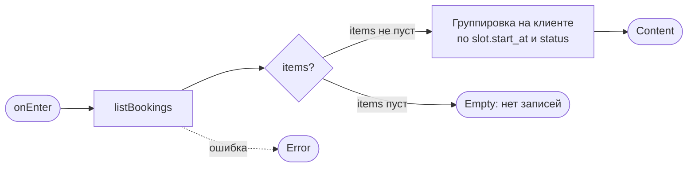
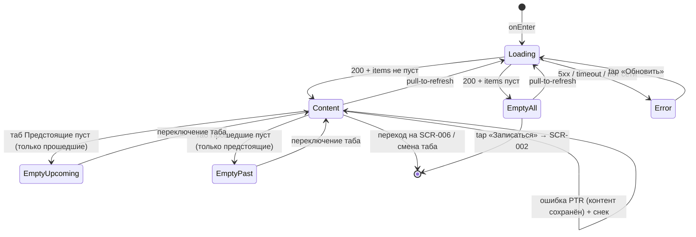

# Мои бронирования

**ID:** SCR-005  
**Тип:** Экран  
**Домен:** 02. Бронирования  
**Приоритет:** Critical  
**Статус:** Черновик  
**Функциональные блоки:** FB-005-001 (Список броней), FB-005-002 (Разделение предстоящие/прошедшие), FB-005-003 (Пустые состояния)  
**Зона авторизации:** АЗ  
**Дизайн-макет:** [Figma — Мои записи (71:6085)](https://www.figma.com/design/ySEt0cjmRqmhdWyDlTpDM5/Волна-приложение?node-id=71-6085)

> **Терминология по дизайну** ([RR-D10](../3-design-brief/design-review.md)): отображаемый заголовок
> экрана — **«Мои записи»** с вкладками **«Предстоящие»** / **«Прошедшие»**. Внутренний ID `SCR-005`
> и название файла («Мои бронирования») сохранены — правится только видимая микрокопия.

---

## Содержание

- [История изменений](#история-изменений)
- [Обзор](#обзор)
- [Навигация](#навигация)
- [Входные данные](#входные-данные)
- [Применяемые логики](#применяемые-логики)
- [Инициализация](#инициализация)
- [Используемые запросы](#используемые-запросы)
- [Макет экрана](#макет-экрана)
- [Элементы экрана](#элементы-экрана)
- [Состояния экрана](#состояния-экрана)
- [Действия пользователя](#действия-пользователя)
- [Связанные требования](#связанные-требования)
- [Критерии приёмки](#критерии-приёмки)
---

## История изменений

| Релиз | ТЗ | Описание изменений |
|-------|-----|-------------------|
| 0.1.0 | SCR-005 «Мои бронирования» | Первичная версия ТЗ на основе [дизайн-брифа SCR-005](../3-design-brief/SCR-005-my-bookings.md). |

---

## Обзор

Корневой экран вкладки **«Мои записи»** таб-бара авторизованной зоны. Даёт клиенту контроль над своими SUP-прогулками: показывает все его брони, разделённые на **Предстоящие** и **Прошедшие**. Это домашняя точка для проверки «куда и когда я записан», входа в детали записи и (через детали) запуска отмены.

Контекст использования — берег, яркое солнце, спешка перед выходом на воду: клиенту нужно **с одного взгляда** понять ближайшую запись (когда старт, какой маршрут, сколько мест) и её статус. Карточка — сводка для опознания записи; полная детализация — на [SCR-006](SCR-006-booking-details.md).

Данные загружаются через `listBookings` (`GET /bookings`) и содержат только брони текущего клиента (NFR-12). Показывается **вся история** броней с **пагинацией** (`limit`/`offset`, ленивая догрузка по мере скролла, R-025). Сервер сортирует по `slot.start_at` (по убыванию); разделение на предстоящие/прошедшие и признак «прошедшее» **вычисляются на клиенте** по `slot.start_at` и `status` — отдельного флага сервер не отдаёт. Отменённые, поздно отменённые и отменённые клубом (`cancelled` / `late_cancel` / `club_cancelled`) брони из истории **не исключаются** — видны с соответствующим бейджем; для `club_cancelled` показывается текст причины отмены `cancellation_reason`.

### User Story

> Как клиент, я хочу видеть список своих бронирований (предстоящих и прошедших),
> чтобы контролировать свои прогулки и при необходимости перейти к деталям или отмене.

### Бизнес-ценность

- Снижает неявки: клиент видит ближайшую прогулку и её детали заранее.
- Самообслуживание: вход в детали и отмену без обращения к клубу.
- Прозрачность: история прошедших и отменённых записей всегда под рукой.

---

## Навигация

### Входящая (откуда открывается)

| Источник | Триггер | Условие | Передаваемые параметры |
|----------|---------|---------|------------------------|
| Таб-бар, вкладка «Мои записи» | Тап на таб | Всегда (с любого корневого экрана АЗ) | — |
| [BS-002 Подтверждение записи](BS-002-booking-success.md) | Тап «Мои бронирования» | После успешной записи | — |

### Исходящая (куда ведёт)

| Назначение | Триггер | Передаваемые параметры |
|------------|---------|------------------------|
| [SCR-006 Детали брони + отмена](SCR-006-booking-details.md) | Тап по карточке записи | `bookingId` (= `id` брони) |
| [SCR-002 Список слотов](SCR-002-slot-list.md) | Тап «Записаться на прогулку» в Empty-состоянии | — |
| [SCR-002 Список слотов](SCR-002-slot-list.md) | Тап по табу «Прогулки» | — |
| [SCR-007 Профиль](SCR-007-profile.md) | Тап по табу «Профиль» | — |

---

## Входные данные

| Название | Тип | Возможные значения | Описание |
|----------|-----|-------------------|----------|
| `now` | Состояние (клиентское время) | timestamp | Текущее время устройства. Используется для сравнения с `slot.start_at` при отнесении брони к предстоящим/прошедшим. |
| `selectedTab` | Состояние (UI) | `upcoming`, `past` | Активная вкладка/секция списка. По умолчанию `upcoming` (Предстоящие). |

> Экран не получает параметров навигации. Все данные берутся из запроса `listBookings` при открытии.

---

## Применяемые логики

| Логика | Элемент/Триггер | Описание |
|--------|-----------------|----------|
| [LOGIC-003 Расчёт цены брони](09_Логики/LOGIC-003_Расчёт-цены-брони.md) | Карточка записи, поле итоговой цены | Итог по брони — **серверное поле `price_total`** из `BookingSummary` (RUB, R-005); клиент его не пересчитывает. |
| [LOGIC-008 Паттерн состояний экрана](09_Логики/LOGIC-008_Паттерн-состояний-экрана.md) | Весь экран | Сквозной паттерн Loading / Content / Empty / Error и pull-to-refresh; разновидности Empty по табам (Шаг 3) и снеки обновления списка (Шаг 6: PTR-успех — без снека, PTR-ошибка — снек). |

---

## Инициализация

### Диаграмма загрузки



### Запросы при открытии

| № | Запрос | Критичный | Зависит от | Условие |
|---|--------|-----------|------------|---------|
| 1 | [listBookings](#listbookings) | Да | — | Всегда |

> Полное описание запросов см. в секции [Используемые запросы](#используемые-запросы).

---

## Используемые запросы

### listBookings

**Тип:** REST  
**Метод:** GET  
**Спецификация:** [../api/bookings/api.yaml](../api/bookings/api.yaml) → `listBookings`

**Триггер:** Инициализация экрана; повторно — при pull-to-refresh и по кнопке «Обновить» в Error-состоянии.

**Параметры:**

| Параметр | Тип | Обязательность | Источник | Описание |
|----------|-----|----------------|----------|----------|
| `status` | string (`active`/`cancelled`/`late_cancel`/`club_cancelled`) | Нет | — | Опциональный фильтр по статусу. На SCR-005 **не передаётся**: грузим **всю историю** (включая отменённые/late_cancel/club_cancelled), разделение делаем на клиенте. |
| `limit` | integer | Нет | — | Размер страницы пагинации (R-025). Не хардкодим; используется для ленивой догрузки. |
| `offset` | integer | Нет | — | Смещение страницы. Растёт при ленивой догрузке следующих страниц по мере скролла. |

> Идентификация клиента — по bearer-токену (`security: bearerAuth`). Клиентский ID в параметрах не передаётся; сервер возвращает только брони текущего клиента (NFR-12).

> **Пагинация и ленивая загрузка (R-025).** История может быть длинной, поэтому грузится
> постранично: первая страница — при открытии (`offset = 0`); следующие — по мере приближения к
> концу списка (бесконечный скролл), увеличивая `offset` на `limit`. `meta` ответа
> (`BookingListResponse.meta`) сообщает о наличии следующей страницы. Догрузка идёт **поверх**
> уже показанного списка (контент не сбрасывается); группировка/сортировка на клиенте
> применяются к накопленному набору.

**Ответ (200):** `BookingListResponse` = `items: BookingSummary[]` + `meta` (пагинация). Поля `BookingSummary`, используемые на экране: `id`, `seats_count`, `rental_count`, **`price_total`** (серверный итог, RUB), `status` (`active`/`cancelled`/`late_cancel`/`club_cancelled`), `cancelled_at`, `cancellation_reason` (причина отмены клубом, заполняется при `status = club_cancelled`), `slot` (`SlotSummary` → `start_at`, `route.name`, `route.type`, `instructor.name`, тарифы `price`/`rental_price` для разбивки).

**Обработка ответа:**

| Результат | Условие | UI-реакция |
|-----------|---------|------------|
| Загрузка | — | Скелетоны карточек записи (в форме будущего контента, без блокирующего спиннера) |
| Успех | `items` не пуст | Группировка на клиенте → Content (секции Предстоящие/Прошедшие) |
| Успех | `items` пуст | Empty state «У вас пока нет записей» + действие «Записаться на прогулку» |
| Успех | `items` не пуст, но нет активных с будущим стартом | Content; в табе «Предстоящие» — Empty «Пока нет предстоящих записей» + CTA «Записаться на прогулку»; таб «Прошедшие» доступен |
| Успех | `items` не пуст, но нет прошедших | Content; в табе «Прошедшие» — Empty «Здесь появятся прошедшие прогулки» + CTA «Записаться на прогулку»; таб «Предстоящие» доступен |
| HTTP 401 | — | Перехват глобальным обработчиком авторизации (выход в НЗ) |
| HTTP 5xx / default | Первичная загрузка (контента нет) | Error state с кнопкой «Обновить» |
| Сеть | Нет соединения / timeout, первичная загрузка | Error state с кнопкой «Обновить» (нейтральный текст сетевой ошибки) |
| Ошибка при pull-to-refresh | 5xx / сеть / timeout, контент уже загружен | Экран **не** уходит в Error: текущий список **сохраняется**, индикатор обновления скрывается, показывается ненавязчивый снек «Не удалось обновить. Проверьте соединение и попробуйте снова.» (LOGIC-008 Шаг 6). Повтор — жестом PTR. |

**Клиентская группировка (по каждому элементу `items`):**

- **Предстоящие** — `status = active` **И** `slot.start_at > now`.
- **Прошедшие** — `slot.start_at <= now` **ИЛИ** `status ∈ {cancelled, late_cancel, club_cancelled}` (отменённая запись — в т.ч. отменённая клубом — с будущим стартом тоже попадает в «Прошедшие»).
- **Сортировка** (после разделения):
  - Предстоящие — по **возрастанию** `slot.start_at` (ближайшая прогулка сверху).
  - Прошедшие — по **убыванию** `slot.start_at` (свежие сверху).

> Признак «прошедшая» — производный (вычисляется из `slot.start_at`), а не статус брони. Параметр `status` запроса в API **не передаётся** (см. [listBookings](#listbookings)); разделение на табы выполняется на клиенте по `slot.start_at` и `Booking.status` (включая `club_cancelled`).

---

## Макет экрана

### Структура (вариант с сегмент-контролом — из брифа)

```
┌──────────────────────────────┐
│  Мои записи                  │  ← заголовок экрана (хедер)
│  [ Предстоящие | Прошедшие ] │  ← сегмент-переключатель (или sticky-секции)
├──────────────────────────────┤
│ ┌──────────────────────────┐ │  ← скролл-список карточек
│ │ сб, 21 июн · 09:00       │ │
│ │ Новичковый маршрут       │ │
│ │ Инструктор: Анна         │ │
│ │ 2 места · 1 прокатная    │ │
│ │ 3000 ₽          [активна]│ │  ← бейдж статуса (текст+форма)
│ └──────────────────────────┘ │
│ ┌──────────────────────────┐ │
│ │ вс, 22 июн · 18:00       │ │
│ │ Опытный маршрут          │ │
│ │ Инструктор: Игорь        │ │
│ │ 1 место · своя доска     │ │
│ │ 1500 ₽          [активна]│ │
│ └──────────────────────────┘ │
├──────────────────────────────┤
│ Прогулки · Мои записи · Профиль│  ← таб-бар
└──────────────────────────────┘
```

### Компоненты

| Компонент | Описание | Обязательность |
|-----------|----------|----------------|
| Хедер с заголовком «Мои записи» | Заголовок корневого экрана, без кнопки «назад» | Да |
| Переключатель «Предстоящие / Прошедшие» | Сегмент-контрол **или** sticky-секции (выбор паттерна за дизайнером). По умолчанию — Предстоящие | Да |
| Скролл-список карточек | Вертикальный, одна колонка; pull-to-refresh | Да |
| Карточка записи | Сводка брони, кликабельна целиком → SCR-006 | Да |
| Бейдж статуса | Текст + форма, не только цвет | Да |
| Empty-заглушка | Для «нет записей вообще», «нет предстоящих» и «нет прошедших»; единый CTA «Записаться на прогулку» | Опционально (по состоянию) |
| Снек | Ненавязчивое сообщение об ошибке обновления (PTR) поверх сохранённого списка | Опционально (по состоянию) |
| Error-заглушка | Нейтральный текст + кнопка «Обновить» | Опционально (по состоянию) |
| Таб-бар | Корневой экран — таб-бар виден | Да |

---

## Элементы экрана

### 1. Хедер и переключатель

| Элемент | Описание | Источник данных | Валидация | Действие |
|---------|----------|-----------------|-----------|----------|
| Заголовок «Мои записи» | Статичный заголовок экрана | — | — | — |
| Сегмент «Предстоящие» | Вкладка предстоящих (по умолчанию активна) | вычисляется на клиенте | — | Показать группу предстоящих (`selectedTab = upcoming`) |
| Сегмент «Прошедшие» | Вкладка прошедших | вычисляется на клиенте | — | Показать группу прошедших (`selectedTab = past`) |

**Логика:**
- Разделение групп: см. правило клиентской группировки в [listBookings](#listbookings). При варианте sticky-секций обе группы видны одновременно (заголовки «ПРЕДСТОЯЩИЕ» / «ПРОШЕДШИЕ»); при сегменте — одна группа за раз.
- Активная вкладка выделяется текстом и состоянием, не только цветом.

### 2. Карточка записи (повторяющийся элемент)

| Элемент | Описание | Источник данных | Валидация | Действие |
|---------|----------|-----------------|-----------|----------|
| Дата и время старта | Крупно, основной ориентир (день недели + дата + время) | `slot.start_at` из `listBookings` | — | — |
| Название маршрута | Название + тип маршрута, если приходит | `slot.route.name` (+ `slot.route.type`: `novice`→«новичковый», `experienced`→«опытный») | — | — |
| Инструктор | «Инструктор: <имя>» | `slot.instructor.name` | — | — |
| Сводка мест и досок | Число мест + сводка по прокату | `seats_count`, `rental_count` (0 → «своя доска»; >0 → «N прокатных») | — | — |
| Итог цены | Итоговая цена по записи, RUB; оплата офлайн | `price_total` из `BookingSummary` (серверное поле, см. [LOGIC-003](09_Логики/LOGIC-003_Расчёт-цены-брони.md), R-005) | — | — |
| Бейдж статуса | Текст + форма: `active`→«активна», `cancelled`→«отменена», `late_cancel`→«поздняя отмена», `club_cancelled`→«отменена клубом» | `status` | — | — |
| Карточка целиком | Кликабельная область (тач-зона ≥ минимума) | `id` (= `bookingId`) | — | Открыть [SCR-006](SCR-006-booking-details.md) с `bookingId` |

**Логика:**
- Итог цены: [LOGIC-003](09_Логики/LOGIC-003_Расчёт-цены-брони.md) — показывается **серверное поле `price_total`** из `BookingSummary` (R-005); клиент его не пересчитывает.
- Бейдж статуса: текст + форма (контур/заливка/иконка), не только цвет — для читаемости на солнце и при дальтонизме. Подробное пояснение поздней отмены — на [SCR-006](SCR-006-booking-details.md).
- Для `club_cancelled` («Отменена клубом») под бейджем/в карточке показывается текст причины из `cancellation_reason` (если заполнен).

**Условия доступности:**
- Карточка кликабельна всегда (в т.ч. отменённые — открывают детали).

### 3. Пустые состояния

| Элемент | Описание | Источник данных | Валидация | Действие |
|---------|----------|-----------------|-----------|----------|
| Заглушка «У вас пока нет записей» | Когда у клиента нет ни одной брони | `items` пуст | — | — |
| Empty таба «Предстоящие» — «Пока нет предстоящих записей» | В табе «Предстоящие», когда предстоящих броней нет (есть только прошедшие) | вычисляется на клиенте | — | — |
| Empty таба «Прошедшие» — «Здесь появятся прошедшие прогулки» | В табе «Прошедшие», когда прошедших броней нет (есть только предстоящие) | вычисляется на клиенте | — | — |
| Кнопка «Записаться на прогулку» | Единый CTA во всех Empty-состояниях экрана | — | — | Открыть [SCR-002](SCR-002-slot-list.md) |

**Логика:**
- Empty по табам (тексты — по каталогу Empty в [LOGIC-008](09_Логики/LOGIC-008_Паттерн-состояний-экрана.md) Шаг 3):
  - таб «Предстоящие» пуст → «Пока нет предстоящих записей» + CTA «Записаться на прогулку»;
  - таб «Прошедшие» пуст → «Здесь появятся прошедшие прогулки» + CTA «Записаться на прогулку».
- При варианте sticky-секций Empty показывается внутри соответствующей секции; другая секция доступна и не скрывается.
- Единый CTA для всех Empty-состояний — «Записаться на прогулку» → [SCR-002](SCR-002-slot-list.md).
- Общий Empty (нет ни одной брони, `items` пуст) — «У вас пока нет записей» + тот же CTA; перекрывает обе секции.

---

## Состояния экрана

### Таблица состояний

| Состояние | Условие | Отображение |
|-----------|---------|-------------|
| Loading | Ожидание ответа `listBookings` | Скелетоны карточек записи |
| Content | 200 + `items` не пуст | Список карточек, разделённый на Предстоящие/Прошедшие |
| Empty (нет записей вообще) | 200 + `items` пуст | Заглушка «У вас пока нет записей» + CTA «Записаться на прогулку» |
| Empty в табе «Предстоящие» | 200 + есть брони, но нет активных с будущим стартом | «Пока нет предстоящих записей» + CTA «Записаться на прогулку»; таб «Прошедшие» доступен |
| Empty в табе «Прошедшие» | 200 + есть брони, но прошедших нет | «Здесь появятся прошедшие прогулки» + CTA «Записаться на прогулку»; таб «Предстоящие» доступен |
| Error (первичная загрузка) | 5xx / timeout / нет сети, контента нет | Заглушка ошибки нейтральным тоном + кнопка «Обновить» |
| Ошибка обновления (PTR) | 5xx / timeout / нет сети при pull-to-refresh, контент уже есть | Экран остаётся в Content (список сохраняется) + ненавязчивый снек «Не удалось обновить. Проверьте соединение и попробуйте снова.» |

### Диаграмма переходов



### Снеки (обновление списка)

По [00-foundations §6.1](../3-design-brief/00-foundations.md) и [LOGIC-008](09_Логики/LOGIC-008_Паттерн-состояний-экрана.md) Шаг 6:

| Тип | Событие | Текст | Поведение |
|-----|---------|-------|-----------|
| — (без снека) | Успешный pull-to-refresh | — | Снек **не показывается**: обратная связь — сам обновлённый контент (дублировать снеком нельзя, §6.2). |
| error | Ошибка pull-to-refresh (сеть/5xx/timeout) | «Не удалось обновить. Проверьте соединение и попробуйте снова.» | Ненавязчивый снек поверх сохранённого списка; экран **не** уходит в Error, контент не сбрасывается; авто-скрытие, повтор — жестом PTR. |

---

## Действия пользователя

| Действие | Элемент | Триггер | Результат |
|----------|---------|---------|-----------|
| Открыть детали брони | Карточка записи | Tap | Переход на [SCR-006](SCR-006-booking-details.md) с `bookingId` |
| Переключить группу | Сегмент «Предстоящие/Прошедшие» | Tap | Показать выбранную группу (при варианте секций — скролл/фокус) |
| Обновить список | Список | Pull-to-refresh | Повторный запрос [listBookings](#listbookings) с `offset = 0`. Успех — обновлённый контент **без снека**; ошибка — список сохраняется + снек «Не удалось обновить. Проверьте соединение и попробуйте снова.» |
| Догрузить следующую страницу | Список | Скролл к концу списка | Ленивая загрузка следующей страницы [listBookings](#listbookings) с увеличенным `offset` (R-025); новые элементы добавляются к показанному списку, группировка/сортировка пересчитываются на накопленном наборе. |
| Повторить запрос | Кнопка «Обновить» | Tap (в Error) | Повторный запрос [listBookings](#listbookings) |
| Записаться | Кнопка «Записаться на прогулку» | Tap (в Empty) | Переход на [SCR-002](SCR-002-slot-list.md) |
| Перейти в «Прогулки» | Таб «Прогулки» | Tap | Переход на [SCR-002](SCR-002-slot-list.md) |
| Перейти в «Профиль» | Таб «Профиль» | Tap | Переход на [SCR-007](SCR-007-profile.md) |

---

## Связанные требования

### Функциональные (REQ-FUNC-*)

| ID | Название | Приоритет |
|----|----------|-----------|
| FR-35a | Показывать клиенту список его бронирований (предстоящие и прошедшие) со статусом, параметрами слота, числом мест и вариантом доски — [Функциональные требования](../2-requirements/functional-requirements.md) | Must |

### Интеграции (REQ-INT-*)

| ID | Название | Приоритет |
|----|----------|-----------|
| listBookings | `GET /bookings` — список броней текущего клиента — [../api/bookings/api.yaml](../api/bookings/api.yaml) | Must |

### UI (REQ-UI-*)

| ID | Название | Приоритет |
|----|----------|-----------|
| US-9 | Клиент видит список своих записей (предстоящих и прошедших) со статусом, параметрами слота, числом мест и вариантом доски — [User stories](../2-requirements/user-stories.md) | Must |

### Данные (REQ-DATA-*)

| ID | Название | Приоритет |
|----|----------|-----------|
| NFR-12 | Клиент видит и управляет только своими записями; чужие/административные данные недоступны — [Нефункциональные требования](../2-requirements/non-functional-requirements.md) | Высокий |

---

## Критерии приёмки

### Позитивные сценарии

| ID | Критерий | Приоритет |
|----|----------|-----------|
| AC-001 | **Дано** у клиента есть брони с разными датами и статусами, **Когда** он открывает экран, **Тогда** записи разделены на «Предстоящие» и «Прошедшие», и по умолчанию показаны Предстоящие | P0 |
| AC-002 | **Дано** бронь со `status = active` и `slot.start_at > now`, **Когда** клиент открывает экран, **Тогда** она попадает в группу «Предстоящие» | P0 |
| AC-003 | **Дано** бронь, у которой `slot.start_at` в прошлом, **Когда** клиент открывает экран, **Тогда** она попадает в группу «Прошедшие», прошедшие отсортированы по убыванию даты старта | P0 |
| AC-004 | **Дано** бронь имеет статус `active`/`cancelled`/`late_cancel`/`club_cancelled`, **Когда** клиент видит карточку, **Тогда** на ней бейдж «активна»/«отменена»/«поздняя отмена»/«отменена клубом», переданный текстом и формой, а не только цветом; для `club_cancelled` дополнительно показан текст причины `cancellation_reason` | P0 |
| AC-005 | **Дано** на экране показана карточка, **Когда** клиент тапает по ней, **Тогда** открывается [SCR-006](SCR-006-booking-details.md) с `bookingId` этой брони | P0 |
| AC-006 | **Дано** экран в состоянии Content, **Когда** клиент делает pull-to-refresh, **Тогда** список перезапрашивается через `listBookings` и показывает актуальные данные и статусы | P1 |
| AC-007 | **Дано** на карточке `rental_count = 0`, **Когда** клиент её видит, **Тогда** показана «своя доска»; **Дано** `rental_count > 0`, **Тогда** показано число прокатных досок | P1 |
| AC-008 | **Дано** у клиента много броней (больше одной страницы), **Когда** он прокручивает список к концу, **Тогда** догружается следующая страница `listBookings` (увеличенный `offset`, R-025), новые элементы добавляются к списку, группировка предстоящие/прошедшие и сортировка по `slot.start_at` пересчитываются на накопленном наборе | P1 |
| AC-009 | **Дано** в истории есть отменённые/поздно отменённые/отменённые клубом брони (`cancelled`/`late_cancel`/`club_cancelled`), **Когда** клиент открывает экран без фильтра по статусу, **Тогда** они присутствуют в истории («Прошедшие») с соответствующим бейджем (для `club_cancelled` — «отменена клубом» + причина `cancellation_reason`) — из выдачи не исключаются (R-025) | P1 |

### Негативные сценарии

| ID | Критерий | Приоритет |
|----|----------|-----------|
| AC-N01 | **Дано** ошибка сети или 5xx, **Когда** открытие экрана, **Тогда** отображается Error state с кнопкой «Обновить» | P0 |
| AC-N02 | **Дано** у клиента нет ни одной брони (`items` пуст), **Когда** он открывает экран, **Тогда** показана заглушка «У вас пока нет записей» с действием «Записаться на прогулку» → [SCR-002](SCR-002-slot-list.md) | P0 |
| AC-N03 | **Дано** в системе есть брони разных клиентов, **Когда** клиент открывает «Мои бронирования», **Тогда** он видит исключительно собственные записи, чужих и административных данных на экране нет (NFR-12) | P0 |

### Граничные условия (Edge Cases)

| ID | Критерий | Приоритет |
|----|----------|-----------|
| AC-E01 | **Дано** бронь отменена (`cancelled`/`late_cancel`/`club_cancelled`), но `slot.start_at` ещё в будущем, **Когда** клиент открывает экран, **Тогда** она показана в «Прошедших», а не в «Предстоящих» | P0 |
| AC-E02 | **Дано** бронь со статусом `late_cancel`, **Когда** клиент видит её карточку, **Тогда** она находится в «Прошедших» с бейджем «поздняя отмена» | P1 |
| AC-E03 | **Дано** у клиента есть только прошедшие брони, **Когда** он открывает таб «Предстоящие», **Тогда** показан Empty «Пока нет предстоящих записей» + CTA «Записаться на прогулку», а таб «Прошедшие» остаётся доступным | P1 |
| AC-E05 | **Дано** у клиента есть только предстоящие брони, **Когда** он открывает таб «Прошедшие», **Тогда** показан Empty «Здесь появятся прошедшие прогулки» + CTA «Записаться на прогулку», а таб «Предстоящие» остаётся доступным | P1 |
| AC-E04 | **Дано** ошибка (сеть/5xx/timeout) во время pull-to-refresh, **Когда** запрос падает, **Тогда** экран **не** уходит в Error, ранее загруженный список сохраняется, показывается ненавязчивый снек «Не удалось обновить. Проверьте соединение и попробуйте снова.», повтор доступен жестом PTR | P2 |
| AC-E06 | **Дано** успешный pull-to-refresh, **Когда** список обновился, **Тогда** обратная связь — обновлённый контент, снек успеха **не** показывается | P2 |

---
