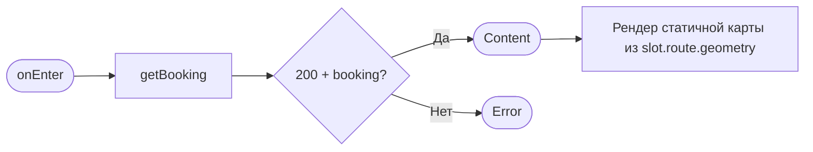
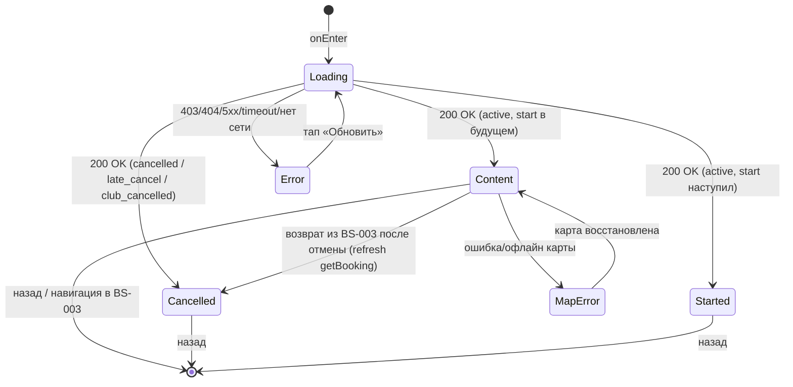

# Детали брони + отмена

**ID:** SCR-006  
**Тип:** Экран  
**Домен:** 03. Мои бронирования и отмены  
**Приоритет:** Critical  
**Статус:** Черновик  
**Функциональные блоки:** FB-BOOKINGS-001 (просмотр деталей брони), FB-BOOKINGS-002 (отмена брони)  
**Зона авторизации:** АЗ  
**Дизайн-макет:** [Figma — Детали записи (71:6100)](https://www.figma.com/design/ySEt0cjmRqmhdWyDlTpDM5/Волна-приложение?node-id=71-6100)

---

## Содержание

- [История изменений](#история-изменений)
- [Обзор](#обзор)
- [Навигация](#навигация)
- [Входные данные](#входные-данные)
- [Применяемые логики](#применяемые-логики)
- [Инициализация](#инициализация)
- [Используемые запросы](#используемые-запросы)
- [Макет экрана](#макет-экрана)
- [Элементы экрана](#элементы-экрана)
- [Состояния экрана](#состояния-экрана)
- [Действия пользователя](#действия-пользователя)
- [Связанные требования](#связанные-требования)
- [Критерии приёмки](#критерии-приёмки)
---

## История изменений

| Релиз | ТЗ | Описание изменений |
|-------|-----|-------------------|
| 0.1.0 | SCR-006 «Детали брони + отмена» | Первичная версия по дизайн-брифу SCR-006 и спецификации API Bookings. |

---

## Обзор

Вложенный экран авторизованной зоны. Показывает **полную информацию об одной брони** клиента и служит **точкой запуска её отмены**. Открывается из списка [«Мои бронирования» (SCR-005)](SCR-005-my-bookings.md) тапом по карточке записи.

Две задачи экрана:
1. **Просмотр.** Собрать в одном месте все параметры брони и её текущий статус: на что и когда записан клиент, маршрут и его тип, инструктор, сколько мест и какие доски, итоговую цену (оплата офлайн) и служебные даты.
2. **Отмена.** Дать единственное действие над записью — отменить участие. Подтверждение и пояснение последствий (правило 2 часов) выполняется в шторке [BS-003](BS-003-cancel-confirm.md); экран лишь запускает её и после возврата отображает обновлённый статус.

Таб-бар на этом экране **скрыт** — экран вложенный. Принцип «только свои данные»: показываются исключительно данные текущего клиента.

### User Story

> Как клиент, я хочу видеть детали своей брони и при необходимости отменить её до старта,
> чтобы освободить место, если мои планы изменились, понимая последствия отмены.

### Бизнес-ценность

- Прозрачность брони: клиент видит все параметры записи и сумму к оплате офлайн в одном месте.
- Самообслуживание при отмене — снимает нагрузку с клуба (заменяет переписку в мессенджере).
- Ранняя отмена возвращает места в слот (FR-17) — их можно перезанять, выше заполняемость прогулок.

---

## Навигация

### Входящая (откуда открывается)

| Источник | Триггер | Условие | Передаваемые параметры |
|----------|---------|---------|------------------------|
| [SCR-005 Мои бронирования](SCR-005-my-bookings.md) | Тап по карточке записи | Всегда | `bookingId` |

### Исходящая (куда ведёт)

| Назначение | Триггер | Передаваемые параметры |
|------------|---------|------------------------|
| [BS-003 Подтверждение отмены](BS-003-cancel-confirm.md) | Тап по активной кнопке «Отменить» | `bookingId` |
| [BS-004 Карта маршрута](BS-004-route-map.md) | Тап по карте маршрута / «Открыть карту» | `bookingId` |
| [SCR-005 Мои бронирования](SCR-005-my-bookings.md) | Тап «Назад» в хедере | — |

> После подтверждения отмены в [BS-003](BS-003-cancel-confirm.md) управление возвращается на SCR-006; экран перечитывает бронь (см. [Состояния экрана](#состояния-экрана)) и показывает обновлённый статус и дату отмены. Снек **итога** отмены (успех/поздняя отмена) показывает **сам SCR-006** как экран-родитель (правило [foundations §6.2](../3-design-brief/00-foundations.md#62-кто-показывает-снек-при-закрытии-шторки)), а не шторка; снеки **ошибок** при открытой шторке остаются на BS-003 — детали в [логике CTA «Отменить»](#9-нижний-cta-отменить--подсказка-дедлайна).

---

## Входные данные

| Название | Тип | Возможные значения | Описание |
|----------|-----|-------------------|----------|
| `bookingId` | Параметр навигации | UUID | Идентификатор брони, переданный из [SCR-005](SCR-005-my-bookings.md). Используется как path-параметр `getBooking`. Обязателен; при отсутствии — невалидный переход (показ Error). |

---

## Применяемые логики

| Логика | Элемент/Триггер | Описание |
|--------|-----------------|----------|
| [LOGIC-003 Расчёт цены брони](09_Логики/LOGIC-003_Расчёт-цены-брони.md) | Блок «Цена» | Итог — серверное поле `Booking.price_total` (R-005), клиент не пересчитывает; LOGIC-003 описывает формулу `price × seats_count + rental_price × rental_count`, которую применяет сервер. |
| [LOGIC-004 Отмена: правило 2 часов](09_Логики/LOGIC-004_Отмена-правило-2-часов.md) | Кнопка «Отменить», подсказка дедлайна | Граница ранней/поздней отмены, момент отсечки `start_at − 2 ч`, доступность CTA до старта. |
| [LOGIC-006 Карта маршрута](09_Логики/LOGIC-006_Карта-маршрута.md) | Блок «Карта маршрута + место встречи» | Статичный превью Яндекс-карты с линией маршрута и пином; состояния загрузки/ошибки и текстовый fallback; переход в [BS-004](BS-004-route-map.md). |
| [LOGIC-008 Паттерн состояний экрана](09_Логики/LOGIC-008_Паттерн-состояний-экрана.md) | Экран целиком | Loading / Content / Error поверх запроса `getBooking`. |

---

## Инициализация

> При открытии экрана отправляется один критичный запрос `getBooking`. Карта маршрута рендерится из уже полученных полей вложенного `slot.route` (отдельного API-вызова не требует, см. [LOGIC-006](09_Логики/LOGIC-006_Карта-маршрута.md)).

### Диаграмма загрузки



### Запросы при открытии

| № | Запрос | Критичный | Зависит от | Условие |
|---|--------|-----------|------------|---------|
| 1 | [getBooking](#getbooking) | Да | — | Всегда (по `bookingId`) |

> Полное описание запросов см. в секции [Используемые запросы](#используемые-запросы).

---

## Используемые запросы

> Все API-запросы экрана с полным описанием параметров и обработки ответов.

### getBooking

**Тип:** REST  
**Метод:** GET  
**Спецификация:** [../api/bookings/api.yaml](../api/bookings/api.yaml) → `getBooking` (`GET /bookings/{bookingId}`)

**Триггер:** Инициализация экрана; повторный вызов — при возврате из [BS-003](BS-003-cancel-confirm.md) после отмены и при «Обновить» в Error-состоянии.

**Параметры:**

| Параметр | Тип | Обязательность | Источник | Описание |
|----------|-----|----------------|----------|----------|
| `bookingId` | string (uuid) | Да | Параметр навигации из [SCR-005](SCR-005-my-bookings.md) | Идентификатор брони (path). |

**Ответ:** схема `Booking` (`../api/bookings/models.yaml` → `Booking`) с вложенным `slot` (`../api/slots/models.yaml` → `Slot`), внутри которого `route` и `instructor` (`../api/instructors/models.yaml`).

**Обработка ответа:**

| Результат | Условие | UI-реакция |
|-----------|---------|------------|
| Загрузка | — | Скелетон-шиммер в форме блоков деталей и бейджа статуса |
| Успех 200 | `booking` получен | Состояние Content: отрисовка всех блоков по правилам [Элементы экрана](#элементы-экрана) |
| HTTP 401 | Токен невалиден | Перевод на сценарий повторной авторизации (сквозное поведение АЗ) |
| HTTP 403 | Бронь принадлежит другому клиенту | Error state с кнопкой «Обновить» (принцип «только свои данные») |
| HTTP 404 | Бронь не найдена / удалена (например, в другой сессии) | Error state с кнопкой «Обновить». Empty state не применяется — отсутствие брони трактуется как ошибка (см. примечание под [таблицей состояний](#таблица-состояний)). |
| HTTP 5xx | — | Error state с кнопкой «Обновить» |
| Сеть | Нет соединения | Error state с кнопкой «Обновить» (текст — [foundations §6](../3-design-brief/00-foundations.md#6-tone-of-voice-и-общая-микрокопия)) |

---

## Макет экрана

### Структура

```
┌───────────────────────────────┐
│ ←  Детали записи              │  ← хедер (фикс.)
├───────────────────────────────┤
│  [● Активна]                  │  ← бейдж статуса (иконка + текст)
│                               │
│  Когда                        │
│   12 июля, 09:00              │  ← slot.start_at (крупно)
│                               │
│  Маршрут                      │
│   Утренний залив · новичковый │  ← slot.route.name + route.type
│   Инструктор: Анна            │  ← slot.instructor.name
│                               │
│  ░░ карта (превью Яндекс) ░░░ │  ← статичный превью маршрута (§4.5)
│  ░╱‾‾╲__ линия маршрута ░ 📍  │  ← slot.route.geometry + пин места встречи
│  [ Открыть карту › ]          │  ← тап → BS-004 (интерактивная карта)
│  📍 Место встречи             │
│   Городская набережная, прич.3│  ← slot.meeting_point (текст)
│                               │
│  Места и доски                │
│   Мест: 2                     │  ← seats_count
│   1 прокатная · 1 своя        │  ← rental_count / (seats_count − rental_count)
│                               │
│  Цена                         │
│   5800 ₽                      │  ← Booking.price_total (серверный итог)
│   Оплата на месте: наличные   │
│   или перевод на карту.       │
│                               │
│  Записано: 1 июля, 18:20      │  ← created_at
│  (Отменено: 5 июля, 10:00)    │  ← cancelled_at (если есть)
├───────────────────────────────┤
│  Бесплатно освободить место   │  ← подсказка дедлайна (если CTA активна)
│  можно до 12 июля, 07:00      │     start_at − 2 ч (LOGIC-004)
│ [        Отменить         ]   │  ← фикс. CTA (enabled / disabled+пояснение)
└───────────────────────────────┘
```

### Компоненты

| Компонент | Описание | Обязательность |
|-----------|----------|----------------|
| Хедер | Кнопка «Назад» + заголовок «Детали записи». Таб-бар скрыт. | Да |
| Бейдж статуса | Иконка + текст статуса (Активна / Отменена / Поздняя отмена / Отменена клубом / Прошедшая). | Да |
| Блок «Когда» | Дата и время старта (`slot.start_at`), крупно. | Да |
| Блок «Маршрут и инструктор» | Название и тип маршрута, имя инструктора. | Да |
| Карта маршрута + место встречи | Статичный превью карты + текст места встречи. | Да |
| Блок «Места и доски» | Число мест и разбивка прокатные/свои. | Да |
| Блок «Цена» | Итоговая сумма + текст офлайн-оплаты. | Да |
| Служебные метки | Дата создания; дата отмены — только если бронь отменена; причина отмены клубом (`cancellation_reason`) — при `club_cancelled`. | Да (создана) / Опционально (отменена) |
| Подсказка дедлайна | Момент бесплатной отсечки `start_at − 2 ч`. | Опционально (только при активной CTA) |
| Нижний CTA «Отменить» | Фиксированная кнопка во всю ширину; enabled/disabled. | Да |

---

## Элементы экрана

> **Примечания:**
> - Колонка «Валидация» для нередактируемых элементов — «—» (экран read-only, полей ввода нет).
> - Логика описана текстовым блоком после таблицы соответствующей секции.

### 1. Хедер

| Элемент | Описание | Источник данных | Валидация | Действие |
|---------|----------|-----------------|-----------|----------|
| Кнопка «Назад» | Возврат к списку | — | — | Открыть [SCR-005](SCR-005-my-bookings.md) |
| Заголовок | Текст «Детали записи» | статичный | — | — |

### 2. Бейдж статуса

| Элемент | Описание | Источник данных | Валидация | Действие |
|---------|----------|-----------------|-----------|----------|
| Бейдж статуса | Иконка + текст текущего статуса брони | `status` + производное «прошедшая» по `slot.start_at` из [getBooking](#getbooking) | — | — |

**Логика:**
- Статус определяется по `status` и времени старта (см. [LOGIC-004](09_Логики/LOGIC-004_Отмена-правило-2-часов.md), [LOGIC-008](09_Логики/LOGIC-008_Паттерн-состояний-экрана.md)):
  - **Активна** — `status = active` И `slot.start_at` в будущем.
  - **Прошедшая** — `status = active` И `slot.start_at` уже наступил (производное, отдельным значением API не хранится).
  - **Отменена** — `status = cancelled` (ранняя отмена; места освобождены).
  - **Поздняя отмена** — `status = late_cancel` (место не освобождено; текст-итог «Поздняя отмена: место не освобождено (правило 2 часов). Штраф не взимается.» — из [foundations §6](../3-design-brief/00-foundations.md#6-tone-of-voice-и-общая-микрокопия)).
  - **Отменена клубом** — `status = club_cancelled` (бронь отменил клуб/инструктор; места освобождены). Под бейджем показывается текст причины отмены из `cancellation_reason` (если заполнен).
- Смысл статуса передаётся иконкой и текстом, **не только цветом** (доступность).

### 3. Блок «Когда»

| Элемент | Описание | Источник данных | Валидация | Действие |
|---------|----------|-----------------|-----------|----------|
| Дата и время старта | Дата и время начала прогулки, крупно | `slot.start_at` из [getBooking](#getbooking) | — | — |

### 4. Блок «Маршрут и инструктор»

| Элемент | Описание | Источник данных | Валидация | Действие |
|---------|----------|-----------------|-----------|----------|
| Название маршрута | Имя маршрута | `slot.route.name` | — | — |
| Тип маршрута | Новичковый / опытный | `slot.route.type` (`novice` / `experienced`) | — | — |
| Инструктор | Имя ведущего | `slot.instructor.name` | — | — |

### 5. Карта маршрута + место встречи

| Элемент | Описание | Источник данных | Валидация | Действие |
|---------|----------|-----------------|-----------|----------|
| Статичная карта | Превью Яндекс-карты с линией маршрута и пином места встречи | `slot.route.geometry` + `slot.meeting_point_lat`/`meeting_point_lng` | — | Открыть [BS-004](BS-004-route-map.md) |
| «Открыть карту ›» | Ссылка/кнопка перехода к интерактивной карте | — | — | Открыть [BS-004](BS-004-route-map.md) |
| Место встречи (текст) | Адрес/ориентир под картой (обязателен) | `slot.meeting_point` | — | — |

**Логика:**
- Карта маршрута: [LOGIC-006](09_Логики/LOGIC-006_Карта-маршрута.md) — статичный превью; при загрузке — скелетон в форме карты; при ошибке/офлайн/отсутствии ключа — fallback на текстовый блок места встречи + ссылку «Открыть в Яндекс.Картах». Остальные детали брони при ошибке карты остаются доступны.
- Текстовый блок места встречи обязателен и служит текстовым эквивалентом карты (доступность).

### 6. Блок «Места и доски»

| Элемент | Описание | Источник данных | Валидация | Действие |
|---------|----------|-----------------|-----------|----------|
| Число мест | Сколько мест в брони (себя + гости) | `seats_count` | — | — |
| Разбивка досок | Сколько прокатных / своих | `rental_count` прокатных; `seats_count − rental_count` своих | — | — |

**Логика:**
- Лейблы «Прокатная доска» / «Своя доска» — из [foundations §6](../3-design-brief/00-foundations.md#6-tone-of-voice-и-общая-микрокопия). Числа не хардкодятся, считаются из `seats_count` и `rental_count`.

### 7. Блок «Цена»

| Элемент | Описание | Источник данных | Валидация | Действие |
|---------|----------|-----------------|-----------|----------|
| Итоговая цена | Сумма к оплате, ₽ (RUB) | **серверное поле `Booking.price_total`** из [getBooking](#getbooking) (R-005); клиент его не пересчитывает | — | — |
| Текст офлайн-оплаты | «Оплата на месте: наличные или перевод на карту.» | статичный ([foundations §6](../3-design-brief/00-foundations.md#6-tone-of-voice-и-общая-микрокопия)) | — | — |

**Логика:**
- Цена: итог берётся из **серверного поля `Booking.price_total`** (из [getBooking](#getbooking)), клиент его **НЕ пересчитывает** (R-005) — согласовано с [SCR-005](SCR-005-my-bookings.md), где также используется `price_total`. [LOGIC-003](09_Логики/LOGIC-003_Расчёт-цены-брони.md) описывает лишь формулу, которую сервер применяет при расчёте (`price × seats_count + rental_price × rental_count`), а не клиентский пересчёт.

### 8. Служебные метки

| Элемент | Описание | Источник данных | Валидация | Действие |
|---------|----------|-----------------|-----------|----------|
| «Записано» | Дата и время создания брони | `created_at` | — | — |
| «Отменено» | Дата и время отмены | `cancelled_at` | — | — |
| Причина отмены клубом | Текст причины (только при `status = club_cancelled`) | `cancellation_reason` | — | — |

**Логика:**
- Метка «Отменено» отображается **только** если `cancelled_at != null` (для статусов `cancelled` / `late_cancel` / `club_cancelled`).
- Для `status = club_cancelled` дополнительно показывается текст причины отмены из `cancellation_reason` (если заполнен) — рядом с бейджем «Отменена клубом» / в блоке деталей отмены.

### 9. Нижний CTA «Отменить» + подсказка дедлайна

| Элемент | Описание | Источник данных | Валидация | Действие |
|---------|----------|-----------------|-----------|----------|
| Подсказка дедлайна | «Бесплатно освободить место можно до `<start_at − 2 ч>`» | вычисляется из `slot.start_at` | — | — |
| Кнопка «Отменить» | Фикс. primary CTA во всю ширину | — | — | Открыть [BS-003](BS-003-cancel-confirm.md) с `bookingId` |
| Пояснение недоступности | Короткий текст причины рядом с disabled-кнопкой | производное от `status` / `slot.start_at` | — | — |

**Логика:**
- Кнопка «Отменить»: [LOGIC-004](09_Логики/LOGIC-004_Отмена-правило-2-часов.md). При тапе по активной кнопке открывается шторка [BS-003](BS-003-cancel-confirm.md); сама отмена (`cancelBooking`) выполняется в шторке, на этом экране деструктивное действие не вызывается.
- Подсказка дедлайна показывается только при активной кнопке; момент отсечки `start_at − 2 ч` вычисляется из данных, без хардкода. Граница трактуется как **ранняя** отмена: точка `start_at − 2 ч` входит в «раннюю» (`≥ 2 ч` = ранняя → место освобождается), синхронно с [LOGIC-004](09_Логики/LOGIC-004_Отмена-правило-2-часов.md) и [foundations §6](../3-design-brief/00-foundations.md#6-tone-of-voice-и-общая-микрокопия). До самой отсечки включительно («бесплатно освободить место можно до `<start_at − 2 ч>`») — ранняя; позже — поздняя.
- Полный текст правила 2 часов на этом экране **не дублируется** — он раскрывается в [BS-003](BS-003-cancel-confirm.md); здесь только краткая подсказка/момент отсечки.

**Возврат из BS-003 (снеки и реакция на исход отмены):**

> Сама отмена (`cancelBooking`) выполняется в шторке [BS-003](BS-003-cancel-confirm.md). SCR-006 как **экран-родитель** перечитывает бронь (`getBooking`) и отвечает за снеки **итога**, которые переживают закрытие шторки (правило [foundations §6.2](../3-design-brief/00-foundations.md#62-кто-показывает-снек-при-закрытии-шторки), каталог — [LOGIC-008 Шаг 6](09_Логики/LOGIC-008_Паттерн-состояний-экрана.md)). Снеки **ошибок**, при которых шторка остаётся открытой (5xx/сеть), показывает **сама BS-003** — на SCR-006 они **не дублируются**.

| Исход в BS-003 | Тип | Реакция SCR-006 (экран-родитель) | Снек | Кто показывает снек |
|----------------|-----|----------------------------------|------|---------------------|
| 200 `status = cancelled` (ранняя) | Успех | Бейдж «Отменена», показан `cancelled_at`; CTA disabled «Запись уже отменена» | «Бронь отменена» ([§6.1](../3-design-brief/00-foundations.md#61-каталог-снеков-успеха-единые-формулировки)) | SCR-006 (после закрытия шторки) |
| 200 `status = late_cancel` (поздняя) | **Успех** (не ошибка) | Бейдж «Поздняя отмена» + текст-итог, показан `cancelled_at`; CTA disabled «Запись уже отменена» | «Поздняя отмена: место не освобождено (правило 2 часов). Штраф не взимается.» ([§6.1](../3-design-brief/00-foundations.md#61-каталог-снеков-успеха-единые-формулировки)) | SCR-006 (после закрытия шторки) |
| 422 `slot_started` | **Ошибка** (отмена недоступна) | Перечитать бронь (`getBooking`); статус **не меняется** сам по себе; CTA «Отменить» становится **disabled** с пояснением «Прогулка уже началась» | «Слот уже стартовал — отмена недоступна.» | BS-003 / SCR-006 при закрытии шторки (синхронно с [BS-003](BS-003-cancel-confirm.md) и [LOGIC-004](09_Логики/LOGIC-004_Отмена-правило-2-часов.md)) |
| 409 `already_cancelled` | Ошибка | Перечитать бронь (`getBooking`); показать актуальный статус (`cancelled`/`late_cancel`) и `cancelled_at`; CTA disabled «Запись уже отменена» | «Запись уже отменена.» | BS-003 / SCR-006 при закрытии шторки |
| 403 / 404 (редкие) | Ошибка | Перечитать бронь (`getBooking`); статус **не меняется** самопроизвольно; кнопка «Отменить» — по фактическому статусу из ответа (active → снова enabled; иначе disabled). При 404 бронь могла исчезнуть → Error state | По правилу [foundations §6](../3-design-brief/00-foundations.md#6-tone-of-voice-и-общая-микрокопия) / [LOGIC-008 Шаг 6](09_Логики/LOGIC-008_Паттерн-состояний-экрана.md) | BS-003 (шторка остаётся открытой) |
| 5xx / сеть | Ошибка | Изменений на SCR-006 нет — шторка остаётся открытой, статус не меняется, доступен retry | Сетевой/серверный снек ([foundations §6](../3-design-brief/00-foundations.md#6-tone-of-voice-и-общая-микрокопия)) | BS-003 (не дублируется на SCR-006) |

- **`slot_started` ≠ `late_cancel`.** 422 `slot_started` — это **ошибка**: слот стартовал между открытием экрана и подтверждением, отмена недоступна, статус не меняется. `late_cancel` приходит как **успех 200** и означает успешную позднюю отмену со сменой статуса на «Поздняя отмена» — это не ошибка (канон [LOGIC-004 Шаг 5](09_Логики/LOGIC-004_Отмена-правило-2-часов.md), [BS-003](BS-003-cancel-confirm.md)).

**Условия доступности:**
- Кнопка «Отменить» **активна (enabled)**, только если: `status = active` **И** `slot.start_at` в будущем (прогулка не началась).
- Кнопка **неактивна (disabled, не скрывается)** с обязательным пояснением, если:
  - `slot.start_at` уже наступил (статус «Прошедшая», UC-2 E1) → «Прогулка уже началась — отменить запись нельзя.»
  - `status = cancelled`, `status = late_cancel` или `status = club_cancelled` (UC-2 E2, повторная отмена не выполняется) → «Запись уже отменена.»
- Disabled-состояние считывается screen reader (доступное имя содержит причину).

---

## Состояния экрана

### Таблица состояний

| Состояние | Условие | Отображение |
|-----------|---------|-------------|
| Loading | Ожидание `getBooking` | Скелетон-шиммер в форме блоков деталей и бейджа статуса |
| Content (Активна) | 200 + `status = active` + `start_at` в будущем | Полные детали; CTA «Отменить» активна; показана подсказка дедлайна |
| Content (Прошедшая) | 200 + `status = active` + `start_at` наступил | Полные детали; бейдж «Прошедшая»; CTA disabled с пояснением (UC-2 E1) |
| Content (Отменена) | 200 + `status = cancelled` | Полные детали; бейдж «Отменена»; показан `cancelled_at`; CTA disabled «Запись уже отменена» (UC-2 E2) |
| Content (Поздняя отмена) | 200 + `status = late_cancel` | Полные детали; бейдж «Поздняя отмена» + текст-итог; показан `cancelled_at`; CTA disabled (UC-2 E2) |
| Content (Отменена клубом) | 200 + `status = club_cancelled` | Полные детали; бейдж «Отменена клубом» + текст причины `cancellation_reason`; показан `cancelled_at`; CTA disabled «Запись уже отменена» (UC-2 E2) |
| MapError | Ошибка/офлайн карты при успешном `getBooking` | Карта → текстовый fallback (место встречи + ссылка); остальные детали доступны (LOGIC-006) |
| Error | `getBooking` 403/404/5xx/timeout/нет сети | Заглушка ошибки + кнопка «Обновить» |

> Empty state неприменим — экран всегда про одну существующую бронь; её отсутствие трактуется как ошибка (Error).

### Диаграмма переходов



---

## Действия пользователя

| Действие | Элемент | Триггер | Результат |
|----------|---------|---------|-----------|
| Вернуться к списку | Кнопка «Назад» | Tap | Переход на [SCR-005](SCR-005-my-bookings.md) |
| Открыть карту | Карта маршрута / «Открыть карту ›» | Tap | Открыть [BS-004](BS-004-route-map.md) (`bookingId`) |
| Начать отмену | Кнопка «Отменить» (активная) | Tap | Открыть [BS-003](BS-003-cancel-confirm.md) (`bookingId`) |
| Повторить загрузку | Кнопка «Обновить» (Error) | Tap | Повторный [getBooking](#getbooking) |
| Открыть в Яндекс.Картах | Ссылка fallback (MapError) | Tap | Handoff во внешнее приложение карт |

---

## Связанные требования

### Функциональные (FR-*)

| ID | Название | Приоритет |
|----|----------|-----------|
| FR-16 | Отмена своей записи до старта прогулки | Must |
| FR-17 | Ранняя отмена (≥ 2 ч) — места возвращаются в слот | Must |
| FR-18 | Поздняя отмена (< 2 ч) — статус «поздняя отмена» без освобождения места и без штрафов | Must |
| FR-35a | Показ брони со статусом, параметрами слота, числом мест и вариантом доски | Must |
| FR-30 | Показ цены; оплата офлайн (наличные / перевод) | Must |

### Сценарии и истории

| ID | Название | Связь |
|----|----------|-------|
| [UC-2](../2-requirements/use-cases.md) | Отмена записи (осн. поток + A1 поздняя; E1 после старта, E2 повторная) | Запуск отмены, доступность CTA |
| [US-10](../2-requirements/user-stories.md) | Клиент видит детали брони и отменяет её до старта | Назначение экрана |

---

## Критерии приёмки

### Позитивные сценарии

| ID | Критерий | Приоритет |
|----|----------|-----------|
| AC-001 | **Дано** бронь клиента в статусе `active` со стартом в будущем, **Когда** экран в Content, **Тогда** отображаются статус, дата/время старта, маршрут и тип, инструктор, число мест, разбивка досок, итоговая цена, текст офлайн-оплаты и дата создания | P0 |
| AC-002 | **Дано** успешный ответ `getBooking`, **Когда** экран в Content, **Тогда** показан статичный превью карты с линией маршрута и пином, а под картой — текстовый блок места встречи (`slot.meeting_point`) | P0 |
| AC-003 | **Дано** бронь `active` и `slot.start_at` в будущем, **Когда** экран в Content, **Тогда** кнопка «Отменить» активна и тап по ней открывает [BS-003](BS-003-cancel-confirm.md) с `bookingId` | P0 |
| AC-004 | **Дано** активная кнопка «Отменить», **Когда** экран в Content, **Тогда** рядом показана подсказка с моментом отсечки «до `<start_at − 2 ч>`», вычисленным из данных без хардкода | P1 |
| AC-005 | **Дано** бронь со статусом `cancelled`, `late_cancel` или `club_cancelled`, **Когда** экран в Content, **Тогда** отображается дата отмены (`cancelled_at`) | P0 |
| AC-011 | **Дано** бронь со статусом `club_cancelled` (отменена клубом), **Когда** экран в Content, **Тогда** показан бейдж «Отменена клубом» и текст причины из `cancellation_reason` (если заполнен), а кнопка «Отменить» disabled с пояснением «Запись уже отменена» | P1 |
| AC-006 | **Дано** тап по карте или «Открыть карту», **Когда** карта доступна, **Тогда** открывается [BS-004](BS-004-route-map.md) с интерактивной картой и маршрутом | P1 |
| AC-007 | **Дано** бронь `late_cancel`, **Когда** экран в Content, **Тогда** бейдж «Поздняя отмена» и текст-итог о неосвобождённом месте без штрафа из [foundations §6](../3-design-brief/00-foundations.md#6-tone-of-voice-и-общая-микрокопия) | P1 |
| AC-008 | **Дано** статус передаётся бейджем, **Когда** экран в Content, **Тогда** смысл статуса считывается иконкой и/или текстом, а не только цветом | P1 |
| AC-009 | **Дано** успешная **ранняя** отмена в [BS-003](BS-003-cancel-confirm.md) (200 `cancelled`), **Когда** шторка закрылась и управление вернулось на SCR-006, **Тогда** экран-родитель показывает снек «Бронь отменена» ([foundations §6.1](../3-design-brief/00-foundations.md#61-каталог-снеков-успеха-единые-формулировки)), бейдж «Отменена» и `cancelled_at` | P1 |
| AC-010 | **Дано** успешная **поздняя** отмена в [BS-003](BS-003-cancel-confirm.md) (200 `late_cancel` — **успешный** исход, не ошибка), **Когда** шторка закрылась, **Тогда** SCR-006 показывает снек «Поздняя отмена: место не освобождено (правило 2 часов). Штраф не взимается.» ([foundations §6.1](../3-design-brief/00-foundations.md#61-каталог-снеков-успеха-единые-формулировки)), бейдж «Поздняя отмена» и `cancelled_at` | P1 |

### Негативные сценарии

| ID | Критерий | Приоритет |
|----|----------|-----------|
| AC-N01 | **Дано** `getBooking` вернул 404/403/5xx или нет сети, **Когда** открытие экрана, **Тогда** отображается Error state с кнопкой «Обновить» | P0 |
| AC-N02 | **Дано** `status = active`, но `slot.start_at` уже наступил (прогулка началась/прошла, UC-2 E1), **Когда** экран в Content, **Тогда** кнопка «Отменить» disabled с пояснением «Прогулка уже началась — отменить запись нельзя» | P0 |
| AC-N03 | **Дано** бронь уже отменена (`cancelled` / `late_cancel` / `club_cancelled`, UC-2 E2), **Когда** экран в Content, **Тогда** кнопка «Отменить» disabled с пояснением «Запись уже отменена» (повторная отмена недоступна) | P0 |
| AC-N04 | **Дано** карта недоступна (ошибка/офлайн/нет ключа), **Когда** экран в Content, **Тогда** карта заменяется текстовым fallback (место встречи + ссылка «Открыть в Яндекс.Картах»), остальные детали остаются доступны | P1 |
| AC-N05 | **Дано** `cancelBooking` в [BS-003](BS-003-cancel-confirm.md) вернул **422 `slot_started`** (слот стартовал между открытием экрана и подтверждением), **Когда** управление возвращается на SCR-006, **Тогда** экран перечитывает бронь (`getBooking`), статус **не меняется** самопроизвольно, кнопка «Отменить» становится disabled с пояснением «Прогулка уже началась», а итог-снек «Слот уже стартовал — отмена недоступна.» синхронизирован с [BS-003](BS-003-cancel-confirm.md) (не дублируется) | P1 |
| AC-N06 | **Дано** `cancelBooking` завершился ошибкой 5xx/сети, **Когда** шторка [BS-003](BS-003-cancel-confirm.md) остаётся открытой, **Тогда** на SCR-006 статус брони не меняется и снек ошибки показывает сама шторка (SCR-006 его **не дублирует**) | P2 |
| AC-N07 | **Дано** `cancelBooking` вернул 403/404 (редкие), **Когда** управление возвращается на SCR-006, **Тогда** экран перечитывает бронь (`getBooking`), статус не меняется самопроизвольно; при 404 (бронь исчезла) показывается Error state, иначе доступность кнопки «Отменить» — по фактическому статусу из ответа | P2 |

### Граничные условия (Edge Cases)

| ID | Критерий | Приоритет |
|----|----------|-----------|
| AC-E01 | **Дано** до старта осталось ровно 2 часа, **Когда** клиент видит подсказку и запускает отмену, **Тогда** отмена трактуется как ранняя (`≥ 2 ч` → место освобождается), подсказка показывает момент отсечки `start_at − 2 ч` | P1 |
| AC-E02 | **Дано** до старта осталось менее 2 часов, но прогулка ещё не началась, **Когда** экран в Content, **Тогда** кнопка «Отменить» активна (доступна до старта), а отмена в [BS-003](BS-003-cancel-confirm.md) будет поздней | P1 |
| AC-E03 | **Дано** клиент подтвердил отмену в [BS-003](BS-003-cancel-confirm.md), **Когда** возврат на SCR-006, **Тогда** экран перечитывает бронь, показывает новый статус и `cancelled_at`, кнопка «Отменить» становится disabled | P0 |
| AC-E04 | **Дано** все места брони — свои (`rental_count = 0`), **Когда** экран в Content, **Тогда** в блоке «Места и доски» показано число мест и «своя доска» без прокатных, числа считаются из `seats_count`/`rental_count` | P2 |

---
